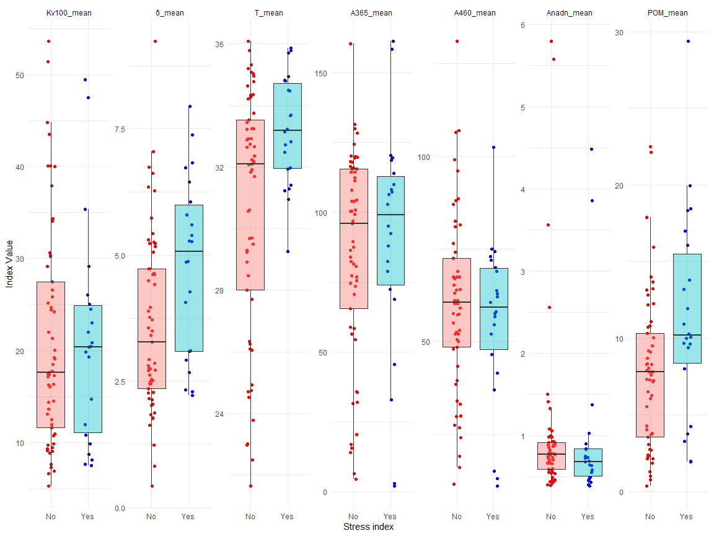
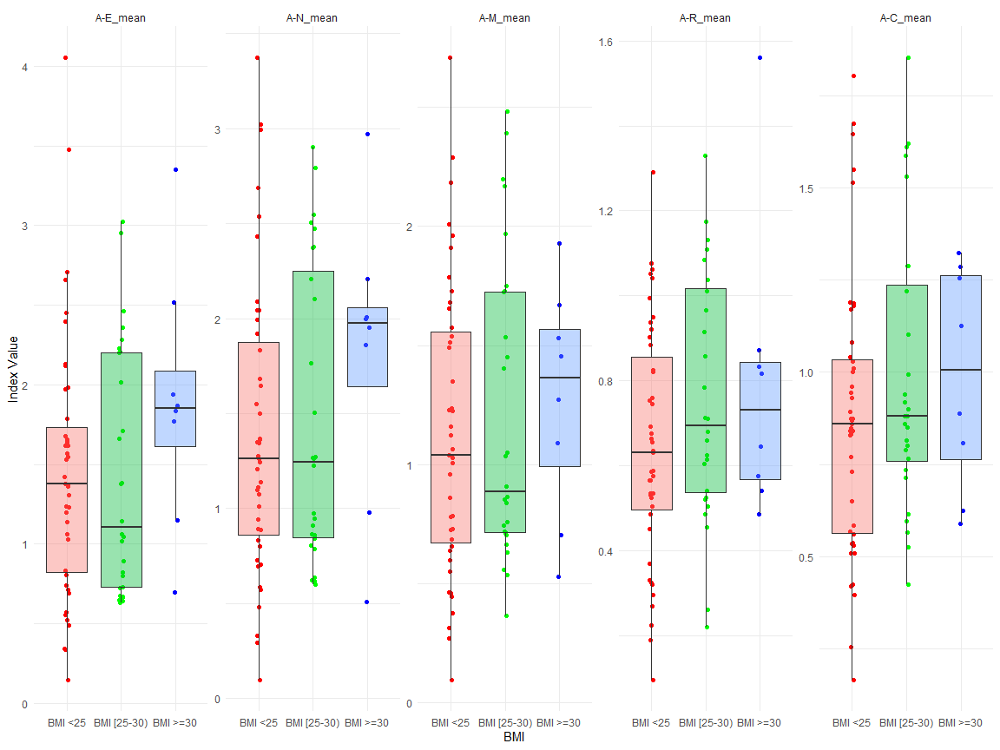

```r
options(warn = -1)
```

## Load bộ số liệu và các packages


```r
library(tidyverse)
library(gtsummary)
library(rstatix)
library(readxl)
library(boot)
library(forestplot)
d <- read_excel("C:/Users/Admin/OneDrive/NC_Quangpho/Data_regardless_sleep_18_03.xlsx")
View(d)

d$BMI_25_30 <- ifelse(d$BMI_index < 25, 1, 
                         ifelse(d$BMI_index >= 25 & d$BMI_index < 30, 2, 3))
d$Age_stage <- ifelse(d$Age <= 30, 1, 
                         ifelse(d$Age >= 30 & d$Age < 40, 2, ifelse(d$Age >= 40 & d$Age < 50, 3,4)))
d$Gender <- ifelse(d$Gender == 0, "female", ifelse(d$Gender == 1, "male", NA))
d$Race <- d$`6. Race`
d <- d %>%
  mutate(Age_stage = case_when(
    Age_stage == 1 ~ "Age <30",
    Age_stage == 2 ~ "Age [30-40)",
    Age_stage == 3 ~ "Age [40-50)",
    Age_stage == 4 ~ "Age >=50",
    TRUE ~ NA_character_  # This line handles any unexpected values
  ))
d$Hypertension <- ifelse(d$Hypertension == 0, "No", ifelse(d$Hypertension == 1, "Yes", NA))
d$`Stress index` <- ifelse(d$`Stress index` == 0, "No", ifelse(d$`Stress index` == 1, "Yes", NA))
d$Obesity <- ifelse(d$Obesity == 0, "No", ifelse(d$Obesity == 1, "Yes", NA))
d <- d %>%
  mutate(BMI_25_30 = case_when(
    BMI_25_30 == 1 ~ "BMI <25",
    BMI_25_30 == 2 ~ "BMI [25-30)",
    BMI_25_30 == 3 ~ "BMI >=30",
    TRUE ~ NA_character_  # This line handles any unexpected values
  ))
d$Smoking <- ifelse(d$Smoking == "Do not smoke", "Non smoker", ifelse(d$Smoking == "Cigarettes, pipe tobacco...", "Smoker", NA))
d$Migraine <- ifelse(d$Migraine == 0, "No migraine", ifelse(d$Migraine == 1, "Migraine", NA))
```

## Vẽ đồ thị scatter plot và boxplot

### Subgroup: Migraine


```r
long_data_migraine1 <- reshape2::melt(d, id.vars = "Migraine", measure.vars = c("M_mean",  "A-E_mean", "A-N_mean", "A-M_mean", "A-R_mean", "A-C_mean"))

# Plotting
ggplot(long_data_migraine1, aes(x = Migraine, y = value, fill = Migraine)) +
  geom_jitter(aes(colour = Migraine), position = position_jitterdodge(jitter.width = 0.2, dodge.width = 0.75)) +
  geom_boxplot(outlier.shape = NA, position = position_dodge(width = 0.1), alpha = 0.4) +
  facet_wrap(~variable, scales = "free_y", nrow = 1) +
  theme_minimal() +
  theme(legend.position = "none") + # Hide the legend if not necessary
  ylab("Index Value") +
  xlab("Migraine") +
  scale_color_manual(values = c("Migraine" = "blue", "No migraine" = "red"))
```

<!-- -->


```r
long_data_migraine2 <- reshape2::melt(d, id.vars = "Migraine", measure.vars = c("Kv100_mean", "δ_mean", "T_mean", "A365_mean", "A460_mean", "Anadn_mean", "POM_mean"))

# Plotting
ggplot(long_data_migraine2, aes(x = Migraine, y = value, fill = Migraine)) +
  geom_jitter(aes(colour = Migraine), position = position_jitterdodge(jitter.width = 0.2, dodge.width = 0.75)) +
  geom_boxplot(outlier.shape = NA, position = position_dodge(width = 0.1), alpha = 0.4) +
  facet_wrap(~variable, scales = "free_y", nrow = 1) +
  theme_minimal() +
  theme(legend.position = "none") + # Hide the legend if not necessary
  ylab("Index Value") +
  xlab("Migraine") +
  scale_color_manual(values = c("Migraine" = "blue", "No migraine" = "red"))
```

<!-- -->


```r
long_data_migraine3 <- reshape2::melt(d, id.vars = "Migraine", measure.vars = c("F-E_mean", "F-N_mean", "F-M_mean", "F-R_mean", "F-C_mean"))

# Plotting
ggplot(long_data_migraine3, aes(x = Migraine, y = value, fill = Migraine)) +
  geom_jitter(aes(colour = Migraine), position = position_jitterdodge(jitter.width = 0.2, dodge.width = 0.75)) +
  geom_boxplot(outlier.shape = NA, position = position_dodge(width = 0.1), alpha = 0.4) +
  facet_wrap(~variable, scales = "free_y", nrow = 1) +
  theme_minimal() +
  theme(legend.position = "none") + # Hide the legend if not necessary
  ylab("Index Value") +
  xlab("Migraine") +
  scale_color_manual(values = c("Migraine" = "blue", "No migraine" = "red"))
```

<!-- -->


### Subgroup: Gender

```r
long_data_Gender1 <- reshape2::melt(d, id.vars = "Gender", measure.vars = c("M_mean",  "A-E_mean", "A-N_mean", "A-M_mean", "A-R_mean", "A-C_mean"))

# Plotting
ggplot(long_data_Gender1, aes(x = Gender, y = value, fill = Gender)) +
  geom_jitter(aes(colour = Gender), position = position_jitterdodge(jitter.width = 0.2, dodge.width = 0.75)) +
  geom_boxplot(outlier.shape = NA, position = position_dodge(width = 0.1), alpha = 0.4) +
  facet_wrap(~variable, scales = "free_y", nrow = 1) +
  theme_minimal() +
  theme(legend.position = "none") + # Hide the legend if not necessary
  ylab("Index Value") +
  xlab("Gender") +
  scale_color_manual(values = c("male" = "blue", "female" = "red"))
```

<!-- -->


```r
long_data_Gender2 <- reshape2::melt(d, id.vars = "Gender", measure.vars = c("Kv100_mean", "δ_mean", "T_mean", "A365_mean", "A460_mean", "Anadn_mean", "POM_mean"))

# Plotting
ggplot(long_data_Gender2, aes(x = Gender, y = value, fill = Gender)) +
  geom_jitter(aes(colour = Gender), position = position_jitterdodge(jitter.width = 0.2, dodge.width = 0.75)) +
  geom_boxplot(outlier.shape = NA, position = position_dodge(width = 0.1), alpha = 0.4) +
  facet_wrap(~variable, scales = "free_y", nrow = 1) +
  theme_minimal() +
  theme(legend.position = "none") + # Hide the legend if not necessary
  ylab("Index Value") +
  xlab("Gender") +
  scale_color_manual(values = c("male" = "blue", "female" = "red"))
```

<!-- -->


```r
long_data_Gender3 <- reshape2::melt(d, id.vars = "Gender", measure.vars = c("F-E_mean", "F-N_mean", "F-M_mean", "F-R_mean", "F-C_mean"))

# Plotting
ggplot(long_data_Gender3, aes(x = Gender, y = value, fill = Gender)) +
  geom_jitter(aes(colour = Gender), position = position_jitterdodge(jitter.width = 0.2, dodge.width = 0.75)) +
  geom_boxplot(outlier.shape = NA, position = position_dodge(width = 0.1), alpha = 0.4) +
  facet_wrap(~variable, scales = "free_y", nrow = 1) +
  theme_minimal() +
  theme(legend.position = "none") + # Hide the legend if not necessary
  ylab("Index Value") +
  xlab("Gender") +
  scale_color_manual(values = c("male" = "blue", "female" = "red"))
```

<!-- -->


###Subgroup Age_stage


```r
long_data_Age_stage1 <- reshape2::melt(d, id.vars = "Age_stage", measure.vars = c("M_mean", "Kv100_mean", "δ_mean"))
long_data_Age_stage1$Age_stage <- factor(long_data_Age_stage1$Age_stage, levels = c("Age <30", "Age [30-40)", "Age [40-50)", "Age >=50"))
# Plotting
ggplot(long_data_Age_stage1, aes(x = Age_stage, y = value, fill = Age_stage)) +
  geom_jitter(aes(colour = Age_stage), position = position_jitterdodge(jitter.width = 0.2, dodge.width = 0.75)) +
  geom_boxplot(outlier.shape = NA, position = position_dodge(width = 0.1), alpha = 0.4) +
  facet_wrap(~variable, scales = "free_y", nrow = 1) +
  theme_minimal() +
  theme(legend.position = "none") + # Hide the legend if not necessary
  ylab("Index Value") +
  xlab("Age_stage") +
  scale_color_manual(values = c("Age <30" = "red", "Age [30-40)" = "green", "Age [40-50)"= "blue", "Age >=50"= "purple"))
```

<!-- -->


```r
long_data_Age_stage2 <- reshape2::melt(d, id.vars = "Age_stage", measure.vars = c("T_mean", "A365_mean", "A460_mean"))
long_data_Age_stage2$Age_stage <- factor(long_data_Age_stage2$Age_stage, levels = c("Age <30", "Age [30-40)", "Age [40-50)", "Age >=50"))
# Plotting
ggplot(long_data_Age_stage2, aes(x = Age_stage, y = value, fill = Age_stage)) +
  geom_jitter(aes(colour = Age_stage), position = position_jitterdodge(jitter.width = 0.2, dodge.width = 0.75)) +
  geom_boxplot(outlier.shape = NA, position = position_dodge(width = 0.1), alpha = 0.4) +
  facet_wrap(~variable, scales = "free_y", nrow = 1) +
  theme_minimal() +
  theme(legend.position = "none") + # Hide the legend if not necessary
  ylab("Index Value") +
  xlab("Age_stage") +
  scale_color_manual(values = c("Age <30" = "red", "Age [30-40)" = "green", "Age [40-50)"= "blue", "Age >=50"= "purple"))
```

<!-- -->


```r
long_data_Age_stage3 <- reshape2::melt(d, id.vars = "Age_stage", measure.vars = c("Anadn_mean", "POM_mean", "A-E_mean"))
long_data_Age_stage3$Age_stage <- factor(long_data_Age_stage3$Age_stage, levels = c("Age <30", "Age [30-40)", "Age [40-50)", "Age >=50"))
# Plotting
ggplot(long_data_Age_stage3, aes(x = Age_stage, y = value, fill = Age_stage)) +
  geom_jitter(aes(colour = Age_stage), position = position_jitterdodge(jitter.width = 0.2, dodge.width = 0.75)) +
  geom_boxplot(outlier.shape = NA, position = position_dodge(width = 0.1), alpha = 0.4) +
  facet_wrap(~variable, scales = "free_y", nrow = 1) +
  theme_minimal() +
  theme(legend.position = "none") + # Hide the legend if not necessary
  ylab("Index Value") +
  xlab("Age_stage") +
  scale_color_manual(values = c("Age <30" = "red", "Age [30-40)" = "green", "Age [40-50)"= "blue", "Age >=50"= "purple"))
```

<!-- -->


```r
long_data_Age_stage4 <- reshape2::melt(d, id.vars = "Age_stage", measure.vars = c("A-N_mean", "A-M_mean", "A-R_mean"))
long_data_Age_stage4$Age_stage <- factor(long_data_Age_stage4$Age_stage, levels = c("Age <30", "Age [30-40)", "Age [40-50)", "Age >=50"))
# Plotting
ggplot(long_data_Age_stage4, aes(x = Age_stage, y = value, fill = Age_stage)) +
  geom_jitter(aes(colour = Age_stage), position = position_jitterdodge(jitter.width = 0.2, dodge.width = 0.75)) +
  geom_boxplot(outlier.shape = NA, position = position_dodge(width = 0.1), alpha = 0.4) +
  facet_wrap(~variable, scales = "free_y", nrow = 1) +
  theme_minimal() +
  theme(legend.position = "none") + # Hide the legend if not necessary
  ylab("Index Value") +
  xlab("Age_stage") +
  scale_color_manual(values = c("Age <30" = "red", "Age [30-40)" = "green", "Age [40-50)"= "blue", "Age >=50"= "purple"))
```

<!-- -->


```r
long_data_Age_stage5 <- reshape2::melt(d, id.vars = "Age_stage", measure.vars = c("A-C_mean", "F-E_mean", "F-N_mean"))
long_data_Age_stage5$Age_stage <- factor(long_data_Age_stage5$Age_stage, levels = c("Age <30", "Age [30-40)", "Age [40-50)", "Age >=50"))
# Plotting
ggplot(long_data_Age_stage5, aes(x = Age_stage, y = value, fill = Age_stage)) +
  geom_jitter(aes(colour = Age_stage), position = position_jitterdodge(jitter.width = 0.2, dodge.width = 0.75)) +
  geom_boxplot(outlier.shape = NA, position = position_dodge(width = 0.1), alpha = 0.4) +
  facet_wrap(~variable, scales = "free_y", nrow = 1) +
  theme_minimal() +
  theme(legend.position = "none") + # Hide the legend if not necessary
  ylab("Index Value") +
  xlab("Age_stage") +
  scale_color_manual(values = c("Age <30" = "red", "Age [30-40)" = "green", "Age [40-50)"= "blue", "Age >=50"= "purple"))
```

<!-- -->


```r
long_data_Age_stage6 <- reshape2::melt(d, id.vars = "Age_stage", measure.vars = c("F-M_mean", "F-R_mean", "F-C_mean"))
long_data_Age_stage6$Age_stage <- factor(long_data_Age_stage6$Age_stage, levels = c("Age <30", "Age [30-40)", "Age [40-50)", "Age >=50"))
# Plotting
ggplot(long_data_Age_stage6, aes(x = Age_stage, y = value, fill = Age_stage)) +
  geom_jitter(aes(colour = Age_stage), position = position_jitterdodge(jitter.width = 0.2, dodge.width = 0.75)) +
  geom_boxplot(outlier.shape = NA, position = position_dodge(width = 0.1), alpha = 0.4) +
  facet_wrap(~variable, scales = "free_y", nrow = 1) +
  theme_minimal() +
  theme(legend.position = "none") + # Hide the legend if not necessary
  ylab("Index Value") +
  xlab("Age_stage") +
  scale_color_manual(values = c("Age <30" = "red", "Age [30-40)" = "green", "Age [40-50)"= "blue", "Age >=50"= "purple"))
```

<!-- -->

###Subgroup: Race


```r
long_data_Race1 <- reshape2::melt(d, id.vars = "Race", measure.vars = c("M_mean", "Kv100_mean", "δ_mean", "T_mean"))

# Plotting
ggplot(long_data_Race1, aes(x = Race, y = value, fill = Race)) +
  geom_jitter(aes(colour = Race), position = position_jitterdodge(jitter.width = 0.2, dodge.width = 0.75)) +
  geom_boxplot(outlier.shape = NA, position = position_dodge(width = 0.1), alpha = 0.4) +
  facet_wrap(~variable, scales = "free_y", nrow = 1) +
  theme_minimal() +
  theme(legend.position = "none") + # Hide the legend if not necessary
  ylab("Index Value") +
  xlab("Race") +
  scale_color_manual(values = c("Asian or Asian British" = "red", "White" = "blue", "Black" = "green"))
```

<!-- -->


```r
long_data_Race2 <- reshape2::melt(d, id.vars = "Race", measure.vars = c("A365_mean", "A460_mean", "Anadn_mean", "POM_mean"))

# Plotting
ggplot(long_data_Race2, aes(x = Race, y = value, fill = Race)) +
  geom_jitter(aes(colour = Race), position = position_jitterdodge(jitter.width = 0.2, dodge.width = 0.75)) +
  geom_boxplot(outlier.shape = NA, position = position_dodge(width = 0.1), alpha = 0.4) +
  facet_wrap(~variable, scales = "free_y", nrow = 1) +
  theme_minimal() +
  theme(legend.position = "none") + # Hide the legend if not necessary
  ylab("Index Value") +
  xlab("Race") +
  scale_color_manual(values = c("Asian or Asian British" = "red", "White" = "blue", "Black" = "green"))
```

<!-- -->


```r
long_data_Race3 <- reshape2::melt(d, id.vars = "Race", measure.vars = c("A-E_mean", "A-N_mean", "A-M_mean", "A-R_mean"))

# Plotting
ggplot(long_data_Race3, aes(x = Race, y = value, fill = Race)) +
  geom_jitter(aes(colour = Race), position = position_jitterdodge(jitter.width = 0.2, dodge.width = 0.75)) +
  geom_boxplot(outlier.shape = NA, position = position_dodge(width = 0.1), alpha = 0.4) +
  facet_wrap(~variable, scales = "free_y", nrow = 1) +
  theme_minimal() +
  theme(legend.position = "none") + # Hide the legend if not necessary
  ylab("Index Value") +
  xlab("Race") +
  scale_color_manual(values = c("Asian or Asian British" = "red", "White" = "blue", "Black" = "green"))
```

<!-- -->


```r
long_data_Race4 <- reshape2::melt(d, id.vars = "Race", measure.vars = c("A-C_mean", "F-E_mean", "F-N_mean", "F-M_mean"))

# Plotting
ggplot(long_data_Race4, aes(x = Race, y = value, fill = Race)) +
  geom_jitter(aes(colour = Race), position = position_jitterdodge(jitter.width = 0.2, dodge.width = 0.75)) +
  geom_boxplot(outlier.shape = NA, position = position_dodge(width = 0.1), alpha = 0.4) +
  facet_wrap(~variable, scales = "free_y", nrow = 1) +
  theme_minimal() +
  theme(legend.position = "none") + # Hide the legend if not necessary
  ylab("Index Value") +
  xlab("Race") +
  scale_color_manual(values = c("Asian or Asian British" = "red", "White" = "blue", "Black" = "green"))
```

<!-- -->


```r
long_data_Race5 <- reshape2::melt(d, id.vars = "Race", measure.vars = c("F-R_mean", "F-C_mean"))

# Plotting
ggplot(long_data_Race5, aes(x = Race, y = value, fill = Race)) +
  geom_jitter(aes(colour = Race), position = position_jitterdodge(jitter.width = 0.2, dodge.width = 0.75)) +
  geom_boxplot(outlier.shape = NA, position = position_dodge(width = 0.1), alpha = 0.4) +
  facet_wrap(~variable, scales = "free_y", nrow = 1) +
  theme_minimal() +
  theme(legend.position = "none") + # Hide the legend if not necessary
  ylab("Index Value") +
  xlab("Race") +
  scale_color_manual(values = c("Asian or Asian British" = "red", "White" = "blue", "Black" = "green"))
```

<!-- -->


### Subgroup: Stress


```r
long_data_Stress1 <- reshape2::melt(d, id.vars = "Stress index", measure.vars = c("M_mean",  "A-E_mean", "A-N_mean", "A-M_mean", "A-R_mean", "A-C_mean"))

# Plotting
ggplot(long_data_Stress1, aes(x = `Stress index`, y = value, fill = `Stress index`)) +
  geom_jitter(aes(colour = `Stress index`), position = position_jitterdodge(jitter.width = 0.2, dodge.width = 0.75)) +
  geom_boxplot(outlier.shape = NA, position = position_dodge(width = 0.1), alpha = 0.4) +
  facet_wrap(~variable, scales = "free_y", nrow = 1) +
  theme_minimal() +
  theme(legend.position = "none") + # Hide the legend if not necessary
  ylab("Index Value") +
  xlab("Stress index") +
  scale_color_manual(values = c("Yes" = "blue", "No" = "red"))
```

<!-- -->


```r
long_data_Stress2 <- reshape2::melt(d, id.vars = "Stress index", measure.vars = c("Kv100_mean", "δ_mean", "T_mean", "A365_mean", "A460_mean", "Anadn_mean", "POM_mean"))

# Plotting
ggplot(long_data_Stress2, aes(x = `Stress index`, y = value, fill = `Stress index`)) +
  geom_jitter(aes(colour = `Stress index`), position = position_jitterdodge(jitter.width = 0.2, dodge.width = 0.75)) +
  geom_boxplot(outlier.shape = NA, position = position_dodge(width = 0.1), alpha = 0.4) +
  facet_wrap(~variable, scales = "free_y", nrow = 1) +
  theme_minimal() +
  theme(legend.position = "none") + # Hide the legend if not necessary
  ylab("Index Value") +
  xlab("Stress index") +
  scale_color_manual(values = c("Yes" = "blue", "No" = "red"))
```

<!-- -->


```r
long_data_Stress3 <- reshape2::melt(d, id.vars = "Stress index", measure.vars = c("F-E_mean", "F-N_mean", "F-M_mean", "F-R_mean", "F-C_mean"))

# Plotting
ggplot(long_data_Stress3, aes(x = `Stress index`, y = value, fill = `Stress index`)) +
  geom_jitter(aes(colour = `Stress index`), position = position_jitterdodge(jitter.width = 0.2, dodge.width = 0.75)) +
  geom_boxplot(outlier.shape = NA, position = position_dodge(width = 0.1), alpha = 0.4) +
  facet_wrap(~variable, scales = "free_y", nrow = 1) +
  theme_minimal() +
  theme(legend.position = "none") + # Hide the legend if not necessary
  ylab("Index Value") +
  xlab("Stress index") +
  scale_color_manual(values = c("Yes" = "blue", "No" = "red"))
```

<!-- -->
### Subgroup Smoking


```r
long_data_Smoking1 <- reshape2::melt(d, id.vars = "Smoking", measure.vars = c("M_mean",  "A-E_mean", "A-N_mean", "A-M_mean", "A-R_mean", "A-C_mean"))

# Plotting
ggplot(long_data_Smoking1, aes(x = Smoking, y = value, fill = Smoking)) +
  geom_jitter(aes(colour = Smoking), position = position_jitterdodge(jitter.width = 0.2, dodge.width = 0.75)) +
  geom_boxplot(outlier.shape = NA, position = position_dodge(width = 0.1), alpha = 0.4) +
  facet_wrap(~variable, scales = "free_y", nrow = 1) +
  theme_minimal() +
  theme(legend.position = "none") + # Hide the legend if not necessary
  ylab("Index Value") +
  xlab("Smoking") +
  scale_color_manual(values = c("Smoker" = "blue", "Non smoker" = "red"))
```

<!-- -->


```r
long_data_Smoking2 <- reshape2::melt(d, id.vars = "Smoking", measure.vars = c("Kv100_mean", "δ_mean", "T_mean", "A365_mean", "A460_mean", "Anadn_mean", "POM_mean"))

# Plotting
ggplot(long_data_Smoking2, aes(x = Smoking, y = value, fill = Smoking)) +
  geom_jitter(aes(colour = Smoking), position = position_jitterdodge(jitter.width = 0.2, dodge.width = 0.75)) +
  geom_boxplot(outlier.shape = NA, position = position_dodge(width = 0.1), alpha = 0.4) +
  facet_wrap(~variable, scales = "free_y", nrow = 1) +
  theme_minimal() +
  theme(legend.position = "none") + # Hide the legend if not necessary
  ylab("Index Value") +
  xlab("Smoking") +
  scale_color_manual(values = c("Smoker" = "blue", "Non smoker" = "red"))
```

<!-- -->


```r
long_data_Smoking3 <- reshape2::melt(d, id.vars = "Smoking", measure.vars = c("F-E_mean", "F-N_mean", "F-M_mean", "F-R_mean", "F-C_mean"))

# Plotting
ggplot(long_data_Smoking3, aes(x = Smoking, y = value, fill = Smoking)) +
  geom_jitter(aes(colour = Smoking), position = position_jitterdodge(jitter.width = 0.2, dodge.width = 0.75)) +
  geom_boxplot(outlier.shape = NA, position = position_dodge(width = 0.1), alpha = 0.4) +
  facet_wrap(~variable, scales = "free_y", nrow = 1) +
  theme_minimal() +
  theme(legend.position = "none") + # Hide the legend if not necessary
  ylab("Index Value") +
  xlab("Smoking") +
  scale_color_manual(values = c("Smoker" = "blue", "Non smoker" = "red"))
```

<!-- -->


### Subgroup Hypertension


```r
long_data_Hypertension1 <- reshape2::melt(d, id.vars = "Hypertension", measure.vars = c("M_mean",  "A-E_mean", "A-N_mean", "A-M_mean", "A-R_mean", "A-C_mean"))

# Plotting
ggplot(long_data_Hypertension1, aes(x = Hypertension, y = value, fill = Hypertension)) +
  geom_jitter(aes(colour = Hypertension), position = position_jitterdodge(jitter.width = 0.2, dodge.width = 0.75)) +
  geom_boxplot(outlier.shape = NA, position = position_dodge(width = 0.1), alpha = 0.4) +
  facet_wrap(~variable, scales = "free_y", nrow = 1) +
  theme_minimal() +
  theme(legend.position = "none") + # Hide the legend if not necessary
  ylab("Index Value") +
  xlab("Hypertension") +
  scale_color_manual(values = c("Yes" = "blue", "No" = "red"))
```

<!-- -->


```r
long_data_Hypertension2 <- reshape2::melt(d, id.vars = "Hypertension", measure.vars = c("Kv100_mean", "δ_mean", "T_mean", "A365_mean", "A460_mean", "Anadn_mean", "POM_mean"))

# Plotting
ggplot(long_data_Hypertension2, aes(x = Hypertension, y = value, fill = Hypertension)) +
  geom_jitter(aes(colour = Hypertension), position = position_jitterdodge(jitter.width = 0.2, dodge.width = 0.75)) +
  geom_boxplot(outlier.shape = NA, position = position_dodge(width = 0.1), alpha = 0.4) +
  facet_wrap(~variable, scales = "free_y", nrow = 1) +
  theme_minimal() +
  theme(legend.position = "none") + # Hide the legend if not necessary
  ylab("Index Value") +
  xlab("Hypertension") +
  scale_color_manual(values = c("Yes" = "blue", "No" = "red"))
```

<!-- -->


```r
long_data_Hypertension3 <- reshape2::melt(d, id.vars = "Hypertension", measure.vars = c("F-E_mean", "F-N_mean", "F-M_mean", "F-R_mean", "F-C_mean"))

# Plotting
ggplot(long_data_Hypertension3, aes(x = Hypertension, y = value, fill = Hypertension)) +
  geom_jitter(aes(colour = Hypertension), position = position_jitterdodge(jitter.width = 0.2, dodge.width = 0.75)) +
  geom_boxplot(outlier.shape = NA, position = position_dodge(width = 0.1), alpha = 0.4) +
  facet_wrap(~variable, scales = "free_y", nrow = 1) +
  theme_minimal() +
  theme(legend.position = "none") + # Hide the legend if not necessary
  ylab("Index Value") +
  xlab("Hypertension") +
  scale_color_manual(values = c("Yes" = "blue", "No" = "red"))
```

<!-- -->


### Subgroup Obesity


```r
long_data_Obesity1 <- reshape2::melt(d, id.vars = "Obesity", measure.vars = c("M_mean",  "A-E_mean", "A-N_mean", "A-M_mean", "A-R_mean", "A-C_mean"))

# Plotting
ggplot(long_data_Obesity1, aes(x = Obesity, y = value, fill = Obesity)) +
  geom_jitter(aes(colour = Obesity), position = position_jitterdodge(jitter.width = 0.2, dodge.width = 0.75)) +
  geom_boxplot(outlier.shape = NA, position = position_dodge(width = 0.1), alpha = 0.4) +
  facet_wrap(~variable, scales = "free_y", nrow = 1) +
  theme_minimal() +
  theme(legend.position = "none") + # Hide the legend if not necessary
  ylab("Index Value") +
  xlab("Obesity") +
  scale_color_manual(values = c("Yes" = "blue", "No" = "red"))
```

<!-- -->


```r
long_data_Obesity2 <- reshape2::melt(d, id.vars = "Obesity", measure.vars = c("Kv100_mean", "δ_mean", "T_mean", "A365_mean", "A460_mean", "Anadn_mean", "POM_mean"))

# Plotting
ggplot(long_data_Obesity2, aes(x = Obesity, y = value, fill = Obesity)) +
  geom_jitter(aes(colour = Obesity), position = position_jitterdodge(jitter.width = 0.2, dodge.width = 0.75)) +
  geom_boxplot(outlier.shape = NA, position = position_dodge(width = 0.1), alpha = 0.4) +
  facet_wrap(~variable, scales = "free_y", nrow = 1) +
  theme_minimal() +
  theme(legend.position = "none") + # Hide the legend if not necessary
  ylab("Index Value") +
  xlab("Obesity") +
  scale_color_manual(values = c("Yes" = "blue", "No" = "red"))
```

<!-- -->


```r
long_data_Obesity3 <- reshape2::melt(d, id.vars = "Obesity", measure.vars = c("F-E_mean", "F-N_mean", "F-M_mean", "F-R_mean", "F-C_mean"))

# Plotting
ggplot(long_data_Obesity3, aes(x = Obesity, y = value, fill = Obesity)) +
  geom_jitter(aes(colour = Obesity), position = position_jitterdodge(jitter.width = 0.2, dodge.width = 0.75)) +
  geom_boxplot(outlier.shape = NA, position = position_dodge(width = 0.1), alpha = 0.4) +
  facet_wrap(~variable, scales = "free_y", nrow = 1) +
  theme_minimal() +
  theme(legend.position = "none") + # Hide the legend if not necessary
  ylab("Index Value") +
  xlab("Obesity") +
  scale_color_manual(values = c("Yes" = "blue", "No" = "red"))
```

<!-- -->

### Subgroup BMI_25_30


```r
long_data_BMI1 <- reshape2::melt(d, id.vars = "BMI_25_30", measure.vars = c("M_mean", "Kv100_mean", "δ_mean", "T_mean"))
long_data_BMI1$BMI_25_30 <- factor(long_data_BMI1$BMI_25_30, levels = c("BMI <25", "BMI [25-30)", "BMI >=30"))
# Plotting
ggplot(long_data_BMI1, aes(x = BMI_25_30, y = value, fill = BMI_25_30)) +
  geom_jitter(aes(colour = BMI_25_30), position = position_jitterdodge(jitter.width = 0.2, dodge.width = 0.75)) +
  geom_boxplot(outlier.shape = NA, position = position_dodge(width = 0.1), alpha = 0.4) +
  facet_wrap(~variable, scales = "free_y", nrow = 1) +
  theme_minimal() +
  theme(legend.position = "none") + # Hide the legend if not necessary
  ylab("Index Value") +
  xlab("BMI") +
  scale_color_manual(values = c("BMI <25" = "red", "BMI [25-30)" = "green", "BMI >=30"= "blue"))
```

<!-- -->


```r
long_data_BMI2 <- reshape2::melt(d, id.vars = "BMI_25_30", measure.vars = c("A365_mean", "A460_mean", "Anadn_mean", "POM_mean"))
long_data_BMI2$BMI_25_30 <- factor(long_data_BMI2$BMI_25_30, levels =  c("BMI <25", "BMI [25-30)", "BMI >=30"))
# Plotting
ggplot(long_data_BMI2, aes(x = BMI_25_30, y = value, fill = BMI_25_30)) +
  geom_jitter(aes(colour = BMI_25_30), position = position_jitterdodge(jitter.width = 0.2, dodge.width = 0.75)) +
  geom_boxplot(outlier.shape = NA, position = position_dodge(width = 0.1), alpha = 0.4) +
  facet_wrap(~variable, scales = "free_y", nrow = 1) +
  theme_minimal() +
  theme(legend.position = "none") + # Hide the legend if not necessary
  ylab("Index Value") +
  xlab("BMI") +
  scale_color_manual(values = c("BMI <25" = "red", "BMI [25-30)" = "green", "BMI >=30"= "blue"))
```

<!-- -->


```r
long_data_BMI3 <- reshape2::melt(d, id.vars = "BMI_25_30", measure.vars = c("A-E_mean", "A-N_mean", "A-M_mean", "A-R_mean", "A-C_mean"))
long_data_BMI3$BMI_25_30 <- factor(long_data_BMI3$BMI_25_30, levels = c("BMI <25", "BMI [25-30)", "BMI >=30"))
# Plotting
ggplot(long_data_BMI3, aes(x = BMI_25_30, y = value, fill = BMI_25_30)) +
  geom_jitter(aes(colour = BMI_25_30), position = position_jitterdodge(jitter.width = 0.2, dodge.width = 0.75)) +
  geom_boxplot(outlier.shape = NA, position = position_dodge(width = 0.1), alpha = 0.4) +
  facet_wrap(~variable, scales = "free_y", nrow = 1) +
  theme_minimal() +
  theme(legend.position = "none") + # Hide the legend if not necessary
  ylab("Index Value") +
  xlab("BMI") +
  scale_color_manual(values = c("BMI <25" = "red", "BMI [25-30)" = "green", "BMI >=30"= "blue"))
```

<!-- -->


```r
long_data_BMI4 <- reshape2::melt(d, id.vars = "BMI_25_30", measure.vars = c("F-E_mean", "F-N_mean", "F-M_mean", "F-R_mean", "F-C_mean"))
long_data_BMI4$BMI_25_30 <- factor(long_data_BMI4$BMI_25_30, levels = c("BMI <25", "BMI [25-30)", "BMI >=30"))
# Plotting
ggplot(long_data_BMI4, aes(x = BMI_25_30, y = value, fill = BMI_25_30)) +
  geom_jitter(aes(colour = BMI_25_30), position = position_jitterdodge(jitter.width = 0.2, dodge.width = 0.75)) +
  geom_boxplot(outlier.shape = NA, position = position_dodge(width = 0.1), alpha = 0.4) +
  facet_wrap(~variable, scales = "free_y", nrow = 1) +
  theme_minimal() +
  theme(legend.position = "none") + # Hide the legend if not necessary
  ylab("Index Value") +
  xlab("BMI") +
  scale_color_manual(values = c("BMI <25" = "red", "BMI [25-30)" = "green", "BMI >=30"= "blue"))
```

<!-- -->


