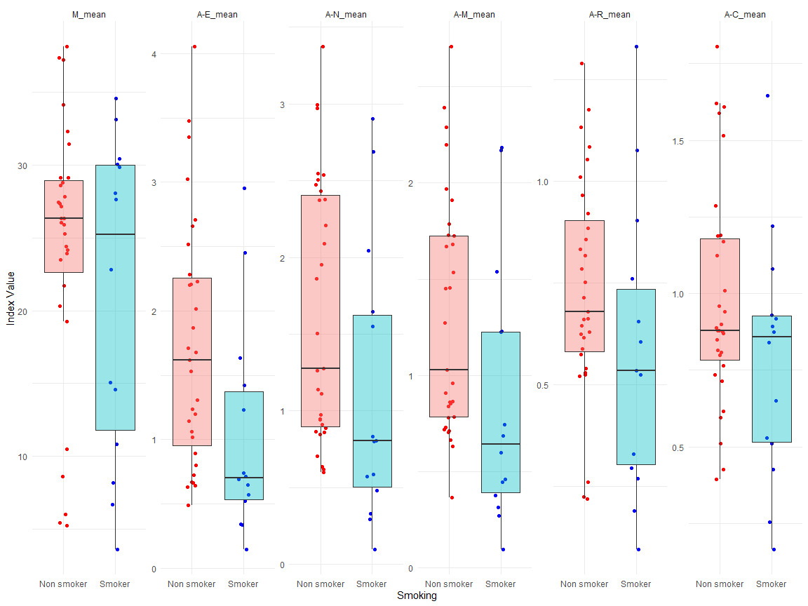
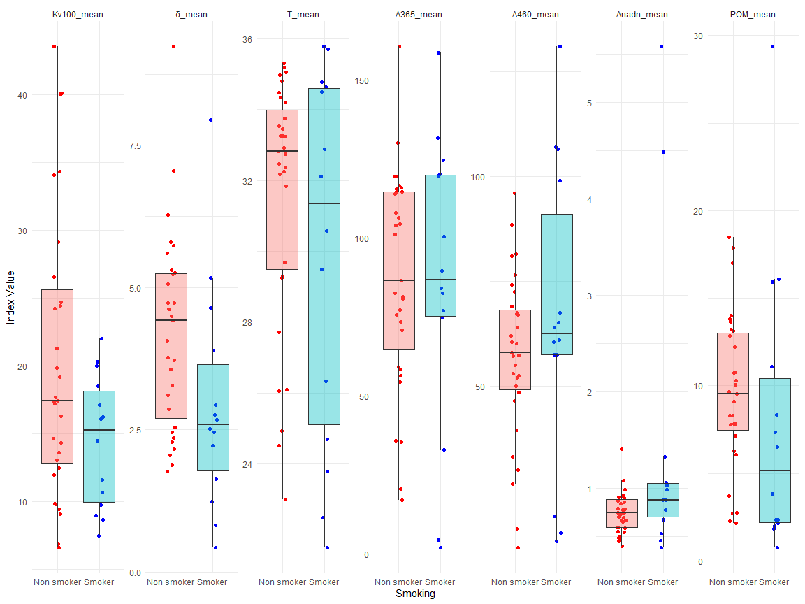
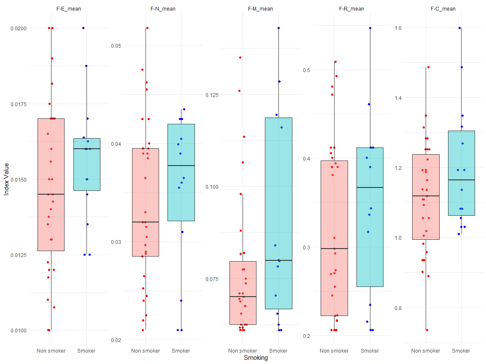

```r
options(warn = -1)
```

## Load bộ số liệu và các packages


```r
library(tidyverse)
library(gtsummary)
library(rstatix)
library(readxl)
library(boot)
library(forestplot)
d <- read_excel("C:/Users/Admin/OneDrive/NC_Quangpho/Data_regardless_sleep_18_03.xlsx")
View(d)

d$BMI_25_30 <- ifelse(d$BMI_index < 25, 1, 
                         ifelse(d$BMI_index >= 25 & d$BMI_index < 30, 2, 3))
d$Age_stage <- ifelse(d$Age <= 30, 1, 
                         ifelse(d$Age >= 30 & d$Age < 40, 2, ifelse(d$Age >= 40 & d$Age < 50, 3,4)))
d$Gender <- ifelse(d$Gender == 0, "female", ifelse(d$Gender == 1, "male", NA))
d$Race <- d$`6. Race`
d <- d %>%
  mutate(Age_stage = case_when(
    Age_stage == 1 ~ "Age <30",
    Age_stage == 2 ~ "Age [30-40)",
    Age_stage == 3 ~ "Age [40-50)",
    Age_stage == 4 ~ "Age >=50",
    TRUE ~ NA_character_  # This line handles any unexpected values
  ))
d$Hypertension <- ifelse(d$Hypertension == 0, "No", ifelse(d$Hypertension == 1, "Yes", NA))
d$`Stress index` <- ifelse(d$`Stress index` == 0, "No", ifelse(d$`Stress index` == 1, "Yes", NA))
d$Obesity <- ifelse(d$Obesity == 0, "No", ifelse(d$Obesity == 1, "Yes", NA))
d <- d %>%
  mutate(BMI_25_30 = case_when(
    BMI_25_30 == 1 ~ "BMI <25",
    BMI_25_30 == 2 ~ "BMI [25-30)",
    BMI_25_30 == 3 ~ "BMI >=30",
    TRUE ~ NA_character_  # This line handles any unexpected values
  ))
d$Smoking <- ifelse(d$Smoking == "Do not smoke", "Non smoker", ifelse(d$Smoking == "Cigarettes, pipe tobacco...", "Smoker", NA))
d <- d %>% filter(Gender == "male")
```

## So sánh các chỉ số trung bình của nhóm Smoker vs Non smoker bằng Wilcox test
Tạo hàm tính 95%CI


```r
library(dplyr)

calculate_95CI <- function(data, variable) {
  ci_lower <- quantile(data[[variable]], probs = 0.025, na.rm = TRUE)
  ci_upper <- quantile(data[[variable]], probs = 0.975, na.rm = TRUE)
  
  return(c(CI_lower = ci_lower, CI_upper = ci_upper))
}
```

Tạo hàm so sánh trung bình bằng Wilcox.test nếu subgroup có 2 level

```r
library(dplyr)

compare_means <- function(data, subgroup, variable) {
  # Split data into subgroups
  subgroup_levels <- unique(data[[subgroup]])
  results <- data.frame(Subgroup = subgroup_levels, n = NA, Mean = NA, CI_lower = NA, CI_upper = NA)
  
  # Loop through each subgroup to calculate mean, n, and 95% CI
  for (i in 1:length(subgroup_levels)) {
    subgroup_data <- data[data[[subgroup]] == subgroup_levels[i], ]
    n <- nrow(subgroup_data)
    mean_value <- mean(subgroup_data[[variable]], na.rm = TRUE)
    CI_lower  <- quantile(subgroup_data[[variable]], probs = 0.025, na.rm = TRUE)
    CI_upper  <- quantile(data[[variable]], probs = 0.975, na.rm = TRUE)
    
    results[i, "n"] <- n
    results[i, "Mean"] <- mean_value
    results[i, "CI_lower"] <- CI_lower
    results[i, "CI_upper"] <- CI_upper
  }
  
  # Statistical comparison
  if (length(subgroup_levels) > 2) {
    results$P_Value <- NA  # Not applicable for more than two subgroups
  } else if (length(subgroup_levels) == 2) {
    # If exactly two subgroups, perform Wilcoxon signed-rank test and add p-values to the results
    test_result <- wilcox.test(data[[variable]] ~ data[[subgroup]], data = data)
    results$P_Value <- rep(test_result$p.value, nrow(results))
  } else {
    # If only one subgroup, no comparison is needed
    results$P_Value <- NA
    message("Only one subgroup detected. No comparison needed.")
  }
  
  return(results)
}
```


```r
List_var <- c("M_mean", "Kv100_mean", "δ_mean", "T_mean", "A365_mean", "A460_mean", "Anadn_mean", "POM_mean", "A-E_mean", "A-N_mean", "A-M_mean", "A-R_mean", "A-C_mean", "F-E_mean", "F-N_mean", "F-M_mean", "F-R_mean", "F-C_mean")
```


```r
# Initialize an empty list to store results
results_list <- list()

# Loop through each variable and apply compare_means
for (var in List_var) {
  result <- compare_means(data = d, subgroup = "Smoking", variable = var)
  result$Variable <- var  # Add a new column for the variable name
  results_list[[var]] <- result
}

# Combine individual data frames into a final results table
final_results <- do.call(rbind, results_list)

# Reordering columns to make 'Variable' the first column
final_results <- final_results[, c("Variable", setdiff(names(final_results), "Variable"))]

# Reset row names to remove any potential duplicates
rownames(final_results) <- NULL

# View the final results
final_results %>% knitr::kable()
```


|Variable   |Subgroup   |  n|       Mean|  CI_lower|   CI_upper|   P_Value|
|:----------|:----------|--:|----------:|---------:|----------:|---------:|
|M_mean     |Non smoker | 31| 24.4826613|  5.372500|  37.353250| 0.6893053|
|M_mean     |Smoker     | 14| 21.1096667|  4.602750|  37.353250| 0.6893053|
|Kv100_mean |Non smoker | 31| 20.6321237|  6.808125|  40.097500| 0.0795145|
|Kv100_mean |Smoker     | 14| 14.4326905|  7.875125|  40.097500| 0.0795145|
|δ_mean     |Non smoker | 31|  4.1933333|  1.848750|   7.860000| 0.0269689|
|δ_mean     |Smoker     | 14|  2.9509881|  0.551750|   7.860000| 0.0269689|
|T_mean     |Non smoker | 31| 31.5779301| 24.133750|  35.666000| 0.5362906|
|T_mean     |Smoker     | 14| 29.9534405| 21.912875|  35.666000| 0.5362906|
|A365_mean  |Non smoker | 31| 87.4220430| 19.625000| 155.800000| 0.7313942|
|A365_mean  |Smoker     | 14| 85.8571429|  2.812500| 155.800000| 0.7313942|
|A460_mean  |Non smoker | 31| 57.2473118| 14.875000| 106.950000| 0.3451713|
|A460_mean  |Smoker     | 14| 65.9904762| 13.650000| 106.950000| 0.3451713|
|Anadn_mean |Non smoker | 31|  0.7467742|  0.436250|   4.177500| 0.0954619|
|Anadn_mean |Smoker     | 14|  1.4245952|  0.409375|   4.177500| 0.0954619|
|POM_mean   |Non smoker | 31|  9.5858333|  2.242500|  18.402500| 0.0839258|
|POM_mean   |Smoker     | 14|  7.8422738|  1.097625|  18.402500| 0.0839258|
|A-E_mean   |Non smoker | 31|  1.7288978|  0.595000|   3.462500| 0.0107407|
|A-E_mean   |Smoker     | 14|  1.0282619|  0.206750|   3.462500| 0.0107407|
|A-N_mean   |Non smoker | 31|  1.6372043|  0.611250|   2.992833| 0.0179084|
|A-N_mean   |Smoker     | 14|  1.1155238|  0.158375|   2.992833| 0.0179084|
|A-M_mean   |Non smoker | 31|  1.2960215|  0.563750|   2.382250| 0.0166848|
|A-M_mean   |Smoker     | 14|  0.8810714|  0.151875|   2.382250| 0.0166848|
|A-R_mean   |Non smoker | 31|  0.7346237|  0.223750|   1.278500| 0.0861069|
|A-R_mean   |Smoker     | 14|  0.5788095|  0.125875|   1.278500| 0.0861069|
|A-C_mean   |Non smoker | 31|  0.9783602|  0.417500|   1.642500| 0.2111059|
|A-C_mean   |Smoker     | 14|  0.7811071|  0.194250|   1.642500| 0.2111059|
|F-E_mean   |Non smoker | 31|  0.0147742|  0.010000|   0.020000| 0.3505025|
|F-E_mean   |Smoker     | 14|  0.0156702|  0.012500|   0.020000| 0.3505025|
|F-N_mean   |Non smoker | 31|  0.0340860|  0.021750|   0.047375| 0.5155402|
|F-N_mean   |Smoker     | 14|  0.0353881|  0.021000|   0.047375| 0.5155402|
|F-M_mean   |Non smoker | 31|  0.0765242|  0.061000|   0.134350| 0.1074320|
|F-M_mean   |Smoker     | 14|  0.0912810|  0.061000|   0.134350| 0.1074320|
|F-R_mean   |Non smoker | 31|  0.3239946|  0.206000|   0.507400| 0.4312457|
|F-R_mean   |Smoker     | 14|  0.3495262|  0.206000|   0.507400| 0.4312457|
|F-C_mean   |Non smoker | 31|  1.1142957|  0.851000|   1.486000| 0.2152527|
|F-C_mean   |Smoker     | 14|  1.2020857|  1.016466|   1.486000| 0.2152527|


## Vẽ đồ thị scatter plot và boxplot


### Subgroup Smoking


```r
long_data_Smoking1 <- reshape2::melt(d, id.vars = "Smoking", measure.vars = c("M_mean",  "A-E_mean", "A-N_mean", "A-M_mean", "A-R_mean", "A-C_mean"))

# Plotting
ggplot(long_data_Smoking1, aes(x = Smoking, y = value, fill = Smoking)) +
  geom_jitter(aes(colour = Smoking), position = position_jitterdodge(jitter.width = 0.2, dodge.width = 0.75)) +
  geom_boxplot(outlier.shape = NA, position = position_dodge(width = 0.1), alpha = 0.4) +
  facet_wrap(~variable, scales = "free_y", nrow = 1) +
  theme_minimal() +
  theme(legend.position = "none") + # Hide the legend if not necessary
  ylab("Index Value") +
  xlab("Smoking") +
  scale_color_manual(values = c("Smoker" = "blue", "Non smoker" = "red"))
```

<!-- -->


```r
long_data_Smoking2 <- reshape2::melt(d, id.vars = "Smoking", measure.vars = c("Kv100_mean", "δ_mean", "T_mean", "A365_mean", "A460_mean", "Anadn_mean", "POM_mean"))

# Plotting
ggplot(long_data_Smoking2, aes(x = Smoking, y = value, fill = Smoking)) +
  geom_jitter(aes(colour = Smoking), position = position_jitterdodge(jitter.width = 0.2, dodge.width = 0.75)) +
  geom_boxplot(outlier.shape = NA, position = position_dodge(width = 0.1), alpha = 0.4) +
  facet_wrap(~variable, scales = "free_y", nrow = 1) +
  theme_minimal() +
  theme(legend.position = "none") + # Hide the legend if not necessary
  ylab("Index Value") +
  xlab("Smoking") +
  scale_color_manual(values = c("Smoker" = "blue", "Non smoker" = "red"))
```

<!-- -->


```r
long_data_Smoking3 <- reshape2::melt(d, id.vars = "Smoking", measure.vars = c("F-E_mean", "F-N_mean", "F-M_mean", "F-R_mean", "F-C_mean"))

# Plotting
ggplot(long_data_Smoking3, aes(x = Smoking, y = value, fill = Smoking)) +
  geom_jitter(aes(colour = Smoking), position = position_jitterdodge(jitter.width = 0.2, dodge.width = 0.75)) +
  geom_boxplot(outlier.shape = NA, position = position_dodge(width = 0.1), alpha = 0.4) +
  facet_wrap(~variable, scales = "free_y", nrow = 1) +
  theme_minimal() +
  theme(legend.position = "none") + # Hide the legend if not necessary
  ylab("Index Value") +
  xlab("Smoking") +
  scale_color_manual(values = c("Smoker" = "blue", "Non smoker" = "red"))
```

<!-- -->


