## Load bộ số liệu và các packages


```
## ── Attaching core tidyverse packages ──────────────────────── tidyverse 2.0.0 ──
## ✔ dplyr     1.1.2     ✔ readr     2.1.4
## ✔ forcats   1.0.0     ✔ stringr   1.5.0
## ✔ ggplot2   3.5.0     ✔ tibble    3.2.1
## ✔ lubridate 1.9.2     ✔ tidyr     1.3.0
## ✔ purrr     1.0.2     
## ── Conflicts ────────────────────────────────────────── tidyverse_conflicts() ──
## ✖ dplyr::filter() masks stats::filter()
## ✖ dplyr::lag()    masks stats::lag()
## ℹ Use the conflicted package (<http://conflicted.r-lib.org/>) to force all conflicts to become errors
## 
## Attaching package: 'rstatix'
## 
## 
## The following object is masked from 'package:stats':
## 
##     filter
```

## So sánh khác biệt về trung bình của chỉ số M theo các biến

Lập hàm so sánh trung bình biến var1 và var2 theo characteristic


### Lập bảng phân tích


Hàm vẽ forest plot


```
## Loading required package: grid
```

```
## Loading required package: checkmate
```

```
## Loading required package: abind
```

Hàm sắp xếp các cột theo thứ tự


Bảng phân tích theo từng characteristic


Bảng M theo các subgroup:


|Characteristic |Subgroup                    | N M_right| N M_left| Mean M_right|CI_95% M_right | Mean M_left|CI_95% M_left |  Mean_Diff|Diff_CI_95%    |   P_Value|
|:--------------|:---------------------------|---------:|--------:|------------:|:--------------|-----------:|:-------------|----------:|:--------------|---------:|
|Gender         |0                           |        31|       31|     21.24866|(17.92,24.58)  |    20.94035|(17.63,24.25) |  0.3083065|(-1.27,1.89)   | 0.5682234|
|Gender         |1                           |        44|       44|     22.86338|(19.91,25.82)  |    23.48846|(20.4,26.57)  | -0.6250833|(-2.27,1.02)   | 0.3160492|
|Age_stage      |1                           |        26|       26|     19.17679|(15.06,23.3)   |    19.65327|(14.93,24.37) | -0.4764744|(-2.43,1.48)   | 0.5651319|
|Age_stage      |2                           |        30|       30|     25.18288|(22.74,27.62)  |    25.07405|(22.38,27.76) |  0.1088278|(-1.64,1.86)   | 0.8552717|
|Age_stage      |3                           |        13|       13|     22.94608|(16.46,29.43)  |    24.01013|(18.64,29.38) | -1.0640513|(-3.58,1.45)   | 0.4548340|
|Age_stage      |4                           |         6|        6|     18.71917|(5.71,31.73)   |    17.88417|(6.82,28.94)  |  0.8350000|(-8.26,9.93)   | 0.8437500|
|Race           |0                           |        11|       11|     26.13345|(21.73,30.54)  |    27.78006|(23.89,31.67) | -1.6466061|(-5.28,1.99)   | 0.2060547|
|Race           |1                           |        61|       61|     21.06736|(18.6,23.53)   |    21.14676|(18.58,23.72) | -0.0794016|(-1.31,1.15)   | 0.9427390|
|Race           |2                           |         3|        3|     30.70667|(11.24,50.17)  |    29.03667|(14.98,43.1)  |  1.6700000|(-17.48,20.82) | 1.0000000|
|Type of skins  |1                           |        10|       10|     24.73180|(20.82,28.64)  |    25.85290|(22.22,29.48) | -1.1211000|(-5.48,3.24)   | 0.6250000|
|Type of skins  |2                           |         4|        4|     30.01750|(21.21,38.82)  |    30.88750|(22.83,38.95) | -0.8700000|(-4.55,2.81)   | 0.6250000|
|Type of skins  |3                           |        40|       40|     19.38852|(16.28,22.49)  |    19.81858|(16.43,23.21) | -0.4300667|(-1.89,1.03)   | 0.4437333|
|Type of skins  |4                           |        11|       11|     26.75303|(23.15,30.36)  |    26.52508|(23.38,29.67) |  0.2279545|(-4.27,4.73)   | 0.8310547|
|Type of skins  |5                           |         6|        6|     17.96917|(3.73,32.2)    |    16.12917|(3.8,28.46)   |  1.8400000|(-0.64,4.32)   | 0.1562500|
|Type of skins  |6                           |         4|        4|     29.91750|(19.43,40.4)   |    29.81750|(22.06,37.58) |  0.1000000|(-11.09,11.29) | 0.8750000|
|Stress index   |0                           |        57|       57|     20.80047|(18.32,23.28)  |    21.22492|(18.61,23.84) | -0.4244503|(-1.69,0.84)   | 0.4696713|
|Stress index   |1                           |        18|       18|     26.61500|(22.41,30.82)  |    26.26792|(22.06,30.47) |  0.3470833|(-2.5,3.19)    | 0.7987061|
|Smoking        |Do not smoke                |        62|       62|     22.67448|(20.4,24.95)   |    22.89599|(20.44,25.35) | -0.2215081|(-1.48,1.04)   | 0.7791370|
|Smoking        |Cigarettes, pipe tobacco... |        13|       13|     19.91377|(12.92,26.91)  |    20.23782|(14.14,26.34) | -0.3240513|(-3.48,2.83)   | 0.7868652|
|Hypertension   |0                           |        54|       54|     23.09776|(20.61,25.59)  |    23.62721|(21.09,26.17) | -0.5294475|(-1.96,0.9)    | 0.4963733|
|Hypertension   |1                           |        21|       21|     19.87705|(15.31,24.44)  |    19.37019|(14.68,24.06) |  0.5068571|(-1.42,2.43)   | 1.0000000|
|BMI_25_30      |1                           |        42|       42|     18.83752|(15.82,21.85)  |    19.73143|(16.71,22.75) | -0.8939127|(-2.47,0.68)   | 0.2688326|
|BMI_25_30      |2                           |        26|       26|     26.08391|(22.9,29.27)   |    26.02997|(22.14,29.92) |  0.0539423|(-1.91,2.01)   | 0.7453930|
|BMI_25_30      |3                           |         7|        7|     27.90567|(24.45,31.36)  |    25.30629|(21.13,29.48) |  2.5993810|(-1.44,6.64)   | 0.1562500|
|Obesity        |0                           |        68|       68|     21.60820|(19.27,23.94)  |    22.13969|(19.7,24.58)  | -0.5314975|(-1.73,0.67)   | 0.2754046|
|Obesity        |1                           |         7|        7|     27.90567|(24.45,31.36)  |    25.30629|(21.13,29.48) |  2.5993810|(-1.44,6.64)   | 0.1562500|
|All            |1                           |        75|       75|     22.19596|(20.03,24.36)  |    22.43524|(20.2,24.67)  | -0.2392822|(-1.38,0.9)    | 0.6289738|
Đồ thị Forest plot theo biến M
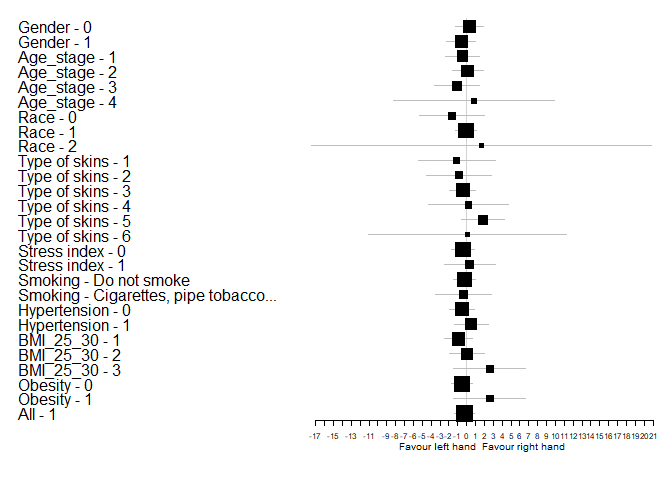<!-- -->


Bảng Kv100 theo các subgroup:


|Characteristic |Subgroup                    | N Kv100_right| N Kv100_left| Mean Kv100_right|CI_95% Kv100_right | Mean Kv100_left|CI_95% Kv100_left |  Mean_Diff|Diff_CI_95%    |   P_Value|
|:--------------|:---------------------------|-------------:|------------:|----------------:|:------------------|---------------:|:-----------------|----------:|:--------------|---------:|
|Gender         |0                           |            31|           31|         22.14626|(17.67,26.62)      |        27.32293|(20.77,33.88)     | -5.1766667|(-9.67,-0.69)  | 0.0233424|
|Gender         |1                           |            44|           44|         19.23460|(15.65,22.82)      |        18.03458|(14.83,21.23)     |  1.2000152|(-2.08,4.48)   | 0.2139098|
|Age_stage      |1                           |            26|           26|         23.41340|(18.69,28.13)      |        27.77519|(21.26,34.29)     | -4.3617949|(-9.76,1.04)   | 0.1048203|
|Age_stage      |2                           |            30|           30|         18.55904|(14.52,22.6)       |        20.48275|(15.6,25.37)      | -1.9237111|(-6.06,2.21)   | 0.7456547|
|Age_stage      |3                           |            13|           13|         13.90246|(9.49,18.31)       |        11.34026|(9.14,13.55)      |  2.5622051|(-1.67,6.8)    | 0.1909180|
|Age_stage      |4                           |             6|            6|         31.10083|(12.44,49.76)      |        26.07861|(6.4,45.76)       |  5.0222222|(-9.17,19.22)  | 0.5625000|
|Race           |0                           |            11|           11|         20.56973|(10.6,30.54)       |        22.03712|(12.81,31.26)     | -1.4673939|(-9.58,6.65)   | 0.3652344|
|Race           |1                           |            61|           61|         20.56688|(17.58,23.56)      |        22.17564|(18.32,26.04)     | -1.6087650|(-4.6,1.39)    | 0.7519698|
|Race           |2                           |             3|            3|         17.33667|(-6.41,41.09)      |        15.13667|(-12.77,43.04)    |  2.2000000|(-37.94,42.34) | 0.7500000|
|Type of skins  |1                           |            10|           10|         22.66645|(12.13,33.21)      |        21.67467|(11.39,31.96)     |  0.9917833|(-7.17,9.15)   | 0.9218750|
|Type of skins  |2                           |             4|            4|         12.98000|(3.23,22.73)       |        13.44000|(0.57,26.31)      | -0.4600000|(-12.76,11.84) | 1.0000000|
|Type of skins  |3                           |            40|           40|         19.72226|(15.86,23.58)      |        22.52825|(17.32,27.73)     | -2.8059917|(-6.72,1.11)   | 0.4160990|
|Type of skins  |4                           |            11|           11|         20.48197|(13.58,27.39)      |        20.75735|(14.36,27.16)     | -0.2753788|(-8.51,7.96)   | 0.8984375|
|Type of skins  |5                           |             6|            6|         29.96500|(18.52,41.41)      |        31.40917|(15.67,47.15)     | -1.4441667|(-14.68,11.79) | 0.6875000|
|Type of skins  |6                           |             4|            4|         15.07250|(0.71,29.43)       |        13.02750|(-3.04,29.09)     |  2.0450000|(-18.95,23.04) | 0.6250000|
|Stress index   |0                           |            57|           57|         20.57171|(17.34,23.8)       |        21.62570|(17.69,25.56)     | -1.0539942|(-4.41,2.3)    | 0.9746467|
|Stress index   |1                           |            18|           18|         20.01495|(14.23,25.8)       |        22.65931|(15.46,29.86)     | -2.6443519|(-6.92,1.63)   | 0.2645264|
|Smoking        |Do not smoke                |            62|           62|         21.63233|(18.42,24.85)      |        23.68966|(19.81,27.57)     | -2.0573333|(-5.24,1.12)   | 0.2679700|
|Smoking        |Cigarettes, pipe tobacco... |            13|           13|         14.74246|(11.63,17.85)      |        13.21333|(9.39,17.04)      |  1.5291282|(-2.42,5.48)   | 0.1909180|
|Hypertension   |0                           |            54|           54|         21.71050|(18.46,24.96)      |        23.72681|(19.39,28.07)     | -2.0163056|(-5.41,1.38)   | 0.4084725|
|Hypertension   |1                           |            21|           21|         17.16617|(11.82,22.51)      |        17.10881|(12.73,21.49)     |  0.0573571|(-4.45,4.56)   | 0.8917322|
|BMI_25_30      |1                           |            42|           42|         24.06937|(20.31,27.83)      |        23.97123|(19.04,28.9)      |  0.0981429|(-4.25,4.45)   | 0.5944014|
|BMI_25_30      |2                           |            26|           26|         15.61135|(11.15,20.07)      |        19.77728|(14.15,25.41)     | -4.1659295|(-7.57,-0.76)  | 0.0254100|
|BMI_25_30      |3                           |             7|            7|         16.57826|(9.8,23.36)        |        17.07595|(10.25,23.9)      | -0.4976905|(-5.24,4.24)   | 0.9375000|
|Obesity        |0                           |            68|           68|         20.83542|(17.86,23.82)      |        22.36766|(18.7,26.04)      | -1.5322377|(-4.5,1.43)    | 0.5472599|
|Obesity        |1                           |             7|            7|         16.57826|(9.8,23.36)        |        17.07595|(10.25,23.9)      | -0.4976905|(-5.24,4.24)   | 0.9375000|
|All            |1                           |            75|           75|         20.43809|(17.69,23.19)      |        21.87377|(18.5,25.25)      | -1.4356800|(-4.14,1.27)   | 0.5524695|
Đồ thị Forest plot theo biến Kv100
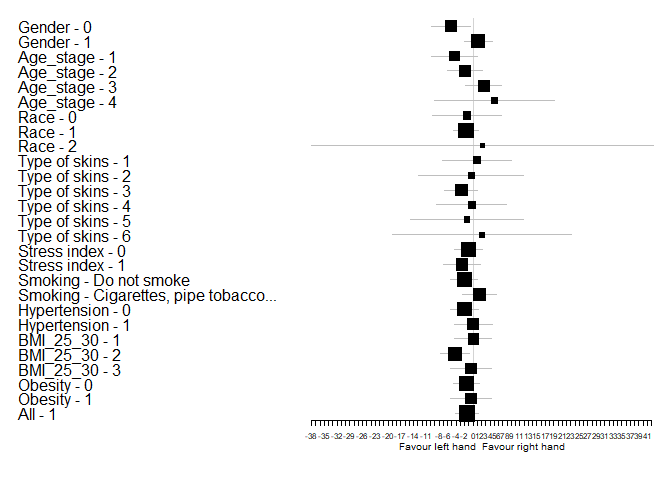<!-- -->


Bảng δ theo các subgroup:


|Characteristic |Subgroup                    | N δ_right| N δ_left| Mean δ_right|CI_95% δ_right | Mean δ_left|CI_95% δ_left |  Mean_Diff|Diff_CI_95%   |   P_Value|
|:--------------|:---------------------------|---------:|--------:|------------:|:--------------|-----------:|:-------------|----------:|:-------------|---------:|
|Gender         |0                           |        31|       31|     3.759113|(3.04,4.48)    |    4.547688|(3.76,5.33)   | -0.7885753|(-1.47,-0.11) | 0.0117951|
|Gender         |1                           |        44|       44|     3.739992|(3.14,4.34)    |    3.664803|(3.06,4.27)   |  0.0751894|(-0.47,0.62)  | 0.5247563|
|Age_stage      |1                           |        26|       26|     3.584680|(2.85,4.32)    |    4.158269|(3.33,4.98)   | -0.5735897|(-1.28,0.14)  | 0.1427159|
|Age_stage      |2                           |        30|       30|     4.118706|(3.38,4.86)    |    4.448211|(3.7,5.2)     | -0.3295056|(-1.09,0.43)  | 0.3183961|
|Age_stage      |3                           |        13|       13|     2.910077|(1.74,4.08)    |    2.782051|(1.8,3.76)    |  0.1280256|(-0.91,1.17)  | 0.9460449|
|Age_stage      |4                           |         6|        6|     4.416389|(2.08,6.76)    |    4.083611|(1.08,7.09)   |  0.3327778|(-1.38,2.05)  | 0.6875000|
|Race           |0                           |        11|       11|     4.503667|(3.26,5.75)    |    5.386333|(4.36,6.41)   | -0.8826667|(-2,0.24)     | 0.1015625|
|Race           |1                           |        61|       61|     3.558063|(3.05,4.06)    |    3.746393|(3.24,4.25)   | -0.1883306|(-0.63,0.26)  | 0.3926863|
|Race           |2                           |         3|        3|     4.836667|(1.68,7.99)    |    4.816667|(-6.27,15.9)  |  0.0200000|(-11.2,11.24) | 1.0000000|
|Type of skins  |1                           |        10|       10|     4.728283|(3.44,6.02)    |    4.964217|(3.84,6.09)   | -0.2359333|(-1.2,0.72)   | 0.5566406|
|Type of skins  |2                           |         4|        4|     3.975000|(0.64,7.31)    |    4.810000|(2.67,6.95)   | -0.8350000|(-3.5,1.83)   | 0.6250000|
|Type of skins  |3                           |        40|       40|     2.981442|(2.5,3.46)     |    3.444417|(2.87,4.02)   | -0.4629750|(-0.96,0.03)  | 0.1561695|
|Type of skins  |4                           |        11|       11|     4.959242|(3.54,6.38)    |    5.000530|(3.53,6.47)   | -0.0412879|(-1.9,1.82)   | 0.7555408|
|Type of skins  |5                           |         6|        6|     4.551667|(1.37,7.73)    |    3.994167|(1.12,6.87)   |  0.5575000|(-0.98,2.09)  | 0.5625000|
|Type of skins  |6                           |         4|        4|     4.197500|(1.58,6.82)    |    4.150000|(-2.02,10.32) |  0.0475000|(-5.82,5.91)  | 0.8750000|
|Stress index   |0                           |        57|       57|     3.520901|(2.98,4.06)    |    3.737012|(3.22,4.25)   | -0.2161111|(-0.7,0.27)   | 0.2979542|
|Stress index   |1                           |        18|       18|     4.466713|(3.71,5.22)    |    4.956667|(3.8,6.11)    | -0.4899537|(-1.46,0.48)  | 0.4171143|
|Smoking        |Do not smoke                |        62|       62|     3.968890|(3.47,4.46)    |    4.363274|(3.84,4.89)   | -0.3943844|(-0.89,0.11)  | 0.1083738|
|Smoking        |Cigarettes, pipe tobacco... |        13|       13|     2.693923|(1.67,3.72)    |    2.438974|(1.68,3.2)    |  0.2549487|(-0.38,0.89)  | 0.6245946|
|Hypertension   |0                           |        54|       54|     4.173475|(3.63,4.72)    |    4.532207|(3.98,5.08)   | -0.3587315|(-0.88,0.16)  | 0.1683121|
|Hypertension   |1                           |        21|       21|     2.653548|(2.04,3.27)    |    2.737643|(1.97,3.51)   | -0.0840952|(-0.87,0.7)   | 1.0000000|
|BMI_25_30      |1                           |        42|       42|     3.887087|(3.19,4.59)    |    3.964167|(3.27,4.65)   | -0.0770794|(-0.69,0.54)  | 0.9203203|
|BMI_25_30      |2                           |        26|       26|     3.378782|(2.76,4)       |    4.189904|(3.39,4.99)   | -0.8111218|(-1.45,-0.17) | 0.0253507|
|BMI_25_30      |3                           |         7|        7|     4.283738|(2.94,5.63)    |    3.828167|(2.18,5.48)   |  0.4555714|(-1.19,2.11)  | 0.9325263|
|Obesity        |0                           |        68|       68|     3.692735|(3.21,4.18)    |    4.050478|(3.54,4.56)   | -0.3577426|(-0.81,0.09)  | 0.1536460|
|Obesity        |1                           |         7|        7|     4.283738|(2.94,5.63)    |    3.828167|(2.18,5.48)   |  0.4555714|(-1.19,2.11)  | 0.9325263|
|All            |1                           |        75|       75|     3.747896|(3.3,4.2)      |    4.029729|(3.55,4.51)   | -0.2818333|(-0.71,0.14)  | 0.2003547|
Đồ thị Forest plot theo biến δ
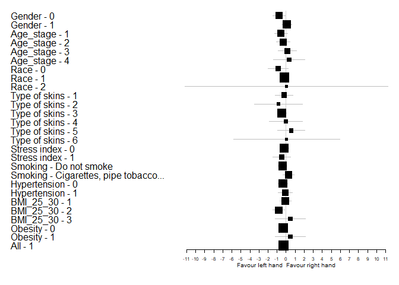<!-- -->


Bảng T theo các subgroup:


|Characteristic |Subgroup                    | N T_right| N T_left| Mean T_right|CI_95% T_right | Mean T_left|CI_95% T_left |  Mean_Diff|Diff_CI_95%  |   P_Value|
|:--------------|:---------------------------|---------:|--------:|------------:|:--------------|-----------:|:-------------|----------:|:------------|---------:|
|Gender         |0                           |        31|       31|     31.67831|(30.56,32.8)   |    31.44366|(30.23,32.66) |  0.2346505|(-0.2,0.67)  | 0.2243493|
|Gender         |1                           |        44|       44|     30.95224|(29.66,32.25)  |    31.01694|(29.76,32.28) | -0.0646970|(-0.58,0.45) | 0.5634673|
|Age_stage      |1                           |        26|       26|     30.55058|(28.99,32.12)  |    30.50000|(29,32)       |  0.0505769|(-0.38,0.48) | 0.8028007|
|Age_stage      |2                           |        30|       30|     32.06649|(31,33.13)     |    32.13918|(31.03,33.25) | -0.0726833|(-0.85,0.71) | 0.2133460|
|Age_stage      |3                           |        13|       13|     31.49985|(28.58,34.42)  |    31.18910|(28.27,34.11) |  0.3107436|(0.01,0.62)  | 0.0805203|
|Age_stage      |4                           |         6|        6|     29.68639|(24.3,35.08)   |    29.47750|(24.03,34.92) |  0.2088889|(-1.15,1.56) | 0.8437500|
|Race           |0                           |        11|       11|     32.83158|(31.42,34.24)  |    32.66200|(31.06,34.26) |  0.1695758|(-0.48,0.82) | 0.5771484|
|Race           |1                           |        61|       61|     30.80654|(29.79,31.83)  |    30.77880|(29.76,31.8)  |  0.0277404|(-0.39,0.44) | 0.2474944|
|Race           |2                           |         3|        3|     34.52667|(31.71,37.34)  |    34.23667|(30.99,37.49) |  0.2900000|(-1.84,2.42) | 0.7500000|
|Type of skins  |1                           |        10|       10|     32.77298|(31.21,34.34)  |    32.69770|(30.89,34.51) |  0.0752833|(-0.65,0.8)  | 0.8457031|
|Type of skins  |2                           |         4|        4|     32.20750|(24.01,40.4)   |    34.27000|(31.96,36.58) | -2.0625000|(-9.49,5.36) | 1.0000000|
|Type of skins  |3                           |        40|       40|     30.34933|(29.07,31.62)  |    30.06021|(28.73,31.39) |  0.2891167|(-0.06,0.64) | 0.2913387|
|Type of skins  |4                           |        11|       11|     33.28576|(32.32,34.25)  |    33.14848|(32.09,34.2)  |  0.1372727|(-0.74,1.01) | 0.0998330|
|Type of skins  |5                           |         6|        6|     27.96667|(23.67,32.27)  |    28.33500|(24.94,31.73) | -0.3683333|(-1.57,0.83) | 0.6875000|
|Type of skins  |6                           |         4|        4|     34.86250|(33.04,36.68)  |    34.59750|(32.55,36.65) |  0.2650000|(-0.85,1.38) | 0.6250000|
|Stress index   |0                           |        57|       57|     30.69375|(29.61,31.78)  |    30.58278|(29.51,31.66) |  0.1109649|(-0.32,0.54) | 0.1561120|
|Stress index   |1                           |        18|       18|     33.02125|(32.07,33.97)  |    33.12667|(32.19,34.06) | -0.1054167|(-0.6,0.39)  | 0.8445921|
|Smoking        |Do not smoke                |        62|       62|     31.57658|(30.71,32.44)  |    31.54775|(30.69,32.4)  |  0.0288360|(-0.38,0.44) | 0.3676146|
|Smoking        |Cigarettes, pipe tobacco... |        13|       13|     29.70600|(26.57,32.84)  |    29.50295|(26.31,32.7)  |  0.2030513|(-0.2,0.6)   | 0.2734375|
|Hypertension   |0                           |        54|       54|     31.69583|(30.8,32.59)   |    31.58660|(30.69,32.48) |  0.1092222|(-0.18,0.4)  | 0.2837214|
|Hypertension   |1                           |        21|       21|     30.11198|(27.91,32.31)  |    30.18200|(27.98,32.39) | -0.0700238|(-1.13,0.99) | 0.5545709|
|BMI_25_30      |1                           |        42|       42|     30.28253|(29.08,31.48)  |    30.08278|(28.81,31.36) |  0.1997540|(-0.17,0.57) | 0.2134395|
|BMI_25_30      |2                           |        26|       26|     32.13122|(30.64,33.62)  |    32.27346|(31.03,33.52) | -0.1422436|(-0.98,0.69) | 0.5505898|
|BMI_25_30      |3                           |         7|        7|     33.80688|(32.14,35.48)  |    33.84457|(32.26,35.43) | -0.0376905|(-0.27,0.19) | 0.8125000|
|Obesity        |0                           |        68|       68|     30.98938|(30.05,31.93)  |    30.92039|(29.99,31.86) |  0.0689902|(-0.31,0.45) | 0.1654166|
|Obesity        |1                           |         7|        7|     33.80688|(32.14,35.48)  |    33.84457|(32.26,35.43) | -0.0376905|(-0.27,0.19) | 0.8125000|
|All            |1                           |        75|       75|     31.25235|(30.38,32.13)  |    31.19332|(30.32,32.07) |  0.0590333|(-0.29,0.4)  | 0.1921221|
Đồ thị Forest plot theo biến T
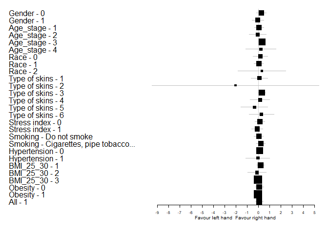<!-- -->


Bảng A365 theo các subgroup:


|Characteristic |Subgroup                    | N A365_right| N A365_left| Mean A365_right|CI_95% A365_right | Mean A365_left|CI_95% A365_left |  Mean_Diff|Diff_CI_95%      |   P_Value|
|:--------------|:---------------------------|------------:|-----------:|---------------:|:-----------------|--------------:|:----------------|----------:|:----------------|---------:|
|Gender         |0                           |           31|          31|        84.00806|(70.46,97.56)     |      90.094086|(73.12,107.06)   |  -6.086022|(-15.53,3.35)    | 0.1880019|
|Gender         |1                           |           44|          44|        83.52348|(72.89,94.16)     |      86.989394|(73.25,100.73)   |  -3.465909|(-13.95,7.02)    | 1.0000000|
|Age_stage      |1                           |           26|          26|        80.21795|(62.83,97.6)      |      81.846154|(61.78,101.91)   |  -1.628205|(-12.82,9.56)    | 0.7063356|
|Age_stage      |2                           |           30|          30|        88.36500|(77.75,98.98)     |      98.315000|(83.05,113.58)   |  -9.950000|(-23.81,3.91)    | 0.3492946|
|Age_stage      |3                           |           13|          13|        79.03846|(53.94,104.13)    |      80.038461|(53.07,107)      |  -1.000000|(-8.92,6.92)     | 0.6747995|
|Age_stage      |4                           |            6|           6|        85.86111|(65.75,105.97)    |      83.750000|(30.18,137.32)   |   2.111111|(-40.94,45.17)   | 1.0000000|
|Race           |0                           |           11|          11|       103.48788|(91.1,115.88)     |     103.957576|(84.66,123.25)   |  -0.469697|(-20.84,19.9)    | 0.4495797|
|Race           |1                           |           61|          61|        82.80191|(73.71,91.9)      |      89.408470|(77.88,100.94)   |  -6.606557|(-14.58,1.36)    | 0.2522731|
|Race           |2                           |            3|           3|        30.00000|(-38.35,98.35)    |       7.666667|(-0.32,15.65)    |  22.333333|(-39.84,84.5)    | 0.5000000|
|Type of skins  |1                           |           10|          10|       105.61167|(93.24,117.99)    |     108.395000|(87.82,128.97)   |  -2.783333|(-25.74,20.17)   | 0.3077489|
|Type of skins  |2                           |            4|           4|        61.50000|(-3.99,126.99)    |      86.000000|(-33.9,205.9)    | -24.500000|(-151.19,102.19) | 0.8750000|
|Type of skins  |3                           |           40|          40|        92.39167|(83.16,101.62)    |      96.495833|(85.03,107.96)   |  -4.104167|(-12.3,4.09)     | 0.3679985|
|Type of skins  |4                           |           11|          11|        89.13636|(70.51,107.76)    |     101.151515|(70.72,131.58)   | -12.015151|(-33.88,9.85)    | 0.2783203|
|Type of skins  |5                           |            6|           6|        35.00000|(4.28,65.72)      |      32.333333|(6.94,57.72)     |   2.666667|(-9.85,15.18)    | 0.6875000|
|Type of skins  |6                           |            4|           4|        22.75000|(-19.8,65.3)      |       6.500000|(0.91,12.09)     |  16.250000|(-21.59,54.09)   | 0.5807122|
|Stress index   |0                           |           57|          57|        84.79591|(75.45,94.14)     |      85.985965|(74.66,97.32)    |  -1.190058|(-8.14,5.76)     | 0.9123013|
|Stress index   |1                           |           18|          18|        80.32870|(61.71,98.94)     |      95.513889|(68.86,122.17)   | -15.185185|(-36.11,5.74)    | 0.1504784|
|Smoking        |Do not smoke                |           62|          62|        83.81909|(75.03,92.61)     |      90.579839|(79.17,101.99)   |  -6.760753|(-14.96,1.44)    | 0.2489138|
|Smoking        |Cigarettes, pipe tobacco... |           13|          13|        83.26923|(58.29,108.24)    |      77.269231|(48.51,106.03)   |   6.000000|(-7.35,19.35)    | 0.6245946|
|Hypertension   |0                           |           54|          54|        81.45062|(71.7,91.21)      |      86.666667|(73.4,99.93)     |  -5.216049|(-14.65,4.21)    | 0.6014114|
|Hypertension   |1                           |           21|          21|        89.56905|(73.52,105.62)    |      92.402381|(75.83,108.97)   |  -2.833333|(-11.83,6.17)    | 0.3847716|
|BMI_25_30      |1                           |           42|          42|        84.09921|(72.17,96.03)     |      86.075397|(70.22,101.93)   |  -1.976190|(-10.34,6.39)    | 0.7361232|
|BMI_25_30      |2                           |           26|          26|        79.87821|(66,93.75)        |      87.397436|(71.12,103.68)   |  -7.519231|(-23.03,7.99)    | 0.7125496|
|BMI_25_30      |3                           |            7|           7|        95.75476|(76.48,115.03)    |     104.707143|(83.02,126.39)   |  -8.952381|(-33.27,15.37)   | 0.2968750|
|Obesity        |0                           |           68|          68|        82.48529|(73.62,91.35)     |      86.580882|(75.25,97.91)    |  -4.095588|(-11.74,3.55)    | 0.6460937|
|Obesity        |1                           |            7|           7|        95.75476|(76.48,115.03)    |     104.707143|(83.02,126.39)   |  -8.952381|(-33.27,15.37)   | 0.2968750|
|All            |1                           |           75|          75|        83.72378|(75.54,91.9)      |      88.272667|(77.84,98.71)    |  -4.548889|(-11.68,2.59)    | 0.3871725|
Đồ thị Forest plot theo biến A365
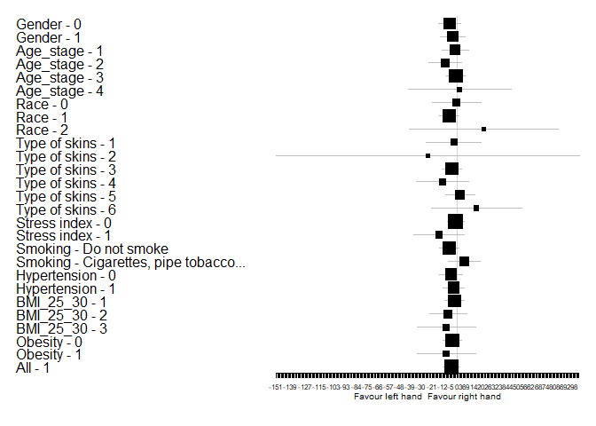<!-- -->


Bảng A460 theo các subgroup:


|Characteristic |Subgroup                    | N A460_right| N A460_left| Mean A460_right|CI_95% A460_right | Mean A460_left|CI_95% A460_left |   Mean_Diff|Diff_CI_95%     |   P_Value|
|:--------------|:---------------------------|------------:|-----------:|---------------:|:-----------------|--------------:|:----------------|-----------:|:---------------|---------:|
|Gender         |0                           |           31|          31|        49.41935|(42.14,56.7)      |       67.51344|(57.68,77.35)    | -18.0940860|(-25.8,-10.39)  | 0.0001613|
|Gender         |1                           |           44|          44|        50.37348|(43.89,56.86)     |       69.91136|(59.23,80.6)     | -19.5378788|(-27.43,-11.64) | 0.0000206|
|Age_stage      |1                           |           26|          26|        46.08974|(36.7,55.48)      |       57.40385|(46.01,68.8)     | -11.3141026|(-21.53,-1.1)   | 0.0270756|
|Age_stage      |2                           |           30|          30|        51.60111|(45.95,57.25)     |       75.66167|(65.41,85.92)    | -24.0605556|(-31.98,-16.14) | 0.0000248|
|Age_stage      |3                           |           13|          13|        54.72308|(39.59,69.85)     |       77.17949|(51.82,102.54)   | -22.4564103|(-39.81,-5.11)  | 0.0096051|
|Age_stage      |4                           |            6|           6|        48.44444|(22.91,73.98)     |       67.22222|(30.34,104.1)    | -18.7777778|(-32.84,-4.72)  | 0.0312500|
|Race           |0                           |           11|          11|        47.26061|(39.78,54.74)     |       69.75152|(57.52,81.98)    | -22.4909091|(-34.98,-10)    | 0.0038398|
|Race           |1                           |           61|          61|        52.22240|(46.9,57.54)      |       71.48770|(63.26,79.71)    | -19.2653005|(-25.66,-12.87) | 0.0000006|
|Race           |2                           |            3|           3|        14.33333|(0.65,28.01)      |       13.66667|(8.5,18.84)      |   0.6666667|(-15.3,16.64)   | 1.0000000|
|Type of skins  |1                           |           10|          10|        47.13667|(40.53,53.74)     |       73.89333|(62.86,84.93)    | -26.7566667|(-39.66,-13.85) | 0.0019531|
|Type of skins  |2                           |            4|           4|        46.00000|(24.73,67.27)     |       58.25000|(8.75,107.75)    | -12.2500000|(-56.07,31.57)  | 0.8750000|
|Type of skins  |3                           |           40|          40|        58.95583|(53.36,64.55)     |       79.24167|(69.63,88.85)    | -20.2858333|(-28.91,-11.67) | 0.0000654|
|Type of skins  |4                           |           11|          11|        50.66667|(38.77,62.56)     |       69.21970|(48.53,89.91)    | -18.5530303|(-34.86,-2.25)  | 0.0580240|
|Type of skins  |5                           |            6|           6|        22.08333|(8.82,35.34)      |       33.50000|(16.18,50.82)    | -11.4166667|(-20.97,-1.86)  | 0.0625000|
|Type of skins  |6                           |            4|           4|        11.25000|(-0.89,23.39)     |       16.25000|(7.6,24.9)       |  -5.0000000|(-24.87,14.87)  | 0.6250000|
|Stress index   |0                           |           57|          57|        50.80292|(45.53,56.07)     |       70.66257|(61.94,79.38)    | -19.8596491|(-26.51,-13.21) | 0.0000006|
|Stress index   |1                           |           18|          18|        47.37037|(35.85,58.9)      |       63.40278|(49.34,77.46)    | -16.0324074|(-26.05,-6.01)  | 0.0069181|
|Smoking        |Do not smoke                |           62|          62|        49.33925|(44.76,53.92)     |       66.54328|(59.48,73.61)    | -17.2040323|(-23.09,-11.31) | 0.0000011|
|Smoking        |Cigarettes, pipe tobacco... |           13|          13|        53.03077|(34.42,71.64)     |       80.25641|(52.35,108.16)   | -27.2256410|(-43.21,-11.24) | 0.0032950|
|Hypertension   |0                           |           54|          54|        47.43025|(42.05,52.81)     |       60.70216|(53.46,67.94)    | -13.2719136|(-18.88,-7.66)  | 0.0000313|
|Hypertension   |1                           |           21|          21|        56.53333|(46.57,66.5)      |       90.05238|(74.14,105.97)   | -33.5190476|(-45.42,-21.62) | 0.0002134|
|BMI_25_30      |1                           |           42|          42|        51.11270|(43.6,58.63)      |       66.57143|(55.28,77.86)    | -15.4587302|(-23.47,-7.45)  | 0.0004511|
|BMI_25_30      |2                           |           26|          26|        48.10256|(41.3,54.91)      |       68.38782|(58.47,78.31)    | -20.2852564|(-28.06,-12.51) | 0.0000955|
|BMI_25_30      |3                           |            7|           7|        50.14762|(43.28,57.01)     |       84.99048|(61.66,108.32)   | -34.8428571|(-57.45,-12.24) | 0.0360317|
|Obesity        |0                           |           68|          68|        49.96176|(44.75,55.17)     |       67.26593|(59.5,75.03)     | -17.3041667|(-22.97,-11.64) | 0.0000002|
|Obesity        |1                           |            7|           7|        50.14762|(43.28,57.01)     |       84.99048|(61.66,108.32)   | -34.8428571|(-57.45,-12.24) | 0.0360317|
|All            |1                           |           75|          75|        49.97911|(45.24,54.72)     |       68.92022|(61.61,76.23)    | -18.9411111|(-24.44,-13.44) | 0.0000000|
Đồ thị Forest plot theo biến A460
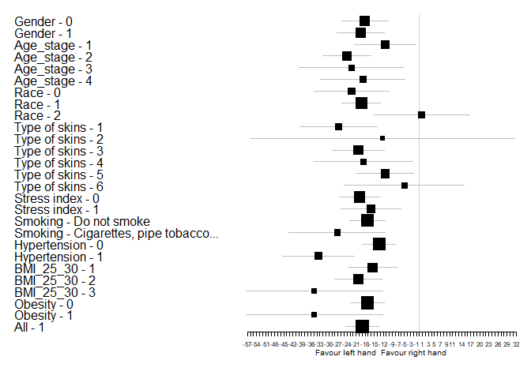<!-- -->


Bảng Anadn theo các subgroup:


|Characteristic |Subgroup                    | N Anadn_right| N Anadn_left| Mean Anadn_right|CI_95% Anadn_right | Mean Anadn_left|CI_95% Anadn_left |  Mean_Diff|Diff_CI_95%   |   P_Value|
|:--------------|:---------------------------|-------------:|------------:|----------------:|:------------------|---------------:|:-----------------|----------:|:-------------|---------:|
|Gender         |0                           |            31|           31|        0.9841398|(0.52,1.45)        |       1.2033065|(0.75,1.66)       | -0.2191667|(-0.45,0.01)  | 0.0341105|
|Gender         |1                           |            44|           44|        0.7017500|(0.6,0.8)          |       1.2424242|(0.73,1.75)       | -0.5406742|(-1.01,-0.07) | 0.0001152|
|Age_stage      |1                           |            26|           26|        0.8906410|(0.53,1.25)        |       1.2288462|(0.63,1.83)       | -0.3382051|(-0.78,0.1)   | 0.0358315|
|Age_stage      |2                           |            30|           30|        0.6636667|(0.56,0.77)        |       0.9568056|(0.68,1.24)       | -0.2931389|(-0.56,-0.02) | 0.0081430|
|Age_stage      |3                           |            13|           13|        1.1620769|(0.22,2.1)         |       1.9470513|(0.32,3.57)       | -0.7849744|(-2.23,0.66)  | 0.0214844|
|Age_stage      |4                           |             6|            6|        0.5352778|(0.34,0.73)        |       1.0005556|(0.54,1.46)       | -0.4652778|(-1.08,0.15)  | 0.0625000|
|Race           |0                           |            11|           11|        0.4646970|(0.39,0.54)        |       0.7127273|(0.56,0.87)       | -0.2480303|(-0.43,-0.07) | 0.0144328|
|Race           |1                           |            61|           61|        0.8431749|(0.63,1.06)        |       1.2680191|(0.85,1.68)       | -0.4248443|(-0.78,-0.07) | 0.0004094|
|Race           |2                           |             3|            3|        1.6133333|(-3.46,6.69)       |       2.2600000|(-1.06,5.58)      | -0.6466667|(-2.87,1.57)  | 0.5000000|
|Type of skins  |1                           |            10|           10|        0.4581667|(0.38,0.54)        |       0.7318333|(0.57,0.9)        | -0.2736667|(-0.47,-0.08) | 0.0178172|
|Type of skins  |2                           |             4|            4|        0.9475000|(0.26,1.64)        |       1.7325000|(-0.97,4.43)      | -0.7850000|(-3.54,1.97)  | 0.3750000|
|Type of skins  |3                           |            40|           40|        0.8589667|(0.54,1.18)        |       1.0428333|(0.75,1.33)       | -0.1838667|(-0.32,-0.05) | 0.0008783|
|Type of skins  |4                           |            11|           11|        0.6413636|(0.45,0.84)        |       0.6806818|(0.51,0.85)       | -0.0393182|(-0.32,0.24)  | 0.5771484|
|Type of skins  |5                           |             6|            6|        0.8266667|(0.46,1.19)        |       2.4283333|(-1.42,6.27)      | -1.6016667|(-5.25,2.04)  | 0.3125000|
|Type of skins  |6                           |             4|            4|        1.6600000|(-1,4.32)          |       3.4875000|(-0.79,7.76)      | -1.8275000|(-5.76,2.11)  | 0.2500000|
|Stress index   |0                           |            57|           57|        0.7966140|(0.57,1.02)        |       1.2238012|(0.84,1.61)       | -0.4271871|(-0.76,-0.1)  | 0.0000098|
|Stress index   |1                           |            18|           18|        0.8876852|(0.46,1.32)        |       1.2340278|(0.4,2.07)        | -0.3463426|(-1.03,0.34)  | 0.3692169|
|Smoking        |Do not smoke                |            62|           62|        0.8281989|(0.59,1.06)        |       1.0143145|(0.78,1.25)       | -0.1861156|(-0.33,-0.04) | 0.0016958|
|Smoking        |Cigarettes, pipe tobacco... |            13|           13|        0.7720769|(0.52,1.02)        |       2.2370513|(0.5,3.97)        | -1.4649744|(-3.03,0.1)   | 0.0002441|
|Hypertension   |0                           |            54|           54|        0.7549136|(0.58,0.93)        |       1.1216512|(0.73,1.52)       | -0.3667377|(-0.72,-0.02) | 0.0009009|
|Hypertension   |1                           |            21|           21|        0.9819048|(0.41,1.56)        |       1.4952381|(0.74,2.25)       | -0.5133333|(-1.08,0.05)  | 0.0057195|
|BMI_25_30      |1                           |            42|           42|        0.8071905|(0.59,1.03)        |       1.4094444|(0.83,1.99)       | -0.6022540|(-1.1,-0.11)  | 0.0002712|
|BMI_25_30      |2                           |            26|           26|        0.8897436|(0.43,1.35)        |       1.0366987|(0.64,1.43)       | -0.1469551|(-0.39,0.09)  | 0.0525191|
|BMI_25_30      |3                           |             7|            7|        0.6214286|(0.3,0.94)         |       0.8311905|(0.64,1.02)       | -0.2097619|(-0.65,0.23)  | 0.2968750|
|Obesity        |0                           |            68|           68|        0.8387549|(0.62,1.05)        |       1.2669240|(0.89,1.65)       | -0.4281691|(-0.75,-0.11) | 0.0000497|
|Obesity        |1                           |             7|            7|        0.6214286|(0.3,0.94)         |       0.8311905|(0.64,1.02)       | -0.2097619|(-0.65,0.23)  | 0.2968750|
|All            |1                           |            75|           75|        0.8184711|(0.62,1.02)        |       1.2262556|(0.88,1.57)       | -0.4077844|(-0.7,-0.12)  | 0.0000189|
Đồ thị Forest plot theo biến Anadn
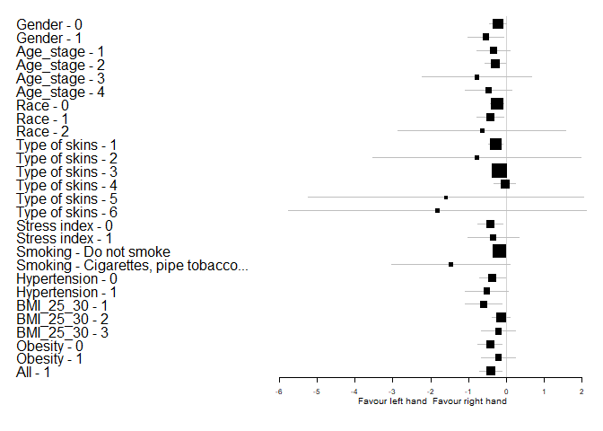<!-- -->


Bảng POM theo các subgroup:


|Characteristic |Subgroup                    | N POM_right| N POM_left| Mean POM_right|CI_95% POM_right | Mean POM_left|CI_95% POM_left |  Mean_Diff|Diff_CI_95%    |   P_Value|
|:--------------|:---------------------------|-----------:|----------:|--------------:|:----------------|-------------:|:---------------|----------:|:--------------|---------:|
|Gender         |0                           |          31|         31|       9.333307|(6.52,12.15)     |      6.987204|(4.84,9.14)     |  2.3461022|(-0.33,5.02)   | 0.0070872|
|Gender         |1                           |          44|         44|       9.375091|(7.6,11.15)      |      7.695288|(5.7,9.69)      |  1.6798030|(-0.67,4.03)   | 0.0047971|
|Age_stage      |1                           |          26|         26|       8.436731|(5.36,11.51)     |      6.778461|(4.19,9.36)     |  1.6582692|(-1.77,5.08)   | 0.0381683|
|Age_stage      |2                           |          30|         30|      10.749206|(8.73,12.77)     |      9.298922|(6.71,11.89)    |  1.4502833|(-1.29,4.19)   | 0.0220989|
|Age_stage      |3                           |          13|         13|       7.446308|(4.4,10.5)       |      5.375513|(2.89,7.86)     |  2.0707949|(0.14,4)       | 0.0573730|
|Age_stage      |4                           |           6|          6|      10.533889|(0.08,20.99)     |      5.017778|(1.19,8.85)     |  5.5161111|(-5.91,16.94)  | 0.3125000|
|Race           |0                           |          11|         11|      14.900485|(9.59,20.21)     |     10.184182|(7.76,12.61)    |  4.7163030|(-1.04,10.47)  | 0.0419922|
|Race           |1                           |          61|         61|       8.136904|(6.76,9.51)      |      7.122951|(5.43,8.81)     |  1.0139536|(-0.69,2.72)   | 0.0018250|
|Race           |2                           |           3|          3|      13.860000|(-20.97,48.69)   |      2.890000|(0.55,5.23)     | 10.9700000|(-23.3,45.24)  | 0.5000000|
|Type of skins  |1                           |          10|         10|      14.578283|(8.64,20.51)     |      8.465267|(7.37,9.56)     |  6.1130167|(0.02,12.2)    | 0.0136719|
|Type of skins  |2                           |           4|          4|      10.450000|(1.23,19.67)     |     13.200000|(-6.46,32.86)   | -2.7500000|(-23.51,18.01) | 1.0000000|
|Type of skins  |3                           |          40|         40|       7.432800|(5.97,8.9)       |      6.378125|(4.55,8.2)      |  1.0546750|(-0.65,2.76)   | 0.0009936|
|Type of skins  |4                           |          11|         11|      12.411970|(7.74,17.08)     |     12.213030|(7.69,16.73)    |  0.1989394|(-6.06,6.45)   | 0.8310547|
|Type of skins  |5                           |           6|          6|       5.973333|(0.85,11.1)      |      3.107500|(0.5,5.71)      |  2.8658333|(-1.08,6.81)   | 0.1562500|
|Type of skins  |6                           |           4|          4|      11.142500|(-9.02,31.31)    |      2.407500|(0.45,4.37)     |  8.7350000|(-10.55,28.02) | 0.2500000|
|Stress index   |0                           |          57|         57|       8.834222|(7.15,10.52)     |      6.501772|(5.08,7.92)     |  2.3324503|(0.67,3.99)    | 0.0000443|
|Stress index   |1                           |          18|         18|      11.015880|(7.39,14.64)     |     10.255278|(6.28,14.24)    |  0.7606019|(-4.55,6.07)   | 0.4682922|
|Smoking        |Do not smoke                |          62|         62|       9.604105|(8,11.21)        |      8.076038|(6.44,9.71)     |  1.5280672|(-0.39,3.44)   | 0.0018524|
|Smoking        |Cigarettes, pipe tobacco... |          13|         13|       8.183231|(3.3,13.07)      |      4.190897|(1.65,6.73)     |  3.9923333|(-0.39,8.37)   | 0.0104980|
|Hypertension   |0                           |          54|         54|      10.389019|(8.47,12.31)     |      8.524167|(6.68,10.37)    |  1.8648519|(-0.47,4.2)    | 0.0025096|
|Hypertension   |1                           |          21|         21|       6.706167|(4.65,8.76)      |      4.518619|(2.97,6.07)     |  2.1875476|(0.51,3.87)    | 0.0113468|
|BMI_25_30      |1                           |          42|         42|       7.952032|(6.01,9.89)      |      6.835476|(4.7,8.97)      |  1.1165556|(-1.14,3.37)   | 0.0093559|
|BMI_25_30      |2                           |          26|         26|      11.148333|(8.15,14.15)     |      8.227820|(5.79,10.66)    |  2.9205128|(-0.52,6.36)   | 0.0140065|
|BMI_25_30      |3                           |           7|          7|      11.142071|(7.91,14.38)     |      7.740381|(5.94,9.54)     |  3.4016905|(-0.85,7.65)   | 0.1093750|
|Obesity        |0                           |          68|         68|       9.174147|(7.52,10.83)     |      7.367843|(5.78,8.95)     |  1.8063039|(-0.07,3.68)   | 0.0004176|
|Obesity        |1                           |           7|          7|      11.142071|(7.91,14.38)     |      7.740381|(5.94,9.54)     |  3.4016905|(-0.85,7.65)   | 0.1093750|
|All            |1                           |          75|         75|       9.357820|(7.84,10.88)     |      7.402613|(5.96,8.84)     |  1.9552067|(0.23,3.68)    | 0.0001249|
Đồ thị Forest plot theo biến POM
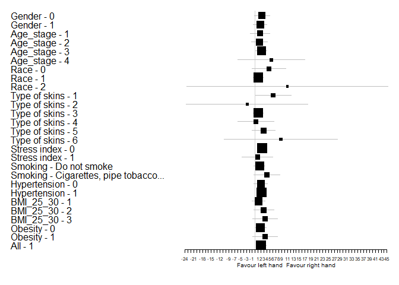<!-- -->


Bảng Ae theo các subgroup:


|Characteristic |Subgroup                    | N Ae_right| N Ae_left| Mean Ae_right|CI_95% Ae_right | Mean Ae_left|CI_95% Ae_left |  Mean_Diff|Diff_CI_95%   |   P_Value|
|:--------------|:---------------------------|----------:|---------:|-------------:|:---------------|------------:|:--------------|----------:|:-------------|---------:|
|Gender         |0                           |         31|        31|     1.2738172|(1.02,1.53)     |    1.6583333|(1.43,1.89)    | -0.3845161|(-0.66,-0.11) | 0.0080606|
|Gender         |1                           |         44|        44|     1.4415606|(1.16,1.72)     |    1.5162652|(1.14,1.89)    | -0.0747045|(-0.41,0.26)  | 0.5994543|
|Age_stage      |1                           |         26|        26|     1.2639744|(0.93,1.6)      |    1.5325000|(1.23,1.84)    | -0.2685256|(-0.6,0.06)   | 0.0890290|
|Age_stage      |2                           |         30|        30|     1.5125222|(1.21,1.81)     |    1.7597444|(1.39,2.12)    | -0.2472222|(-0.61,0.12)  | 0.2941338|
|Age_stage      |3                           |         13|        13|     1.2010000|(0.67,1.73)     |    0.9714103|(0.54,1.41)    |  0.2295897|(-0.24,0.7)   | 0.2734375|
|Age_stage      |4                           |          6|         6|     1.5108333|(0.57,2.45)     |    2.1430556|(-0.09,4.38)   | -0.6322222|(-2.35,1.08)  | 0.6875000|
|Race           |0                           |         11|        11|     1.5626364|(1.01,2.11)     |    2.4702121|(1.56,3.38)    | -0.9075758|(-1.78,-0.04) | 0.0419922|
|Race           |1                           |         61|        61|     1.3286557|(1.11,1.55)     |    1.4242896|(1.2,1.65)     | -0.0956339|(-0.31,0.12)  | 0.5582661|
|Race           |2                           |          3|         3|     1.5600000|(0.33,2.79)     |    1.3566667|(-1.35,4.06)   |  0.2033333|(-2.41,2.81)  | 1.0000000|
|Type of skins  |1                           |         10|        10|     1.7754000|(1.21,2.34)     |    2.4479833|(1.51,3.38)    | -0.6725833|(-1.59,0.25)  | 0.1601562|
|Type of skins  |2                           |          4|         4|     1.1825000|(-0.02,2.38)    |    2.0050000|(-0.1,4.11)    | -0.8225000|(-3.21,1.56)  | 0.3750000|
|Type of skins  |3                           |         40|        40|     1.1565333|(0.93,1.39)     |    1.2607083|(1,1.52)       | -0.1041750|(-0.36,0.15)  | 0.7368407|
|Type of skins  |4                           |         11|        11|     1.7024242|(1.15,2.26)     |    2.0141667|(1.52,2.51)    | -0.3117424|(-0.97,0.35)  | 0.2402344|
|Type of skins  |5                           |          6|         6|     1.6708333|(0.18,3.16)     |    1.4283333|(0.09,2.77)    |  0.2425000|(-0.77,1.26)  | 0.6875000|
|Type of skins  |6                           |          4|         4|     1.3550000|(0.44,2.27)     |    1.1175000|(-0.49,2.72)   |  0.2375000|(-1.13,1.61)  | 0.8750000|
|Stress index   |0                           |         57|        57|     1.3136316|(1.08,1.54)     |    1.5716491|(1.28,1.86)    | -0.2580175|(-0.53,0.01)  | 0.1481662|
|Stress index   |1                           |         18|        18|     1.5577778|(1.22,1.9)      |    1.5855556|(1.19,1.98)    | -0.0277778|(-0.41,0.35)  | 0.9305833|
|Smoking        |Do not smoke                |         62|        62|     1.4347419|(1.23,1.64)     |    1.7613817|(1.5,2.02)     | -0.3266398|(-0.58,-0.07) | 0.0212703|
|Smoking        |Cigarettes, pipe tobacco... |         13|        13|     1.0740769|(0.56,1.58)     |    0.6860256|(0.38,1)       |  0.3880513|(0.05,0.72)   | 0.0545501|
|Hypertension   |0                           |         54|        54|     1.5272778|(1.29,1.76)     |    1.7141204|(1.44,1.99)    | -0.1868426|(-0.46,0.09)  | 0.3137403|
|Hypertension   |1                           |         21|        21|     0.9735238|(0.69,1.25)     |    1.2172143|(0.76,1.67)    | -0.2436905|(-0.64,0.16)  | 0.3944213|
|BMI_25_30      |1                           |         42|        42|     1.4222937|(1.13,1.71)     |    1.4693254|(1.16,1.78)    | -0.0470317|(-0.35,0.26)  | 0.8807253|
|BMI_25_30      |2                           |         26|        26|     1.1963462|(0.93,1.46)     |    1.6093269|(1.18,2.04)    | -0.4129808|(-0.82,0)     | 0.0940730|
|BMI_25_30      |3                           |          7|         7|     1.7250952|(1.06,2.39)     |    2.0814048|(1.07,3.1)     | -0.3563095|(-0.95,0.24)  | 0.2187500|
|Obesity        |0                           |         68|        68|     1.3359020|(1.13,1.54)     |    1.5228554|(1.28,1.77)    | -0.1869534|(-0.43,0.05)  | 0.3222206|
|Obesity        |1                           |          7|         7|     1.7250952|(1.06,2.39)     |    2.0814048|(1.07,3.1)     | -0.3563095|(-0.95,0.24)  | 0.2187500|
|All            |1                           |         75|        75|     1.3722267|(1.18,1.56)     |    1.5749867|(1.34,1.81)    | -0.2027600|(-0.43,0.02)  | 0.1867793|
Đồ thị Forest plot theo biến Ae
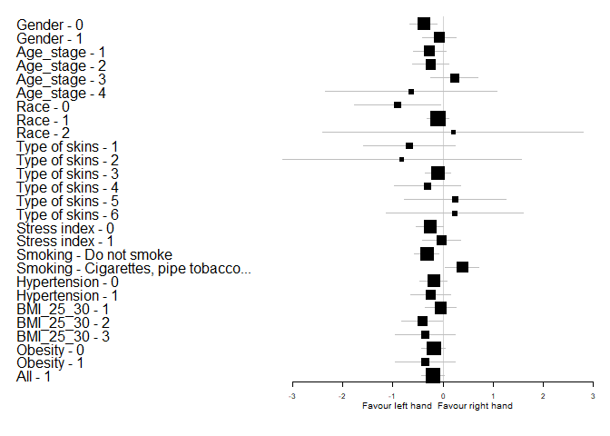<!-- -->


Bảng An theo các subgroup:


|Characteristic |Subgroup                    | N An_right| N An_left| Mean An_right|CI_95% An_right | Mean An_left|CI_95% An_left |  Mean_Diff|Diff_CI_95%   |   P_Value|
|:--------------|:---------------------------|----------:|---------:|-------------:|:---------------|------------:|:--------------|----------:|:-------------|---------:|
|Gender         |0                           |         31|        31|     1.2481183|(1,1.49)        |    1.5940323|(1.33,1.85)    | -0.3459140|(-0.59,-0.1)  | 0.0135384|
|Gender         |1                           |         44|        44|     1.4019318|(1.15,1.65)     |    1.4827955|(1.14,1.83)    | -0.0808636|(-0.38,0.21)  | 0.5439436|
|Age_stage      |1                           |         26|        26|     1.2549359|(0.98,1.53)     |    1.5180769|(1.18,1.86)    | -0.2631410|(-0.54,0.01)  | 0.1048203|
|Age_stage      |2                           |         30|        30|     1.3908444|(1.11,1.67)     |    1.6481556|(1.29,2.01)    | -0.2573111|(-0.61,0.1)   | 0.3284699|
|Age_stage      |3                           |         13|        13|     1.3010000|(0.71,1.89)     |    1.1316667|(0.56,1.71)    |  0.1693333|(-0.4,0.74)   | 0.4973145|
|Age_stage      |4                           |          6|         6|     1.5183333|(0.69,2.35)     |    1.8386111|(0.15,3.53)    | -0.3202778|(-1.32,0.68)  | 0.6875000|
|Race           |0                           |         11|        11|     1.6138182|(1.15,2.07)     |    2.3337576|(1.62,3.05)    | -0.7199394|(-1.39,-0.05) | 0.0419922|
|Race           |1                           |         61|        61|     1.2528634|(1.06,1.45)     |    1.3666667|(1.15,1.58)    | -0.1138033|(-0.31,0.08)  | 0.6328917|
|Race           |2                           |          3|         3|     2.0666667|(-0.32,4.45)    |    1.8733333|(-2.77,6.52)   |  0.1933333|(-4.7,5.08)   | 1.0000000|
|Type of skins  |1                           |         10|        10|     1.8177000|(1.36,2.27)     |    2.2774667|(1.62,2.93)    | -0.4597667|(-1.05,0.13)  | 0.1308594|
|Type of skins  |2                           |          4|         4|     1.2650000|(0.13,2.4)      |    2.1725000|(-0.13,4.48)   | -0.9075000|(-3.54,1.72)  | 0.3750000|
|Type of skins  |3                           |         40|        40|     1.0847833|(0.89,1.28)     |    1.2505833|(1,1.5)        | -0.1658000|(-0.38,0.04)  | 0.1969039|
|Type of skins  |4                           |         11|        11|     1.6439394|(1.09,2.2)      |    1.7468182|(1.16,2.33)    | -0.1028788|(-0.76,0.56)  | 0.8310547|
|Type of skins  |5                           |          6|         6|     1.4775000|(0.31,2.65)     |    1.3291667|(0.22,2.44)    |  0.1483333|(-0.6,0.89)   | 0.6875000|
|Type of skins  |6                           |          4|         4|     1.7000000|(-0.01,3.41)    |    1.4950000|(-1.22,4.21)   |  0.2050000|(-2.35,2.76)  | 0.8750000|
|Stress index   |0                           |         57|        57|     1.2948830|(1.09,1.5)      |    1.5111930|(1.25,1.78)    | -0.2163099|(-0.45,0.02)  | 0.1448508|
|Stress index   |1                           |         18|        18|     1.4760185|(1.11,1.84)     |    1.5844444|(1.12,2.05)    | -0.1084259|(-0.5,0.28)   | 0.8317261|
|Smoking        |Do not smoke                |         62|        62|     1.3915108|(1.2,1.58)      |    1.6667151|(1.42,1.91)    | -0.2752043|(-0.51,-0.04) | 0.0476309|
|Smoking        |Cigarettes, pipe tobacco... |         13|        13|     1.0848462|(0.57,1.6)      |    0.8708974|(0.42,1.32)    |  0.2139487|(-0.04,0.47)  | 0.1156290|
|Hypertension   |0                           |         54|        54|     1.4712901|(1.26,1.68)     |    1.6598148|(1.41,1.91)    | -0.1885247|(-0.42,0.04)  | 0.1696459|
|Hypertension   |1                           |         21|        21|     0.9965238|(0.71,1.29)     |    1.1918095|(0.7,1.68)     | -0.1952857|(-0.63,0.24)  | 0.8212467|
|BMI_25_30      |1                           |         42|        42|     1.3422540|(1.09,1.6)      |    1.4198016|(1.14,1.7)     | -0.0775476|(-0.32,0.16)  | 0.5864929|
|BMI_25_30      |2                           |         26|        26|     1.2500000|(0.97,1.53)     |    1.6146795|(1.17,2.06)    | -0.3646795|(-0.79,0.06)  | 0.2578226|
|BMI_25_30      |3                           |          7|         7|     1.6431429|(1.01,2.28)     |    1.8635238|(0.96,2.77)    | -0.2203810|(-0.73,0.29)  | 0.4687500|
|Obesity        |0                           |         68|        68|     1.3069804|(1.12,1.49)     |    1.4943137|(1.26,1.73)    | -0.1873333|(-0.4,0.03)   | 0.2647851|
|Obesity        |1                           |          7|         7|     1.6431429|(1.01,2.28)     |    1.8635238|(0.96,2.77)    | -0.2203810|(-0.73,0.29)  | 0.4687500|
|All            |1                           |         75|        75|     1.3383556|(1.16,1.51)     |    1.5287733|(1.3,1.75)     | -0.1904178|(-0.39,0.01)  | 0.1824162|
Đồ thị Forest plot theo biến An
<!-- -->


Bảng Am theo các subgroup:


|Characteristic |Subgroup                    | N Am_right| N Am_left| Mean Am_right|CI_95% Am_right | Mean Am_left|CI_95% Am_left |  Mean_Diff|Diff_CI_95%   |   P_Value|
|:--------------|:---------------------------|----------:|---------:|-------------:|:---------------|------------:|:--------------|----------:|:-------------|---------:|
|Gender         |0                           |         31|        31|     1.0274462|(0.8,1.25)      |    1.2763441|(1.07,1.49)    | -0.2488978|(-0.44,-0.06) | 0.0267897|
|Gender         |1                           |         44|        44|     1.1082197|(0.92,1.29)     |    1.1787500|(0.92,1.44)    | -0.0705303|(-0.29,0.15)  | 0.6532108|
|Age_stage      |1                           |         26|        26|     1.0476923|(0.81,1.29)     |    1.2450000|(0.98,1.51)    | -0.1973077|(-0.42,0.03)  | 0.1243664|
|Age_stage      |2                           |         30|        30|     1.0886944|(0.86,1.31)     |    1.3386667|(1.05,1.63)    | -0.2499722|(-0.51,0.01)  | 0.1746077|
|Age_stage      |3                           |         13|        13|     1.0203846|(0.56,1.48)     |    0.8626923|(0.47,1.26)    |  0.1576923|(-0.23,0.55)  | 0.4548340|
|Age_stage      |4                           |          6|         6|     1.2411111|(0.68,1.8)      |    1.2811111|(0.19,2.37)    | -0.0400000|(-0.74,0.66)  | 0.5625000|
|Race           |0                           |         11|        11|     1.2556061|(0.93,1.58)     |    1.6918182|(1.2,2.18)     | -0.4362121|(-0.96,0.08)  | 0.1015625|
|Race           |1                           |         61|        61|     1.0159153|(0.86,1.17)     |    1.1311749|(0.95,1.31)    | -0.1152596|(-0.26,0.03)  | 0.4770212|
|Race           |2                           |          3|         3|     1.6100000|(-0.49,3.71)    |    1.2733333|(-1.44,3.99)   |  0.3366667|(-3.19,3.87)  | 0.7500000|
|Type of skins  |1                           |         10|        10|     1.3569167|(1.05,1.66)     |    1.5849167|(1.1,2.07)     | -0.2280000|(-0.67,0.22)  | 0.3750000|
|Type of skins  |2                           |          4|         4|     1.1625000|(0.24,2.08)     |    1.6800000|(0.18,3.18)    | -0.5175000|(-2.39,1.35)  | 0.6250000|
|Type of skins  |3                           |         40|        40|     0.8827500|(0.71,1.06)     |    1.0115833|(0.79,1.23)    | -0.1288333|(-0.31,0.05)  | 0.3006674|
|Type of skins  |4                           |         11|        11|     1.3680303|(0.88,1.85)     |    1.5476515|(1.16,1.94)    | -0.1796212|(-0.59,0.23)  | 0.7001953|
|Type of skins  |5                           |          6|         6|     1.1158333|(0.35,1.88)     |    1.1908333|(0.14,2.24)    | -0.0750000|(-0.78,0.63)  | 1.0000000|
|Type of skins  |6                           |          4|         4|     1.3350000|(-0.07,2.74)    |    1.0575000|(-0.52,2.63)   |  0.2775000|(-1.58,2.13)  | 0.6250000|
|Stress index   |0                           |         57|        57|     1.0297661|(0.87,1.19)     |    1.1838889|(0.98,1.39)    | -0.1541228|(-0.33,0.03)  | 0.2711473|
|Stress index   |1                           |         18|        18|     1.2175463|(0.88,1.55)     |    1.3305556|(1.01,1.65)    | -0.1130093|(-0.4,0.17)   | 0.6094589|
|Smoking        |Do not smoke                |         62|        62|     1.1246371|(0.97,1.28)     |    1.3223656|(1.13,1.51)    | -0.1977285|(-0.37,-0.02) | 0.0760915|
|Smoking        |Cigarettes, pipe tobacco... |         13|        13|     0.8373077|(0.46,1.22)     |    0.7265385|(0.37,1.09)    |  0.1107692|(-0.04,0.26)  | 0.3054199|
|Hypertension   |0                           |         54|        54|     1.1895370|(1.01,1.36)     |    1.3532253|(1.16,1.55)    | -0.1636883|(-0.34,0.02)  | 0.1468220|
|Hypertension   |1                           |         21|        21|     0.7798810|(0.59,0.97)     |    0.8741667|(0.54,1.2)     | -0.0942857|(-0.38,0.19)  | 0.8381939|
|BMI_25_30      |1                           |         42|        42|     1.0641667|(0.86,1.26)     |    1.1743254|(0.95,1.4)     | -0.1101587|(-0.3,0.08)   | 0.2711870|
|BMI_25_30      |2                           |         26|        26|     1.0910897|(0.84,1.35)     |    1.2771474|(0.93,1.62)    | -0.1860577|(-0.5,0.13)   | 0.6348496|
|BMI_25_30      |3                           |          7|         7|     1.0784524|(0.71,1.45)     |    1.2720238|(0.78,1.77)    | -0.1935714|(-0.57,0.18)  | 0.4687500|
|Obesity        |0                           |         68|        68|     1.0744608|(0.92,1.23)     |    1.2136397|(1.03,1.4)     | -0.1391789|(-0.3,0.02)   | 0.3177683|
|Obesity        |1                           |          7|         7|     1.0784524|(0.71,1.45)     |    1.2720238|(0.78,1.77)    | -0.1935714|(-0.57,0.18)  | 0.4687500|
|All            |1                           |         75|        75|     1.0748333|(0.93,1.22)     |    1.2190889|(1.05,1.39)    | -0.1442556|(-0.29,0)     | 0.2136535|
Đồ thị Forest plot theo biến Am
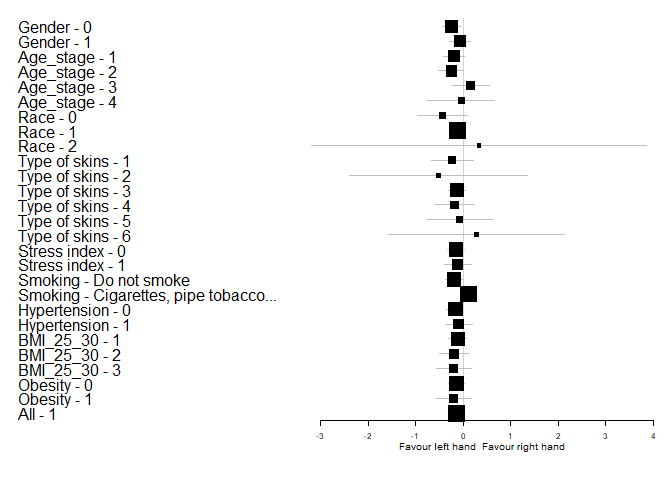<!-- -->


Bảng Ar theo các subgroup:


|Characteristic |Subgroup                    | N Ar_right| N Ar_left| Mean Ar_right|CI_95% Ar_right | Mean Ar_left|CI_95% Ar_left |  Mean_Diff|Diff_CI_95%  |   P_Value|
|:--------------|:---------------------------|----------:|---------:|-------------:|:---------------|------------:|:--------------|----------:|:------------|---------:|
|Gender         |0                           |         31|        31|     0.6700000|(0.55,0.79)     |    0.7418011|(0.62,0.86)    | -0.0718011|(-0.23,0.09) | 0.3369043|
|Gender         |1                           |         44|        44|     0.6885758|(0.6,0.77)      |    0.6502045|(0.54,0.76)    |  0.0383712|(-0.06,0.14) | 0.0571290|
|Age_stage      |1                           |         26|        26|     0.6694231|(0.53,0.81)     |    0.6946154|(0.58,0.81)    | -0.0251923|(-0.18,0.13) | 0.5590854|
|Age_stage      |2                           |         30|        30|     0.6721333|(0.58,0.77)     |    0.7083833|(0.57,0.84)    | -0.0362500|(-0.17,0.1)  | 0.6070872|
|Age_stage      |3                           |         13|        13|     0.6776923|(0.45,0.9)      |    0.5543590|(0.37,0.74)    |  0.1233333|(0.01,0.23)  | 0.0327148|
|Age_stage      |4                           |          6|         6|     0.7813889|(0.57,1)        |    0.8477778|(0.21,1.49)    | -0.0663889|(-0.68,0.54) | 0.8437500|
|Race           |0                           |         11|        11|     0.7183939|(0.63,0.81)     |    0.8856667|(0.62,1.15)    | -0.1672727|(-0.43,0.09) | 0.1748047|
|Race           |1                           |         61|        61|     0.6666393|(0.58,0.75)     |    0.6497131|(0.56,0.74)    |  0.0169262|(-0.08,0.11) | 0.2087382|
|Race           |2                           |          3|         3|     0.8333333|(0.11,1.56)     |    0.7433333|(0.08,1.4)     |  0.0900000|(-1.16,1.34) | 0.7500000|
|Type of skins  |1                           |         10|        10|     0.7297333|(0.64,0.82)     |    0.8713167|(0.56,1.18)    | -0.1415833|(-0.44,0.16) | 0.4316406|
|Type of skins  |2                           |          4|         4|     0.7125000|(0.28,1.14)     |    0.9050000|(0.18,1.63)    | -0.1925000|(-1.04,0.66) | 1.0000000|
|Type of skins  |3                           |         40|        40|     0.5547500|(0.48,0.63)     |    0.5815833|(0.48,0.68)    | -0.0268333|(-0.13,0.08) | 0.9303724|
|Type of skins  |4                           |         11|        11|     0.9190909|(0.73,1.11)     |    0.8739394|(0.68,1.07)    |  0.0451515|(-0.16,0.25) | 0.8310547|
|Type of skins  |5                           |          6|         6|     0.9283333|(0.39,1.47)     |    0.6108333|(0.28,0.94)    |  0.3175000|(-0.11,0.75) | 0.1562500|
|Type of skins  |6                           |          4|         4|     0.7625000|(0.32,1.2)      |    0.6825000|(0.29,1.08)    |  0.0800000|(-0.58,0.74) | 0.6250000|
|Stress index   |0                           |         57|        57|     0.6569708|(0.57,0.74)     |    0.6624971|(0.56,0.76)    | -0.0055263|(-0.11,0.1)  | 0.3864562|
|Stress index   |1                           |         18|        18|     0.7566667|(0.64,0.87)     |    0.7690278|(0.64,0.9)     | -0.0123611|(-0.15,0.13) | 0.9322815|
|Smoking        |Do not smoke                |         62|        62|     0.7030215|(0.63,0.78)     |    0.7344866|(0.64,0.82)    | -0.0314651|(-0.13,0.07) | 0.9608566|
|Smoking        |Cigarettes, pipe tobacco... |         13|        13|     0.5753846|(0.38,0.77)     |    0.4666667|(0.31,0.63)    |  0.1087179|(0.01,0.2)   | 0.0327148|
|Hypertension   |0                           |         54|        54|     0.7165432|(0.63,0.8)      |    0.7584877|(0.67,0.85)    | -0.0419444|(-0.15,0.06) | 0.6235675|
|Hypertension   |1                           |         21|        21|     0.5892381|(0.47,0.71)     |    0.5069762|(0.35,0.66)    |  0.0822619|(-0.06,0.22) | 0.0325234|
|BMI_25_30      |1                           |         42|        42|     0.6288095|(0.54,0.72)     |    0.6694048|(0.55,0.79)    | -0.0405952|(-0.17,0.09) | 0.8905963|
|BMI_25_30      |2                           |         26|        26|     0.7613462|(0.63,0.9)      |    0.7308333|(0.6,0.86)     |  0.0305128|(-0.11,0.17) | 0.5089967|
|BMI_25_30      |3                           |          7|         7|     0.6946190|(0.55,0.84)     |    0.6411667|(0.46,0.82)    |  0.0534524|(-0.11,0.22) | 0.5781250|
|Obesity        |0                           |         68|        68|     0.6794853|(0.6,0.76)      |    0.6928922|(0.6,0.78)     | -0.0134069|(-0.11,0.08) | 0.6163202|
|Obesity        |1                           |          7|         7|     0.6946190|(0.55,0.84)     |    0.6411667|(0.46,0.82)    |  0.0534524|(-0.11,0.22) | 0.5781250|
|All            |1                           |         75|        75|     0.6808978|(0.61,0.75)     |    0.6880644|(0.61,0.77)    | -0.0071667|(-0.09,0.08) | 0.4974063|
Đồ thị Forest plot theo biến Ar
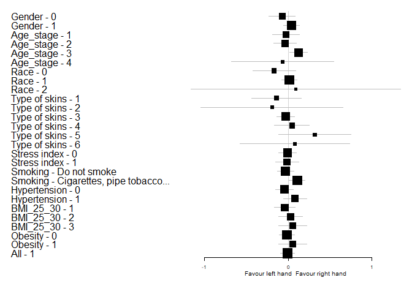<!-- -->


Bảng Ac theo các subgroup:


|Characteristic |Subgroup                    | N Ac_right| N Ac_left| Mean Ac_right|CI_95% Ac_right | Mean Ac_left|CI_95% Ac_left |  Mean_Diff|Diff_CI_95%  |   P_Value|
|:--------------|:---------------------------|----------:|---------:|-------------:|:---------------|------------:|:--------------|----------:|:------------|---------:|
|Gender         |0                           |         31|        31|     0.8793548|(0.74,1.02)     |    0.9726344|(0.81,1.14)    | -0.0932796|(-0.24,0.05) | 0.2319238|
|Gender         |1                           |         44|        44|     0.9059697|(0.77,1.04)     |    0.9135909|(0.79,1.04)    | -0.0076212|(-0.12,0.11) | 0.8610102|
|Age_stage      |1                           |         26|        26|     0.8508333|(0.68,1.02)     |    0.9665385|(0.77,1.17)    | -0.1157051|(-0.24,0.01) | 0.0841973|
|Age_stage      |2                           |         30|        30|     0.9003333|(0.79,1.01)     |    0.9538778|(0.82,1.09)    | -0.0535444|(-0.2,0.1)   | 0.6970815|
|Age_stage      |3                           |         13|        13|     0.8823846|(0.52,1.24)     |    0.7846154|(0.54,1.03)    |  0.0977692|(-0.16,0.36) | 0.8393555|
|Age_stage      |4                           |          6|         6|     1.0866667|(0.48,1.69)     |    1.0672222|(0.71,1.43)    |  0.0194444|(-0.54,0.58) | 1.0000000|
|Race           |0                           |         11|        11|     1.0254545|(0.72,1.33)     |    1.2507273|(0.99,1.51)    | -0.2252727|(-0.52,0.07) | 0.0665457|
|Race           |1                           |         61|        61|     0.8590601|(0.75,0.97)     |    0.8621585|(0.76,0.96)    | -0.0030984|(-0.1,0.09)  | 0.9856729|
|Race           |2                           |          3|         3|     1.1466667|(0.84,1.46)     |    1.3333333|(-0.39,3.05)   | -0.1866667|(-1.63,1.25) | 0.7500000|
|Type of skins  |1                           |         10|        10|     1.1060000|(0.75,1.46)     |    1.1916333|(1.01,1.37)    | -0.0856333|(-0.39,0.22) | 0.4069412|
|Type of skins  |2                           |          4|         4|     0.8275000|(0.48,1.17)     |    0.8525000|(0.52,1.18)    | -0.0250000|(-0.66,0.61) | 0.6250000|
|Type of skins  |3                           |         40|        40|     0.7703167|(0.64,0.9)      |    0.8237917|(0.69,0.96)    | -0.0534750|(-0.18,0.08) | 0.4720485|
|Type of skins  |4                           |         11|        11|     1.1536364|(0.9,1.4)       |    1.1083333|(0.82,1.39)    |  0.0453030|(-0.18,0.27) | 0.7001953|
|Type of skins  |5                           |          6|         6|     0.8500000|(0.43,1.27)     |    0.8816667|(0.5,1.26)     | -0.0316667|(-0.35,0.28) | 0.8437500|
|Type of skins  |6                           |          4|         4|     1.0375000|(0.65,1.42)     |    1.1475000|(0.07,2.22)    | -0.1100000|(-0.9,0.68)  | 0.8750000|
|Stress index   |0                           |         57|        57|     0.8660702|(0.75,0.99)     |    0.9168363|(0.8,1.03)     | -0.0507661|(-0.15,0.05) | 0.2945512|
|Stress index   |1                           |         18|        18|     0.9864815|(0.84,1.14)     |    1.0050000|(0.79,1.22)    | -0.0185185|(-0.21,0.17) | 0.9479025|
|Smoking        |Do not smoke                |         62|        62|     0.9203495|(0.82,1.02)     |    0.9835430|(0.87,1.09)    | -0.0631935|(-0.16,0.03) | 0.2861257|
|Smoking        |Cigarettes, pipe tobacco... |         13|        13|     0.7739231|(0.43,1.12)     |    0.7207692|(0.53,0.91)    |  0.0531538|(-0.25,0.35) | 1.0000000|
|Hypertension   |0                           |         54|        54|     0.9395864|(0.84,1.04)     |    1.0301235|(0.92,1.14)    | -0.0905370|(-0.19,0.01) | 0.0969277|
|Hypertension   |1                           |         21|        21|     0.7802381|(0.55,1.01)     |    0.7010952|(0.54,0.86)    |  0.0791429|(-0.12,0.28) | 0.2722101|
|BMI_25_30      |1                           |         42|        42|     0.8603016|(0.72,1)        |    0.8861111|(0.76,1.02)    | -0.0258095|(-0.16,0.11) | 0.7450970|
|BMI_25_30      |2                           |         26|        26|     0.9360897|(0.78,1.1)      |    1.0225641|(0.84,1.2)     | -0.0864744|(-0.22,0.05) | 0.2158207|
|BMI_25_30      |3                           |          7|         7|     0.9502381|(0.62,1.28)     |    0.9351905|(0.6,1.27)     |  0.0150476|(-0.36,0.39) | 0.9375000|
|Obesity        |0                           |         68|        68|     0.8892794|(0.78,0.99)     |    0.9382843|(0.83,1.04)    | -0.0490049|(-0.14,0.04) | 0.2997541|
|Obesity        |1                           |          7|         7|     0.9502381|(0.62,1.28)     |    0.9351905|(0.6,1.27)     |  0.0150476|(-0.36,0.39) | 0.9375000|
|All            |1                           |         75|        75|     0.8949689|(0.8,0.99)      |    0.9379956|(0.84,1.03)    | -0.0430267|(-0.13,0.05) | 0.3583386|
Đồ thị Forest plot theo biến Ac
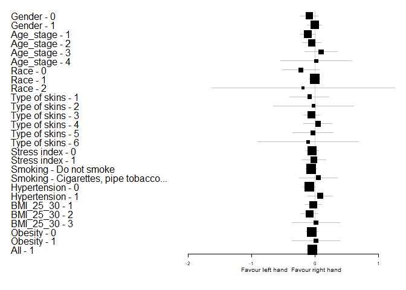<!-- -->


Bảng F_Ae theo các subgroup:


|Characteristic |Subgroup                    | N F_Ae_right| N F_Ae_left| Mean F_Ae_right|CI_95% F_Ae_right | Mean F_Ae_left|CI_95% F_Ae_left |  Mean_Diff|Diff_CI_95% |   P_Value|
|:--------------|:---------------------------|------------:|-----------:|---------------:|:-----------------|--------------:|:----------------|----------:|:-----------|---------:|
|Gender         |0                           |           31|          31|       0.0146075|(0.01,0.02)       |      0.0151586|(0.01,0.02)      | -0.0005511|(0,0)       | 0.5270144|
|Gender         |1                           |           44|          44|       0.0148311|(0.01,0.02)       |      0.0153280|(0.01,0.02)      | -0.0004970|(0,0)       | 0.5209040|
|Age_stage      |1                           |           26|          26|       0.0143013|(0.01,0.02)       |      0.0154038|(0.01,0.02)      | -0.0011026|(0,0)       | 0.2623894|
|Age_stage      |2                           |           30|          30|       0.0147044|(0.01,0.02)       |      0.0151339|(0.01,0.02)      | -0.0004294|(0,0)       | 0.6467779|
|Age_stage      |3                           |           13|          13|       0.0146231|(0.01,0.02)       |      0.0156667|(0.01,0.02)      | -0.0010436|(0,0)       | 0.1252935|
|Age_stage      |4                           |            6|           6|       0.0170556|(0.01,0.02)       |      0.0143611|(0.01,0.02)      |  0.0026944|(0,0.01)    | 0.1056454|
|Race           |0                           |           11|          11|       0.0182848|(0.02,0.02)       |      0.0145697|(0.01,0.02)      |  0.0037152|(0,0.01)    | 0.0328159|
|Race           |1                           |           61|          61|       0.0142011|(0.01,0.02)       |      0.0153784|(0.01,0.02)      | -0.0011773|(0,0)       | 0.0639557|
|Race           |2                           |            3|           3|       0.0126667|(0.01,0.02)       |      0.0153333|(0.01,0.02)      | -0.0026667|(-0.01,0)   | 0.3710934|
|Type of skins  |1                           |           10|          10|       0.0178133|(0.02,0.02)       |      0.0138017|(0.01,0.02)      |  0.0040117|(0,0.01)    | 0.0328159|
|Type of skins  |2                           |            4|           4|       0.0155000|(0.01,0.02)       |      0.0190000|(0.02,0.02)      | -0.0035000|(-0.01,0)   | 0.1735682|
|Type of skins  |3                           |           40|          40|       0.0141608|(0.01,0.02)       |      0.0153792|(0.01,0.02)      | -0.0012183|(0,0)       | 0.1465522|
|Type of skins  |4                           |           11|          11|       0.0148939|(0.01,0.02)       |      0.0142879|(0.01,0.02)      |  0.0006061|(0,0)       | 0.5286121|
|Type of skins  |5                           |            6|           6|       0.0143333|(0.01,0.02)       |      0.0156667|(0.01,0.02)      | -0.0013333|(-0.01,0)   | 0.5896386|
|Type of skins  |6                           |            4|           4|       0.0122500|(0.01,0.02)       |      0.0160000|(0.01,0.02)      | -0.0037500|(-0.01,0)   | 0.1814492|
|Stress index   |0                           |           57|          57|       0.0148433|(0.01,0.02)       |      0.0152474|(0.01,0.02)      | -0.0004041|(0,0)       | 0.4617646|
|Stress index   |1                           |           18|          18|       0.0144074|(0.01,0.02)       |      0.0152917|(0.01,0.02)      | -0.0008843|(0,0)       | 0.3074491|
|Smoking        |Do not smoke                |           62|          62|       0.0146984|(0.01,0.02)       |      0.0149949|(0.01,0.02)      | -0.0002965|(0,0)       | 0.6359656|
|Smoking        |Cigarettes, pipe tobacco... |           13|          13|       0.0149308|(0.01,0.02)       |      0.0165128|(0.01,0.02)      | -0.0015821|(0,0)       | 0.1921272|
|Hypertension   |0                           |           54|          54|       0.0147889|(0.01,0.02)       |      0.0153519|(0.01,0.02)      | -0.0005630|(0,0)       | 0.4872385|
|Hypertension   |1                           |           21|          21|       0.0146095|(0.01,0.02)       |      0.0150167|(0.01,0.02)      | -0.0004071|(0,0)       | 0.6489681|
|BMI_25_30      |1                           |           42|          42|       0.0143635|(0.01,0.02)       |      0.0154484|(0.01,0.02)      | -0.0010849|(0,0)       | 0.1720396|
|BMI_25_30      |2                           |           26|          26|       0.0149295|(0.01,0.02)       |      0.0152115|(0.01,0.02)      | -0.0002821|(0,0)       | 0.6844019|
|BMI_25_30      |3                           |            7|           7|       0.0162810|(0.01,0.02)       |      0.0142881|(0.01,0.02)      |  0.0019929|(0,0)       | 0.1775299|
|Obesity        |0                           |           68|          68|       0.0145799|(0.01,0.02)       |      0.0153578|(0.01,0.02)      | -0.0007779|(0,0)       | 0.1803704|
|Obesity        |1                           |            7|           7|       0.0162810|(0.01,0.02)       |      0.0142881|(0.01,0.02)      |  0.0019929|(0,0)       | 0.1775299|
|All            |1                           |           75|          75|       0.0147387|(0.01,0.02)       |      0.0152580|(0.01,0.02)      | -0.0005193|(0,0)       | 0.3608340|
Đồ thị Forest plot theo biến F_Ae
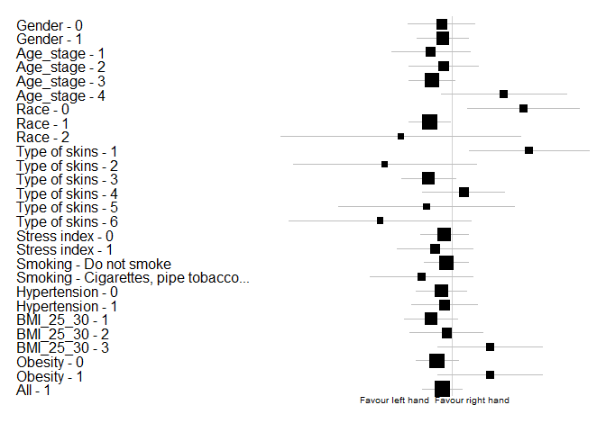<!-- -->


Bảng F_An theo các subgroup:


|Characteristic |Subgroup                    | N F_An_right| N F_An_left| Mean F_An_right|CI_95% F_An_right | Mean F_An_left|CI_95% F_An_left |  Mean_Diff|Diff_CI_95%  |   P_Value|
|:--------------|:---------------------------|------------:|-----------:|---------------:|:-----------------|--------------:|:----------------|----------:|:------------|---------:|
|Gender         |0                           |           31|          31|       0.0344140|(0.03,0.04)       |      0.0336478|(0.03,0.04)      |  0.0007661|(0,0)        | 0.2942199|
|Gender         |1                           |           44|          44|       0.0313795|(0.03,0.03)       |      0.0374083|(0.03,0.04)      | -0.0060288|(-0.01,0)    | 0.0231586|
|Age_stage      |1                           |           26|          26|       0.0371603|(0.03,0.04)       |      0.0377308|(0.03,0.04)      | -0.0005705|(-0.01,0.01) | 0.8710221|
|Age_stage      |2                           |           30|          30|       0.0307389|(0.03,0.03)       |      0.0335961|(0.03,0.04)      | -0.0028572|(-0.01,0)    | 0.2861005|
|Age_stage      |3                           |           13|          13|       0.0274385|(0.02,0.03)       |      0.0356282|(0.03,0.04)      | -0.0081897|(-0.02,0)    | 0.0261572|
|Age_stage      |4                           |            6|           6|       0.0337500|(0.02,0.05)       |      0.0395000|(0.02,0.05)      | -0.0057500|(-0.03,0.02) | 0.4618380|
|Race           |0                           |           11|          11|       0.0289545|(0.02,0.03)       |      0.0303000|(0.03,0.03)      | -0.0013455|(-0.01,0.01) | 0.5286121|
|Race           |1                           |           61|          61|       0.0333284|(0.03,0.04)       |      0.0364713|(0.03,0.04)      | -0.0031429|(-0.01,0)    | 0.2087826|
|Race           |2                           |            3|           3|       0.0320000|(0.02,0.04)       |      0.0436667|(0.01,0.08)      | -0.0116667|(-0.05,0.03) | 0.3710934|
|Type of skins  |1                           |           10|          10|       0.0304000|(0.03,0.04)       |      0.0306050|(0.03,0.03)      | -0.0002050|(-0.01,0.01) | 0.8336349|
|Type of skins  |2                           |            4|           4|       0.0385000|(0.01,0.07)       |      0.0282500|(0.01,0.05)      |  0.0102500|(-0.02,0.04) | 0.1814492|
|Type of skins  |3                           |           40|          40|       0.0321467|(0.03,0.04)       |      0.0350667|(0.03,0.04)      | -0.0029200|(-0.01,0)    | 0.3089761|
|Type of skins  |4                           |           11|          11|       0.0356970|(0.03,0.04)       |      0.0375758|(0.03,0.04)      | -0.0018788|(-0.01,0)    | 0.5334924|
|Type of skins  |5                           |            6|           6|       0.0313333|(0.02,0.04)       |      0.0441667|(0.03,0.06)      | -0.0128333|(-0.03,0.01) | 0.1562500|
|Type of skins  |6                           |            4|           4|       0.0307500|(0.02,0.04)       |      0.0472500|(0.03,0.07)      | -0.0165000|(-0.04,0.01) | 0.1735682|
|Stress index   |0                           |           57|          57|       0.0320766|(0.03,0.03)       |      0.0351193|(0.03,0.04)      | -0.0030427|(-0.01,0)    | 0.1206924|
|Stress index   |1                           |           18|          18|       0.0343981|(0.03,0.04)       |      0.0381806|(0.03,0.05)      | -0.0037824|(-0.01,0)    | 0.8159723|
|Smoking        |Do not smoke                |           62|          62|       0.0330618|(0.03,0.04)       |      0.0351110|(0.03,0.04)      | -0.0020492|(-0.01,0)    | 0.3544968|
|Smoking        |Cigarettes, pipe tobacco... |           13|          13|       0.0305923|(0.02,0.04)       |      0.0393974|(0.03,0.05)      | -0.0088051|(-0.02,0)    | 0.1222158|
|Hypertension   |0                           |           54|          54|       0.0324543|(0.03,0.04)       |      0.0364630|(0.03,0.04)      | -0.0040086|(-0.01,0)    | 0.1088763|
|Hypertension   |1                           |           21|          21|       0.0330952|(0.03,0.04)       |      0.0342881|(0.03,0.04)      | -0.0011929|(-0.01,0.01) | 0.6629720|
|BMI_25_30      |1                           |           42|          42|       0.0324294|(0.03,0.04)       |      0.0352976|(0.03,0.04)      | -0.0028683|(-0.01,0)    | 0.3176760|
|BMI_25_30      |2                           |           26|          26|       0.0333269|(0.03,0.04)       |      0.0371538|(0.03,0.04)      | -0.0038269|(-0.01,0)    | 0.2801508|
|BMI_25_30      |3                           |            7|           7|       0.0312857|(0.02,0.04)       |      0.0343643|(0.02,0.05)      | -0.0030786|(-0.01,0.01) | 0.6875000|
|Obesity        |0                           |           68|          68|       0.0327725|(0.03,0.04)       |      0.0360074|(0.03,0.04)      | -0.0032348|(-0.01,0)    | 0.1310633|
|Obesity        |1                           |            7|           7|       0.0312857|(0.02,0.04)       |      0.0343643|(0.02,0.05)      | -0.0030786|(-0.01,0.01) | 0.6875000|
|All            |1                           |           75|          75|       0.0326338|(0.03,0.04)       |      0.0358540|(0.03,0.04)      | -0.0032202|(-0.01,0)    | 0.0982323|
Đồ thị Forest plot theo biến F_An
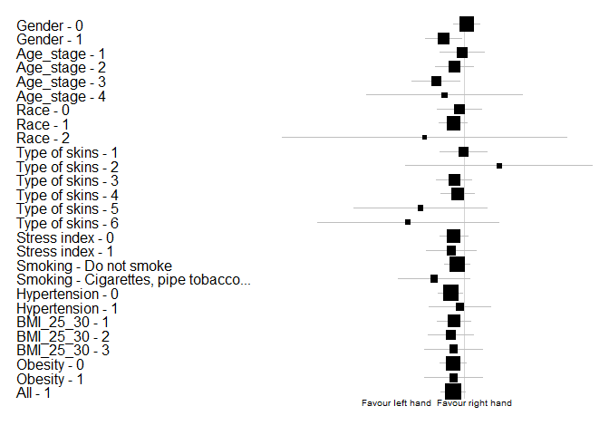<!-- -->


Bảng F_Am theo các subgroup:


|Characteristic |Subgroup                    | N F_Am_right| N F_Am_left| Mean F_Am_right|CI_95% F_Am_right | Mean F_Am_left|CI_95% F_Am_left | Mean_Diff|Diff_CI_95%  |   P_Value|
|:--------------|:---------------------------|------------:|-----------:|---------------:|:-----------------|--------------:|:----------------|---------:|:------------|---------:|
|Gender         |0                           |           31|          31|       0.0841452|(0.07,0.1)        |      0.0809919|(0.07,0.09)      | 0.0031532|(-0.01,0.02) | 0.6373347|
|Gender         |1                           |           44|          44|       0.0879409|(0.08,0.1)        |      0.0751674|(0.07,0.08)      | 0.0127735|(0,0.03)     | 0.2071704|
|Age_stage      |1                           |           26|          26|       0.0896731|(0.07,0.11)       |      0.0802308|(0.07,0.09)      | 0.0094423|(-0.01,0.03) | 0.6319003|
|Age_stage      |2                           |           30|          30|       0.0839844|(0.07,0.1)        |      0.0736983|(0.06,0.08)      | 0.0102861|(-0.01,0.03) | 0.1700888|
|Age_stage      |3                           |           13|          13|       0.0822846|(0.06,0.1)        |      0.0798590|(0.06,0.1)       | 0.0024256|(-0.03,0.03) | 0.8240126|
|Age_stage      |4                           |            6|           6|       0.0928611|(0.04,0.15)       |      0.0805000|(0.05,0.11)      | 0.0123611|(-0.05,0.08) | 0.9162824|
|Race           |0                           |           11|          11|       0.0866697|(0.06,0.11)       |      0.0691091|(0.06,0.08)      | 0.0175606|(-0.01,0.05) | 0.3589514|
|Race           |1                           |           61|          61|       0.0874186|(0.08,0.1)        |      0.0798675|(0.07,0.09)      | 0.0075511|(0,0.02)     | 0.3797405|
|Race           |2                           |            3|           3|       0.0640000|(0.05,0.08)       |      0.0620000|(0.06,0.07)      | 0.0020000|(-0.01,0.02) | 1.0000000|
|Type of skins  |1                           |           10|          10|       0.0830367|(0.05,0.11)       |      0.0695200|(0.06,0.08)      | 0.0135167|(-0.02,0.05) | 0.7695312|
|Type of skins  |2                           |            4|           4|       0.0780000|(0.03,0.13)       |      0.0632500|(0.06,0.07)      | 0.0147500|(-0.03,0.06) | 0.3710934|
|Type of skins  |3                           |           40|          40|       0.0869800|(0.08,0.1)        |      0.0820917|(0.07,0.09)      | 0.0048883|(-0.01,0.02) | 0.7389914|
|Type of skins  |4                           |           11|          11|       0.0802576|(0.06,0.1)        |      0.0737500|(0.06,0.09)      | 0.0065076|(0,0.02)     | 0.4771966|
|Type of skins  |5                           |            6|           6|       0.0975833|(0.04,0.15)       |      0.0831667|(0.06,0.11)      | 0.0144167|(-0.05,0.07) | 1.0000000|
|Type of skins  |6                           |            4|           4|       0.0970000|(-0.01,0.2)       |      0.0690000|(0.05,0.09)      | 0.0280000|(-0.06,0.11) | 0.4226781|
|Stress index   |0                           |           57|          57|       0.0867292|(0.08,0.1)        |      0.0802784|(0.07,0.09)      | 0.0064509|(-0.01,0.02) | 0.7562228|
|Stress index   |1                           |           18|          18|       0.0852407|(0.07,0.1)        |      0.0690139|(0.06,0.07)      | 0.0162269|(0,0.03)     | 0.0238241|
|Smoking        |Do not smoke                |           62|          62|       0.0822774|(0.07,0.09)       |      0.0768379|(0.07,0.08)      | 0.0054395|(0,0.02)     | 0.3639746|
|Smoking        |Cigarettes, pipe tobacco... |           13|          13|       0.1059000|(0.07,0.14)       |      0.0810897|(0.06,0.1)       | 0.0248103|(-0.02,0.07) | 0.2661661|
|Hypertension   |0                           |           54|          54|       0.0820500|(0.07,0.09)       |      0.0778781|(0.07,0.09)      | 0.0041719|(-0.01,0.02) | 0.6257792|
|Hypertension   |1                           |           21|          21|       0.0974857|(0.07,0.12)       |      0.0767952|(0.06,0.09)      | 0.0206905|(-0.01,0.05) | 0.1297106|
|BMI_25_30      |1                           |           42|          42|       0.0873738|(0.07,0.1)        |      0.0814802|(0.07,0.09)      | 0.0058937|(-0.01,0.02) | 0.7434550|
|BMI_25_30      |2                           |           26|          26|       0.0875962|(0.07,0.1)        |      0.0727019|(0.07,0.08)      | 0.0148942|(0,0.03)     | 0.1176013|
|BMI_25_30      |3                           |            7|           7|       0.0758143|(0.06,0.1)        |      0.0722429|(0.06,0.09)      | 0.0035714|(-0.02,0.03) | 1.0000000|
|Obesity        |0                           |           68|          68|       0.0874588|(0.08,0.1)        |      0.0781238|(0.07,0.09)      | 0.0093350|(0,0.02)     | 0.2389782|
|Obesity        |1                           |            7|           7|       0.0758143|(0.06,0.1)        |      0.0722429|(0.06,0.09)      | 0.0035714|(-0.02,0.03) | 1.0000000|
|All            |1                           |           75|          75|       0.0863720|(0.08,0.1)        |      0.0775749|(0.07,0.08)      | 0.0087971|(0,0.02)     | 0.2129398|
Đồ thị Forest plot theo biến F_Am
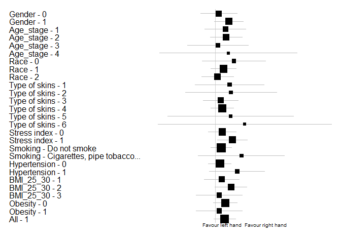<!-- -->


Bảng F_Ar theo các subgroup:


|Characteristic |Subgroup                    | N F_Ar_right| N F_Ar_left| Mean F_Ar_right|CI_95% F_Ar_right | Mean F_Ar_left|CI_95% F_Ar_left |  Mean_Diff|Diff_CI_95%   |   P_Value|
|:--------------|:---------------------------|------------:|-----------:|---------------:|:-----------------|--------------:|:----------------|----------:|:-------------|---------:|
|Gender         |0                           |           31|          31|       0.3290511|(0.28,0.38)       |      0.3135484|(0.26,0.37)      |  0.0155027|(-0.05,0.08)  | 0.6029687|
|Gender         |1                           |           44|          44|       0.3167152|(0.28,0.36)       |      0.3501644|(0.3,0.4)        | -0.0334492|(-0.1,0.03)   | 0.4064087|
|Age_stage      |1                           |           26|          26|       0.2993397|(0.24,0.36)       |      0.2706923|(0.22,0.32)      |  0.0286474|(-0.02,0.08)  | 0.4533134|
|Age_stage      |2                           |           30|          30|       0.3425494|(0.29,0.4)        |      0.3380300|(0.28,0.4)       |  0.0045194|(-0.09,0.1)   | 0.6650736|
|Age_stage      |3                           |           13|          13|       0.2911077|(0.21,0.37)       |      0.4342564|(0.35,0.52)      | -0.1431487|(-0.25,-0.04) | 0.0233764|
|Age_stage      |4                           |            6|           6|       0.3820556|(0.25,0.51)       |      0.3838333|(0.25,0.52)      | -0.0017778|(-0.23,0.23)  | 1.0000000|
|Race           |0                           |           11|          11|       0.3168394|(0.24,0.39)       |      0.3169909|(0.22,0.41)      | -0.0001515|(-0.12,0.12)  | 0.9441825|
|Race           |1                           |           61|          61|       0.3183740|(0.28,0.35)       |      0.3402678|(0.3,0.38)       | -0.0218937|(-0.07,0.03)  | 0.5239673|
|Race           |2                           |            3|           3|       0.4100000|(-0.06,0.88)      |      0.2946667|(-0.09,0.68)     |  0.1153333|(-0.43,0.66)  | 1.0000000|
|Type of skins  |1                           |           10|          10|       0.3134483|(0.23,0.4)        |      0.3029400|(0.22,0.39)      |  0.0105083|(-0.11,0.13)  | 0.7998461|
|Type of skins  |2                           |            4|           4|       0.3390000|(0.06,0.62)       |      0.3980000|(0.07,0.72)      | -0.0590000|(-0.56,0.44)  | 0.7127019|
|Type of skins  |3                           |           40|          40|       0.3168558|(0.27,0.36)       |      0.3421583|(0.29,0.39)      | -0.0253025|(-0.1,0.05)   | 0.6872507|
|Type of skins  |4                           |           11|          11|       0.3073939|(0.21,0.4)        |      0.3397273|(0.23,0.45)      | -0.0323333|(-0.12,0.05)  | 0.4468728|
|Type of skins  |5                           |            6|           6|       0.3066667|(0.16,0.45)       |      0.2707500|(0.19,0.35)      |  0.0359167|(-0.14,0.21)  | 1.0000000|
|Type of skins  |6                           |            4|           4|       0.4375000|(0.18,0.7)        |      0.3645000|(0.07,0.66)      |  0.0730000|(-0.24,0.39)  | 1.0000000|
|Stress index   |0                           |           57|          57|       0.3131749|(0.28,0.35)       |      0.3281532|(0.29,0.37)      | -0.0149784|(-0.07,0.04)  | 0.8300456|
|Stress index   |1                           |           18|          18|       0.3491713|(0.28,0.42)       |      0.3568056|(0.28,0.44)      | -0.0076343|(-0.09,0.07)  | 0.3462545|
|Smoking        |Do not smoke                |           62|          62|       0.3324137|(0.3,0.37)        |      0.3118694|(0.28,0.35)      |  0.0205444|(-0.03,0.07)  | 0.3119649|
|Smoking        |Cigarettes, pipe tobacco... |           13|          13|       0.2712615|(0.21,0.33)       |      0.4454872|(0.35,0.54)      | -0.1742256|(-0.27,-0.08) | 0.0050123|
|Hypertension   |0                           |           54|          54|       0.3127111|(0.28,0.35)       |      0.3091451|(0.27,0.35)      |  0.0035660|(-0.05,0.06)  | 0.8510471|
|Hypertension   |1                           |           21|          21|       0.3452214|(0.28,0.41)       |      0.4015905|(0.33,0.47)      | -0.0563690|(-0.15,0.04)  | 0.2556422|
|BMI_25_30      |1                           |           42|          42|       0.3054897|(0.26,0.35)       |      0.3156508|(0.27,0.36)      | -0.0101611|(-0.07,0.05)  | 0.8529041|
|BMI_25_30      |2                           |           26|          26|       0.3303718|(0.27,0.39)       |      0.3570769|(0.29,0.42)      | -0.0267051|(-0.11,0.06)  | 0.6371766|
|BMI_25_30      |3                           |            7|           7|       0.3879738|(0.29,0.48)       |      0.3694143|(0.23,0.51)      |  0.0185595|(-0.1,0.14)   | 0.6749867|
|Obesity        |0                           |           68|          68|       0.3150034|(0.28,0.35)       |      0.3314902|(0.29,0.37)      | -0.0164868|(-0.07,0.03)  | 0.6513134|
|Obesity        |1                           |            7|           7|       0.3879738|(0.29,0.48)       |      0.3694143|(0.23,0.51)      |  0.0185595|(-0.1,0.14)   | 0.6749867|
|All            |1                           |           75|          75|       0.3218140|(0.29,0.35)       |      0.3350298|(0.3,0.37)       | -0.0132158|(-0.06,0.03)  | 0.7084823|
Đồ thị Forest plot theo biến F_Ar
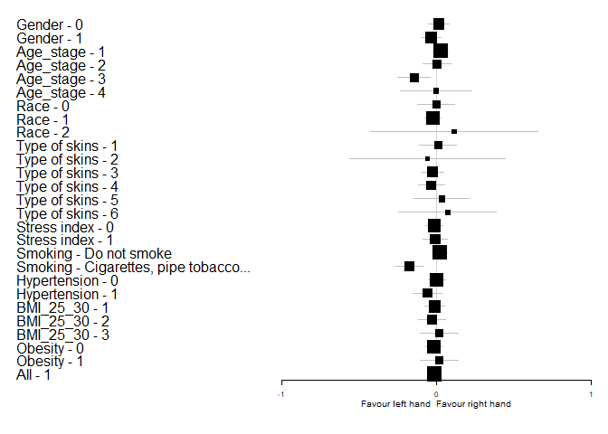<!-- -->


Bảng F_Ac theo các subgroup:


|Characteristic |Subgroup                    | N F_Ac_right| N F_Ac_left| Mean F_Ac_right|CI_95% F_Ac_right | Mean F_Ac_left|CI_95% F_Ac_left |  Mean_Diff|Diff_CI_95%  |   P_Value|
|:--------------|:---------------------------|------------:|-----------:|---------------:|:-----------------|--------------:|:----------------|----------:|:------------|---------:|
|Gender         |0                           |           31|          31|        1.135505|(1.06,1.21)       |      1.1403199|(1.07,1.21)      | -0.0048145|(-0.08,0.07) | 0.9622438|
|Gender         |1                           |           44|          44|        1.148052|(1.09,1.2)        |      1.1427364|(1.08,1.2)       |  0.0053159|(-0.04,0.05) | 0.6008342|
|Age_stage      |1                           |           26|          26|        1.112173|(1.02,1.21)       |      1.1316154|(1.05,1.22)      | -0.0194423|(-0.12,0.08) | 0.6246637|
|Age_stage      |2                           |           30|          30|        1.182847|(1.13,1.24)       |      1.1789772|(1.12,1.24)      |  0.0038694|(-0.05,0.06) | 0.4346918|
|Age_stage      |3                           |           13|          13|        1.149954|(1.04,1.26)       |      1.1445385|(1.03,1.26)      |  0.0054154|(-0.02,0.03) | 0.7874065|
|Age_stage      |4                           |            6|           6|        1.060611|(0.9,1.22)        |      0.9933333|(0.71,1.27)      |  0.0672778|(-0.07,0.21) | 0.4226781|
|Race           |0                           |           11|          11|        1.089779|(0.98,1.2)        |      1.0876273|(0.96,1.22)      |  0.0021515|(-0.08,0.09) | 0.8336349|
|Race           |1                           |           61|          61|        1.154466|(1.1,1.2)         |      1.1524986|(1.1,1.2)        |  0.0019669|(-0.05,0.05) | 0.7823043|
|Race           |2                           |            3|           3|        1.101667|(0.89,1.31)       |      1.1213333|(0.83,1.41)      | -0.0196667|(-0.1,0.06)  | 1.0000000|
|Type of skins  |1                           |           10|          10|        1.133507|(1,1.26)          |      1.1106650|(0.96,1.26)      |  0.0228417|(-0.03,0.07) | 0.5541131|
|Type of skins  |2                           |            4|           4|        1.129000|(0.91,1.35)       |      1.1940000|(1.09,1.3)       | -0.0650000|(-0.34,0.21) | 1.0000000|
|Type of skins  |3                           |           40|          40|        1.133847|(1.07,1.2)        |      1.1384750|(1.07,1.2)       | -0.0046275|(-0.07,0.06) | 0.9546984|
|Type of skins  |4                           |           11|          11|        1.124227|(1.04,1.21)       |      1.1198788|(1.01,1.23)      |  0.0043485|(-0.15,0.16) | 0.9326466|
|Type of skins  |5                           |            6|           6|        1.242917|(1,1.49)          |      1.2123333|(0.87,1.55)      |  0.0305833|(-0.09,0.15) | 1.0000000|
|Type of skins  |6                           |            4|           4|        1.171500|(0.92,1.42)       |      1.1540000|(0.97,1.34)      |  0.0175000|(-0.11,0.14) | 1.0000000|
|Stress index   |0                           |           57|          57|        1.151833|(1.1,1.2)         |      1.1385450|(1.08,1.19)      |  0.0132877|(-0.03,0.06) | 0.3129045|
|Stress index   |1                           |           18|          18|        1.114472|(1.02,1.21)       |      1.1518472|(1.08,1.23)      | -0.0373750|(-0.14,0.07) | 0.4498038|
|Smoking        |Do not smoke                |           62|          62|        1.126638|(1.08,1.17)       |      1.1273438|(1.08,1.18)      | -0.0007056|(-0.05,0.05) | 0.8908762|
|Smoking        |Cigarettes, pipe tobacco... |           13|          13|        1.220262|(1.11,1.33)       |      1.2103846|(1.1,1.32)       |  0.0098769|(-0.02,0.04) | 0.5896386|
|Hypertension   |0                           |           54|          54|        1.133547|(1.09,1.18)       |      1.1251605|(1.07,1.18)      |  0.0083870|(-0.04,0.06) | 0.7878390|
|Hypertension   |1                           |           21|          21|        1.166829|(1.07,1.27)       |      1.1843643|(1.08,1.29)      | -0.0175357|(-0.09,0.05) | 1.0000000|
|BMI_25_30      |1                           |           42|          42|        1.145271|(1.08,1.21)       |      1.1333611|(1.07,1.2)       |  0.0119103|(-0.05,0.08) | 0.5135489|
|BMI_25_30      |2                           |           26|          26|        1.126083|(1.07,1.18)       |      1.1211538|(1.05,1.19)      |  0.0049295|(-0.04,0.05) | 0.7555408|
|BMI_25_30      |3                           |            7|           7|        1.190771|(1.01,1.37)       |      1.2684500|(1.13,1.41)      | -0.0776786|(-0.24,0.08) | 0.2807127|
|Obesity        |0                           |           68|          68|        1.137935|(1.09,1.18)       |      1.1286936|(1.08,1.18)      |  0.0092412|(-0.03,0.05) | 0.4804511|
|Obesity        |1                           |            7|           7|        1.190771|(1.01,1.37)       |      1.2684500|(1.13,1.41)      | -0.0776786|(-0.24,0.08) | 0.2807127|
|All            |1                           |           75|          75|        1.142866|(1.1,1.19)        |      1.1417376|(1.1,1.19)       |  0.0011287|(-0.04,0.04) | 0.7652998|
Đồ thị Forest plot theo biến F_Ac
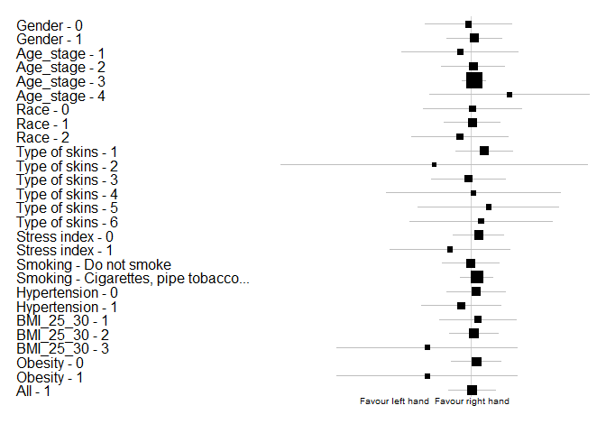<!-- -->


