## Load bộ số liệu và các packages


```
## ── Attaching core tidyverse packages ──────────────────────── tidyverse 2.0.0 ──
## ✔ dplyr     1.1.2     ✔ readr     2.1.4
## ✔ forcats   1.0.0     ✔ stringr   1.5.0
## ✔ ggplot2   3.5.0     ✔ tibble    3.2.1
## ✔ lubridate 1.9.2     ✔ tidyr     1.3.0
## ✔ purrr     1.0.2     
## ── Conflicts ────────────────────────────────────────── tidyverse_conflicts() ──
## ✖ dplyr::filter() masks stats::filter()
## ✖ dplyr::lag()    masks stats::lag()
## ℹ Use the conflicted package (<http://conflicted.r-lib.org/>) to force all conflicts to become errors
## 
## Attaching package: 'rstatix'
## 
## 
## The following object is masked from 'package:stats':
## 
##     filter
## 
## 
## Loading required package: grid
## 
## Loading required package: checkmate
## 
## Loading required package: abind
```

## So sánh khác biệt về ratio của chỉ số Right index/ Left index theo các biến


Hàm để so sánh lograrit(right/left) với 0 bằng Wilcox test 


Hàm để tạo bảng tổng hợp kết quả và p-value


Hàm sắp xếp các cột theo thứ tự


Hàm vẽ Forest plot


Bảng All


|Variable |Subgroup |Subgroup_Level | Median_Ratio|  CI_Lower|  CI_Upper|   P_Value|
|:--------|:--------|:--------------|------------:|---------:|---------:|---------:|
|M        |All      |1              |    0.9765196| 0.9471572| 1.0410736| 0.7899733|
|Kv100    |All      |1              |    0.9908616| 0.8091980| 1.1437362| 0.3777141|
|δ        |All      |1              |    0.9064935| 0.7736486| 1.0122699| 0.1231051|
|T        |All      |1              |    1.0026902| 0.9978960| 1.0051843| 0.3036074|
|A365     |All      |1              |    0.9514563| 0.9129761| 1.0000000| 0.5450711|
|A460     |All      |1              |    0.7340426| 0.6774194| 0.8461538| 0.0000002|
|Anadn    |All      |1              |    0.7294118| 0.6460177| 0.8664921| 0.0000197|
|POM      |All      |1              |    1.3286094| 1.1113300| 1.5989305| 0.0018061|
|A-E      |All      |1              |    0.9537612| 0.7122302| 1.1274298| 0.1961384|
|A-N      |All      |1              |    0.9285714| 0.7697368| 1.0868056| 0.1600116|
|A-M      |All      |1              |    0.9356984| 0.7844311| 1.1111111| 0.1207467|
|A-R      |All      |1              |    1.0638298| 0.9259259| 1.2444444| 0.5858161|
|A-C      |All      |1              |    0.9675325| 0.8897059| 1.0943396| 0.2797757|
|F-E      |All      |1              |    1.0000000| 0.9250000| 1.0000000| 0.4270740|
|F-N      |All      |1              |    1.0000000| 0.9024390| 1.0109890| 0.1445894|
|F-M      |All      |1              |    1.0000000| 1.0000000| 1.0447761| 0.2543253|
|F-R      |All      |1              |    1.0000000| 0.9533898| 1.0000000| 0.5555405|
|F-C      |All      |1              |    1.0000000| 1.0000000| 1.0000000| 0.4908955|

Các đồ thị Forest plot theo dưới nhóm All

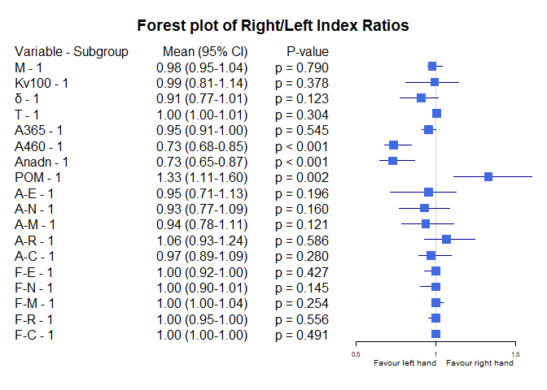<!-- -->


Bảng Gender


|Variable |Subgroup |Subgroup_Level | Median_Ratio|  CI_Lower|  CI_Upper|   P_Value|
|:--------|:--------|:--------------|------------:|---------:|---------:|---------:|
|M        |Gender   |female         |    1.0072381| 0.9639284| 1.1044558| 0.4216649|
|M        |Gender   |male           |    0.9569698| 0.9001016| 1.0157001| 0.3205616|
|Kv100    |Gender   |female         |    0.8226067| 0.6628594| 0.9908616| 0.0286438|
|Kv100    |Gender   |male           |    1.1849202| 0.9512922| 1.3021492| 0.5273196|
|δ        |Gender   |female         |    0.7649620| 0.6760736| 0.9064935| 0.0062296|
|δ        |Gender   |male           |    1.0505051| 0.9003322| 1.2656071| 0.7605460|
|T        |Gender   |female         |    1.0046228| 0.9896768| 1.0165116| 0.3926476|
|T        |Gender   |male           |    1.0015279| 0.9965577| 1.0038079| 0.5957550|
|A365     |Gender   |female         |    0.9228671| 0.8634580| 0.9950372| 0.3436414|
|A365     |Gender   |male           |    0.9924242| 0.9316239| 1.1181818| 0.9460043|
|A460     |Gender   |female         |    0.7797538| 0.6335697| 0.8978102| 0.0002020|
|A460     |Gender   |male           |    0.7304348| 0.6732026| 0.8620690| 0.0002252|
|Anadn    |Gender   |female         |    0.8185304| 0.6458333| 1.0157309| 0.0221910|
|Anadn    |Gender   |male           |    0.7053191| 0.5909091| 0.8526316| 0.0008011|
|POM      |Gender   |female         |    1.3651960| 0.9989101| 1.6218690| 0.0340088|
|POM      |Gender   |male           |    1.3286094| 1.1125849| 1.8983834| 0.0200594|
|A-E      |Gender   |female         |    0.6617844| 0.5467980| 1.1182796| 0.0012325|
|A-E      |Gender   |male           |    1.0744186| 0.8778626| 1.4964346| 0.4228908|
|A-N      |Gender   |female         |    0.7213096| 0.6508420| 0.9079638| 0.0023409|
|A-N      |Gender   |male           |    1.0868056| 0.9285714| 1.4300000| 0.5421747|
|A-M      |Gender   |female         |    0.7747157| 0.6538299| 1.0958084| 0.0023409|
|A-M      |Gender   |male           |    1.0476190| 0.9291339| 1.2439024| 0.6679764|
|A-R      |Gender   |female         |    0.9209804| 0.7500000| 1.1870918| 0.3298077|
|A-R      |Gender   |male           |    1.1400000| 0.9350000| 1.2686567| 0.0801900|
|A-C      |Gender   |female         |    0.9504329| 0.7543860| 1.1225342| 0.2970004|
|A-C      |Gender   |male           |    0.9675325| 0.9183673| 1.1192053| 0.5634839|
|F-E      |Gender   |female         |    1.0000000| 0.9128709| 1.0344828| 0.4188084|
|F-E      |Gender   |male           |    1.0000000| 0.9230769| 1.0416667| 0.7370000|
|F-N      |Gender   |female         |    1.0416667| 0.9729730| 1.1481481| 0.4601156|
|F-N      |Gender   |male           |    0.9024390| 0.6764706| 1.0000000| 0.0572904|
|F-M      |Gender   |female         |    1.0000000| 0.9481481| 1.0571429| 0.7823196|
|F-M      |Gender   |male           |    1.0000000| 1.0000000| 1.0491803| 0.1949058|
|F-R      |Gender   |female         |    1.0000000| 1.0000000| 1.0239842| 0.8668808|
|F-R      |Gender   |male           |    1.0000000| 0.7615385| 1.0000000| 0.3919448|
|F-C      |Gender   |female         |    1.0000000| 1.0000000| 1.0058218| 0.5460472|
|F-C      |Gender   |male           |    1.0000000| 1.0000000| 1.0000000| 0.7022383|

Các đồ thị Forest plot theo dưới nhóm Gender

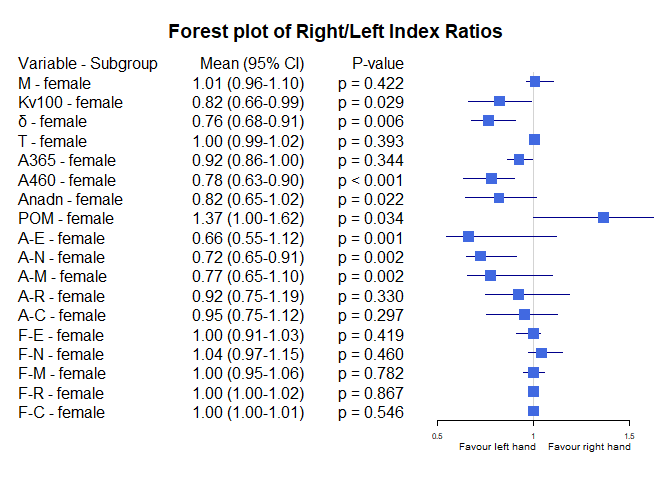<!-- -->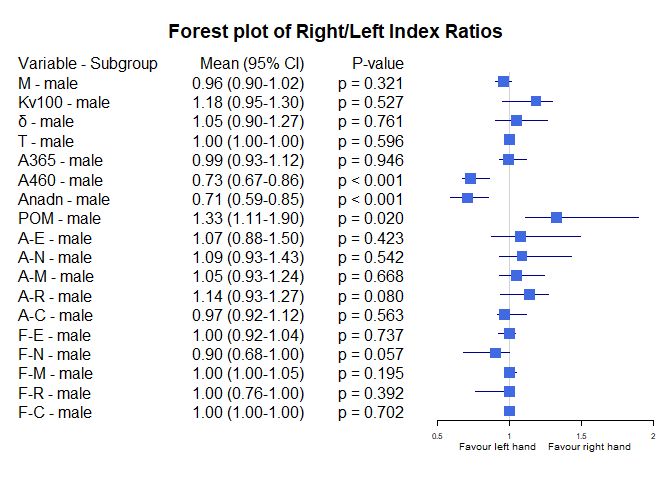<!-- -->


Bảng Age_stage

|Variable |Subgroup  |Subgroup_Level | Median_Ratio|  CI_Lower|  CI_Upper|   P_Value|
|:--------|:---------|:--------------|------------:|---------:|---------:|---------:|
|M        |Age_stage |Age [30-40)    |    1.0022222| 0.9471572| 1.0715195| 0.6043417|
|M        |Age_stage |Age <30        |    0.9511744| 0.8634924| 1.0605868| 0.6659118|
|M        |Age_stage |Age [40-50)    |    0.9649541| 0.8818049| 1.0924511| 0.3151744|
|M        |Age_stage |Age >=50       |    1.1520763| 0.7184127| 1.3837591| 0.8339354|
|Kv100    |Age_stage |Age [30-40)    |    1.0061704| 0.6881430| 1.1849202| 0.3346135|
|Kv100    |Age_stage |Age <30        |    0.9489714| 0.6690312| 1.0796074| 0.1477052|
|Kv100    |Age_stage |Age [40-50)    |    1.3653921| 0.7064922| 1.5677591| 0.6603461|
|Kv100    |Age_stage |Age >=50       |    1.2828551| 0.8038773| 1.8388742| 0.1422132|
|δ        |Age_stage |Age [30-40)    |    0.8242991| 0.6908386| 1.1004184| 0.1744780|
|δ        |Age_stage |Age <30        |    0.9399116| 0.7382664| 1.0467800| 0.1213152|
|δ        |Age_stage |Age [40-50)    |    0.9017336| 0.6735643| 1.5939529| 1.0000000|
|δ        |Age_stage |Age >=50       |    1.2664680| 0.7696569| 1.9075723| 0.2945074|
|T        |Age_stage |Age [30-40)    |    1.0042992| 0.9978960| 1.0153798| 0.2454757|
|T        |Age_stage |Age <30        |    1.0010080| 0.9894594| 1.0052547| 0.7799549|
|T        |Age_stage |Age [40-50)    |    1.0037236| 0.9930836| 1.0224584| 0.2092866|
|T        |Age_stage |Age >=50       |    0.9980195| 0.9764773| 1.0488077| 0.8339354|
|A365     |Age_stage |Age [30-40)    |    0.9473684| 0.8844622| 1.0427350| 0.4317594|
|A365     |Age_stage |Age <30        |    0.9348105| 0.8194425| 1.1181818| 0.5360093|
|A365     |Age_stage |Age [40-50)    |    0.9923563| 0.8620962| 1.1955962| 0.9000858|
|A365     |Age_stage |Age >=50       |    1.0324647| 0.7019453| 3.3143527| 0.6749867|
|A460     |Age_stage |Age [30-40)    |    0.6811594| 0.6640625| 0.8350101| 0.0000403|
|A460     |Age_stage |Age <30        |    0.7797659| 0.6474820| 0.9455343| 0.0350282|
|A460     |Age_stage |Age [40-50)    |    0.8009835| 0.5445066| 1.0000000| 0.0426947|
|A460     |Age_stage |Age >=50       |    0.7379706| 0.6210399| 0.8722784| 0.0360317|
|Anadn    |Age_stage |Age [30-40)    |    0.7244094| 0.6296296| 0.9298246| 0.0267182|
|Anadn    |Age_stage |Age <30        |    0.7056150| 0.6270945| 0.9830944| 0.0273583|
|Anadn    |Age_stage |Age [40-50)    |    0.8816299| 0.6133272| 0.9262071| 0.0120369|
|Anadn    |Age_stage |Age >=50       |    0.6195286| 0.2563658| 1.0086990| 0.0934925|
|POM      |Age_stage |Age [30-40)    |    1.3234501| 1.0731970| 1.7373806| 0.0606385|
|POM      |Age_stage |Age <30        |    1.3552902| 0.9895075| 1.8646316| 0.0796947|
|POM      |Age_stage |Age [40-50)    |    1.2402574| 0.7248614| 2.0532446| 0.3151744|
|POM      |Age_stage |Age >=50       |    2.0358275| 0.7681371| 4.9049052| 0.1422132|
|A-E      |Age_stage |Age [30-40)    |    0.9277108| 0.6096491| 1.1274298| 0.1982743|
|A-E      |Age_stage |Age <30        |    0.7728238| 0.6126236| 1.1999246| 0.1549264|
|A-E      |Age_stage |Age [40-50)    |    1.3756683| 0.5000000| 1.8434783| 0.5301580|
|A-E      |Age_stage |Age >=50       |    1.0071836| 0.4618015| 2.4840235| 0.8339354|
|A-N      |Age_stage |Age [30-40)    |    0.9285714| 0.6796875| 1.1698367| 0.1921138|
|A-N      |Age_stage |Age <30        |    0.8716770| 0.6393430| 1.0941693| 0.1477052|
|A-N      |Age_stage |Age [40-50)    |    1.1734664| 0.6793175| 1.6118977| 0.5720817|
|A-N      |Age_stage |Age >=50       |    1.0832456| 0.6167555| 2.0573182| 0.8339354|
|A-M      |Age_stage |Age [30-40)    |    0.8738739| 0.7716535| 1.1089331| 0.0896128|
|A-M      |Age_stage |Age <30        |    0.8168889| 0.6640625| 1.1882353| 0.1213152|
|A-M      |Age_stage |Age [40-50)    |    1.1255556| 0.7157198| 1.5412040| 0.7536104|
|A-M      |Age_stage |Age >=50       |    1.3052571| 0.7210087| 2.1530018| 0.2945074|
|A-R      |Age_stage |Age [30-40)    |    1.1400000| 0.9019608| 1.2500000| 0.8024717|
|A-R      |Age_stage |Age <30        |    0.9478114| 0.7592201| 1.1000000| 0.6844725|
|A-R      |Age_stage |Age [40-50)    |    1.1837971| 0.9000000| 1.3636364| 0.1486785|
|A-R      |Age_stage |Age >=50       |    1.1166228| 0.5732625| 2.7586762| 0.6749867|
|A-C      |Age_stage |Age [30-40)    |    0.9803922| 0.8897059| 1.1627907| 0.4601450|
|A-C      |Age_stage |Age <30        |    0.9382413| 0.6940789| 1.1244950| 0.2041207|
|A-C      |Age_stage |Age [40-50)    |    0.9459981| 0.8573967| 1.2321429| 1.0000000|
|A-C      |Age_stage |Age >=50       |    1.1391799| 0.5491439| 1.5135112| 0.8339354|
|F-E      |Age_stage |Age [30-40)    |    1.0000000| 0.9081633| 1.1818182| 0.9808292|
|F-E      |Age_stage |Age <30        |    1.0000000| 0.8125000| 1.0344828| 0.2393985|
|F-E      |Age_stage |Age [40-50)    |    0.9302885| 0.9087379| 1.0000000| 0.0828084|
|F-E      |Age_stage |Age >=50       |    1.1616352| 0.9660918| 1.5055453| 0.1775299|
|F-N      |Age_stage |Age [30-40)    |    1.0000000| 0.9130435| 1.0252101| 0.3524618|
|F-N      |Age_stage |Age <30        |    1.0208333| 0.8275862| 1.2025998| 1.0000000|
|F-N      |Age_stage |Age [40-50)    |    0.9377060| 0.6846532| 1.0067002| 0.0775562|
|F-N      |Age_stage |Age >=50       |    0.7887931| 0.5262153| 1.5396007| 0.5293681|
|F-M      |Age_stage |Age [30-40)    |    1.0245902| 1.0000000| 1.0491803| 0.1331822|
|F-M      |Age_stage |Age <30        |    1.0000000| 0.9638632| 1.0571429| 0.6012497|
|F-M      |Age_stage |Age [40-50)    |    0.9765625| 0.8791591| 1.1550053| 1.0000000|
|F-M      |Age_stage |Age >=50       |    0.9770476| 0.7004168| 1.9202033| 1.0000000|
|F-R      |Age_stage |Age [30-40)    |    1.0000000| 0.8655462| 1.1067961| 0.7089421|
|F-R      |Age_stage |Age <30        |    1.0000000| 1.0000000| 1.0494815| 0.3654364|
|F-R      |Age_stage |Age [40-50)    |    0.6012348| 0.4146341| 1.0000000| 0.0134354|
|F-R      |Age_stage |Age >=50       |    0.9409653| 0.5575015| 1.8646617| 0.8339354|
|F-C      |Age_stage |Age [30-40)    |    1.0000000| 1.0000000| 1.0249330| 0.4079782|
|F-C      |Age_stage |Age <30        |    1.0000000| 1.0000000| 1.0000000| 0.5046693|
|F-C      |Age_stage |Age [40-50)    |    1.0000000| 1.0000000| 1.0229344| 0.2945074|
|F-C      |Age_stage |Age >=50       |    1.0000000| 0.9758117| 1.3382722| 0.4226781|

Các đồ thị Forest plot dưới nhóm Age_stage
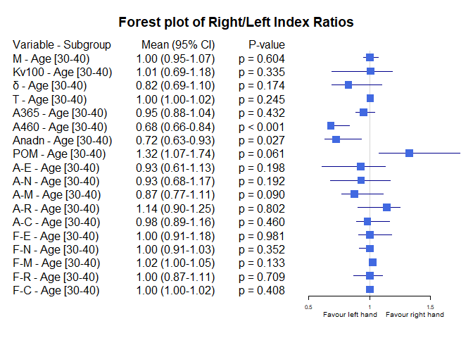<!-- -->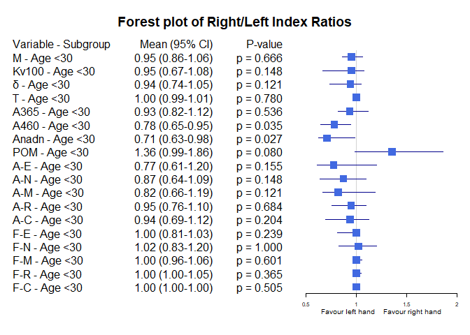<!-- -->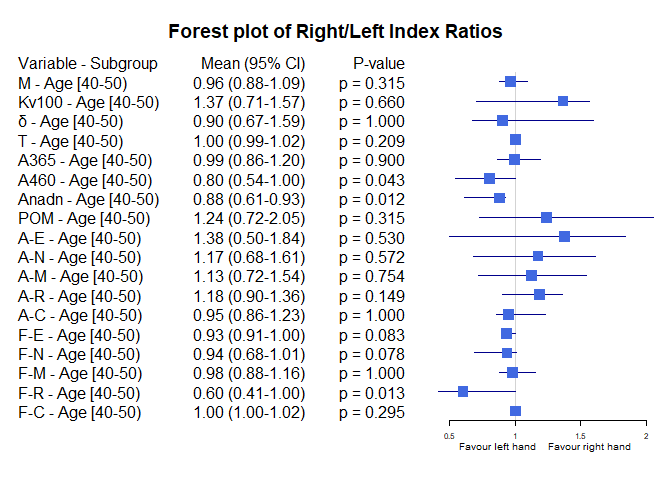<!-- -->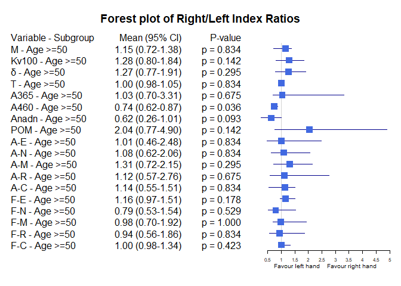<!-- -->


Bảng Race


|Variable |Subgroup |Subgroup_Level         | Median_Ratio|  CI_Lower|   CI_Upper|   P_Value|
|:--------|:--------|:----------------------|------------:|---------:|----------:|---------:|
|M        |Race     |Asian or Asian British |    0.9853694| 0.9330131|  1.0836576| 0.9713510|
|M        |Race     |White                  |    0.9569698| 0.8755584|  1.0589121| 0.4101983|
|M        |Race     |Black                  |    0.9963380| 0.8130631|  1.4052863| 1.0000000|
|Kv100    |Race     |Asian or Asian British |    1.0263425| 0.8138761|  1.1849202| 0.6928040|
|Kv100    |Race     |White                  |    0.8091980| 0.6881430|  0.9512922| 0.1322987|
|Kv100    |Race     |Black                  |    1.4130737| 0.4880314|  2.7556207| 0.7892680|
|δ        |Race     |Asian or Asian British |    0.9566929| 0.7680723|  1.0604651| 0.3077502|
|δ        |Race     |White                  |    0.8199654| 0.6908386|  0.9047994| 0.0500580|
|δ        |Race     |Black                  |    1.9944134| 0.4859155|  2.2463235| 0.7892680|
|T        |Race     |Asian or Asian British |    1.0032944| 0.9965577|  1.0053251| 0.2780992|
|T        |Race     |White                  |    1.0015279| 0.9890372|  1.0134267| 0.9773446|
|T        |Race     |Black                  |    1.0014013| 0.9876106|  1.0374283| 0.7892680|
|A365     |Race     |Asian or Asian British |    0.9611650| 0.8886680|  1.0427350| 0.4461042|
|A365     |Race     |White                  |    0.9342105| 0.8934426|  1.0921659| 0.5136556|
|A365     |Race     |Black                  |    3.1000000| 0.5000000|  6.3333333| 0.4226781|
|A460     |Race     |Asian or Asian British |    0.7142857| 0.6479522|  0.8461538| 0.0000016|
|A460     |Race     |White                  |    0.7966102| 0.6568047|  0.9344262| 0.0328100|
|A460     |Race     |Black                  |    0.8750000| 0.6923077|  1.6666667| 1.0000000|
|Anadn    |Race     |Asian or Asian British |    0.7053191| 0.6460177|  0.8664921| 0.0003112|
|Anadn    |Race     |White                  |    0.8604651| 0.5909091|  1.0676692| 0.0686802|
|Anadn    |Race     |Black                  |    0.5333333| 0.1318681|  1.0531915| 0.4226781|
|POM      |Race     |Asian or Asian British |    1.3819710| 1.1787004|  1.8274648| 0.0087489|
|POM      |Race     |White                  |    1.0731970| 0.9368265|  1.4345767| 0.4432311|
|POM      |Race     |Black                  |    2.7064935| 0.9543147| 10.2736842| 0.4226781|
|A-E      |Race     |Asian or Asian British |    1.0606061| 0.7360115|  1.3328700| 0.7356710|
|A-E      |Race     |White                  |    0.6713948| 0.4310345|  0.9277108| 0.0134874|
|A-E      |Race     |Black                  |    1.6587302| 0.5943775|  3.4687500| 0.7892680|
|A-N      |Race     |Asian or Asian British |    1.0040000| 0.8363636|  1.1148325| 0.5226492|
|A-N      |Race     |White                  |    0.7203472| 0.5280612|  0.9111111| 0.0248679|
|A-N      |Race     |Black                  |    2.3333333| 0.5100000|  2.6666667| 0.4226781|
|A-M      |Race     |Asian or Asian British |    0.9672131| 0.8560000|  1.1692308| 0.3926894|
|A-M      |Race     |White                  |    0.6826347| 0.5670103|  1.0958084| 0.0331834|
|A-M      |Race     |Black                  |    1.8541667| 0.5555556|  3.0975610| 0.4226781|
|A-R      |Race     |Asian or Asian British |    1.1206897| 0.9400000|  1.2686567| 0.1108059|
|A-R      |Race     |White                  |    0.8655462| 0.6134868|  1.1935484| 0.0649102|
|A-R      |Race     |Black                  |    1.2982456| 0.5714286|  1.9016393| 0.7892680|
|A-C      |Race     |Asian or Asian British |    1.0263158| 0.9249127|  1.1498258| 0.9199007|
|A-C      |Race     |White                  |    0.8897059| 0.6329966|  0.9675325| 0.0280078|
|A-C      |Race     |Black                  |    0.8571429| 0.6262136|  1.5735294| 0.7892680|
|F-E      |Race     |Asian or Asian British |    1.0000000| 0.9090909|  1.0000000| 0.0799674|
|F-E      |Race     |White                  |    1.0566038| 1.0000000|  1.7272727| 0.0545205|
|F-E      |Race     |Black                  |    0.7692308| 0.7058824|  1.0000000| 0.3710934|
|F-N      |Race     |Asian or Asian British |    1.0000000| 0.9130435|  1.0416667| 0.2196366|
|F-N      |Race     |White                  |    1.0000000| 0.7500000|  1.1034483| 0.8445193|
|F-N      |Race     |Black                  |    0.9024390| 0.4655172|  1.0000000| 0.3710934|
|F-M      |Race     |Asian or Asian British |    1.0000000| 1.0000000|  1.0447761| 0.3382147|
|F-M      |Race     |White                  |    1.0245902| 0.9531250|  1.0826667| 0.5301580|
|F-M      |Race     |Black                  |    1.0000000| 0.9531250|  1.1475410| 1.0000000|
|F-R      |Race     |Asian or Asian British |    1.0000000| 0.9059233|  1.0023256| 0.5502308|
|F-R      |Race     |White                  |    1.0000000| 0.7832700|  1.2187128| 0.5408179|
|F-R      |Race     |Black                  |    1.0000000| 0.9533898|  2.7864078| 1.0000000|
|F-C      |Race     |Asian or Asian British |    1.0000000| 1.0000000|  1.0000000| 0.7823196|
|F-C      |Race     |White                  |    1.0000000| 1.0000000|  1.1002610| 0.3589514|
|F-C      |Race     |Black                  |    1.0000000| 0.9528754|  1.0000000| 1.0000000|

Các đồ thị Forest plot theo dưới nhóm Race

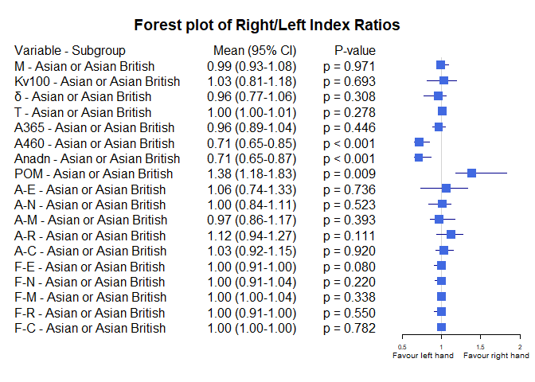<!-- -->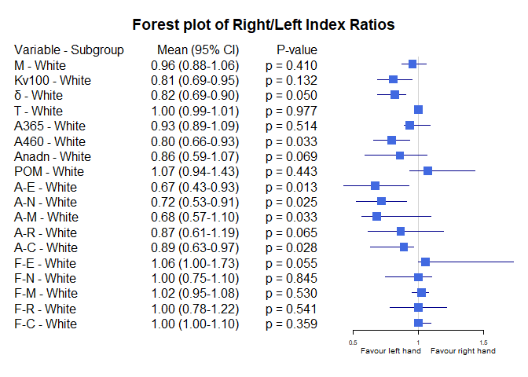<!-- -->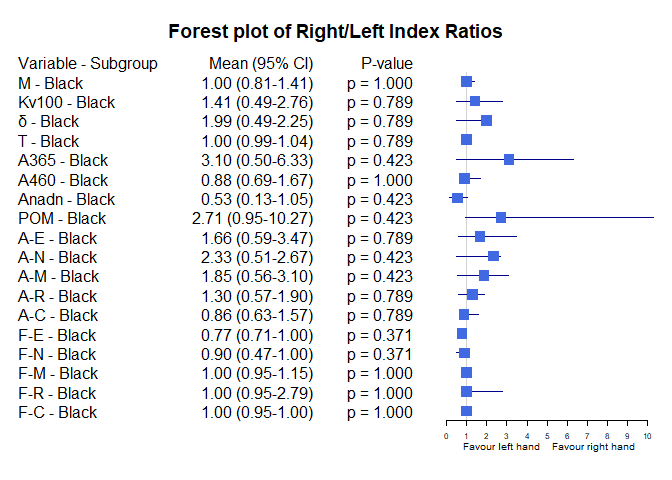<!-- -->


Bảng Skin


|                       |Variable |Subgroup       |Subgroup_Level | Median_Ratio|  CI_Lower|   CI_Upper|   P_Value|
|:----------------------|:--------|:--------------|:--------------|------------:|---------:|----------:|---------:|
|Typer of skins_3_M     |M        |Typer of skins |3              |    0.9699917| 0.9001016|  1.0491287| 0.6428450|
|Typer of skins_3_Kv100 |Kv100    |Typer of skins |3              |    1.0071327| 0.7044745|  1.1807911| 0.3786400|
|Typer of skins_3_δ     |δ        |Typer of skins |3              |    0.9096803| 0.6965846|  1.0627203| 0.1522875|
|Typer of skins_3_T     |T        |Typer of skins |3              |    1.0029492| 0.9931950|  1.0091936| 0.3502161|
|Typer of skins_3_A365  |A365     |Typer of skins |3              |    0.9729489| 0.9181801|  1.0243902| 0.4142900|
|Typer of skins_3_A460  |A460     |Typer of skins |3              |    0.7063492| 0.6557479|  0.8412304| 0.0001915|
|Typer of skins_3_Anadn |Anadn    |Typer of skins |3              |    0.7732930| 0.6617769|  0.8902439| 0.0003074|
|Typer of skins_3_POM   |POM      |Typer of skins |3              |    1.2938021| 1.0864256|  1.7563929| 0.0152598|
|Typer of skins_3_A-E   |A-E      |Typer of skins |3              |    1.0779221| 0.7872928|  1.3820225| 0.9090378|
|Typer of skins_3_A-N   |A-N      |Typer of skins |3              |    0.9301948| 0.7030061|  1.1388839| 0.3231843|
|Typer of skins_3_A-M   |A-M      |Typer of skins |3              |    0.9324162| 0.7777778|  1.1132458| 0.3298113|
|Typer of skins_3_A-R   |A-R      |Typer of skins |3              |    1.0339066| 0.8843884|  1.2453618| 0.6332400|
|Typer of skins_3_A-C   |A-C      |Typer of skins |3              |    0.9782913| 0.8263163|  1.1483385| 0.4316824|
|Typer of skins_3_F-E   |F-E      |Typer of skins |3              |    1.0000000| 0.9089144|  1.0000000| 0.1441903|
|Typer of skins_3_F-N   |F-N      |Typer of skins |3              |    1.0000000| 0.7812500|  1.0660208| 0.3090292|
|Typer of skins_3_F-M   |F-M      |Typer of skins |3              |    1.0000000| 0.9205863|  1.0672555| 0.6735099|
|Typer of skins_3_F-R   |F-R      |Typer of skins |3              |    1.0000000| 0.7986798|  1.1016949| 0.7678168|
|Typer of skins_3_F-C   |F-C      |Typer of skins |3              |    1.0000000| 1.0000000|  1.0000000| 1.0000000|
|Typer of skins_4_M     |M        |Typer of skins |4              |    0.9713620| 0.9030870|  1.2265991| 0.7556577|
|Typer of skins_4_Kv100 |Kv100    |Typer of skins |4              |    0.8138761| 0.6608448|  1.7388334| 0.6890837|
|Typer of skins_4_δ     |δ        |Typer of skins |4              |    0.9260417| 0.6760736|  1.6751864| 0.6248349|
|Typer of skins_4_T     |T        |Typer of skins |4              |    1.0140701| 1.0036394|  1.0215240| 0.1000006|
|Typer of skins_4_A365  |A365     |Typer of skins |4              |    0.8453039| 0.6235294|  1.3770492| 0.5048799|
|Typer of skins_4_A460  |A460     |Typer of skins |4              |    0.8350101| 0.5438596|  1.0000000| 0.0755606|
|Typer of skins_4_Anadn |Anadn    |Typer of skins |4              |    0.7747748| 0.6190476|  1.9400000| 0.8939037|
|Typer of skins_4_POM   |POM      |Typer of skins |4              |    1.0259981| 0.4361281|  2.0532446| 0.9645414|
|Typer of skins_4_A-E   |A-E      |Typer of skins |4              |    0.7122302| 0.5817965|  1.2549020| 0.1197224|
|Typer of skins_4_A-N   |A-N      |Typer of skins |4              |    1.0637119| 0.5761124|  1.3333333| 0.9645414|
|Typer of skins_4_A-M   |A-M      |Typer of skins |4              |    1.0118577| 0.6237113|  1.2105263| 0.3983046|
|Typer of skins_4_A-R   |A-R      |Typer of skins |4              |    1.3418252| 0.7155172|  1.4000000| 0.6890837|
|Typer of skins_4_A-C   |A-C      |Typer of skins |4              |    1.0701754| 0.7543860|  1.2995169| 0.7556577|
|Typer of skins_4_F-E   |F-E      |Typer of skins |4              |    1.0433387| 1.0000000|  1.2142857| 0.4069412|
|Typer of skins_4_F-N   |F-N      |Typer of skins |4              |    0.9729730| 0.8148148|  1.0434783| 0.5633178|
|Typer of skins_4_F-M   |F-M      |Typer of skins |4              |    1.0245902| 0.9481481|  1.0945946| 0.4771966|
|Typer of skins_4_F-R   |F-R      |Typer of skins |4              |    1.0000000| 0.6445993|  1.0504202| 0.5541131|
|Typer of skins_4_F-C   |F-C      |Typer of skins |4              |    1.0000000| 0.9402283|  1.0501761| 0.9326466|
|Typer of skins_1_M     |M        |Typer of skins |1              |    0.9765196| 0.9020202|  1.2097210| 0.8888407|
|Typer of skins_1_Kv100 |Kv100    |Typer of skins |1              |    0.9377246| 0.8023301|  1.2578413| 0.7267678|
|Typer of skins_1_δ     |δ        |Typer of skins |1              |    0.9003322| 0.7554077|  1.2048077| 0.4846417|
|Typer of skins_1_T     |T        |Typer of skins |1              |    0.9980134| 0.9777342|  1.0020402| 0.4420464|
|Typer of skins_1_A365  |A365     |Typer of skins |1              |    0.9333333| 0.8934426|  0.9618321| 0.4846417|
|Typer of skins_1_A460  |A460     |Typer of skins |1              |    0.7546296| 0.5522388|  0.8695652| 0.0107874|
|Typer of skins_1_Anadn |Anadn    |Typer of skins |1              |    0.7655172| 0.5882353|  1.0000000| 0.0206584|
|Typer of skins_1_POM   |POM      |Typer of skins |1              |    1.4070022| 0.9989101|  1.6304781| 0.0934925|
|Typer of skins_1_A-E   |A-E      |Typer of skins |1              |    0.6904962| 0.4600000|  1.1182796| 0.0692130|
|Typer of skins_1_A-N   |A-N      |Typer of skins |1              |    0.7321814| 0.6366177|  1.1713062| 0.1241747|
|Typer of skins_1_A-M   |A-M      |Typer of skins |1              |    0.7953488| 0.6567568|  1.1460674| 0.2348113|
|Typer of skins_1_A-R   |A-R      |Typer of skins |1              |    0.8864865| 0.6134868|  1.2457627| 0.1842351|
|Typer of skins_1_A-C   |A-C      |Typer of skins |1              |    0.9134615| 0.7551020|  1.4419592| 0.2895874|
|Typer of skins_1_F-E   |F-E      |Typer of skins |1              |    1.0566038| 0.9375000|  1.4468085| 0.0998330|
|Typer of skins_1_F-N   |F-N      |Typer of skins |1              |    1.0000000| 0.7500000|  1.1034483| 0.6890837|
|Typer of skins_1_F-M   |F-M      |Typer of skins |1              |    0.9722222| 0.8714286|  1.0826667| 1.0000000|
|Typer of skins_1_F-R   |F-R      |Typer of skins |1              |    1.0000000| 0.9285409|  1.0023256| 0.7262861|
|Typer of skins_1_F-C   |F-C      |Typer of skins |1              |    1.0000000| 1.0000000|  1.0499490| 0.2361370|
|Typer of skins_6_M     |M        |Typer of skins |6              |    0.9264961| 0.8130631|  1.4052863| 0.8551321|
|Typer of skins_6_Kv100 |Kv100    |Typer of skins |6              |    1.3244473| 0.4880314|  2.7556207| 0.5838824|
|Typer of skins_6_δ     |δ        |Typer of skins |6              |    1.5274393| 0.4859155|  2.2463235| 0.5838824|
|Typer of skins_6_T     |T        |Typer of skins |6              |    1.0033632| 0.9876106|  1.0374283| 0.5838824|
|Typer of skins_6_A365  |A365     |Typer of skins |6              |    1.8000000| 0.3333333|  6.3333333| 0.5838824|
|Typer of skins_6_A460  |A460     |Typer of skins |6              |    0.7836538| 0.0833333|  1.6666667| 0.5838824|
|Typer of skins_6_Anadn |Anadn    |Typer of skins |6              |    0.3921897| 0.1318681|  1.0531915| 0.2012426|
|Typer of skins_6_POM   |POM      |Typer of skins |6              |    2.9105384| 0.9543147| 10.2736842| 0.2012426|
|Typer of skins_6_A-E   |A-E      |Typer of skins |6              |    1.7543651| 0.5943775|  3.4687500| 0.3613104|
|Typer of skins_6_A-N   |A-N      |Typer of skins |6              |    2.0000000| 0.5100000|  2.6666667| 0.3613104|
|Typer of skins_6_A-M   |A-M      |Typer of skins |6              |    1.5490346| 0.5555556|  3.0975610| 0.3613104|
|Typer of skins_6_A-R   |A-R      |Typer of skins |6              |    1.1991228| 0.5714286|  1.9016393| 0.5838824|
|Typer of skins_6_A-C   |A-C      |Typer of skins |6              |    1.0302663| 0.6262136|  1.5735294| 1.0000000|
|Typer of skins_6_F-E   |F-E      |Typer of skins |6              |    0.7375566| 0.6111111|  1.0000000| 0.1814492|
|Typer of skins_6_F-N   |F-N      |Typer of skins |6              |    0.6839781| 0.4655172|  1.0000000| 0.1735682|
|Typer of skins_6_F-M   |F-M      |Typer of skins |6              |    1.0737705| 0.9531250|  2.1777778| 0.4226781|
|Typer of skins_6_F-R   |F-R      |Typer of skins |6              |    0.9766949| 0.9059233|  2.7864078| 1.0000000|
|Typer of skins_6_F-C   |F-C      |Typer of skins |6              |    1.0000000| 0.9528754|  1.1030351| 1.0000000|
|Typer of skins_2_M     |M        |Typer of skins |2              |    0.9853694| 0.5925328|  1.0525388| 0.2807127|
|Typer of skins_2_Kv100 |Kv100    |Typer of skins |2              |    0.8229814| 0.3249756|  6.5467626| 0.7874065|
|Typer of skins_2_δ     |δ        |Typer of skins |2              |    0.7736486| 0.1927982|  1.2485437| 0.1775299|
|Typer of skins_2_T     |T        |Typer of skins |2              |    1.0089087| 0.7320107|  1.0184445| 0.7874065|
|Typer of skins_2_A365  |A365     |Typer of skins |2              |    1.0176991| 0.1966292|  3.4285714| 1.0000000|
|Typer of skins_2_A460  |A460     |Typer of skins |2              |    1.0370370| 0.4646465|  1.5000000| 1.0000000|
|Typer of skins_2_Anadn |Anadn    |Typer of skins |2              |    0.9298246| 0.2935780|  6.0000000| 1.0000000|
|Typer of skins_2_POM   |POM      |Typer of skins |2              |    0.8923629| 0.2356364|  3.5702479| 0.7874065|
|Typer of skins_2_A-E   |A-E      |Typer of skins |2              |    0.7235772| 0.1542969|  1.0744186| 0.1056454|
|Typer of skins_2_A-N   |A-N      |Typer of skins |2              |    0.7027027| 0.2061611|  1.1148325| 0.1775299|
|Typer of skins_2_A-M   |A-M      |Typer of skins |2              |    0.7716535| 0.2875817|  1.4125874| 0.2807127|
|Typer of skins_2_A-R   |A-R      |Typer of skins |2              |    0.9908257| 0.3219178|  1.2444444| 0.5896386|
|Typer of skins_2_A-C   |A-C      |Typer of skins |2              |    0.9183673| 0.4969325|  1.8000000| 0.2807127|
|Typer of skins_2_F-E   |F-E      |Typer of skins |2              |    0.9000000| 0.6250000|  1.7272727| 0.8551321|
|Typer of skins_2_F-N   |F-N      |Typer of skins |2              |    1.1428571| 1.0000000|  2.6363636| 0.1003482|
|Typer of skins_2_F-M   |F-M      |Typer of skins |2              |    1.0491803| 1.0000000|  1.8000000| 0.1735682|
|Typer of skins_2_F-R   |F-R      |Typer of skins |2              |    0.7832700| 0.3588850|  2.7864078| 0.4982249|
|Typer of skins_2_F-C   |F-C      |Typer of skins |2              |    1.0000000| 0.7468051|  1.0501761| 1.0000000|
|Typer of skins_5_M     |M        |Typer of skins |5              |    1.0864178| 0.8928482|  1.2922034| 0.2945074|
|Typer of skins_5_Kv100 |Kv100    |Typer of skins |5              |    1.0529749| 0.7021954|  1.4094562| 0.6749867|
|Typer of skins_5_δ     |δ        |Typer of skins |5              |    1.1653785| 0.6178038|  1.7338256| 0.6749867|
|Typer of skins_5_T     |T        |Typer of skins |5              |    0.9962441| 0.9407552|  1.0137475| 0.6749867|
|Typer of skins_5_A365  |A365     |Typer of skins |5              |    1.2961287| 0.5366563|  1.7269789| 0.6749867|
|Typer of skins_5_A460  |A460     |Typer of skins |5              |    0.7430087| 0.3743941|  0.9607689| 0.0591721|
|Typer of skins_5_Anadn |Anadn    |Typer of skins |5              |    0.5799992| 0.2571694|  1.3271293| 0.2945074|
|Typer of skins_5_POM   |POM      |Typer of skins |5              |    1.9167129| 0.4998205|  4.7355095| 0.2945074|
|Typer of skins_5_A-E   |A-E      |Typer of skins |5              |    1.4179764| 0.3415401|  2.5966208| 0.6749867|
|Typer of skins_5_A-N   |A-N      |Typer of skins |5              |    1.2369020| 0.3616740|  1.9934561| 1.0000000|
|Typer of skins_5_A-M   |A-M      |Typer of skins |5              |    1.3514706| 0.3429071|  1.5341844| 0.6749867|
|Typer of skins_5_A-R   |A-R      |Typer of skins |5              |    1.5058570| 0.9285556|  2.2209665| 0.1422132|
|Typer of skins_5_A-C   |A-C      |Typer of skins |5              |    1.0233550| 0.5629958|  1.4985689| 1.0000000|
|Typer of skins_5_F-E   |F-E      |Typer of skins |5              |    0.9848485| 0.7302967|  1.1447029| 0.7874065|
|Typer of skins_5_F-N   |F-N      |Typer of skins |5              |    0.6079401| 0.4640782|  1.3460485| 0.1422132|
|Typer of skins_5_F-M   |F-M      |Typer of skins |5              |    1.0000000| 0.7027821|  1.9230634| 0.8551321|
|Typer of skins_5_F-R   |F-R      |Typer of skins |5              |    1.0242718| 0.7371874|  1.7561279| 1.0000000|
|Typer of skins_5_F-C   |F-C      |Typer of skins |5              |    1.0000000| 0.9646623|  1.2014664| 1.0000000|

Các đồ thị Forest plot theo dưới nhóm Skin

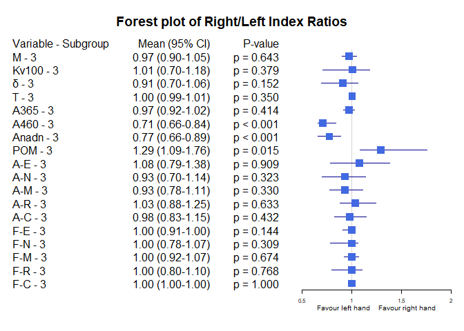<!-- -->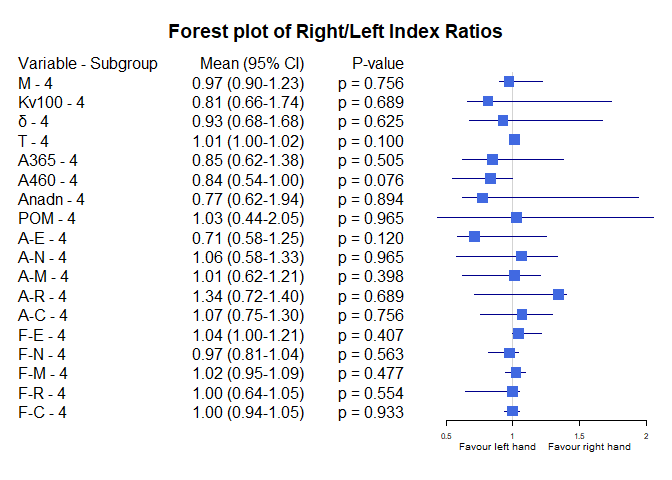<!-- -->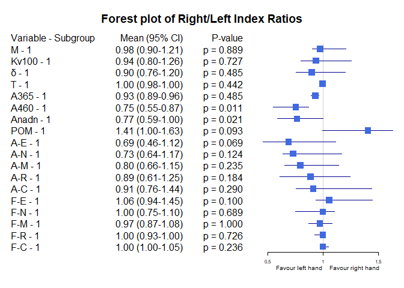<!-- -->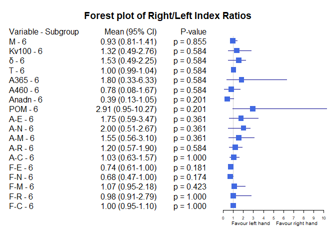<!-- -->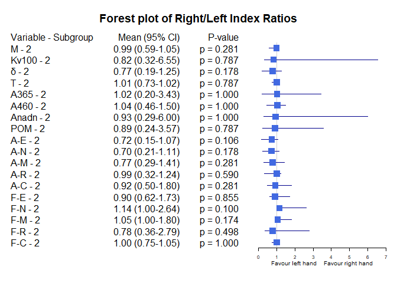<!-- -->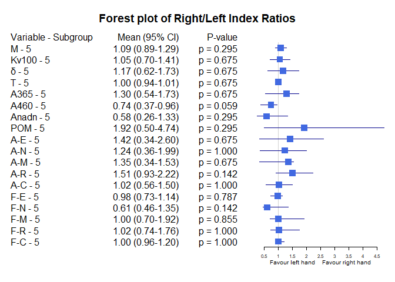<!-- -->


Bảng Stress


|Variable |Subgroup     |Subgroup_Level | Median_Ratio|  CI_Lower|  CI_Upper|   P_Value|
|:--------|:------------|:--------------|------------:|---------:|---------:|---------:|
|M        |Stress index |No             |    0.9651313| 0.9206987| 1.0410736| 0.6911754|
|M        |Stress index |Yes            |    1.0042960| 0.9326970| 1.0933843| 0.8202219|
|Kv100    |Stress index |No             |    1.0263425| 0.8023301| 1.2194821| 0.6794961|
|Kv100    |Stress index |Yes            |    0.9352172| 0.6881430| 1.2033759| 0.2696660|
|δ        |Stress index |No             |    0.9260417| 0.7680723| 1.0339367| 0.2122517|
|δ        |Stress index |Yes            |    0.8757868| 0.7446336| 1.1349338| 0.3807189|
|T        |Stress index |No             |    1.0026902| 0.9980134| 1.0051107| 0.2460487|
|T        |Stress index |Yes            |    1.0023048| 0.9890372| 1.0134267| 0.9224112|
|A365     |Stress index |No             |    0.9900990| 0.9333333| 1.1181818| 0.7349721|
|A365     |Stress index |Yes            |    0.8926099| 0.7250052| 0.9863615| 0.0913702|
|A460     |Stress index |No             |    0.7304348| 0.6640625| 0.8208955| 0.0000041|
|A460     |Stress index |Yes            |    0.8199441| 0.6685822| 0.9796996| 0.0164724|
|Anadn    |Stress index |No             |    0.6820809| 0.6352459| 0.8072289| 0.0000043|
|Anadn    |Stress index |Yes            |    0.8951448| 0.6610169| 1.0676692| 0.5161361|
|POM      |Stress index |No             |    1.5325077| 1.2467903| 1.8764045| 0.0004320|
|POM      |Stress index |Yes            |    1.0191910| 0.9042375| 1.3634318| 0.8202219|
|A-E      |Stress index |No             |    0.9537612| 0.7235772| 1.1274298| 0.2942832|
|A-E      |Stress index |Yes            |    1.0010647| 0.6334306| 1.3148374| 0.3807189|
|A-N      |Stress index |No             |    0.9318182| 0.7104377| 1.0868056| 0.1952965|
|A-N      |Stress index |Yes            |    0.9251553| 0.7040600| 1.2698864| 0.6034467|
|A-M      |Stress index |No             |    0.9589844| 0.7777778| 1.1153846| 0.3525818|
|A-M      |Stress index |Yes            |    0.8379786| 0.6521326| 1.2439024| 0.1831589|
|A-R      |Stress index |No             |    1.1268534| 0.9259259| 1.2686567| 0.2592253|
|A-R      |Stress index |Yes            |    1.0273277| 0.7325558| 1.1934804| 0.4169975|
|A-C      |Stress index |No             |    0.9518072| 0.8545455| 1.1422501| 0.2385182|
|A-C      |Stress index |Yes            |    0.9782913| 0.8897059| 1.1538462| 0.6968414|
|F-E      |Stress index |No             |    1.0000000| 0.9230769| 1.0000000| 0.4587783|
|F-E      |Stress index |Yes            |    1.0000000| 0.8770580| 1.1100388| 0.6232614|
|F-N      |Stress index |No             |    1.0000000| 0.7777778| 1.0134454| 0.1219058|
|F-N      |Stress index |Yes            |    1.0000000| 0.9136498| 1.1428571| 0.9553348|
|F-M      |Stress index |No             |    1.0000000| 0.9722222| 1.0352113| 0.7179337|
|F-M      |Stress index |Yes            |    1.0469782| 1.0000000| 1.1475410| 0.0814698|
|F-R      |Stress index |No             |    1.0000000| 1.0000000| 1.0485437| 0.8477038|
|F-R      |Stress index |Yes            |    0.9766949| 0.8547718| 1.0000000| 0.1269030|
|F-C      |Stress index |No             |    1.0000000| 1.0000000| 1.0000000| 0.3891835|
|F-C      |Stress index |Yes            |    1.0000000| 1.0000000| 1.0116775| 0.9442847|

Các đồ thị Forest plot theo dưới nhóm Stress

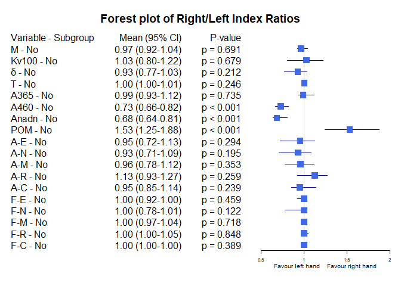<!-- -->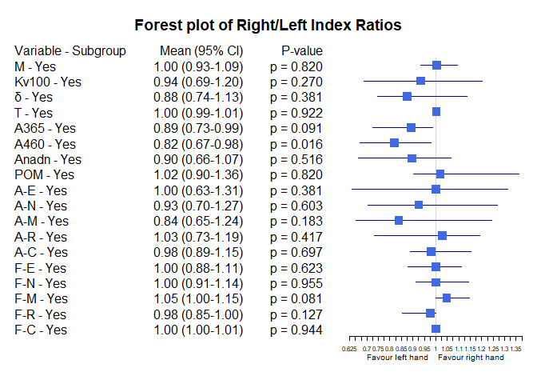<!-- -->


Bảng Smoking


|Variable |Subgroup |Subgroup_Level | Median_Ratio|  CI_Lower|  CI_Upper|   P_Value|
|:--------|:--------|:--------------|------------:|---------:|---------:|---------:|
|M        |Smoking  |Non smoker     |    0.9864477| 0.9471572| 1.0525388| 0.8908461|
|M        |Smoking  |Smoker         |    0.9326164| 0.8566542| 1.1062100| 0.3463733|
|Kv100    |Smoking  |Non smoker     |    0.9512922| 0.8023301| 1.0926366| 0.1956940|
|Kv100    |Smoking  |Smoker         |    1.3137485| 0.7110165| 1.4408873| 0.6155185|
|δ        |Smoking  |Non smoker     |    0.9047994| 0.7736486| 1.0091097| 0.0821592|
|δ        |Smoking  |Smoker         |    1.0615927| 0.7340426| 1.3936944| 0.9000858|
|T        |Smoking  |Non smoker     |    1.0020402| 0.9954553| 1.0051107| 0.5920520|
|T        |Smoking  |Smoker         |    1.0043475| 0.9972274| 1.0184106| 0.1672536|
|A365     |Smoking  |Non smoker     |    0.9365854| 0.8934426| 1.0176991| 0.4203326|
|A365     |Smoking  |Smoker         |    0.9928788| 0.8181818| 1.3085922| 0.8506184|
|A460     |Smoking  |Non smoker     |    0.7543860| 0.6805556| 0.8620690| 0.0000077|
|A460     |Smoking  |Smoker         |    0.6792535| 0.5634807| 0.8750000| 0.0069467|
|Anadn    |Smoking  |Non smoker     |    0.7655172| 0.6481481| 0.8902439| 0.0006561|
|Anadn    |Smoking  |Smoker         |    0.6193262| 0.3603931| 0.8821167| 0.0069467|
|POM      |Smoking  |Non smoker     |    1.3234501| 1.0731970| 1.5979899| 0.0084490|
|POM      |Smoking  |Smoker         |    1.9260071| 0.9520000| 2.8643094| 0.0686802|
|A-E      |Smoking  |Non smoker     |    0.7872928| 0.6746988| 1.1182796| 0.0237534|
|A-E      |Smoking  |Smoker         |    1.5832689| 0.9190950| 2.1457652| 0.1319041|
|A-N      |Smoking  |Non smoker     |    0.9111111| 0.7027027| 1.0575850| 0.0455337|
|A-N      |Smoking  |Smoker         |    1.3629412| 0.7837838| 1.6666667| 0.3151744|
|A-M      |Smoking  |Non smoker     |    0.8738739| 0.7071198| 1.0958084| 0.0507076|
|A-M      |Smoking  |Smoker         |    1.0391621| 0.8320432| 1.4348247| 0.5720817|
|A-R      |Smoking  |Non smoker     |    0.9830508| 0.9019608| 1.2457627| 0.9271040|
|A-R      |Smoking  |Smoker         |    1.1334267| 0.9000000| 1.2982456| 0.2328509|
|A-C      |Smoking  |Non smoker     |    0.9803922| 0.9134615| 1.0958904| 0.3901506|
|A-C      |Smoking  |Smoker         |    0.9150327| 0.6576129| 1.2033898| 0.4898538|
|F-E      |Smoking  |Non smoker     |    1.0000000| 0.9250000| 1.0344828| 0.5589956|
|F-E      |Smoking  |Smoker         |    0.9848485| 0.9087379| 1.0000000| 0.5405549|
|F-N      |Smoking  |Non smoker     |    1.0000000| 0.9024390| 1.0434783| 0.3209112|
|F-N      |Smoking  |Smoker         |    0.9864865| 0.5966680| 1.0000000| 0.4145199|
|F-M      |Smoking  |Non smoker     |    1.0000000| 1.0000000| 1.0404858| 0.4338023|
|F-M      |Smoking  |Smoker         |    1.0245902| 0.9045613| 1.6976744| 0.3266134|
|F-R      |Smoking  |Non smoker     |    1.0000000| 1.0000000| 1.0504202| 0.4314759|
|F-R      |Smoking  |Smoker         |    0.6597044| 0.4355401| 0.9533494| 0.0032162|
|F-C      |Smoking  |Non smoker     |    1.0000000| 1.0000000| 1.0000000| 0.5614162|
|F-C      |Smoking  |Smoker         |    1.0000000| 1.0000000| 1.0000000| 0.7874065|

Các đồ thị Forest plot theo dưới nhóm Smoking

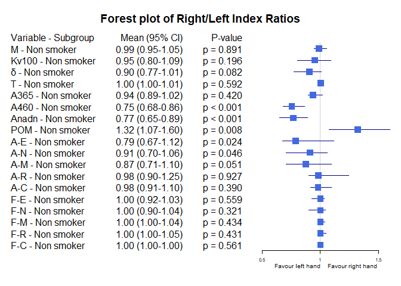<!-- -->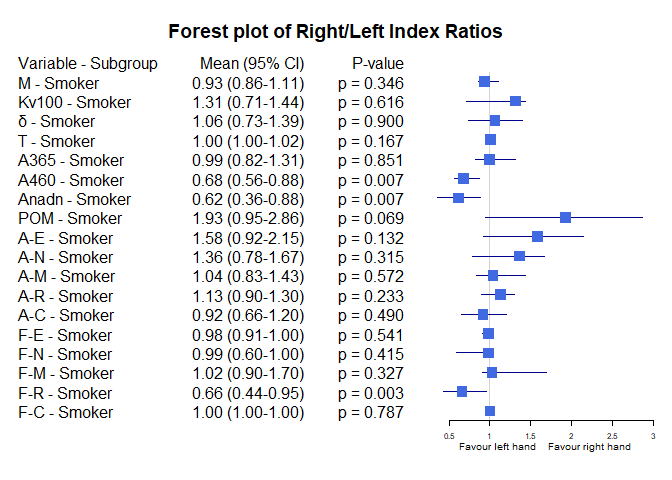<!-- -->


Bảng Hypertension


|Variable |Subgroup     |Subgroup_Level | Median_Ratio|  CI_Lower|  CI_Upper|   P_Value|
|:--------|:------------|:--------------|------------:|---------:|---------:|---------:|
|M        |Hypertension |No             |    0.9814837| 0.9206987| 1.0498745| 0.6312092|
|M        |Hypertension |Yes            |    0.9748521| 0.8818049| 1.1851155| 0.8077703|
|Kv100    |Hypertension |No             |    0.9857016| 0.8096407| 1.1437362| 0.4162487|
|Kv100    |Hypertension |Yes            |    0.9908616| 0.7110165| 1.2985723| 0.7022135|
|δ        |Hypertension |No             |    0.9025658| 0.7680723| 1.0107584| 0.0588740|
|δ        |Hypertension |Yes            |    0.9566929| 0.6908386| 1.4848485| 1.0000000|
|T        |Hypertension |No             |    1.0026242| 0.9948822| 1.0114557| 0.3650128|
|T        |Hypertension |Yes            |    1.0026902| 0.9930303| 1.0053251| 0.8077703|
|A365     |Hypertension |No             |    0.9566442| 0.9236948| 1.0701754| 0.9841526|
|A365     |Hypertension |Yes            |    0.9285714| 0.8333333| 1.0243902| 0.1984315|
|A460     |Hypertension |No             |    0.8007441| 0.6933752| 0.8722784| 0.0003003|
|A460     |Hypertension |Yes            |    0.5972222| 0.4782609| 0.7213115| 0.0001973|
|Anadn    |Hypertension |No             |    0.7678938| 0.6610169| 0.9126707| 0.0022214|
|Anadn    |Hypertension |Yes            |    0.6481481| 0.4508063| 0.8730159| 0.0019786|
|POM      |Hypertension |No             |    1.2713028| 1.0676237| 1.5325077| 0.0301695|
|POM      |Hypertension |Yes            |    1.9756098| 1.0259981| 2.3571429| 0.0123302|
|A-E      |Hypertension |No             |    0.9580127| 0.7122302| 1.1274298| 0.2125743|
|A-E      |Hypertension |Yes            |    0.8198052| 0.6046512| 1.3709924| 0.7809654|
|A-N      |Hypertension |No             |    0.9251553| 0.7153753| 1.0571414| 0.1056301|
|A-N      |Hypertension |Yes            |    1.0637119| 0.6366177| 1.4058824| 1.0000000|
|A-M      |Hypertension |No             |    0.8942540| 0.7716535| 1.0814669| 0.0558300|
|A-M      |Hypertension |Yes            |    1.1111111| 0.6875000| 1.3129973| 0.8077703|
|A-R      |Hypertension |No             |    0.9548950| 0.8473754| 1.1431663| 0.4810880|
|A-R      |Hypertension |Yes            |    1.2954545| 0.9696970| 1.4000000| 0.0437899|
|A-C      |Hypertension |No             |    0.9340817| 0.8266004| 0.9934853| 0.0506396|
|A-C      |Hypertension |Yes            |    1.1944444| 0.9411765| 1.3548387| 0.3480098|
|F-E      |Hypertension |No             |    1.0000000| 0.9333333| 1.0386862| 0.5866697|
|F-E      |Hypertension |Yes            |    1.0000000| 0.9081633| 1.0000000| 0.7118861|
|F-N      |Hypertension |No             |    1.0000000| 0.9024390| 1.0274591| 0.1528671|
|F-N      |Hypertension |Yes            |    1.0000000| 0.7500000| 1.1453633| 0.7275066|
|F-M      |Hypertension |No             |    1.0000000| 0.9762812| 1.0352113| 0.7596693|
|F-M      |Hypertension |Yes            |    1.0245902| 1.0000000| 1.2187500| 0.1297644|
|F-R      |Hypertension |No             |    1.0000000| 0.9636083| 1.0128612| 0.9813519|
|F-R      |Hypertension |Yes            |    1.0000000| 0.6445993| 1.0023256| 0.2363671|
|F-C      |Hypertension |No             |    1.0000000| 1.0000000| 1.0000000| 0.3740089|
|F-C      |Hypertension |Yes            |    1.0000000| 1.0000000| 1.0000000| 0.8939037|

Các đồ thị Forest plot theo dưới nhóm Hypertension

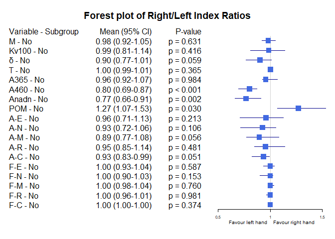<!-- -->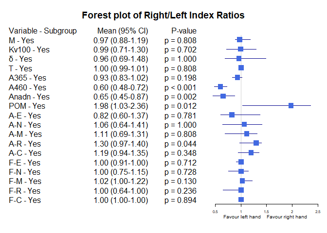<!-- -->


Bảng BMI_25_30


|Variable |Subgroup  |Subgroup_Level | Median_Ratio|  CI_Lower|  CI_Upper|   P_Value|
|:--------|:---------|:--------------|------------:|---------:|---------:|---------:|
|M        |BMI_25_30 |BMI <25        |    0.9713620| 0.9001773| 1.0410736| 0.4150384|
|M        |BMI_25_30 |BMI [25-30)    |    0.9706483| 0.9020202| 1.0235062| 0.5311745|
|M        |BMI_25_30 |BMI >=30       |    1.1974183| 0.9639175| 1.2464466| 0.0587074|
|Kv100    |BMI_25_30 |BMI <25        |    1.2194821| 0.9659820| 1.4018595| 0.2852349|
|Kv100    |BMI_25_30 |BMI [25-30)    |    0.8081031| 0.6305505| 1.0796074| 0.0118614|
|Kv100    |BMI_25_30 |BMI >=30       |    0.8073127| 0.6881430| 1.2401994| 0.2339528|
|δ        |BMI_25_30 |BMI <25        |    1.0092492| 0.7736486| 1.2644612| 0.8991090|
|δ        |BMI_25_30 |BMI [25-30)    |    0.8043626| 0.6506740| 0.9946828| 0.0173308|
|δ        |BMI_25_30 |BMI >=30       |    0.9292904| 0.7554077| 1.4557589| 0.7262861|
|T        |BMI_25_30 |BMI <25        |    1.0033698| 1.0004623| 1.0153798| 0.1781873|
|T        |BMI_25_30 |BMI [25-30)    |    1.0026673| 0.9923041| 1.0100684| 0.6244272|
|T        |BMI_25_30 |BMI >=30       |    0.9967343| 0.9890372| 1.0036394| 0.2339528|
|A365     |BMI_25_30 |BMI <25        |    0.9611650| 0.9126984| 1.0427350| 0.9950117|
|A365     |BMI_25_30 |BMI [25-30)    |    0.9890331| 0.8504564| 1.1390842| 0.5614620|
|A365     |BMI_25_30 |BMI >=30       |    0.9086197| 0.7166667| 0.9913793| 0.1834306|
|A460     |BMI_25_30 |BMI <25        |    0.6984127| 0.6640625| 0.8978102| 0.0011006|
|A460     |BMI_25_30 |BMI [25-30)    |    0.7465112| 0.6972167| 0.8547712| 0.0008764|
|A460     |BMI_25_30 |BMI >=30       |    0.6003322| 0.4455446| 0.8695652| 0.0224943|
|Anadn    |BMI_25_30 |BMI <25        |    0.7053191| 0.6352459| 0.9126214| 0.0005584|
|Anadn    |BMI_25_30 |BMI [25-30)    |    0.8401224| 0.6470820| 0.9755832| 0.0488695|
|Anadn    |BMI_25_30 |BMI >=30       |    0.6036415| 0.4984026| 0.8604651| 0.1834306|
|POM      |BMI_25_30 |BMI <25        |    1.2958153| 1.0136172| 1.7349750| 0.0221257|
|POM      |BMI_25_30 |BMI [25-30)    |    1.3879571| 0.9681342| 1.9777312| 0.0897967|
|POM      |BMI_25_30 |BMI >=30       |    1.4207894| 0.9989101| 2.2361831| 0.2339528|
|A-E      |BMI_25_30 |BMI <25        |    1.1182796| 0.8108108| 1.3333333| 0.8610102|
|A-E      |BMI_25_30 |BMI [25-30)    |    0.7471831| 0.4733488| 1.2636701| 0.1135095|
|A-E      |BMI_25_30 |BMI >=30       |    0.6920495| 0.6713948| 1.2549020| 0.0800579|
|A-N      |BMI_25_30 |BMI <25        |    0.9553571| 0.7837838| 1.2800000| 0.7216825|
|A-N      |BMI_25_30 |BMI [25-30)    |    0.8788012| 0.5670165| 1.1007298| 0.1358229|
|A-N      |BMI_25_30 |BMI >=30       |    0.8790514| 0.7203472| 1.1901794| 0.2936215|
|A-M      |BMI_25_30 |BMI <25        |    0.9291339| 0.7777778| 1.1153846| 0.2538311|
|A-M      |BMI_25_30 |BMI [25-30)    |    1.0256820| 0.6120286| 1.3675766| 0.3806497|
|A-M      |BMI_25_30 |BMI >=30       |    0.8771666| 0.6310928| 1.1692308| 0.2339528|
|A-R      |BMI_25_30 |BMI <25        |    1.0930233| 0.9000000| 1.2686567| 0.6420103|
|A-R      |BMI_25_30 |BMI [25-30)    |    1.0557577| 0.8672952| 1.2678025| 0.7412597|
|A-R      |BMI_25_30 |BMI >=30       |    0.9994149| 0.6947063| 1.3995068| 0.8336349|
|A-C      |BMI_25_30 |BMI <25        |    0.9803922| 0.8571429| 1.1944444| 0.6947361|
|A-C      |BMI_25_30 |BMI [25-30)    |    0.9293706| 0.7767505| 1.0466740| 0.1746502|
|A-C      |BMI_25_30 |BMI >=30       |    1.0021364| 0.6329966| 1.3594905| 0.9441825|
|F-E      |BMI_25_30 |BMI <25        |    1.0000000| 0.9087379| 1.0000000| 0.1688085|
|F-E      |BMI_25_30 |BMI [25-30)    |    1.0000000| 0.8891084| 1.0758287| 0.8190792|
|F-E      |BMI_25_30 |BMI >=30       |    1.0283019| 1.0000000| 1.3358133| 0.1775299|
|F-N      |BMI_25_30 |BMI <25        |    1.0000000| 0.8275862| 1.0134454| 0.2386508|
|F-N      |BMI_25_30 |BMI [25-30)    |    1.0000000| 0.7500000| 1.1567105| 0.4351933|
|F-N      |BMI_25_30 |BMI >=30       |    0.9990915| 0.7807611| 1.1034483| 0.7262861|
|F-M      |BMI_25_30 |BMI <25        |    1.0000000| 0.9481481| 1.0352113| 0.7074657|
|F-M      |BMI_25_30 |BMI [25-30)    |    1.0448331| 1.0000000| 1.1268228| 0.1484923|
|F-M      |BMI_25_30 |BMI >=30       |    0.9861111| 0.7878116| 1.4197531| 0.6726038|
|F-R      |BMI_25_30 |BMI <25        |    1.0000000| 0.9074890| 1.0000000| 0.9016244|
|F-R      |BMI_25_30 |BMI [25-30)    |    0.9642704| 0.6782299| 1.1013328| 0.3963794|
|F-R      |BMI_25_30 |BMI >=30       |    1.0011628| 0.7706553| 1.3755020| 0.6749867|
|F-C      |BMI_25_30 |BMI <25        |    1.0000000| 1.0000000| 1.0000000| 0.4440812|
|F-C      |BMI_25_30 |BMI [25-30)    |    1.0000000| 1.0000000| 1.0000000| 0.2894019|
|F-C      |BMI_25_30 |BMI >=30       |    0.9886076| 0.9077670| 1.0116775| 0.5293681|

Các đồ thị Forest plot theo dưới nhóm BMI_25_30

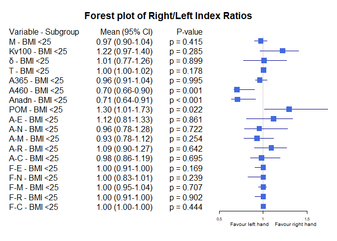<!-- -->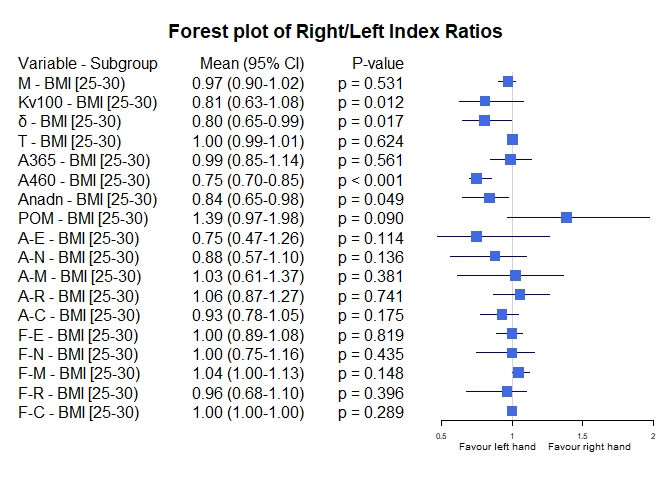<!-- -->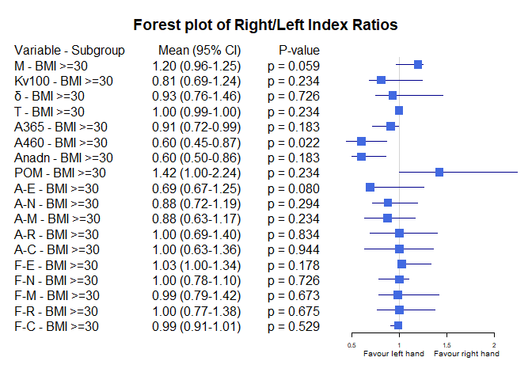<!-- -->


Bảng Obesity


|Variable |Subgroup |Subgroup_Level | Median_Ratio|  CI_Lower|  CI_Upper|   P_Value|
|:--------|:--------|:--------------|------------:|---------:|---------:|---------:|
|M        |Obesity  |No             |    0.9713620| 0.9206987| 1.0119979| 0.3343058|
|M        |Obesity  |Yes            |    1.1974183| 1.0102989| 1.2464466| 0.0587074|
|Kv100    |Obesity  |No             |    1.0080951| 0.8229814| 1.1727273| 0.5341476|
|Kv100    |Obesity  |Yes            |    0.8073127| 0.6990029| 1.2401994| 0.2339528|
|δ        |Obesity  |No             |    0.9064935| 0.7680723| 1.0505051| 0.1131256|
|δ        |Obesity  |Yes            |    0.9292904| 0.7554077| 1.4636429| 0.7262861|
|T        |Obesity  |No             |    1.0032944| 0.9978960| 1.0067212| 0.1646853|
|T        |Obesity  |Yes            |    0.9967343| 0.9890372| 1.0020563| 0.2339528|
|A365     |Obesity  |No             |    0.9618321| 0.9236948| 1.0427350| 0.7855243|
|A365     |Obesity  |Yes            |    0.9086197| 0.7252674| 0.9913793| 0.1834306|
|A460     |Obesity  |No             |    0.7386364| 0.6811594| 0.8620690| 0.0000030|
|A460     |Obesity  |Yes            |    0.6003322| 0.4463177| 0.8695652| 0.0224943|
|Anadn    |Obesity  |No             |    0.7702703| 0.6610546| 0.8958333| 0.0000743|
|Anadn    |Obesity  |Yes            |    0.6036415| 0.4984026| 0.8604651| 0.1834306|
|POM      |Obesity  |No             |    1.3234501| 1.0741494| 1.6304781| 0.0042091|
|POM      |Obesity  |Yes            |    1.4207894| 0.9989101| 2.2361831| 0.2339528|
|A-E      |Obesity  |No             |    1.0338983| 0.7360115| 1.1674208| 0.3285993|
|A-E      |Obesity  |Yes            |    0.6920495| 0.6713948| 1.2549020| 0.0800579|
|A-N      |Obesity  |No             |    0.9318182| 0.7104377| 1.1148325| 0.2105811|
|A-N      |Obesity  |Yes            |    0.8790514| 0.7203472| 1.2698864| 0.2936215|
|A-M      |Obesity  |No             |    0.9356984| 0.7777778| 1.1153846| 0.2064342|
|A-M      |Obesity  |Yes            |    0.8771666| 0.6436318| 1.1692308| 0.2339528|
|A-R      |Obesity  |No             |    1.0930233| 0.9105691| 1.2444444| 0.5569959|
|A-R      |Obesity  |Yes            |    0.9994149| 0.6769014| 1.4000000| 0.8336349|
|A-C      |Obesity  |No             |    0.9675325| 0.8571429| 1.0943396| 0.2537969|
|A-C      |Obesity  |Yes            |    1.0021364| 0.7360761| 1.5000000| 0.9441825|
|F-E      |Obesity  |No             |    1.0000000| 0.9168290| 1.0000000| 0.2226398|
|F-E      |Obesity  |Yes            |    1.0283019| 1.0000000| 1.4468085| 0.1775299|
|F-N      |Obesity  |No             |    1.0000000| 0.9024390| 1.0109890| 0.1745929|
|F-N      |Obesity  |Yes            |    0.9990915| 0.7368780| 1.1034483| 0.7262861|
|F-M      |Obesity  |No             |    1.0000000| 1.0000000| 1.0491803| 0.2450636|
|F-M      |Obesity  |Yes            |    0.9861111| 0.7877855| 1.4197531| 0.6726038|
|F-R      |Obesity  |No             |    1.0000000| 0.9074890| 1.0000000| 0.5102433|
|F-R      |Obesity  |Yes            |    1.0011628| 0.7706553| 1.3755020| 0.6749867|
|F-C      |Obesity  |No             |    1.0000000| 1.0000000| 1.0000000| 0.3170991|
|F-C      |Obesity  |Yes            |    0.9886076| 0.9077670| 1.0116775| 0.5293681|

Các đồ thị Forest plot theo dưới nhóm Obesity

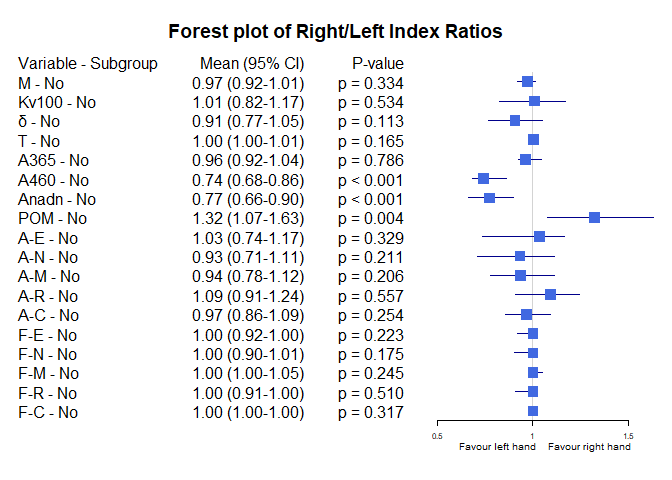<!-- -->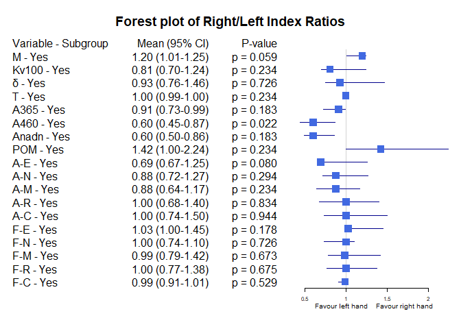<!-- -->


