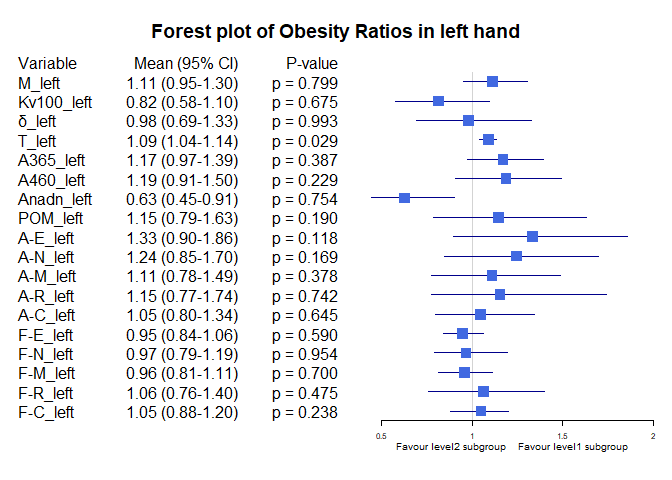
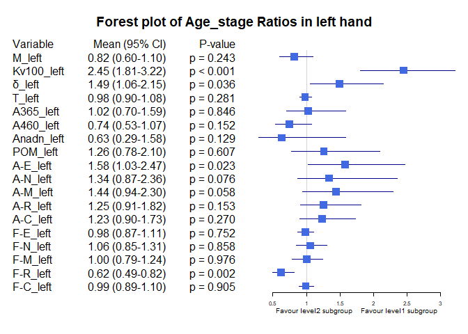

## Load bộ số liệu và các packages


```
## ── Attaching core tidyverse packages ──────────────────────── tidyverse 2.0.0 ──
## ✔ dplyr     1.1.3     ✔ readr     2.1.4
## ✔ forcats   1.0.0     ✔ stringr   1.5.0
## ✔ ggplot2   3.4.3     ✔ tibble    3.2.1
## ✔ lubridate 1.9.2     ✔ tidyr     1.3.0
## ✔ purrr     1.0.2     
## ── Conflicts ────────────────────────────────────────── tidyverse_conflicts() ──
## ✖ dplyr::filter() masks stats::filter()
## ✖ dplyr::lag()    masks stats::lag()
## ℹ Use the conflicted package (<http://conflicted.r-lib.org/>) to force all conflicts to become errors
## #BlackLivesMatter
## 
## 
## Attaching package: 'rstatix'
## 
## 
## The following object is masked from 'package:stats':
## 
##     filter
## 
## 
## Loading required package: grid
## 
## Loading required package: checkmate
## 
## Loading required package: abind
```

## So sánh khác biệt về ratio của chỉ số Stress vs non stress theo các biến


Hàm để tạo bảng tổng hợp kết quả và p-value


Hàm sắp xếp các cột theo thứ tự


Hàm vẽ Forest plot


Bảng Stress index Ratio, level1 = "Yes", level2 = "No"

|           |Variable   |Subgroup     | Level1_Mean| Level2_Mean|     Ratio|  CI_Lower|  CI_Upper|   P_Value|
|:----------|:----------|:------------|-----------:|-----------:|---------:|---------:|---------:|---------:|
|M_left     |M_left     |Stress index |  26.5329762|  21.2249240| 1.2500858| 1.0377458| 1.5052099| 0.0381952|
|Kv100_left |Kv100_left |Stress index |  23.2055952|  21.6257018| 1.0730563| 0.7788266| 1.4383520| 0.4640325|
|δ_left     |δ_left     |Stress index |   5.3633333|   3.7370117| 1.4351931| 1.1125549| 1.8585804| 0.0151978|
|T_left     |T_left     |Stress index |  33.2104762|  30.5827836| 1.0859206| 1.0422115| 1.1306105| 0.0169317|
|A365_left  |A365_left  |Stress index | 100.7261905|  85.9859649| 1.1714259| 0.8913623| 1.4915418| 0.3052460|
|A460_left  |A460_left  |Stress index |  61.7738095|  70.6625731| 0.8742083| 0.6986620| 1.0903291| 0.3025230|
|Anadn_left |Anadn_left |Stress index |   1.1186905|   1.2238012| 0.9141113| 0.4578957| 1.6832017| 0.0292591|
|POM_left   |POM_left   |Stress index |  12.1683333|   6.5017719| 1.8715411| 1.1954069| 2.7455940| 0.0127902|
|A-E_left   |A-E_left   |Stress index |   1.8000000|   1.5716491| 1.1452938| 0.8366809| 1.5375692| 0.2413602|
|A-N_left   |A-N_left   |Stress index |   1.7666667|   1.5111930| 1.1690543| 0.8388658| 1.5486678| 0.3052889|
|A-M_left   |A-M_left   |Stress index |   1.4585714|   1.1838889| 1.2320172| 0.9280663| 1.5994158| 0.0954401|
|A-R_left   |A-R_left   |Stress index |   0.8763095|   0.6624971| 1.3227372| 1.0180498| 1.6956644| 0.0654807|
|A-C_left   |A-C_left   |Stress index |   1.0400000|   0.9168363| 1.1343356| 0.9140275| 1.4061066| 0.2622852|
|F-E_left   |F-E_left   |Stress index |   0.0151071|   0.0152474| 0.9908033| 0.8923854| 1.0978966| 0.8339029|
|F-N_left   |F-N_left   |Stress index |   0.0375357|   0.0351193| 1.0688059| 0.9016212| 1.2520520| 0.3755210|
|F-M_left   |F-M_left   |Stress index |   0.0696786|   0.0802784| 0.8679620| 0.7784014| 0.9772096| 0.3806790|
|F-R_left   |F-R_left   |Stress index |   0.3379762|   0.3281532| 1.0299341| 0.8234763| 1.2805524| 0.5365367|
|F-C_left   |F-C_left   |Stress index |   1.1246310|   1.1385450| 0.9877791| 0.9034022| 1.0776197| 0.8124961|

Forest plot cho Stress index ratio

<!-- -->

Bảng Gender Ratio, level1 = "male", level2 = "female"


|           |Variable   |Subgroup | Level1_Mean| Level2_Mean|     Ratio|  CI_Lower|  CI_Upper|   P_Value|
|:----------|:----------|:--------|-----------:|-----------:|---------:|---------:|---------:|---------:|
|M_left     |M_left     |Gender   |  23.9307185|  20.9130556| 1.1442957| 0.9370498| 1.4139304| 0.1323960|
|Kv100_left |Kv100_left |Gender   |  18.3162593|  27.1439646| 0.6747820| 0.5037759| 0.8990008| 0.0159219|
|δ_left     |δ_left     |Gender   |   3.8795852|   4.5775253| 0.8475290| 0.6578076| 1.0634357| 0.1067077|
|T_left     |T_left     |Gender   |  31.0890074|  31.5646465| 0.9849313| 0.9375318| 1.0359140| 0.9034010|
|A365_left  |A365_left  |Gender   |  89.1674074|  91.0277778| 0.9795626| 0.7886697| 1.2314737| 0.8396801|
|A460_left  |A460_left  |Gender   |  69.3800000|  66.7550505| 1.0393221| 0.8566013| 1.2496631| 0.7847379|
|Anadn_left |Anadn_left |Gender   |   1.2203704|   1.1615909| 1.0506025| 0.6320489| 1.7887434| 0.2406712|
|POM_left   |POM_left   |Gender   |   8.4865037|   7.4013131| 1.1466214| 0.7858382| 1.6446909| 0.7248776|
|A-E_left   |A-E_left   |Gender   |   1.5963481|   1.6832828| 0.9483541| 0.7134674| 1.2093485| 0.0767323|
|A-N_left   |A-N_left   |Gender   |   1.5505111|   1.6201515| 0.9570161| 0.7187204| 1.2487014| 0.1318052|
|A-M_left   |A-M_left   |Gender   |   1.2201111|   1.3092929| 0.9318855| 0.7118821| 1.2085013| 0.1552813|
|A-R_left   |A-R_left   |Gender   |   0.6804222|   0.7741162| 0.8789666| 0.6893965| 1.1155627| 0.3093852|
|A-C_left   |A-C_left   |Gender   |   0.9295111|   0.9779293| 0.9504891| 0.7896083| 1.1938525| 0.9395281|
|F-E_left   |F-E_left   |Gender   |   0.0152319|   0.0151793| 1.0034625| 0.9055614| 1.1100066| 0.9432091|
|F-N_left   |F-N_left   |Gender   |   0.0370881|   0.0339722| 1.0917198| 0.9530262| 1.2539102| 0.3697338|
|F-M_left   |F-M_left   |Gender   |   0.0748526|   0.0809318| 0.9248846| 0.7914710| 1.0874283| 0.3818398|
|F-R_left   |F-R_left   |Gender   |   0.3482274|   0.3070303| 1.1341793| 0.9404194| 1.3785198| 0.2241786|
|F-C_left   |F-C_left   |Gender   |   1.1402311|   1.1273914| 1.0113889| 0.9337618| 1.1015639| 0.7686839|

<!-- -->


Bảng Smoking ratio, level1 = "Cigarettes, pipe tobacco...", level2 = "Do not smoke"

|           |Variable   |Subgroup | Level1_Mean| Level2_Mean|     Ratio|  CI_Lower|  CI_Upper|   P_Value|
|:----------|:----------|:--------|-----------:|-----------:|---------:|---------:|---------:|---------:|
|M_left     |M_left     |Smoking  |  21.8915476|  22.8208047| 0.9592803| 0.6885858| 1.2323560| 0.9325537|
|Kv100_left |Kv100_left |Smoking  |  14.4630952|  23.7109245| 0.6099760| 0.4409289| 0.8278511| 0.0187646|
|δ_left     |δ_left     |Smoking  |   3.2169048|   4.3844219| 0.7337124| 0.4472048| 1.1971721| 0.0111169|
|T_left     |T_left     |Smoking  |  29.8427381|  31.6068802| 0.9441849| 0.8573113| 1.0244734| 0.4385072|
|A365_left  |A365_left  |Smoking  |  84.9642857|  91.0460938| 0.9332008| 0.6108336| 1.2741493| 0.7745059|
|A460_left  |A460_left  |Smoking  |  77.8095238|  66.1825521| 1.1756803| 0.8278543| 1.5769849| 0.3972379|
|Anadn_left |Anadn_left |Smoking  |   2.0951190|   0.9987109| 2.0978233| 0.8868856| 4.0615962| 0.0316690|
|POM_left   |POM_left   |Smoking  |   6.9844048|   8.2555365| 0.8460268| 0.3151728| 1.7379315| 0.0332684|
|A-E_left   |A-E_left   |Smoking  |   1.0027381|   1.7710260| 0.5661905| 0.2806897| 0.9942754| 0.0005204|
|A-N_left   |A-N_left   |Smoking  |   1.1322619|   1.6779115| 0.6748043| 0.3720930| 1.1125851| 0.0082114|
|A-M_left   |A-M_left   |Smoking  |   0.8917857|   1.3379167| 0.6665480| 0.3882834| 1.0369103| 0.0103100|
|A-R_left   |A-R_left   |Smoking  |   0.5769048|   0.7513776| 0.7677961| 0.4854966| 1.1733417| 0.0598924|
|A-C_left   |A-C_left   |Smoking  |   0.7857143|   0.9859323| 0.7969252| 0.6074516| 1.0138650| 0.1309024|
|F-E_left   |F-E_left   |Smoking  |   0.0161190|   0.0150107| 1.0738388| 0.9508835| 1.2006292| 0.2383488|
|F-N_left   |F-N_left   |Smoking  |   0.0382262|   0.0352326| 1.0849680| 0.8693023| 1.3170304| 0.4222905|
|F-M_left   |F-M_left   |Smoking  |   0.0796548|   0.0769367| 1.0353283| 0.8456603| 1.2749657| 0.9156133|
|F-R_left   |F-R_left   |Smoking  |   0.4324524|   0.3085609| 1.4015137| 1.1190784| 1.7036889| 0.0048527|
|F-C_left   |F-C_left   |Smoking  |   1.1975000|   1.1210831| 1.0681635| 0.9806628| 1.1713851| 0.5181115|

<!-- -->


Bảng Smoking ratio, level1 = "Cigarettes, pipe tobacco...", level2 = "Do not smoke"

|           |Variable   |Subgroup | Level1_Mean| Level2_Mean|     Ratio|  CI_Lower|  CI_Upper|   P_Value|
|:----------|:----------|:--------|-----------:|-----------:|---------:|---------:|---------:|---------:|
|M_left     |M_left     |Smoking  |  21.8915476|  22.8208047| 0.9592803| 0.7005197| 1.2207911| 0.9325537|
|Kv100_left |Kv100_left |Smoking  |  14.4630952|  23.7109245| 0.6099760| 0.4472068| 0.8103131| 0.0187646|
|δ_left     |δ_left     |Smoking  |   3.2169048|   4.3844219| 0.7337124| 0.4511057| 1.1378471| 0.0111169|
|T_left     |T_left     |Smoking  |  29.8427381|  31.6068802| 0.9441849| 0.8582554| 1.0349051| 0.4385072|
|A365_left  |A365_left  |Smoking  |  84.9642857|  91.0460938| 0.9332008| 0.6152794| 1.2775625| 0.7745059|
|A460_left  |A460_left  |Smoking  |  77.8095238|  66.1825521| 1.1756803| 0.8653488| 1.5502582| 0.3972379|
|Anadn_left |Anadn_left |Smoking  |   2.0951190|   0.9987109| 2.0978233| 0.8684509| 3.8699259| 0.0316690|
|POM_left   |POM_left   |Smoking  |   6.9844048|   8.2555365| 0.8460268| 0.3160215| 1.6400180| 0.0332684|
|A-E_left   |A-E_left   |Smoking  |   1.0027381|   1.7710260| 0.5661905| 0.2827449| 1.0217614| 0.0005204|
|A-N_left   |A-N_left   |Smoking  |   1.1322619|   1.6779115| 0.6748043| 0.3494963| 1.0789792| 0.0082114|
|A-M_left   |A-M_left   |Smoking  |   0.8917857|   1.3379167| 0.6665480| 0.3808410| 1.0459654| 0.0103100|
|A-R_left   |A-R_left   |Smoking  |   0.5769048|   0.7513776| 0.7677961| 0.4806967| 1.1610693| 0.0598924|
|A-C_left   |A-C_left   |Smoking  |   0.7857143|   0.9859323| 0.7969252| 0.6008621| 1.0295247| 0.1309024|
|F-E_left   |F-E_left   |Smoking  |   0.0161190|   0.0150107| 1.0738388| 0.9485926| 1.1949904| 0.2383488|
|F-N_left   |F-N_left   |Smoking  |   0.0382262|   0.0352326| 1.0849680| 0.8767466| 1.3022108| 0.4222905|
|F-M_left   |F-M_left   |Smoking  |   0.0796548|   0.0769367| 1.0353283| 0.8403306| 1.2673541| 0.9156133|
|F-R_left   |F-R_left   |Smoking  |   0.4324524|   0.3085609| 1.4015137| 1.1001345| 1.7346213| 0.0048527|
|F-C_left   |F-C_left   |Smoking  |   1.1975000|   1.1210831| 1.0681635| 0.9824521| 1.1773302| 0.5181115|

<!-- -->

Bảng Hypertension ratio, level1 = "Yes", level2 = "No"

|           |Variable   |Subgroup     | Level1_Mean| Level2_Mean|     Ratio|  CI_Lower|  CI_Upper|   P_Value|
|:----------|:----------|:------------|-----------:|-----------:|---------:|---------:|---------:|---------:|
|M_left     |M_left     |Hypertension |  19.3701905|  23.8638450| 0.8116961| 0.6157802| 1.0093915| 0.1525302|
|Kv100_left |Kv100_left |Hypertension |  17.1088095|  23.8718860| 0.7166928| 0.5290757| 0.9448898| 0.0788607|
|δ_left     |δ_left     |Hypertension |   2.7376429|   4.7043713| 0.5819360| 0.4329134| 0.7542975| 0.0001502|
|T_left     |T_left     |Hypertension |  30.1820000|  31.6985380| 0.9521575| 0.8851446| 1.0172523| 0.5848223|
|A365_left  |A365_left  |Hypertension |  92.4023810|  89.0526316| 1.0376154| 0.8221363| 1.2709590| 0.6975032|
|A460_left  |A460_left  |Hypertension |  90.0523810|  60.2441520| 1.4947904| 1.2171316| 1.7943064| 0.0005303|
|Anadn_left |Anadn_left |Hypertension |   1.4952381|   1.0850731| 1.3780068| 0.7696418| 2.4071030| 0.0238933|
|POM_left   |POM_left   |Hypertension |   4.5186190|   9.3200877| 0.4848258| 0.3174736| 0.6987245| 0.0046912|
|A-E_left   |A-E_left   |Hypertension |   1.2172143|   1.7863596| 0.6813937| 0.4562615| 0.9739142| 0.0107231|
|A-N_left   |A-N_left   |Hypertension |   1.1918095|   1.7229825| 0.6917131| 0.4247335| 0.9903929| 0.0073363|
|A-M_left   |A-M_left   |Hypertension |   0.8741667|   1.3991959| 0.6247636| 0.4222716| 0.9088672| 0.0013764|
|A-R_left   |A-R_left   |Hypertension |   0.5069762|   0.7985673| 0.6348572| 0.4498622| 0.8746286| 0.0008368|
|A-C_left   |A-C_left   |Hypertension |   0.7010952|   1.0416959| 0.6730325| 0.5250678| 0.8435120| 0.0013493|
|F-E_left   |F-E_left   |Hypertension |   0.0150167|   0.0152807| 0.9827210| 0.8817110| 1.0947456| 0.8162516|
|F-N_left   |F-N_left   |Hypertension |   0.0342881|   0.0363158| 0.9441649| 0.7767609| 1.1461917| 0.3096287|
|F-M_left   |F-M_left   |Hypertension |   0.0767952|   0.0776564| 0.9889102| 0.8345479| 1.1917607| 0.5862195|
|F-R_left   |F-R_left   |Hypertension |   0.4015905|   0.3047164| 1.3179156| 1.0630832| 1.6004703| 0.0145737|
|F-C_left   |F-C_left   |Hypertension |   1.1843643|   1.1165380| 1.0607469| 0.9745539| 1.1636073| 0.1203892|

<!-- -->

Bảng Obesity ratio, level1 = "Yes", level2 = "No"

|           |Variable   |Subgroup | Level1_Mean| Level2_Mean|     Ratio|  CI_Lower| CI_Upper|   P_Value|
|:----------|:----------|:--------|-----------:|-----------:|---------:|---------:|--------:|---------:|
|M_left     |M_left     |Obesity  |  24.9205000|  22.3949881| 1.1127713| 0.9512965| 1.303755| 0.7985078|
|Kv100_left |Kv100_left |Obesity  |  18.3239583|  22.4770119| 0.8152311| 0.5775864| 1.099077| 0.6745039|
|δ_left     |δ_left     |Obesity  |   4.1008958|   4.1833214| 0.9802966| 0.6924226| 1.325866| 0.9934296|
|T_left     |T_left     |Obesity  |  33.8190000|  31.0012381| 1.0908919| 1.0413817| 1.137800| 0.0290921|
|A365_left  |A365_left  |Obesity  | 103.4937500|  88.4071429| 1.1706492| 0.9747670| 1.393124| 0.3871657|
|A460_left  |A460_left  |Obesity  |  79.4916667|  66.9869048| 1.1866747| 0.9105893| 1.495148| 0.2291222|
|Anadn_left |Anadn_left |Obesity  |   0.7810417|   1.2428690| 0.6284183| 0.4457427| 0.905630| 0.7543171|
|POM_left   |POM_left   |Obesity  |   9.0665833|   7.9086190| 1.1464180| 0.7863136| 1.634532| 0.1904215|
|A-E_left   |A-E_left   |Obesity  |   2.1062292|   1.5790595| 1.3338504| 0.8989415| 1.858195| 0.1176623|
|A-N_left   |A-N_left   |Obesity  |   1.9180833|   1.5413333| 1.2444312| 0.8479115| 1.701059| 0.1690470|
|A-M_left   |A-M_left   |Obesity  |   1.3817708|   1.2436786| 1.1110353| 0.7768999| 1.487910| 0.3782057|
|A-R_left   |A-R_left   |Obesity  |   0.8185208|   0.7088095| 1.1547825| 0.7744932| 1.742010| 0.7418405|
|A-C_left   |A-C_left   |Obesity  |   0.9882917|   0.9456190| 1.0451266| 0.7970951| 1.342360| 0.6446500|
|F-E_left   |F-E_left   |Obesity  |   0.0145021|   0.0152905| 0.9484390| 0.8400438| 1.062635| 0.5901680|
|F-N_left   |F-N_left   |Obesity  |   0.0346938|   0.0358929| 0.9665920| 0.7899333| 1.193456| 0.9539350|
|F-M_left   |F-M_left   |Obesity  |   0.0744625|   0.0777631| 0.9575558| 0.8137029| 1.111687| 0.6999858|
|F-R_left   |F-R_left   |Obesity  |   0.3489875|   0.3287190| 1.0616589| 0.7586794| 1.397447| 0.4750510|
|F-C_left   |F-C_left   |Obesity  |   1.1851437|   1.1290452| 1.0496867| 0.8812542| 1.203874| 0.2376917|

<!-- -->

Bảng Race ratio, level1 = "White", level2 = "Asian or Asian British"

|           |Variable   |Subgroup | Level1_Mean| Level2_Mean|     Ratio|  CI_Lower|  CI_Upper|   P_Value|
|:----------|:----------|:--------|-----------:|-----------:|---------:|---------:|---------:|---------:|
|M_left     |M_left     |Race     |  27.8536190|  21.1467623| 1.3171576| 1.1094341| 1.5714588| 0.0393984|
|Kv100_left |Kv100_left |Race     |  22.9898810|  22.1756421| 1.0367177| 0.7530061| 1.3993017| 0.4504566|
|δ_left     |δ_left     |Race     |   5.9042619|   3.7463934| 1.5759855| 1.2473729| 1.9974874| 0.0013638|
|T_left     |T_left     |Race     |  32.8872857|  30.7787978| 1.0685046| 1.0223708| 1.1164098| 0.0674227|
|A365_left  |A365_left  |Race     | 109.9666667|  89.4084699| 1.2299357| 0.9936573| 1.5011742| 0.1364576|
|A460_left  |A460_left  |Race     |  65.9476190|  71.4877049| 0.9225030| 0.7729070| 1.1133801| 0.5957880|
|Anadn_left |Anadn_left |Race     |   0.6514286|   1.2680191| 0.5137372| 0.3672775| 0.7534891| 0.0311295|
|POM_left   |POM_left   |Race     |  13.0690000|   7.1229508| 1.8347733| 1.1984686| 2.9443307| 0.0010748|
|A-E_left   |A-E_left   |Race     |   2.6023095|   1.4242896| 1.8270930| 1.3194638| 2.4030803| 0.0011545|
|A-N_left   |A-N_left   |Race     |   2.4465238|   1.3666667| 1.7901394| 1.3384359| 2.3207550| 0.0005525|
|A-M_left   |A-M_left   |Race     |   1.8064286|   1.1311749| 1.5969490| 1.2358202| 2.0473304| 0.0025372|
|A-R_left   |A-R_left   |Race     |   1.0215952|   0.6497131| 1.5723790| 1.1388590| 2.1415244| 0.0183072|
|A-C_left   |A-C_left   |Race     |   1.2505714|   0.8621585| 1.4505123| 1.1852647| 1.7375011| 0.0012988|
|F-E_left   |F-E_left   |Race     |   0.0144476|   0.0153784| 0.9394739| 0.8314341| 1.0539575| 0.3484143|
|F-N_left   |F-N_left   |Race     |   0.0310214|   0.0364713| 0.8505707| 0.7297132| 0.9750517| 0.2696869|
|F-M_left   |F-M_left   |Race     |   0.0700857|   0.0798675| 0.8775250| 0.7706342| 0.9914055| 0.4436267|
|F-R_left   |F-R_left   |Race     |   0.2972786|   0.3402678| 0.8736607| 0.6772834| 1.1362054| 0.5373888|
|F-C_left   |F-C_left   |Race     |   1.0605643|   1.1524986| 0.9202304| 0.8133323| 1.0145881| 0.0896704|

<!-- -->


Bảng Race ratio, level1 = "Black, African, Caribbean or Black Bristish", level2 = "Asian or Asian British"

|           |Variable   |Subgroup | Level1_Mean| Level2_Mean|     Ratio|  CI_Lower|  CI_Upper|   P_Value|
|:----------|:----------|:--------|-----------:|-----------:|---------:|---------:|---------:|---------:|
|M_left     |M_left     |Race     |  29.0366667|  21.1467623| 1.3731022| 1.1155652| 1.6966289| 0.2528587|
|Kv100_left |Kv100_left |Race     |  15.1366667|  22.1756421| 0.6825808| 0.3200140| 1.2430000| 0.3738219|
|δ_left     |δ_left     |Race     |   4.8166667|   3.7463934| 1.2856809| 0.5037447| 2.5506760| 0.9114818|
|T_left     |T_left     |Race     |  34.2366667|  30.7787978| 1.1123458| 1.0627145| 1.1648465| 0.0834427|
|A365_left  |A365_left  |Race     |   7.6666667|  89.4084699| 0.0857488| 0.0458943| 0.1176767| 0.0100790|
|A460_left  |A460_left  |Race     |  13.6666667|  71.4877049| 0.1911751| 0.1615866| 0.2294167| 0.0051818|
|Anadn_left |Anadn_left |Race     |   2.2600000|   1.2680191| 1.7823075| 0.8986840| 3.1906665| 0.0307771|
|POM_left   |POM_left   |Race     |   2.8900000|   7.1229508| 0.4057307| 0.2718374| 0.5821356| 0.2039131|
|A-E_left   |A-E_left   |Race     |   1.3566667|   1.4242896| 0.9525216| 0.2259312| 1.7135769| 0.8738127|
|A-N_left   |A-N_left   |Race     |   1.8733333|   1.3666667| 1.3707317| 0.3689733| 2.9402956| 0.8738127|
|A-M_left   |A-M_left   |Race     |   1.2733333|   1.1311749| 1.1256733| 0.4333230| 2.1853951| 1.0000000|
|A-R_left   |A-R_left   |Race     |   0.7433333|   0.6497131| 1.1440947| 0.8336225| 1.6207638| 0.5047167|
|A-C_left   |A-C_left   |Race     |   1.3333333|   0.8621585| 1.5465061| 0.8296826| 2.2649838| 0.1622014|
|F-E_left   |F-E_left   |Race     |   0.0153333|   0.0153784| 0.9970685| 0.8543628| 1.1186697| 1.0000000|
|F-N_left   |F-N_left   |Race     |   0.0436667|   0.0364713| 1.1972881| 0.8952367| 1.5507254| 0.2931407|
|F-M_left   |F-M_left   |Race     |   0.0620000|   0.0798675| 0.7762859| 0.7039907| 0.8507283| 0.0957373|
|F-R_left   |F-R_left   |Race     |   0.2946667|   0.3402678| 0.8659847| 0.5605103| 1.3547750| 0.4649379|
|F-C_left   |F-C_left   |Race     |   1.1213333|   1.1524986| 0.9729585| 0.8838378| 1.0754358| 0.5239811|

<!-- -->

Bảng BMI ratio, level1 = "BMI <25", level2 = "BMI [25-30)"

|           |Variable   |Subgroup  | Level1_Mean| Level2_Mean|     Ratio|  CI_Lower|  CI_Upper|   P_Value|
|:----------|:----------|:---------|-----------:|-----------:|---------:|---------:|---------:|---------:|
|M_left     |M_left     |BMI_25_30 |  19.7088372|  26.6729321| 0.7389078| 0.6061921| 0.9025721| 0.0102414|
|Kv100_left |Kv100_left |BMI_25_30 |  23.9179457|  20.1821914| 1.1851015| 0.8998362| 1.6633334| 0.2155310|
|δ_left     |δ_left     |BMI_25_30 |   3.9666279|   4.5284259| 0.8759397| 0.6663632| 1.1270869| 0.5030829|
|T_left     |T_left     |BMI_25_30 |  30.1562016|  32.3470370| 0.9322709| 0.8817233| 0.9796036| 0.0101706|
|A365_left  |A365_left  |BMI_25_30 |  86.7713178|  91.0123457| 0.9534016| 0.7485832| 1.1907745| 0.9711209|
|A460_left  |A460_left  |BMI_25_30 |  66.6279070|  67.5586420| 0.9862233| 0.7946572| 1.2152682| 0.6595313|
|Anadn_left |Anadn_left |BMI_25_30 |   1.3906202|   1.0075617| 1.3801836| 0.7940664| 2.2287641| 0.5422710|
|POM_left   |POM_left   |BMI_25_30 |   6.8925581|   9.5267901| 0.7234922| 0.4657476| 1.1530268| 0.0913001|
|A-E_left   |A-E_left   |BMI_25_30 |   1.4784109|   1.7393519| 0.8499780| 0.6051053| 1.2014890| 0.5423063|
|A-N_left   |A-N_left   |BMI_25_30 |   1.4274806|   1.7226543| 0.8286518| 0.5936846| 1.1739051| 0.5264218|
|A-M_left   |A-M_left   |BMI_25_30 |   1.1816667|   1.3424383| 0.8802391| 0.6666722| 1.2198074| 0.7491432|
|A-R_left   |A-R_left   |BMI_25_30 |   0.6652326|   0.7782099| 0.8548241| 0.6576858| 1.1120764| 0.2393953|
|A-C_left   |A-C_left   |BMI_25_30 |   0.8831783|   1.0450617| 0.8450968| 0.6928697| 1.0485612| 0.1409572|
|F-E_left   |F-E_left   |BMI_25_30 |   0.0154380|   0.0150556| 1.0254012| 0.9142748| 1.1526484| 0.6094959|
|F-N_left   |F-N_left   |BMI_25_30 |   0.0354302|   0.0366296| 0.9672561| 0.8205969| 1.1339117| 0.6986622|
|F-M_left   |F-M_left   |BMI_25_30 |   0.0812132|   0.0722685| 1.1237698| 0.9636692| 1.3105821| 0.6850343|
|F-R_left   |F-R_left   |BMI_25_30 |   0.3131008|   0.3535926| 0.8854845| 0.7203572| 1.1020963| 0.2698766|
|F-C_left   |F-C_left   |BMI_25_30 |   1.1361202|   1.1177778| 1.0164097| 0.9431017| 1.1024256| 0.9372716|

<!-- -->

Bảng BMI ratio, level1 = "BMI >=30", level2 = "BMI [25-30)"

|           |Variable   |Subgroup  | Level1_Mean| Level2_Mean|     Ratio|  CI_Lower| CI_Upper|   P_Value|
|:----------|:----------|:---------|-----------:|-----------:|---------:|---------:|--------:|---------:|
|M_left     |M_left     |BMI_25_30 |  24.9205000|  26.6729321| 0.9342992| 0.7925715| 1.118773| 0.3631012|
|Kv100_left |Kv100_left |BMI_25_30 |  18.3239583|  20.1821914| 0.9079271| 0.6106293| 1.302059| 0.9539623|
|δ_left     |δ_left     |BMI_25_30 |   4.1008958|   4.5284259| 0.9055897| 0.6391349| 1.237437| 0.7433810|
|T_left     |T_left     |BMI_25_30 |  33.8190000|  32.3470370| 1.0455053| 1.0003259| 1.096824| 0.2207089|
|A365_left  |A365_left  |BMI_25_30 | 103.4937500|  91.0123457| 1.1371397| 0.9002461| 1.458528| 0.2977655|
|A460_left  |A460_left  |BMI_25_30 |  79.4916667|  67.5586420| 1.1766321| 0.8920436| 1.525351| 0.2625224|
|Anadn_left |Anadn_left |BMI_25_30 |   0.7810417|   1.0075617| 0.7751800| 0.5166668| 1.156842| 0.9530081|
|POM_left   |POM_left   |BMI_25_30 |   9.0665833|   9.5267901| 0.9516934| 0.6133441| 1.551096| 0.5760027|
|A-E_left   |A-E_left   |BMI_25_30 |   2.1062292|   1.7393519| 1.2109276| 0.7900441| 1.829988| 0.3070422|
|A-N_left   |A-N_left   |BMI_25_30 |   1.9180833|   1.7226543| 1.1134464| 0.7213278| 1.656287| 0.5425358|
|A-M_left   |A-M_left   |BMI_25_30 |   1.3817708|   1.3424383| 1.0292993| 0.7214272| 1.482733| 0.5556067|
|A-R_left   |A-R_left   |BMI_25_30 |   0.8185208|   0.7782099| 1.0517996| 0.6877066| 1.659240| 0.9217552|
|A-C_left   |A-C_left   |BMI_25_30 |   0.9882917|   1.0450617| 0.9456778| 0.7117705| 1.237288| 0.8751126|
|F-E_left   |F-E_left   |BMI_25_30 |   0.0145021|   0.0150556| 0.9632380| 0.8378767| 1.108612| 0.7975257|
|F-N_left   |F-N_left   |BMI_25_30 |   0.0346938|   0.0366296| 0.9471499| 0.7585824| 1.200461| 1.0000000|
|F-M_left   |F-M_left   |BMI_25_30 |   0.0744625|   0.0722685| 1.0303587| 0.8863435| 1.201990| 0.5373604|
|F-R_left   |F-R_left   |BMI_25_30 |   0.3489875|   0.3535926| 0.9869763| 0.7055047| 1.347829| 0.8874140|
|F-C_left   |F-C_left   |BMI_25_30 |   1.1851437|   1.1177778| 1.0602678| 0.8749797| 1.219412| 0.2145716|

<!-- -->

Bảng Age_stage ratio, level1 = "Age <30", level2= "Age [30-40)"


|           |Variable   |Subgroup  | Level1_Mean| Level2_Mean|     Ratio|  CI_Lower|  CI_Upper|   P_Value|
|:----------|:----------|:---------|-----------:|-----------:|---------:|---------:|---------:|---------:|
|M_left     |M_left     |Age_stage |  19.6532692|  25.3512576| 0.7752384| 0.6006600| 0.9893824| 0.0947446|
|Kv100_left |Kv100_left |Age_stage |  27.7751923|  21.0282576| 1.3208509| 0.9736660| 1.7645023| 0.0831156|
|δ_left     |δ_left     |Age_stage |   4.1582692|   4.7532222| 0.8748316| 0.6771363| 1.1233609| 0.4619055|
|T_left     |T_left     |Age_stage |  30.5000000|  32.2822828| 0.9447907| 0.8939311| 0.9979574| 0.0225728|
|A365_left  |A365_left  |Age_stage |  81.8461538| 101.3772727| 0.8073422| 0.6030479| 1.0360024| 0.1533873|
|A460_left  |A460_left  |Age_stage |  57.4038462|  73.5106061| 0.7808920| 0.6246351| 0.9640759| 0.0573003|
|Anadn_left |Anadn_left |Age_stage |   1.2288462|   0.9086111| 1.3524446| 0.7571823| 2.1916733| 0.4271631|
|POM_left   |POM_left   |Age_stage |   6.7784615|  10.6032626| 0.6392807| 0.3959160| 0.9899399| 0.0440811|
|A-E_left   |A-E_left   |Age_stage |   1.5325000|   1.8803737| 0.8149976| 0.6159377| 1.0814404| 0.3247200|
|A-N_left   |A-N_left   |Age_stage |   1.5180769|   1.7583232| 0.8633662| 0.6315322| 1.1507950| 0.4636264|
|A-M_left   |A-M_left   |Age_stage |   1.2450000|   1.4193939| 0.8771349| 0.6621960| 1.1511239| 0.5669137|
|A-R_left   |A-R_left   |Age_stage |   0.6946154|   0.7821667| 0.8880657| 0.6901597| 1.1480799| 0.9939085|
|A-C_left   |A-C_left   |Age_stage |   0.9665385|   0.9807980| 0.9854613| 0.7806658| 1.2483715| 0.5824875|
|F-E_left   |F-E_left   |Age_stage |   0.0154038|   0.0150308| 1.0248182| 0.8972116| 1.1555257| 0.6434878|
|F-N_left   |F-N_left   |Age_stage |   0.0377308|   0.0336025| 1.1228552| 0.9418116| 1.3165866| 0.2383339|
|F-M_left   |F-M_left   |Age_stage |   0.0802308|   0.0736955| 1.0886800| 0.8999641| 1.3074890| 0.0731918|
|F-R_left   |F-R_left   |Age_stage |   0.2706923|   0.3277545| 0.8258995| 0.6566742| 1.0324001| 0.2601709|
|F-C_left   |F-C_left   |Age_stage |   1.1316154|   1.1591914| 0.9762110| 0.8891355| 1.0687865| 0.6903321|

<!-- -->

Bảng Age_stage ratio, level1 = "Age <30", level2= "Age [40-50)"


|           |Variable   |Subgroup  | Level1_Mean| Level2_Mean|     Ratio|  CI_Lower|  CI_Upper|   P_Value|
|:----------|:----------|:---------|-----------:|-----------:|---------:|---------:|---------:|---------:|
|M_left     |M_left     |Age_stage |  19.6532692|  24.0101282| 0.8185408| 0.6022520| 1.0955558| 0.2428218|
|Kv100_left |Kv100_left |Age_stage |  27.7751923|  11.3402564| 2.4492561| 1.8105876| 3.2169824| 0.0000657|
|δ_left     |δ_left     |Age_stage |   4.1582692|   2.7820513| 1.4946774| 1.0590237| 2.1483138| 0.0356888|
|T_left     |T_left     |Age_stage |  30.5000000|  31.1891026| 0.9779057| 0.8999853| 1.0826800| 0.2809149|
|A365_left  |A365_left  |Age_stage |  81.8461538|  80.0384615| 1.0225853| 0.7030433| 1.5911350| 0.8464045|
|A460_left  |A460_left  |Age_stage |  57.4038462|  77.1794872| 0.7437708| 0.5334699| 1.0729076| 0.1524814|
|Anadn_left |Anadn_left |Age_stage |   1.2288462|   1.9470513| 0.6311319| 0.2891130| 1.5846215| 0.1285648|
|POM_left   |POM_left   |Age_stage |   6.7784615|   5.3755128| 1.2609888| 0.7798502| 2.0961989| 0.6066367|
|A-E_left   |A-E_left   |Age_stage |   1.5325000|   0.9714103| 1.5776033| 1.0273451| 2.4669373| 0.0226473|
|A-N_left   |A-N_left   |Age_stage |   1.5180769|   1.1316667| 1.3414524| 0.8712126| 2.3598320| 0.0762595|
|A-M_left   |A-M_left   |Age_stage |   1.2450000|   0.8626923| 1.4431565| 0.9398748| 2.2973336| 0.0584661|
|A-R_left   |A-R_left   |Age_stage |   0.6946154|   0.5543590| 1.2530065| 0.9090906| 1.8162013| 0.1526476|
|A-C_left   |A-C_left   |Age_stage |   0.9665385|   0.7846154| 1.2318627| 0.8994534| 1.7348207| 0.2702054|
|F-E_left   |F-E_left   |Age_stage |   0.0154038|   0.0156667| 0.9832242| 0.8739063| 1.1099309| 0.7523730|
|F-N_left   |F-N_left   |Age_stage |   0.0377308|   0.0356282| 1.0590140| 0.8459115| 1.3050664| 0.8578466|
|F-M_left   |F-M_left   |Age_stage |   0.0802308|   0.0798590| 1.0046556| 0.7896527| 1.2433985| 0.9759451|
|F-R_left   |F-R_left   |Age_stage |   0.2706923|   0.4342564| 0.6233467| 0.4927321| 0.8174165| 0.0015399|
|F-C_left   |F-C_left   |Age_stage |   1.1316154|   1.1445385| 0.9887089| 0.8889722| 1.1040199| 0.9048055|

<!-- -->

Bảng Age_stage ratio, level1 = "Age <30", level2= "Age >=50"


|           |Variable   |Subgroup  | Level1_Mean| Level2_Mean|     Ratio|  CI_Lower|  CI_Upper|   P_Value|
|:----------|:----------|:---------|-----------:|-----------:|---------:|---------:|---------:|---------:|
|M_left     |M_left     |Age_stage |  19.6532692|  17.8841667| 1.0989200| 0.7187726| 1.9666540| 0.6890791|
|Kv100_left |Kv100_left |Age_stage |  27.7751923|  26.0786111| 1.0650564| 0.6498005| 2.0201440| 0.7597551|
|δ_left     |δ_left     |Age_stage |   4.1582692|   4.0836111| 1.0182824| 0.6359650| 1.9413291| 0.8468497|
|T_left     |T_left     |Age_stage |  30.5000000|  29.4775000| 1.0346875| 0.9119717| 1.1938243| 0.7353676|
|A365_left  |A365_left  |Age_stage |  81.8461538|  83.7500000| 0.9772675| 0.6159687| 1.8201904| 0.8468358|
|A460_left  |A460_left  |Age_stage |  57.4038462|  67.2222222| 0.8539415| 0.5816339| 1.3917966| 0.6119978|
|Anadn_left |Anadn_left |Age_stage |   1.2288462|   1.0005556| 1.2281638| 0.6981253| 2.1083668| 0.3587502|
|POM_left   |POM_left   |Age_stage |   6.7784615|   5.0177778| 1.3508891| 0.7649338| 2.8527809| 0.5878909|
|A-E_left   |A-E_left   |Age_stage |   1.5325000|   2.1430556| 0.7151005| 0.3866338| 2.1122927| 0.9422618|
|A-N_left   |A-N_left   |Age_stage |   1.5180769|   1.8386111| 0.8256650| 0.4715678| 2.3863540| 0.9812380|
|A-M_left   |A-M_left   |Age_stage |   1.2450000|   1.2811111| 0.9718127| 0.5845535| 2.2382390| 1.0000000|
|A-R_left   |A-R_left   |Age_stage |   0.6946154|   0.8477778| 0.8193366| 0.5029608| 1.5561660| 0.6814968|
|A-C_left   |A-C_left   |Age_stage |   0.9665385|   1.0672222| 0.9056581| 0.6784752| 1.2467140| 0.3222080|
|F-E_left   |F-E_left   |Age_stage |   0.0154038|   0.0143611| 1.0726082| 0.9139306| 1.2753057| 0.6086915|
|F-N_left   |F-N_left   |Age_stage |   0.0377308|   0.0395000| 0.9552093| 0.7191072| 1.3207605| 0.8653458|
|F-M_left   |F-M_left   |Age_stage |   0.0802308|   0.0805000| 0.9966555| 0.7568656| 1.3607701| 0.8636657|
|F-R_left   |F-R_left   |Age_stage |   0.2706923|   0.3838333| 0.7052340| 0.5346034| 0.9379117| 0.0116064|
|F-C_left   |F-C_left   |Age_stage |   1.1316154|   0.9933333| 1.1392101| 0.9361505| 1.4115347| 0.1830244|

<!-- -->

Bảng Age_stage ratio, level1 = "Age [30-40)", level2= "Age >=50"


|           |Variable   |Subgroup  | Level1_Mean| Level2_Mean|     Ratio|  CI_Lower| CI_Upper|   P_Value|
|:----------|:----------|:---------|-----------:|-----------:|---------:|---------:|--------:|---------:|
|M_left     |M_left     |Age_stage |  25.3512576|  17.8841667| 1.4175252| 1.0004907| 2.461100| 0.1167429|
|Kv100_left |Kv100_left |Age_stage |  21.0282576|  26.0786111| 0.8063412| 0.4945900| 1.545650| 0.6901766|
|δ_left     |δ_left     |Age_stage |   4.7532222|   4.0836111| 1.1639752| 0.7425853| 2.308216| 0.4576410|
|T_left     |T_left     |Age_stage |  32.2822828|  29.4775000| 1.0951500| 0.9794618| 1.252138| 0.3297433|
|A365_left  |A365_left  |Age_stage | 101.3772727|  83.7500000| 1.2104749| 0.8189185| 2.107952| 0.5991709|
|A460_left  |A460_left  |Age_stage |  73.5106061|  67.2222222| 1.0935462| 0.7606397| 1.792785| 0.6970625|
|Anadn_left |Anadn_left |Age_stage |   0.9086111|   1.0005556| 0.9081066| 0.6003274| 1.396888| 0.2931974|
|POM_left   |POM_left   |Age_stage |  10.6032626|   5.0177778| 2.1131391| 1.2430597| 4.527776| 0.0832962|
|A-E_left   |A-E_left   |Age_stage |   1.8803737|   2.1430556| 0.8774265| 0.4805539| 2.593419| 0.8052411|
|A-N_left   |A-N_left   |Age_stage |   1.7583232|   1.8386111| 0.9563323| 0.5510252| 2.347679| 0.5992264|
|A-M_left   |A-M_left   |Age_stage |   1.4193939|   1.2811111| 1.1079398| 0.6446355| 2.477593| 0.5080836|
|A-R_left   |A-R_left   |Age_stage |   0.7821667|   0.8477778| 0.9226081| 0.5584415| 1.866580| 0.7115133|
|A-C_left   |A-C_left   |Age_stage |   0.9807980|   1.0672222| 0.9190195| 0.7217998| 1.228700| 0.5205978|
|F-E_left   |F-E_left   |Age_stage |   0.0150308|   0.0143611| 1.0466327| 0.9017640| 1.234889| 0.7391402|
|F-N_left   |F-N_left   |Age_stage |   0.0336025|   0.0395000| 0.8506968| 0.6361290| 1.158597| 0.4238355|
|F-M_left   |F-M_left   |Age_stage |   0.0736955|   0.0805000| 0.9154715| 0.7029949| 1.199265| 0.6753826|
|F-R_left   |F-R_left   |Age_stage |   0.3277545|   0.3838333| 0.8538981| 0.6360936| 1.134176| 0.1674034|
|F-C_left   |F-C_left   |Age_stage |   1.1591914|   0.9933333| 1.1669712| 0.9727955| 1.429828| 0.1050057|

<!-- -->

Bảng Age_stage ratio, level1 = "Age [30-40)", level2= "Age [40-50)"


|           |Variable   |Subgroup  | Level1_Mean| Level2_Mean|     Ratio|  CI_Lower|  CI_Upper|   P_Value|
|:----------|:----------|:---------|-----------:|-----------:|---------:|---------:|---------:|---------:|
|M_left     |M_left     |Age_stage |  25.3512576|  24.0101282| 1.0558568| 0.8632087| 1.3513686| 1.0000000|
|Kv100_left |Kv100_left |Age_stage |  21.0282576|  11.3402564| 1.8543018| 1.4068551| 2.4206889| 0.0040611|
|δ_left     |δ_left     |Age_stage |   4.7532222|   2.7820513| 1.7085315| 1.2194123| 2.5023235| 0.0067689|
|T_left     |T_left     |Age_stage |  32.2822828|  31.1891026| 1.0350501| 0.9616785| 1.1302768| 0.8661278|
|A365_left  |A365_left  |Age_stage | 101.3772727|  80.0384615| 1.2666070| 0.9497222| 1.8378011| 0.2366468|
|A460_left  |A460_left  |Age_stage |  73.5106061|  77.1794872| 0.9524630| 0.7228523| 1.3158823| 0.8836011|
|Anadn_left |Anadn_left |Age_stage |   0.9086111|   1.9470513| 0.4666601| 0.2337268| 1.1295456| 0.0247976|
|POM_left   |POM_left   |Age_stage |  10.6032626|   5.3755128| 1.9725118| 1.2371394| 3.4491311| 0.0250855|
|A-E_left   |A-E_left   |Age_stage |   1.8803737|   0.9714103| 1.9357153| 1.3137957| 3.1011598| 0.0044793|
|A-N_left   |A-N_left   |Age_stage |   1.7583232|   1.1316667| 1.5537466| 1.0119425| 2.5996685| 0.0392494|
|A-M_left   |A-M_left   |Age_stage |   1.4193939|   0.8626923| 1.6453073| 1.1205219| 2.7134232| 0.0185526|
|A-R_left   |A-R_left   |Age_stage |   0.7821667|   0.5543590| 1.4109389| 1.0037489| 2.0186293| 0.1570192|
|A-C_left   |A-C_left   |Age_stage |   0.9807980|   0.7846154| 1.2500366| 0.9378613| 1.7212053| 0.1958968|
|F-E_left   |F-E_left   |Age_stage |   0.0150308|   0.0156667| 0.9594133| 0.8513793| 1.0806128| 0.5400278|
|F-N_left   |F-N_left   |Age_stage |   0.0336025|   0.0356282| 0.9431439| 0.7664007| 1.1798780| 0.4707260|
|F-M_left   |F-M_left   |Age_stage |   0.0736955|   0.0798590| 0.9228199| 0.7310770| 1.1482949| 0.2330594|
|F-R_left   |F-R_left   |Age_stage |   0.3277545|   0.4342564| 0.7547489| 0.6040819| 0.9640666| 0.0484207|
|F-C_left   |F-C_left   |Age_stage |   1.1591914|   1.1445385| 1.0128025| 0.9126482| 1.1301933| 0.4925891|

<!-- -->

Bảng Age_stage ratio, level1 = "Age [40-50)", level2= "Age >=50"


|           |Variable   |Subgroup  | Level1_Mean| Level2_Mean|     Ratio|  CI_Lower| CI_Upper|   P_Value|
|:----------|:----------|:---------|-----------:|-----------:|---------:|---------:|--------:|---------:|
|M_left     |M_left     |Age_stage |  24.0101282|  17.8841667| 1.3425355| 0.8830161| 2.479768| 0.1791243|
|Kv100_left |Kv100_left |Age_stage |  11.3402564|  26.0786111| 0.4348489| 0.2672199| 0.833042| 0.0364883|
|δ_left     |δ_left     |Age_stage |   2.7820513|   4.0836111| 0.6812723| 0.4010002| 1.376432| 0.6293843|
|T_left     |T_left     |Age_stage |  31.1891026|  29.4775000| 1.0580647| 0.9121454| 1.223708| 0.7653693|
|A365_left  |A365_left  |Age_stage |  80.0384615|  83.7500000| 0.9556831| 0.5661942| 1.845091| 0.9300493|
|A460_left  |A460_left  |Age_stage |  77.1794872|  67.2222222| 1.1481246| 0.7353976| 1.896252| 0.4819372|
|Anadn_left |Anadn_left |Age_stage |   1.9470513|   1.0005556| 1.9459702| 0.8273523| 3.921784| 0.8314168|
|POM_left   |POM_left   |Age_stage |   5.3755128|   5.0177778| 1.0712935| 0.5624864| 2.410721| 0.9660917|
|A-E_left   |A-E_left   |Age_stage |   0.9714103|   2.1430556| 0.4532828| 0.2102579| 1.564224| 0.6929541|
|A-N_left   |A-N_left   |Age_stage |   1.1316667|   1.8386111| 0.6155008| 0.3088835| 1.683444| 0.6388029|
|A-M_left   |A-M_left   |Age_stage |   0.8626923|   1.2811111| 0.6733938| 0.3570724| 1.654667| 0.5788737|
|A-R_left   |A-R_left   |Age_stage |   0.5543590|   0.8477778| 0.6538966| 0.3763004| 1.333265| 0.2361962|
|A-C_left   |A-C_left   |Age_stage |   0.7846154|   1.0672222| 0.7351940| 0.5063910| 1.044207| 0.1043795|
|F-E_left   |F-E_left   |Age_stage |   0.0156667|   0.0143611| 1.0909091| 0.9347105| 1.290557| 0.2701890|
|F-N_left   |F-N_left   |Age_stage |   0.0356282|   0.0395000| 0.9019799| 0.6761290| 1.258551| 0.5089936|
|F-M_left   |F-M_left   |Age_stage |   0.0798590|   0.0805000| 0.9920369| 0.7392118| 1.355451| 0.8247722|
|F-R_left   |F-R_left   |Age_stage |   0.4342564|   0.3838333| 1.1313671| 0.8436244| 1.545581| 0.4483050|
|F-C_left   |F-C_left   |Age_stage |   1.1445385|   0.9933333| 1.1522199| 0.9479757| 1.445116| 0.1588750|

<!-- -->
