## Load bộ số liệu và các packages


```
## ── Attaching core tidyverse packages ──────────────────────── tidyverse 2.0.0 ──
## ✔ dplyr     1.1.3     ✔ readr     2.1.4
## ✔ forcats   1.0.0     ✔ stringr   1.5.0
## ✔ ggplot2   3.4.3     ✔ tibble    3.2.1
## ✔ lubridate 1.9.2     ✔ tidyr     1.3.0
## ✔ purrr     1.0.2     
## ── Conflicts ────────────────────────────────────────── tidyverse_conflicts() ──
## ✖ dplyr::filter() masks stats::filter()
## ✖ dplyr::lag()    masks stats::lag()
## ℹ Use the conflicted package (<http://conflicted.r-lib.org/>) to force all conflicts to become errors
## 
## Attaching package: 'rstatix'
## 
## 
## The following object is masked from 'package:stats':
## 
##     filter
## 
## 
## Loading required package: grid
## 
## Loading required package: checkmate
## 
## Loading required package: abind
```

## So sánh khác biệt về ratio của chỉ số Stress vs non stress theo các biến


Hàm để tạo bảng tổng hợp kết quả và p-value


Hàm sắp xếp các cột theo thứ tự


Hàm vẽ Forest plot


Bảng Stress index Ratio, level1 = "Yes", level2 = "No"

|           |Variable   |Subgroup     | Level1_Mean| Level2_Mean|     Ratio|  CI_Lower| CI_Upper|   P_Value|
|:----------|:----------|:------------|-----------:|-----------:|---------:|---------:|--------:|---------:|
|M_mean     |M_mean     |Stress index |  26.5119643|  21.0126988| 1.2617115| 1.0599063| 1.461831| 0.0177254|
|Kv100_mean |Kv100_mean |Stress index |  21.4694444|  21.0987047| 1.0175717| 0.7715552| 1.307577| 0.7100835|
|δ_mean     |δ_mean     |Stress index |   4.9252579|   3.6289561| 1.3572107| 1.1172575| 1.634833| 0.0031631|
|T_mean     |T_mean     |Stress index |  33.1152976|  30.6382661| 1.0808476| 1.0399830| 1.123221| 0.0280441|
|A365_mean  |A365_mean  |Stress index |  92.5515873|  85.3909357| 1.0838573| 0.8550448| 1.362159| 0.5355233|
|A460_mean  |A460_mean  |Stress index |  55.2599206|  60.7327485| 0.9098867| 0.7439594| 1.105576| 0.5317919|
|Anadn_mean |Anadn_mean |Stress index |   0.9769246|   1.0102076| 0.9670533| 0.5473003| 1.576369| 0.1477280|
|POM_mean   |POM_mean   |Stress index |  11.8462103|   7.6679971| 1.5448898| 1.1369409| 2.059581| 0.0050320|
|A-E_mean   |A-E_mean   |Stress index |   1.6690476|   1.4426404| 1.1569395| 0.9171628| 1.438252| 0.1134812|
|A-N_mean   |A-N_mean   |Stress index |   1.6501984|   1.4030380| 1.1761609| 0.9271087| 1.463059| 0.1990640|
|A-M_mean   |A-M_mean   |Stress index |   1.3660913|   1.1068275| 1.2342405| 0.9766785| 1.548160| 0.0943531|
|A-R_mean   |A-R_mean   |Stress index |   0.8183929|   0.6597339| 1.2404893| 1.0380848| 1.478046| 0.0576593|
|A-C_mean   |A-C_mean   |Stress index |   1.0177778|   0.8914532| 1.1417063| 0.9698556| 1.338912| 0.0714743|
|F-E_mean   |F-E_mean   |Stress index |   0.0148710|   0.0150453| 0.9884157| 0.9040707| 1.075662| 0.6157306|
|F-N_mean   |F-N_mean   |Stress index |   0.0363194|   0.0335980| 1.0810017| 0.9571231| 1.217942| 0.2322757|
|F-M_mean   |F-M_mean   |Stress index |   0.0761091|   0.0835038| 0.9114451| 0.8091142| 1.038816| 0.4389290|
|F-R_mean   |F-R_mean   |Stress index |   0.3333472|   0.3206640| 1.0395529| 0.8680063| 1.231254| 0.8207598|
|F-C_mean   |F-C_mean   |Stress index |   1.1213274|   1.1451889| 0.9791637| 0.9138962| 1.043086| 0.6158559|

Forest plot cho Stress index ratio

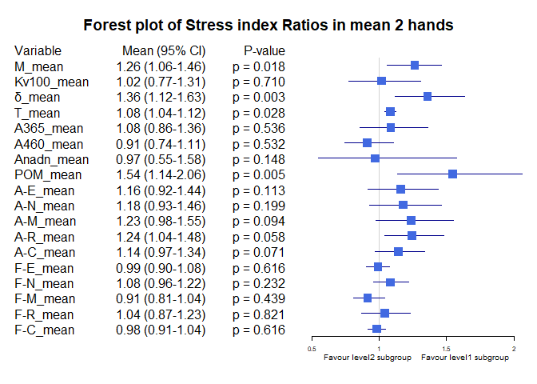<!-- -->

Bảng Gender Ratio, level1 = "male", level2 = "female"


|           |Variable   |Subgroup | Level1_Mean| Level2_Mean|     Ratio|  CI_Lower|  CI_Upper|   P_Value|
|:----------|:----------|:--------|-----------:|-----------:|---------:|---------:|---------:|---------:|
|M_mean     |M_mean     |Gender   |  23.4286778|  21.2177146| 1.1042036| 0.9358730| 1.3166801| 0.1705510|
|Kv100_mean |Kv100_mean |Gender   |  18.6726000|  24.6429545| 0.7577257| 0.6047184| 0.9653108| 0.0357702|
|δ_mean     |δ_mean     |Gender   |   3.7967889|   4.2250126| 0.8986456| 0.7460647| 1.1076730| 0.2632719|
|T_mean     |T_mean     |Gender   |  31.0624889|  31.6360732| 0.9818693| 0.9323372| 1.0333598| 0.8801301|
|A365_mean  |A365_mean  |Gender   |  86.8840741|  87.9116162| 0.9883116| 0.8190511| 1.1984161| 0.8121269|
|A460_mean  |A460_mean  |Gender   |  60.0837037|  58.1351010| 1.0335185| 0.8693659| 1.2181617| 0.8396841|
|Anadn_mean |Anadn_mean |Gender   |   0.9590407|   1.0588005| 0.9057804| 0.5904435| 1.4550820| 0.1305164|
|POM_mean   |POM_mean   |Gender   |   8.9979630|   8.5132702| 1.0569338| 0.8086125| 1.4279501| 0.6292548|
|A-E_mean   |A-E_mean   |Gender   |   1.5117148|   1.4925253| 1.0128571| 0.8038627| 1.2616472| 0.5012202|
|A-N_mean   |A-N_mean   |Gender   |   1.4748667|   1.4623737| 1.0085429| 0.8037470| 1.2437297| 0.6273444|
|A-M_mean   |A-M_mean   |Gender   |   1.1662963|   1.1907197| 0.9794885| 0.7883306| 1.2371427| 0.7385613|
|A-R_mean   |A-R_mean   |Gender   |   0.6840704|   0.7275126| 0.9402866| 0.7854710| 1.1297395| 0.8199758|
|A-C_mean   |A-C_mean   |Gender   |   0.9166741|   0.9374495| 0.9778384| 0.8098346| 1.1855098| 0.9838613|
|F-E_mean   |F-E_mean   |Gender   |   0.0150778|   0.0148902| 1.0126007| 0.9358529| 1.0905225| 0.6669287|
|F-N_mean   |F-N_mean   |Gender   |   0.0345296|   0.0340593| 1.0138078| 0.9125719| 1.1364872| 0.5238654|
|F-M_mean   |F-M_mean   |Gender   |   0.0811307|   0.0820341| 0.9889881| 0.8685847| 1.1216631| 0.7531540|
|F-R_mean   |F-R_mean   |Gender   |   0.3312411|   0.3143119| 1.0538613| 0.9100863| 1.2216128| 0.2654100|
|F-C_mean   |F-C_mean   |Gender   |   1.1428300|   1.1332210| 1.0084794| 0.9467634| 1.0810408| 0.9677019|

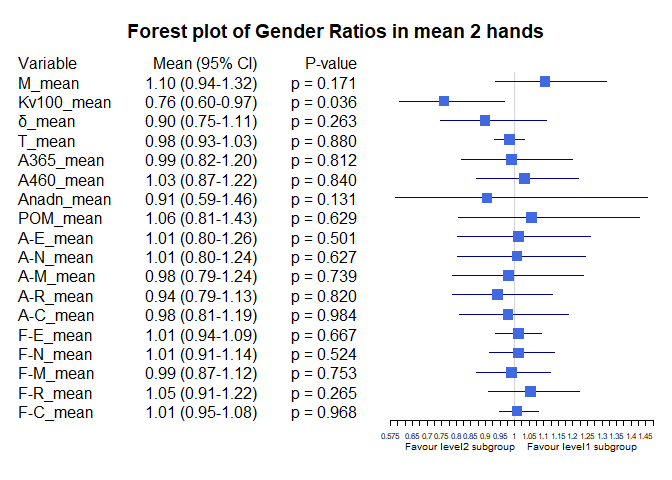<!-- -->


Bảng Smoking ratio, level1 = "Cigarettes, pipe tobacco...", level2 = "Do not smoke"

|           |Variable   |Subgroup | Level1_Mean| Level2_Mean|     Ratio|  CI_Lower|  CI_Upper|   P_Value|
|:----------|:----------|:--------|-----------:|-----------:|---------:|---------:|---------:|---------:|
|M_mean     |M_mean     |Smoking  |  21.1096667|  22.7959336| 0.9260277| 0.6724945| 1.1564801| 0.8912557|
|Kv100_mean |Kv100_mean |Smoking  |  14.4326905|  22.6785443| 0.6364029| 0.5095496| 0.7760495| 0.0168834|
|δ_mean     |δ_mean     |Smoking  |   2.9509881|   4.2026107| 0.7021797| 0.4893837| 0.9666899| 0.0168834|
|T_mean     |T_mean     |Smoking  |  29.9534405|  31.6008477| 0.9478683| 0.8575567| 1.0394055| 0.5025081|
|A365_mean  |A365_mean  |Smoking  |  85.8571429|  87.6385417| 0.9796733| 0.6992673| 1.2817889| 0.8912529|
|A460_mean  |A460_mean  |Smoking  |  65.9904762|  57.7868490| 1.1419636| 0.8100460| 1.4369862| 0.3829585|
|Anadn_mean |Anadn_mean |Smoking  |   1.4245952|   0.9086393| 1.5678336| 0.8513314| 2.6915320| 0.0607923|
|POM_mean   |POM_mean   |Smoking  |   7.8422738|   9.0008503| 0.8712814| 0.4596222| 1.4034747| 0.1502214|
|A-E_mean   |A-E_mean   |Smoking  |   1.0282619|   1.6075755| 0.6396352| 0.3951526| 0.9336438| 0.0056602|
|A-N_mean   |A-N_mean   |Smoking  |   1.1155238|   1.5470313| 0.7210739| 0.4406025| 1.0717549| 0.0215548|
|A-M_mean   |A-M_mean   |Smoking  |   0.8810714|   1.2412826| 0.7098073| 0.4498537| 1.0075465| 0.0201167|
|A-R_mean   |A-R_mean   |Smoking  |   0.5788095|   0.7294961| 0.7934375| 0.5577811| 1.0614273| 0.0833041|
|A-C_mean   |A-C_mean   |Smoking  |   0.7811071|   0.9570417| 0.8161684| 0.6079606| 1.0502142| 0.2019428|
|F-E_mean   |F-E_mean   |Smoking  |   0.0156702|   0.0148514| 1.0551331| 0.9757717| 1.1408121| 0.2850748|
|F-N_mean   |F-N_mean   |Smoking  |   0.0353881|   0.0340993| 1.0377939| 0.8983661| 1.1743914| 0.4118863|
|F-M_mean   |F-M_mean   |Smoking  |   0.0912810|   0.0793762| 1.1499793| 0.9711399| 1.3546880| 0.1871471|
|F-R_mean   |F-R_mean   |Smoking  |   0.3495262|   0.3185121| 1.0973717| 0.9082061| 1.2923869| 0.2657248|
|F-C_mean   |F-C_mean   |Smoking  |   1.2020857|   1.1249132| 1.0686031| 0.9856160| 1.1647458| 0.2514642|

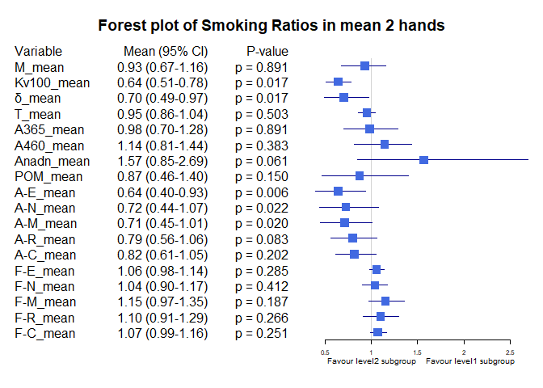<!-- -->


Bảng Smoking ratio, level1 = "Cigarettes, pipe tobacco...", level2 = "Do not smoke"

|           |Variable   |Subgroup | Level1_Mean| Level2_Mean|     Ratio|  CI_Lower|  CI_Upper|   P_Value|
|:----------|:----------|:--------|-----------:|-----------:|---------:|---------:|---------:|---------:|
|M_mean     |M_mean     |Smoking  |  21.1096667|  22.7959336| 0.9260277| 0.6706116| 1.1824736| 0.8912557|
|Kv100_mean |Kv100_mean |Smoking  |  14.4326905|  22.6785443| 0.6364029| 0.5090875| 0.7870932| 0.0168834|
|δ_mean     |δ_mean     |Smoking  |   2.9509881|   4.2026107| 0.7021797| 0.4778241| 0.9904394| 0.0168834|
|T_mean     |T_mean     |Smoking  |  29.9534405|  31.6008477| 0.9478683| 0.8578573| 1.0310294| 0.5025081|
|A365_mean  |A365_mean  |Smoking  |  85.8571429|  87.6385417| 0.9796733| 0.6916402| 1.2635160| 0.8912529|
|A460_mean  |A460_mean  |Smoking  |  65.9904762|  57.7868490| 1.1419636| 0.8337530| 1.4877782| 0.3829585|
|Anadn_mean |Anadn_mean |Smoking  |   1.4245952|   0.9086393| 1.5678336| 0.8098727| 2.7873076| 0.0607923|
|POM_mean   |POM_mean   |Smoking  |   7.8422738|   9.0008503| 0.8712814| 0.4782358| 1.4250831| 0.1502214|
|A-E_mean   |A-E_mean   |Smoking  |   1.0282619|   1.6075755| 0.6396352| 0.3945709| 0.9338969| 0.0056602|
|A-N_mean   |A-N_mean   |Smoking  |   1.1155238|   1.5470313| 0.7210739| 0.4465061| 1.0315200| 0.0215548|
|A-M_mean   |A-M_mean   |Smoking  |   0.8810714|   1.2412826| 0.7098073| 0.4620074| 0.9952964| 0.0201167|
|A-R_mean   |A-R_mean   |Smoking  |   0.5788095|   0.7294961| 0.7934375| 0.5593113| 1.0721151| 0.0833041|
|A-C_mean   |A-C_mean   |Smoking  |   0.7811071|   0.9570417| 0.8161684| 0.6027874| 1.0518455| 0.2019428|
|F-E_mean   |F-E_mean   |Smoking  |   0.0156702|   0.0148514| 1.0551331| 0.9766105| 1.1397110| 0.2850748|
|F-N_mean   |F-N_mean   |Smoking  |   0.0353881|   0.0340993| 1.0377939| 0.8955301| 1.1780555| 0.4118863|
|F-M_mean   |F-M_mean   |Smoking  |   0.0912810|   0.0793762| 1.1499793| 0.9613175| 1.3647842| 0.1871471|
|F-R_mean   |F-R_mean   |Smoking  |   0.3495262|   0.3185121| 1.0973717| 0.9071041| 1.2970961| 0.2657248|
|F-C_mean   |F-C_mean   |Smoking  |   1.2020857|   1.1249132| 1.0686031| 0.9840099| 1.1615513| 0.2514642|

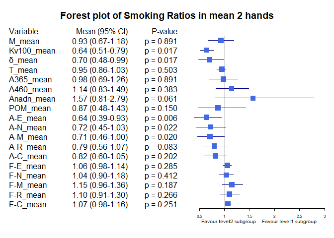<!-- -->

Bảng Hypertension ratio, level1 = "Yes", level2 = "No"

|           |Variable   |Subgroup     | Level1_Mean| Level2_Mean|     Ratio|  CI_Lower|  CI_Upper|   P_Value|
|:----------|:----------|:------------|-----------:|-----------:|---------:|---------:|---------:|---------:|
|M_mean     |M_mean     |Hypertension |  19.6236190|  23.5505102| 0.8332566| 0.6456375| 1.0303837| 0.1893901|
|Kv100_mean |Kv100_mean |Hypertension |  17.1374881|  22.6946886| 0.7551321| 0.5716830| 0.9913220| 0.0513146|
|δ_mean     |δ_mean     |Hypertension |   2.6955952|   4.4504108| 0.6056958| 0.4772141| 0.7418382| 0.0000733|
|T_mean     |T_mean     |Hypertension |  30.1469881|  31.7318538| 0.9500544| 0.8847551| 1.0146379| 0.3919216|
|A365_mean  |A365_mean  |Hypertension |  90.9857143|  85.9678363| 1.0583692| 0.8379861| 1.2754988| 0.5244539|
|A460_mean  |A460_mean  |Hypertension |  73.2928571|  54.0890351| 1.3550409| 1.1216967| 1.6249973| 0.0014877|
|Anadn_mean |Anadn_mean |Hypertension |   1.2385714|   0.9138114| 1.3553906| 0.8281933| 2.1777126| 0.0392489|
|POM_mean   |POM_mean   |Hypertension |   5.6123929|   9.9646667| 0.5632294| 0.4168794| 0.7405380| 0.0026319|
|A-E_mean   |A-E_mean   |Hypertension |   1.0953690|   1.6539956| 0.6622563| 0.4842844| 0.8553284| 0.0048586|
|A-N_mean   |A-N_mean   |Hypertension |   1.0941667|   1.6078918| 0.6804977| 0.4927887| 0.9217323| 0.0045282|
|A-M_mean   |A-M_mean   |Hypertension |   0.8270238|   1.3054313| 0.6335253| 0.4647951| 0.8139599| 0.0017716|
|A-R_mean   |A-R_mean   |Hypertension |   0.5481071|   0.7593129| 0.7218462| 0.5673545| 0.8931693| 0.0033995|
|A-C_mean   |A-C_mean   |Hypertension |   0.7406667|   0.9935468| 0.7454774| 0.5815294| 0.9384606| 0.0012735|
|F-E_mean   |F-E_mean   |Hypertension |   0.0148131|   0.0150667| 0.9831700| 0.8995211| 1.0689155| 0.7736441|
|F-N_mean   |F-N_mean   |Hypertension |   0.0336917|   0.0345661| 0.9747031| 0.8506090| 1.1056755| 0.7141834|
|F-M_mean   |F-M_mean   |Hypertension |   0.0871405|   0.0794396| 1.0969397| 0.9319818| 1.2688405| 0.5049896|
|F-R_mean   |F-R_mean   |Hypertension |   0.3734060|   0.3059056| 1.2206576| 1.0433910| 1.4076713| 0.0135268|
|F-C_mean   |F-C_mean   |Hypertension |   1.1755964|   1.1251950| 1.0447935| 0.9571033| 1.1240708| 0.1366759|

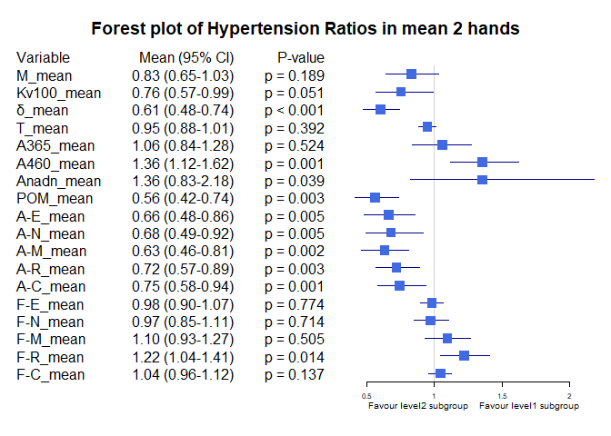<!-- -->

Bảng Obesity ratio, level1 = "Yes", level2 = "No"

|           |Variable   |Subgroup | Level1_Mean| Level2_Mean|     Ratio|  CI_Lower|  CI_Upper|   P_Value|
|:----------|:----------|:--------|-----------:|-----------:|---------:|---------:|---------:|---------:|
|M_mean     |M_mean     |Obesity  |  26.3489792|  22.0526179| 1.1948232| 1.0449860| 1.3592648| 0.2734105|
|Kv100_mean |Kv100_mean |Obesity  |  17.4699688|  21.6246393| 0.8078733| 0.5994929| 1.0368561| 0.4942983|
|δ_mean     |δ_mean     |Obesity  |   4.2083333|   3.9516321| 1.0649608| 0.8247234| 1.3370642| 0.5924687|
|T_mean     |T_mean     |Obesity  |  33.5900104|  31.0440333| 1.0820118| 1.0328657| 1.1308308| 0.0713221|
|A365_mean  |A365_mean  |Obesity  |  99.2645833|  85.9535714| 1.1548628| 0.9878355| 1.3521479| 0.5314012|
|A460_mean  |A460_mean  |Obesity  |  63.7479167|  58.7463095| 1.0851391| 0.8720517| 1.3130440| 0.5259844|
|Anadn_mean |Anadn_mean |Obesity  |   0.6855208|   1.0373298| 0.6608514| 0.4853978| 0.9008707| 0.4942819|
|POM_mean   |POM_mean   |Obesity  |  10.5535729|   8.5916810| 1.2283479| 0.9627336| 1.5832086| 0.1495592|
|A-E_mean   |A-E_mean   |Obesity  |   1.8947188|   1.4588964| 1.2987342| 0.9375344| 1.7418715| 0.1119867|
|A-N_mean   |A-N_mean   |Obesity  |   1.8104167|   1.4306286| 1.2654694| 0.8944895| 1.6658549| 0.1989163|
|A-M_mean   |A-M_mean   |Obesity  |   1.2695833|   1.1660060| 1.0888309| 0.7858954| 1.4053612| 0.5532393|
|A-R_mean   |A-R_mean   |Obesity  |   0.7794063|   0.6936548| 1.1236227| 0.8406160| 1.5162707| 0.6565292|
|A-C_mean   |A-C_mean   |Obesity  |   0.9855000|   0.9186024| 1.0728254| 0.8523340| 1.3086699| 0.4340202|
|F-E_mean   |F-E_mean   |Obesity  |   0.0153740|   0.0149555| 1.0279819| 0.9201743| 1.1280866| 0.6681135|
|F-N_mean   |F-N_mean   |Obesity  |   0.0332844|   0.0344502| 0.9661581| 0.8220412| 1.1632697| 0.5258797|
|F-M_mean   |F-M_mean   |Obesity  |   0.0742125|   0.0823473| 0.9012139| 0.7901740| 1.0209004| 0.7348688|
|F-R_mean   |F-R_mean   |Obesity  |   0.3571073|   0.3203040| 1.1149010| 0.8764194| 1.4068875| 0.4029313|
|F-C_mean   |F-C_mean   |Obesity  |   1.1845344|   1.1335338| 1.0449925| 0.9315103| 1.1589804| 0.3913493|

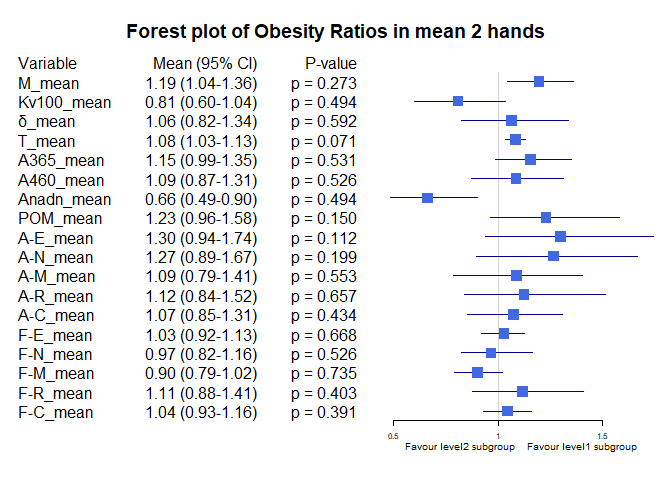<!-- -->

Bảng Race ratio, level1 = "White", level2 = "Asian or Asian British"

|           |Variable   |Subgroup | Level1_Mean| Level2_Mean|     Ratio|  CI_Lower|  CI_Upper|   P_Value|
|:----------|:----------|:--------|-----------:|-----------:|---------:|---------:|---------:|---------:|
|M_mean     |M_mean     |Race     |  26.9520952|  21.1070615| 1.2769231| 1.1081477| 1.4816311| 0.0502243|
|Kv100_mean |Kv100_mean |Race     |  21.5091190|  21.3712596| 1.0064507| 0.7465103| 1.3311148| 0.8119168|
|δ_mean     |δ_mean     |Race     |   5.2153571|   3.6522281| 1.4279933| 1.1718189| 1.7187034| 0.0019788|
|T_mean     |T_mean     |Race     |  32.8789048|  30.7926680| 1.0677511| 1.0229835| 1.1126564| 0.0737673|
|A365_mean  |A365_mean  |Race     | 107.2821429|  86.1051913| 1.2459428| 1.0719748| 1.4482834| 0.0737550|
|A460_mean  |A460_mean  |Race     |  57.6476190|  61.8550546| 0.9319791| 0.7964050| 1.0666037| 0.4965357|
|Anadn_mean |Anadn_mean |Race     |   0.5639881|   1.0555970| 0.5342835| 0.4033603| 0.7002756| 0.0009755|
|POM_mean   |POM_mean   |Race     |  13.9496905|   7.6299276| 1.8282861| 1.3921483| 2.3859879| 0.0002755|
|A-E_mean   |A-E_mean   |Race     |   2.0671905|   1.3764727| 1.5018028| 1.1689235| 1.8850584| 0.0043903|
|A-N_mean   |A-N_mean   |Race     |   2.0586905|   1.3097650| 1.5718014| 1.2566552| 1.8972886| 0.0016448|
|A-M_mean   |A-M_mean   |Race     |   1.5689881|   1.0735451| 1.4615018| 1.1851991| 1.7812230| 0.0025965|
|A-R_mean   |A-R_mean   |Race     |   0.8769524|   0.6581762| 1.3323975| 1.0710096| 1.6577732| 0.0183081|
|A-C_mean   |A-C_mean   |Race     |   1.1406429|   0.8606093| 1.3253899| 1.1017333| 1.5708998| 0.0095872|
|F-E_mean   |F-E_mean   |Race     |   0.0161214|   0.0147898| 1.0900403| 1.0149909| 1.1814678| 0.0701785|
|F-N_mean   |F-N_mean   |Race     |   0.0311000|   0.0348999| 0.8911210| 0.8047169| 0.9899369| 0.1803419|
|F-M_mean   |F-M_mean   |Race     |   0.0761988|   0.0836430| 0.9110001| 0.8007331| 1.0574702| 0.5485620|
|F-R_mean   |F-R_mean   |Race     |   0.2951833|   0.3293209| 0.8963395| 0.7544737| 1.0799553| 0.1918141|
|F-C_mean   |F-C_mean   |Race     |   1.0804810|   1.1534821| 0.9367124| 0.8708478| 1.0205742| 0.0927960|

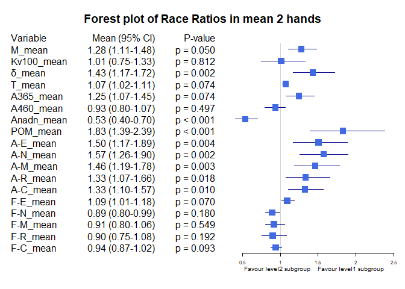<!-- -->


Bảng Race ratio, level1 = "Black, African, Caribbean or Black Bristish", level2 = "Asian or Asian British"

|           |Variable   |Subgroup | Level1_Mean| Level2_Mean|     Ratio|  CI_Lower|  CI_Upper|   P_Value|
|:----------|:----------|:--------|-----------:|-----------:|---------:|---------:|---------:|---------:|
|M_mean     |M_mean     |Race     |  29.8716667|  21.1070615| 1.4152452| 1.1358229| 1.7230749| 0.1196230|
|Kv100_mean |Kv100_mean |Race     |  16.2366667|  21.3712596| 0.7597431| 0.4189363| 1.0411674| 0.5675139|
|δ_mean     |δ_mean     |Race     |   4.8266667|   3.6522281| 1.3215677| 0.7573318| 2.0090494| 0.3248092|
|T_mean     |T_mean     |Race     |  34.3816667|  30.7926680| 1.1165537| 1.0705298| 1.1646093| 0.0654461|
|A365_mean  |A365_mean  |Race     |  18.8333333|  86.1051913| 0.2187247| 0.0355439| 0.3736131| 0.0157774|
|A460_mean  |A460_mean  |Race     |  14.0000000|  61.8550546| 0.2263356| 0.1805809| 0.2697493| 0.0057143|
|Anadn_mean |Anadn_mean |Race     |   1.9366667|   1.0555970| 1.8346648| 0.7604908| 3.4835337| 0.0420663|
|POM_mean   |POM_mean   |Race     |   8.3750000|   7.6299276| 1.0976513| 0.3045875| 2.0564333| 0.9240876|
|A-E_mean   |A-E_mean   |Race     |   1.4583333|   1.3764727| 1.0594713| 0.5379573| 1.4981514| 0.6113142|
|A-N_mean   |A-N_mean   |Race     |   1.9700000|   1.3097650| 1.5040866| 0.6998325| 2.3164657| 0.2662794|
|A-M_mean   |A-M_mean   |Race     |   1.4416667|   1.0735451| 1.3429028| 0.6464554| 1.8731453| 0.3406493|
|A-R_mean   |A-R_mean   |Race     |   0.7883333|   0.6581762| 1.1977542| 0.9838815| 1.4030668| 0.3406106|
|A-C_mean   |A-C_mean   |Race     |   1.2400000|   0.8606093| 1.4408397| 1.0325549| 1.9017007| 0.1018773|
|F-E_mean   |F-E_mean   |Race     |   0.0140000|   0.0147898| 0.9466013| 0.7879606| 1.0804867| 0.6676734|
|F-N_mean   |F-N_mean   |Race     |   0.0378333|   0.0348999| 1.0840539| 0.9291135| 1.2346379| 0.4648688|
|F-M_mean   |F-M_mean   |Race     |   0.0630000|   0.0836430| 0.7532008| 0.6905402| 0.8214107| 0.0715067|
|F-R_mean   |F-R_mean   |Race     |   0.3523333|   0.3293209| 1.0698784| 0.6376811| 1.4051833| 0.8857982|
|F-C_mean   |F-C_mean   |Race     |   1.1115000|   1.1534821| 0.9636040| 0.8878866| 1.0510636| 0.5778788|

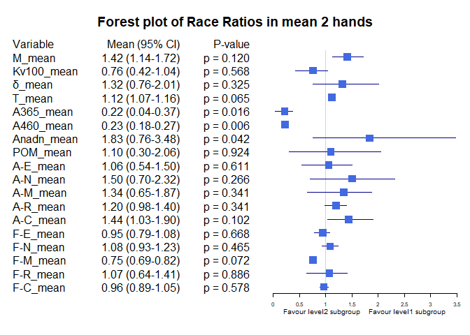<!-- -->

Bảng BMI ratio, level1 = "BMI <25", level2 = "BMI [25-30)"

|           |Variable   |Subgroup  | Level1_Mean| Level2_Mean|     Ratio|  CI_Lower|  CI_Upper|   P_Value|
|:----------|:----------|:---------|-----------:|-----------:|---------:|---------:|---------:|---------:|
|M_mean     |M_mean     |BMI_25_30 |  19.3407636|  26.3714969| 0.7333965| 0.6094558| 0.8878451| 0.0014458|
|Kv100_mean |Kv100_mean |BMI_25_30 |  24.0308760|  17.7924846| 1.3506195| 1.0244110| 1.7810472| 0.0136159|
|δ_mean     |δ_mean     |BMI_25_30 |   3.9597984|   3.9386265| 1.0053755| 0.7896130| 1.2532960| 0.8951398|
|T_mean     |T_mean     |BMI_25_30 |  30.2635233|  32.2870679| 0.9373265| 0.8863368| 0.9880261| 0.0114094|
|A365_mean  |A365_mean  |BMI_25_30 |  85.6666667|  86.4104938| 0.9913919| 0.8000633| 1.2120337| 0.6994131|
|A460_mean  |A460_mean  |BMI_25_30 |  59.0782946|  58.2175926| 1.0147842| 0.8479766| 1.2035145| 0.9087310|
|Anadn_mean |Anadn_mean |BMI_25_30 |   1.0973101|   0.9418056| 1.1651132| 0.7100391| 1.8355423| 0.8611143|
|POM_mean   |POM_mean   |BMI_25_30 |   7.4457597|  10.4166667| 0.7147929| 0.5145348| 1.0085819| 0.0408807|
|A-E_mean   |A-E_mean   |BMI_25_30 |   1.4580000|   1.4603241| 0.9984085| 0.7786147| 1.2757467| 0.9663156|
|A-N_mean   |A-N_mean   |BMI_25_30 |   1.3953062|   1.4868827| 0.9384104| 0.7254596| 1.2301797| 0.7767616|
|A-M_mean   |A-M_mean   |BMI_25_30 |   1.1317054|   1.2206327| 0.9271466| 0.7216183| 1.2189263| 0.6994231|
|A-R_mean   |A-R_mean   |BMI_25_30 |   0.6471512|   0.7677160| 0.8429564| 0.6982150| 1.0224784| 0.1210187|
|A-C_mean   |A-C_mean   |BMI_25_30 |   0.8748760|   0.9882407| 0.8852863| 0.7275014| 1.0735564| 0.3283968|
|F-E_mean   |F-E_mean   |BMI_25_30 |   0.0148849|   0.0150679| 0.9878538| 0.9081355| 1.0852400| 0.8609215|
|F-N_mean   |F-N_mean   |BMI_25_30 |   0.0338318|   0.0354352| 0.9547511| 0.8523585| 1.0713545| 0.3402734|
|F-M_mean   |F-M_mean   |BMI_25_30 |   0.0841380|   0.0794954| 1.0584011| 0.9198293| 1.2192434| 0.3933794|
|F-R_mean   |F-R_mean   |BMI_25_30 |   0.3081384|   0.3396790| 0.9071457| 0.7749267| 1.0580714| 0.1244004|
|F-C_mean   |F-C_mean   |BMI_25_30 |   1.1419368|   1.1201512| 1.0194488| 0.9585385| 1.0915577| 0.9374227|

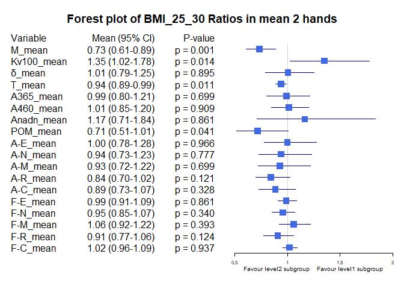<!-- -->

Bảng BMI ratio, level1 = "BMI >=30", level2 = "BMI [25-30)"

|           |Variable   |Subgroup  | Level1_Mean| Level2_Mean|     Ratio|  CI_Lower| CI_Upper|   P_Value|
|:----------|:----------|:---------|-----------:|-----------:|---------:|---------:|--------:|---------:|
|M_mean     |M_mean     |BMI_25_30 |  26.3489792|  26.3714969| 0.9991461| 0.8676350| 1.172163| 0.6299203|
|Kv100_mean |Kv100_mean |BMI_25_30 |  17.4699688|  17.7924846| 0.9818735| 0.6825080| 1.374638| 0.6027029|
|δ_mean     |δ_mean     |BMI_25_30 |   4.2083333|   3.9386265| 1.0684774| 0.8100943| 1.393652| 0.4993064|
|T_mean     |T_mean     |BMI_25_30 |  33.5900104|  32.2870679| 1.0403549| 0.9869761| 1.095320| 0.4057995|
|A365_mean  |A365_mean  |BMI_25_30 |  99.2645833|  86.4104938| 1.1487561| 0.9665205| 1.390171| 0.3457110|
|A460_mean  |A460_mean  |BMI_25_30 |  63.7479167|  58.2175926| 1.0949940| 0.8609393| 1.342253| 0.4917291|
|Anadn_mean |Anadn_mean |BMI_25_30 |   0.6855208|   0.9418056| 0.7278794| 0.4831931| 1.059328| 0.6299203|
|POM_mean   |POM_mean   |BMI_25_30 |  10.5535729|  10.4166667| 1.0131430| 0.7511536| 1.380613| 0.6576328|
|A-E_mean   |A-E_mean   |BMI_25_30 |   1.8947188|   1.4603241| 1.2974646| 0.9066677| 1.776207| 0.1789175|
|A-N_mean   |A-N_mean   |BMI_25_30 |   1.8104167|   1.4868827| 1.2175921| 0.8408849| 1.644477| 0.3874219|
|A-M_mean   |A-M_mean   |BMI_25_30 |   1.2695833|   1.2206327| 1.0401027| 0.7508528| 1.409828| 0.8136509|
|A-R_mean   |A-R_mean   |BMI_25_30 |   0.7794063|   0.7677160| 1.0152272| 0.7536820| 1.376387| 0.9217443|
|A-C_mean   |A-C_mean   |BMI_25_30 |   0.9855000|   0.9882407| 0.9972266| 0.7844049| 1.260509| 0.8596741|
|F-E_mean   |F-E_mean   |BMI_25_30 |   0.0153740|   0.0150679| 1.0203119| 0.9166563| 1.136470| 0.9216841|
|F-N_mean   |F-N_mean   |BMI_25_30 |   0.0332844|   0.0354352| 0.9393030| 0.7846914| 1.158588| 0.4204746|
|F-M_mean   |F-M_mean   |BMI_25_30 |   0.0742125|   0.0794954| 0.9335449| 0.7972339| 1.080232| 0.9371832|
|F-R_mean   |F-R_mean   |BMI_25_30 |   0.3571073|   0.3396790| 1.0513081| 0.8263180| 1.326693| 0.7679781|
|F-C_mean   |F-C_mean   |BMI_25_30 |   1.1845344|   1.1201512| 1.0574772| 0.9325845| 1.188094| 0.3159290|

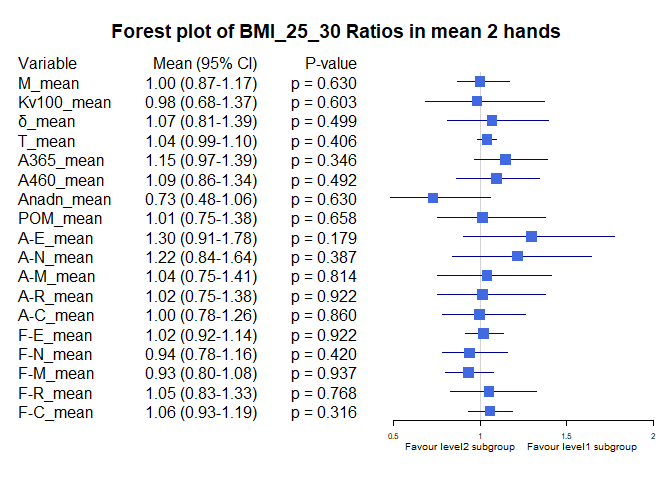<!-- -->

Bảng Age_stage ratio, level1 = "Age <30", level2= "Age [30-40)"


|           |Variable   |Subgroup  | Level1_Mean| Level2_Mean|     Ratio|  CI_Lower|  CI_Upper|   P_Value|
|:----------|:----------|:---------|-----------:|-----------:|---------:|---------:|---------:|---------:|
|M_mean     |M_mean     |Age_stage |  19.4150321|  25.2926944| 0.7676142| 0.6006565| 0.9349092| 0.0778227|
|Kv100_mean |Kv100_mean |Age_stage |  25.5942949|  19.7702071| 1.2945891| 0.9918883| 1.6705176| 0.0549122|
|δ_mean     |δ_mean     |Age_stage |   3.8714744|   4.4582955| 0.8683755| 0.6950669| 1.0794690| 0.1730923|
|T_mean     |T_mean     |Age_stage |  30.5252885|  32.2174268| 0.9474775| 0.8972756| 0.9970732| 0.0702111|
|A365_mean  |A365_mean  |Age_stage |  81.0320513|  95.7939394| 0.8458996| 0.6449891| 1.0365990| 0.3438253|
|A460_mean  |A460_mean  |Age_stage |  51.7467949|  62.8012626| 0.8239770| 0.6671827| 1.0031698| 0.0930380|
|Anadn_mean |Anadn_mean |Age_stage |   1.0597436|   0.7796086| 1.3593278| 0.8668292| 2.0119337| 0.6359821|
|POM_mean   |POM_mean   |Age_stage |   7.6075962|  10.8500581| 0.7011572| 0.4881613| 0.9753335| 0.0276857|
|A-E_mean   |A-E_mean   |Age_stage |   1.3982372|   1.6922424| 0.8262629| 0.6583864| 1.0486532| 0.1106028|
|A-N_mean   |A-N_mean   |Age_stage |   1.3865064|   1.5968182| 0.8682932| 0.6762015| 1.1071728| 0.4053471|
|A-M_mean   |A-M_mean   |Age_stage |   1.1463462|   1.2777399| 0.8971671| 0.7032043| 1.1443419| 0.4452295|
|A-R_mean   |A-R_mean   |Age_stage |   0.6820192|   0.7322045| 0.9314600| 0.7622979| 1.1339243| 0.8069987|
|A-C_mean   |A-C_mean   |Age_stage |   0.9086859|   0.9473687| 0.9591682| 0.7647127| 1.1796318| 0.2490106|
|F-E_mean   |F-E_mean   |Age_stage |   0.0148526|   0.0149265| 0.9950457| 0.9128740| 1.0955685| 0.8784296|
|F-N_mean   |F-N_mean   |Age_stage |   0.0374455|   0.0325614| 1.1499983| 1.0266417| 1.2804493| 0.0385173|
|F-M_mean   |F-M_mean   |Age_stage |   0.0849519|   0.0780376| 1.0886021| 0.9305780| 1.2720178| 0.3779338|
|F-R_mean   |F-R_mean   |Age_stage |   0.2850160|   0.3289452| 0.8664544| 0.7201766| 1.0339505| 0.0581977|
|F-C_mean   |F-C_mean   |Age_stage |   1.1218942|   1.1690412| 0.9596704| 0.8920390| 1.0313441| 0.2743406|

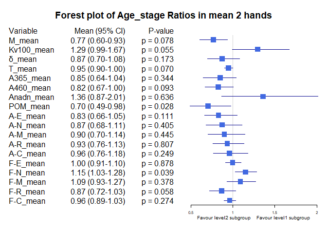<!-- -->

Bảng Age_stage ratio, level1 = "Age <30", level2= "Age [40-50)"


|           |Variable   |Subgroup  | Level1_Mean| Level2_Mean|     Ratio|  CI_Lower|  CI_Upper|   P_Value|
|:----------|:----------|:---------|-----------:|-----------:|---------:|---------:|---------:|---------:|
|M_mean     |M_mean     |Age_stage |  19.4150321|  23.4781026| 0.8269421| 0.6223243| 1.0996840| 0.2162958|
|Kv100_mean |Kv100_mean |Age_stage |  25.5942949|  12.6213590| 2.0278557| 1.5372907| 2.6751940| 0.0002978|
|δ_mean     |δ_mean     |Age_stage |   3.8714744|   2.8460641| 1.3602906| 1.0029710| 2.0028102| 0.0760885|
|T_mean     |T_mean     |Age_stage |  30.5252885|  31.3444744| 0.9738651| 0.8942518| 1.0723837| 0.2678025|
|A365_mean  |A365_mean  |Age_stage |  81.0320513|  79.5384615| 1.0187782| 0.7234118| 1.5264248| 0.9524843|
|A460_mean  |A460_mean  |Age_stage |  51.7467949|  65.9512821| 0.7846215| 0.5860971| 1.0578673| 0.1177408|
|Anadn_mean |Anadn_mean |Age_stage |   1.0597436|   1.5545641| 0.6816982| 0.3484876| 1.5614748| 0.0923086|
|POM_mean   |POM_mean   |Age_stage |   7.6075962|   6.4109103| 1.1866640| 0.7865336| 1.8383334| 0.6066367|
|A-E_mean   |A-E_mean   |Age_stage |   1.3982372|   1.0862051| 1.2872681| 0.9068038| 1.9241246| 0.2084201|
|A-N_mean   |A-N_mean   |Age_stage |   1.3865064|   1.2163333| 1.1399066| 0.7997965| 1.8187646| 0.4705009|
|A-M_mean   |A-M_mean   |Age_stage |   1.1463462|   0.9415385| 1.2175245| 0.8310986| 1.9126087| 0.2944442|
|A-R_mean   |A-R_mean   |Age_stage |   0.6820192|   0.6160256| 1.1071280| 0.8385401| 1.5286286| 0.4125766|
|A-C_mean   |A-C_mean   |Age_stage |   0.9086859|   0.8335000| 1.0902050| 0.7821746| 1.5951121| 0.7885787|
|F-E_mean   |F-E_mean   |Age_stage |   0.0148526|   0.0151449| 0.9806992| 0.8705677| 1.1180543| 0.7655324|
|F-N_mean   |F-N_mean   |Age_stage |   0.0374455|   0.0315333| 1.1874898| 1.0103188| 1.3788943| 0.0382239|
|F-M_mean   |F-M_mean   |Age_stage |   0.0849519|   0.0810718| 1.0478604| 0.8742637| 1.2718799| 0.8690399|
|F-R_mean   |F-R_mean   |Age_stage |   0.2850160|   0.3626821| 0.7858564| 0.6356438| 0.9715216| 0.0456793|
|F-C_mean   |F-C_mean   |Age_stage |   1.1218942|   1.1472462| 0.9779019| 0.8788240| 1.0854887| 0.7093546|

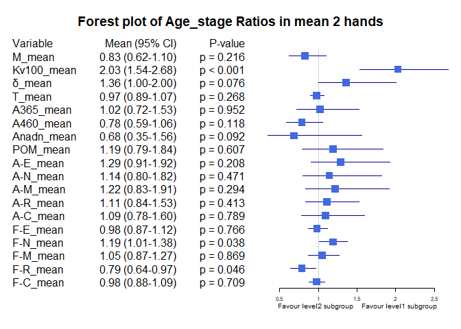<!-- -->

Bảng Age_stage ratio, level1 = "Age <30", level2= "Age >=50"


|           |Variable   |Subgroup  | Level1_Mean| Level2_Mean|     Ratio|  CI_Lower|  CI_Upper|   P_Value|
|:----------|:----------|:---------|-----------:|-----------:|---------:|---------:|---------:|---------:|
|M_mean     |M_mean     |Age_stage |  19.4150321|  18.3016667| 1.0608341| 0.7109825| 1.8246353| 0.9807390|
|Kv100_mean |Kv100_mean |Age_stage |  25.5942949|  28.5897222| 0.8952271| 0.5671836| 1.5640075| 0.7241534|
|δ_mean     |δ_mean     |Age_stage |   3.8714744|   4.2500000| 0.9109351| 0.6265372| 1.5508730| 0.8323953|
|T_mean     |T_mean     |Age_stage |  30.5252885|  29.5819444| 1.0318892| 0.9103563| 1.1902458| 0.6546560|
|A365_mean  |A365_mean  |Age_stage |  81.0320513|  84.8055556| 0.9555040| 0.6806880| 1.3861181| 0.9437890|
|A460_mean  |A460_mean  |Age_stage |  51.7467949|  57.8333333| 0.8947573| 0.6131107| 1.4120211| 0.7905541|
|Anadn_mean |Anadn_mean |Age_stage |   1.0597436|   0.7679167| 1.3800242| 0.8959889| 1.9993002| 0.6121610|
|POM_mean   |POM_mean   |Age_stage |   7.6075962|   7.7758333| 0.9783641| 0.5979076| 1.9005617| 0.8692882|
|A-E_mean   |A-E_mean   |Age_stage |   1.3982372|   1.8269444| 0.7653419| 0.4601713| 1.7014885| 0.7597551|
|A-N_mean   |A-N_mean   |Age_stage |   1.3865064|   1.6784722| 0.8260526| 0.5163084| 1.6291510| 0.6890791|
|A-M_mean   |A-M_mean   |Age_stage |   1.1463462|   1.2611111| 0.9089970| 0.6088510| 1.5892429| 0.8692882|
|A-R_mean   |A-R_mean   |Age_stage |   0.6820192|   0.8145833| 0.8372615| 0.6191576| 1.2373072| 0.3813739|
|A-C_mean   |A-C_mean   |Age_stage |   0.9086859|   1.0769444| 0.8437630| 0.6105260| 1.1242722| 0.2565033|
|F-E_mean   |F-E_mean   |Age_stage |   0.0148526|   0.0157083| 0.9455213| 0.8363854| 1.0735655| 0.3840353|
|F-N_mean   |F-N_mean   |Age_stage |   0.0374455|   0.0366250| 1.0224031| 0.8549332| 1.2207058| 0.9614645|
|F-M_mean   |F-M_mean   |Age_stage |   0.0849519|   0.0866806| 0.9800574| 0.7752752| 1.2775221| 0.9419530|
|F-R_mean   |F-R_mean   |Age_stage |   0.2850160|   0.3829444| 0.7442751| 0.6252566| 0.9009075| 0.0236520|
|F-C_mean   |F-C_mean   |Age_stage |   1.1218942|   1.0269722| 1.0924290| 0.9315924| 1.2884673| 0.3843847|

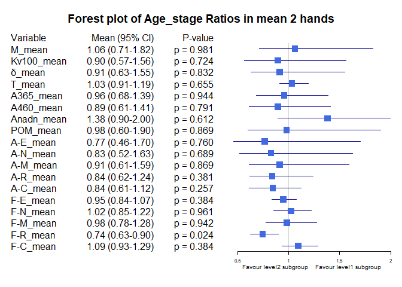<!-- -->

Bảng Age_stage ratio, level1 = "Age [30-40)", level2= "Age >=50"


|           |Variable   |Subgroup  | Level1_Mean| Level2_Mean|     Ratio|  CI_Lower|  CI_Upper|   P_Value|
|:----------|:----------|:---------|-----------:|-----------:|---------:|---------:|---------:|---------:|
|M_mean     |M_mean     |Age_stage |  25.2926944|  18.3016667| 1.3819886| 0.9544945| 2.4471517| 0.2058266|
|Kv100_mean |Kv100_mean |Age_stage |  19.7702071|  28.5897222| 0.6915145| 0.4424369| 1.1768589| 0.3108094|
|δ_mean     |δ_mean     |Age_stage |   4.4582955|   4.2500000| 1.0490107| 0.7223482| 1.8487942| 0.8944061|
|T_mean     |T_mean     |Age_stage |  32.2174268|  29.5819444| 1.0890909| 0.9630924| 1.2483335| 0.3493784|
|A365_mean  |A365_mean  |Age_stage |  95.7939394|  84.8055556| 1.1295715| 0.8810738| 1.5681094| 0.6901766|
|A460_mean  |A460_mean  |Age_stage |  62.8012626|  57.8333333| 1.0859008| 0.7806564| 1.6190485| 0.5080622|
|Anadn_mean |Anadn_mean |Age_stage |   0.7796086|   0.7679167| 1.0152255| 0.8049370| 1.3128398| 0.5054479|
|POM_mean   |POM_mean   |Age_stage |  10.8500581|   7.7758333| 1.3953563| 0.8862892| 2.6575685| 0.1841702|
|A-E_mean   |A-E_mean   |Age_stage |   1.6922424|   1.8269444| 0.9262692| 0.5708744| 2.0876839| 0.9844714|
|A-N_mean   |A-N_mean   |Age_stage |   1.5968182|   1.6784722| 0.9513522| 0.6235020| 1.8707934| 0.9534353|
|A-M_mean   |A-M_mean   |Age_stage |   1.2777399|   1.2611111| 1.0131858| 0.6726709| 1.8838291| 0.9848769|
|A-R_mean   |A-R_mean   |Age_stage |   0.7322045|   0.8145833| 0.8988700| 0.6646556| 1.3297904| 0.4576410|
|A-C_mean   |A-C_mean   |Age_stage |   0.9473687|   1.0769444| 0.8796820| 0.6839055| 1.1655761| 0.6128216|
|F-E_mean   |F-E_mean   |Age_stage |   0.0149265|   0.0157083| 0.9502291| 0.8491512| 1.0850994| 0.3292650|
|F-N_mean   |F-N_mean   |Age_stage |   0.0325614|   0.0366250| 0.8890475| 0.7514407| 1.0760638| 0.2507306|
|F-M_mean   |F-M_mean   |Age_stage |   0.0780376|   0.0866806| 0.9002899| 0.7115692| 1.1772036| 0.4828790|
|F-R_mean   |F-R_mean   |Age_stage |   0.3289452|   0.3829444| 0.8589894| 0.7336727| 0.9972173| 0.2645738|
|F-C_mean   |F-C_mean   |Age_stage |   1.1690412|   1.0269722| 1.1383377| 0.9773719| 1.3360315| 0.0827614|

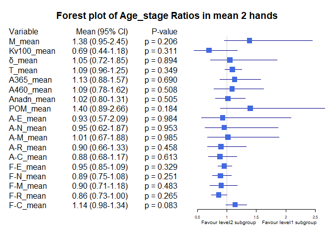<!-- -->

Bảng Age_stage ratio, level1 = "Age [30-40)", level2= "Age [40-50)"


|           |Variable   |Subgroup  | Level1_Mean| Level2_Mean|     Ratio|  CI_Lower| CI_Upper|   P_Value|
|:----------|:----------|:---------|-----------:|-----------:|---------:|---------:|--------:|---------:|
|M_mean     |M_mean     |Age_stage |  25.2926944|  23.4781026| 1.0772887| 0.8819476| 1.430459| 0.8452587|
|Kv100_mean |Kv100_mean |Age_stage |  19.7702071|  12.6213590| 1.5664087| 1.2361960| 2.012618| 0.0143726|
|δ_mean     |δ_mean     |Age_stage |   4.4582955|   2.8460641| 1.5664775| 1.1714339| 2.208025| 0.0056824|
|T_mean     |T_mean     |Age_stage |  32.2174268|  31.3444744| 1.0278503| 0.9528987| 1.140527| 0.6126951|
|A365_mean  |A365_mean  |Age_stage |  95.7939394|  79.5384615| 1.2043725| 0.9400073| 1.743142| 0.4207578|
|A460_mean  |A460_mean  |Age_stage |  62.8012626|  65.9512821| 0.9522372| 0.7418374| 1.286644| 0.5997795|
|Anadn_mean |Anadn_mean |Age_stage |   0.7796086|   1.5545641| 0.5014966| 0.2782163| 1.079980| 0.0392554|
|POM_mean   |POM_mean   |Age_stage |  10.8500581|   6.4109103| 1.6924364| 1.1765346| 2.623619| 0.0091690|
|A-E_mean   |A-E_mean   |Age_stage |   1.6922424|   1.0862051| 1.5579400| 1.1152656| 2.258604| 0.0168094|
|A-N_mean   |A-N_mean   |Age_stage |   1.5968182|   1.2163333| 1.3128130| 0.9473772| 1.995997| 0.0971140|
|A-M_mean   |A-M_mean   |Age_stage |   1.2777399|   0.9415385| 1.3570767| 0.9849862| 2.111703| 0.0769370|
|A-R_mean   |A-R_mean   |Age_stage |   0.7322045|   0.6160256| 1.1885943| 0.8861489| 1.662970| 0.2885488|
|A-C_mean   |A-C_mean   |Age_stage |   0.9473687|   0.8335000| 1.1366151| 0.8794828| 1.633811| 0.2550897|
|F-E_mean   |F-E_mean   |Age_stage |   0.0149265|   0.0151449| 0.9855821| 0.8774670| 1.105804| 0.9902548|
|F-N_mean   |F-N_mean   |Age_stage |   0.0325614|   0.0315333| 1.0326014| 0.8931109| 1.204633| 0.8356462|
|F-M_mean   |F-M_mean   |Age_stage |   0.0780376|   0.0810718| 0.9625743| 0.8115479| 1.134543| 0.3341712|
|F-R_mean   |F-R_mean   |Age_stage |   0.3289452|   0.3626821| 0.9069795| 0.7678166| 1.101686| 0.3202884|
|F-C_mean   |F-C_mean   |Age_stage |   1.1690412|   1.1472462| 1.0189977| 0.9245424| 1.116559| 0.5656505|

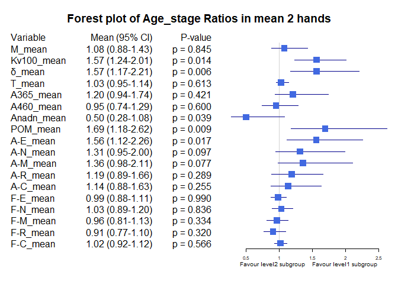<!-- -->

Bảng Age_stage ratio, level1 = "Age [40-50)", level2= "Age >=50"


|           |Variable   |Subgroup  | Level1_Mean| Level2_Mean|     Ratio|  CI_Lower|  CI_Upper|   P_Value|
|:----------|:----------|:---------|-----------:|-----------:|---------:|---------:|---------:|---------:|
|M_mean     |M_mean     |Age_stage |  23.4781026|  18.3016667| 1.2828396| 0.8545391| 2.2937304| 0.3676102|
|Kv100_mean |Kv100_mean |Age_stage |  12.6213590|  28.5897222| 0.4414649| 0.2861971| 0.7432258| 0.0364883|
|δ_mean     |δ_mean     |Age_stage |   2.8460641|   4.2500000| 0.6696621| 0.4142750| 1.1473742| 0.1791243|
|T_mean     |T_mean     |Age_stage |  31.3444744|  29.5819444| 1.0595813| 0.9098252| 1.2294336| 0.7653693|
|A365_mean  |A365_mean  |Age_stage |  79.5384615|  84.8055556| 0.9378921| 0.6176928| 1.4432427| 0.9660917|
|A460_mean  |A460_mean  |Age_stage |  65.9512821|  57.8333333| 1.1403680| 0.7462930| 1.9644431| 0.2361962|
|Anadn_mean |Anadn_mean |Age_stage |   1.5545641|   0.7679167| 2.0243917| 0.9620699| 3.4589980| 0.3802461|
|POM_mean   |POM_mean   |Age_stage |   6.4109103|   7.7758333| 0.8244660| 0.4476331| 1.6023287| 0.4670500|
|A-E_mean   |A-E_mean   |Age_stage |   1.0862051|   1.8269444| 0.5945474| 0.3431595| 1.3371561| 0.2818075|
|A-N_mean   |A-N_mean   |Age_stage |   1.2163333|   1.6784722| 0.7246669| 0.3924935| 1.5299977| 0.3676102|
|A-M_mean   |A-M_mean   |Age_stage |   0.9415385|   1.2611111| 0.7465944| 0.4237204| 1.4520012| 0.3228660|
|A-R_mean   |A-R_mean   |Age_stage |   0.6160256|   0.8145833| 0.7562463| 0.4856669| 1.1892771| 0.2440660|
|A-C_mean   |A-C_mean   |Age_stage |   0.8335000|   1.0769444| 0.7739489| 0.5203550| 1.1236366| 0.2818075|
|F-E_mean   |F-E_mean   |Age_stage |   0.0151449|   0.0157083| 0.9641298| 0.8288149| 1.1190023| 0.7254898|
|F-N_mean   |F-N_mean   |Age_stage |   0.0315333|   0.0366250| 0.8609784| 0.6984821| 1.0513629| 0.1467885|
|F-M_mean   |F-M_mean   |Age_stage |   0.0810718|   0.0866806| 0.9352939| 0.7265386| 1.2441291| 0.8262940|
|F-R_mean   |F-R_mean   |Age_stage |   0.3626821|   0.3829444| 0.9470879| 0.7771060| 1.1600365| 0.8606352|
|F-C_mean   |F-C_mean   |Age_stage |   1.1472462|   1.0269722| 1.1171151| 0.9457725| 1.3452791| 0.1871481|

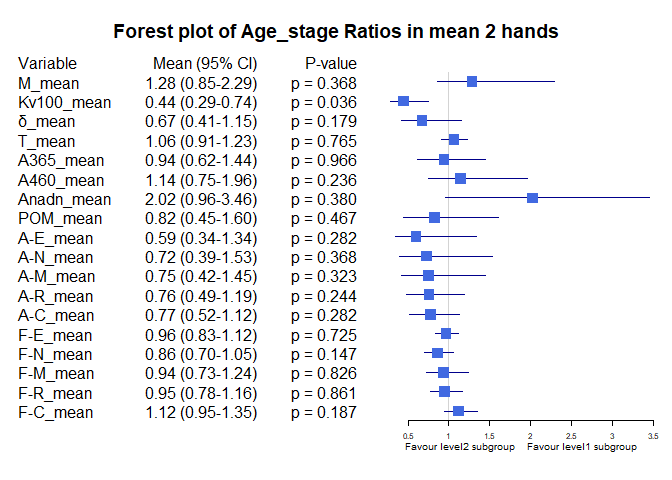<!-- -->
