## Load bộ số liệu và các packages


```
## ── Attaching core tidyverse packages ──────────────────────── tidyverse 2.0.0 ──
## ✔ dplyr     1.1.3     ✔ readr     2.1.4
## ✔ forcats   1.0.0     ✔ stringr   1.5.0
## ✔ ggplot2   3.4.3     ✔ tibble    3.2.1
## ✔ lubridate 1.9.2     ✔ tidyr     1.3.0
## ✔ purrr     1.0.2     
## ── Conflicts ────────────────────────────────────────── tidyverse_conflicts() ──
## ✖ dplyr::filter() masks stats::filter()
## ✖ dplyr::lag()    masks stats::lag()
## ℹ Use the conflicted package (<http://conflicted.r-lib.org/>) to force all conflicts to become errors
## 
## Attaching package: 'rstatix'
## 
## 
## The following object is masked from 'package:stats':
## 
##     filter
## 
## 
## Loading required package: grid
## 
## Loading required package: checkmate
## 
## Loading required package: abind
```

## So sánh khác biệt về ratio của chỉ số Stress vs non stress theo các biến


Hàm để tạo bảng tổng hợp kết quả và p-value


Hàm sắp xếp các cột theo thứ tự


Hàm vẽ Forest plot


Bảng Stress index Ratio, level1 = "Yes", level2 = "No"

|            |Variable    |Subgroup     | Level1_Mean| Level2_Mean|     Ratio|  CI_Lower| CI_Upper|   P_Value|
|:-----------|:-----------|:------------|-----------:|-----------:|---------:|---------:|--------:|---------:|
|M_right     |M_right     |Stress index |  26.4909524|  20.8004737| 1.2735745| 1.0441011| 1.479376| 0.0140586|
|Kv100_right |Kv100_right |Stress index |  19.7332937|  20.5717076| 0.9592443| 0.7142196| 1.240374| 0.9013828|
|δ_right     |δ_right     |Stress index |   4.4871825|   3.5209006| 1.2744417| 1.0349096| 1.556989| 0.0235529|
|T_right     |T_right     |Stress index |  33.0201190|  30.6937485| 1.0757930| 1.0314381| 1.120456| 0.0443456|
|A365_right  |A365_right  |Stress index |  84.3769841|  84.7959064| 0.9950596| 0.7994581| 1.216196| 0.9461030|
|A460_right  |A460_right  |Stress index |  48.7460317|  50.8029240| 0.9595123| 0.7465880| 1.184444| 0.9326588|
|Anadn_right |Anadn_right |Stress index |   0.8351587|   0.7966140| 1.0483857| 0.6283730| 1.726047| 0.6521904|
|POM_right   |POM_right   |Stress index |  11.5240873|   8.8342222| 1.3044824| 0.9318632| 1.782997| 0.0769606|
|A-E_right   |A-E_right   |Stress index |   1.5380952|   1.3136316| 1.1708726| 0.9022916| 1.512152| 0.1493055|
|A-N_right   |A-N_right   |Stress index |   1.5337302|   1.2948830| 1.1844546| 0.9115132| 1.516563| 0.1384802|
|A-M_right   |A-M_right   |Stress index |   1.2736111|   1.0297661| 1.2367965| 0.9554994| 1.560925| 0.1240988|
|A-R_right   |A-R_right   |Stress index |   0.7604762|   0.6569708| 1.1575495| 0.9611035| 1.382914| 0.0797506|
|A-C_right   |A-C_right   |Stress index |   0.9955556|   0.8660702| 1.1495091| 0.9651385| 1.386695| 0.0547326|
|F-E_right   |F-E_right   |Stress index |   0.0146349|   0.0148433| 0.9859631| 0.8833825| 1.103609| 0.8032412|
|F-N_right   |F-N_right   |Stress index |   0.0351032|   0.0320766| 1.0943543| 0.9366985| 1.271762| 0.2683844|
|F-M_right   |F-M_right   |Stress index |   0.0825397|   0.0867292| 0.9516938| 0.7841862| 1.183122| 0.9864037|
|F-R_right   |F-R_right   |Stress index |   0.3287183|   0.3131749| 1.0496317| 0.8401163| 1.290314| 0.8815869|
|F-C_right   |F-C_right   |Stress index |   1.1180238|   1.1518327| 0.9706477| 0.8929440| 1.040838| 0.5308001|

Forest plot cho Stress index ratio
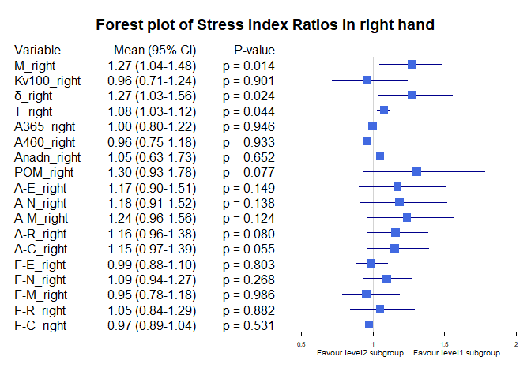<!-- -->
Bảng Gender Ratio, level1 = "male", level2 = "female"

|            |Variable    |Subgroup | Level1_Mean| Level2_Mean|     Ratio|  CI_Lower| CI_Upper|   P_Value|
|:-----------|:-----------|:--------|-----------:|-----------:|---------:|---------:|--------:|---------:|
|M_right     |M_right     |Gender   |  22.9266370|  21.5223737| 1.0652467| 0.8852788| 1.272324| 0.4090993|
|Kv100_right |Kv100_right |Gender   |  19.0289407|  22.1419444| 0.8594069| 0.6669717| 1.123673| 0.2186232|
|δ_right     |δ_right     |Gender   |   3.7139926|   3.8725000| 0.9590685| 0.7662351| 1.213480| 0.9154246|
|T_right     |T_right     |Gender   |  31.0359704|  31.7075000| 0.9788211| 0.9288080| 1.027547| 0.9878959|
|A365_right  |A365_right  |Gender   |  84.6007407|  84.7954545| 0.9977037| 0.8435702| 1.224325| 0.9717574|
|A460_right  |A460_right  |Gender   |  50.7874074|  49.5151515| 1.0256943| 0.8681986| 1.231751| 0.7925518|
|Anadn_right |Anadn_right |Gender   |   0.6977111|   0.9560101| 0.7298156| 0.4714706| 1.166519| 0.6598868|
|POM_right   |POM_right   |Gender   |   9.5094222|   9.6252273| 0.9879686| 0.7165643| 1.362367| 0.6150265|
|A-E_right   |A-E_right   |Gender   |   1.4270815|   1.3017677| 1.0962643| 0.8530711| 1.391751| 0.7500295|
|A-N_right   |A-N_right   |Gender   |   1.3992222|   1.3045960| 1.0725330| 0.8451925| 1.389605| 0.7082233|
|A-M_right   |A-M_right   |Gender   |   1.1124815|   1.0721465| 1.0376208| 0.8119462| 1.342654| 0.6094993|
|A-R_right   |A-R_right   |Gender   |   0.6877185|   0.6809091| 1.0100005| 0.8341176| 1.244472| 0.4663857|
|A-C_right   |A-C_right   |Gender   |   0.9038370|   0.8969697| 1.0076562| 0.8170785| 1.221792| 0.9959645|
|F-E_right   |F-E_right   |Gender   |   0.0149237|   0.0146010| 1.0221008| 0.9237412| 1.129725| 0.6327286|
|F-N_right   |F-N_right   |Gender   |   0.0319711|   0.0341465| 0.9362934| 0.8124558| 1.085116| 0.2068094|
|F-M_right   |F-M_right   |Gender   |   0.0874089|   0.0831364| 1.0513918| 0.8663880| 1.287922| 0.9106660|
|F-R_right   |F-R_right   |Gender   |   0.3142548|   0.3215934| 0.9771804| 0.8015028| 1.192064| 0.8652135|
|F-C_right   |F-C_right   |Gender   |   1.1454289|   1.1390505| 1.0055997| 0.9401561| 1.088461| 0.6228906|

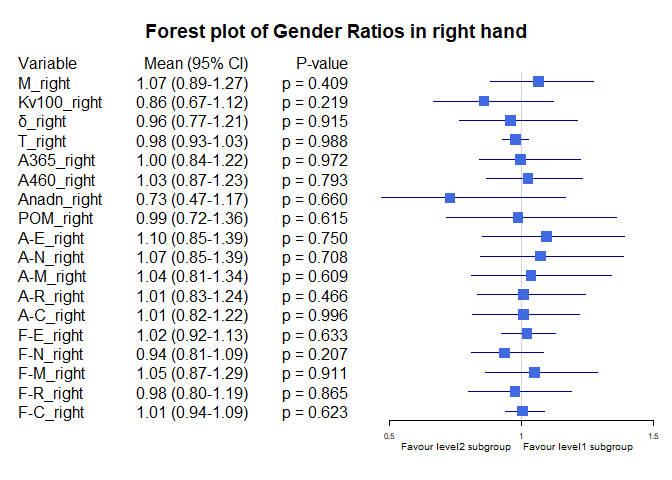<!-- -->


Bảng Smoking ratio, level1 = "Cigarettes, pipe tobacco...", level2 = "Do not smoke"

|            |Variable    |Subgroup | Level1_Mean| Level2_Mean|     Ratio|  CI_Lower|  CI_Upper|   P_Value|
|:-----------|:-----------|:--------|-----------:|-----------:|---------:|---------:|---------:|---------:|
|M_right     |M_right     |Smoking  |  20.3277857|  22.7710625| 0.8927026| 0.6276090| 1.1480820| 0.5025081|
|Kv100_right |Kv100_right |Smoking  |  14.4022857|  21.6461641| 0.6653505| 0.5298169| 0.8450397| 0.0943044|
|δ_right     |δ_right     |Smoking  |   2.6850714|   4.0207995| 0.6677954| 0.4582935| 0.9120510| 0.0360505|
|T_right     |T_right     |Smoking  |  30.0641429|  31.5948151| 0.9515531| 0.8637726| 1.0325286| 0.5277192|
|A365_right  |A365_right  |Smoking  |  86.7500000|  84.2309896| 1.0299060| 0.7526068| 1.2850956| 0.6207002|
|A460_right  |A460_right  |Smoking  |  54.1714286|  49.3911458| 1.0967842| 0.7649565| 1.4305880| 0.3191487|
|Anadn_right |Anadn_right |Smoking  |   0.7540714|   0.8185677| 0.9212084| 0.6269979| 1.3203503| 0.4422434|
|POM_right   |POM_right   |Smoking  |   8.7001429|   9.7461641| 0.8926735| 0.4931391| 1.3821055| 0.3320380|
|A-E_right   |A-E_right   |Smoking  |   1.0537857|   1.4441250| 0.7297053| 0.4664439| 1.0887565| 0.0626022|
|A-N_right   |A-N_right   |Smoking  |   1.0987857|   1.4161510| 0.7758958| 0.4909068| 1.1501271| 0.1181510|
|A-M_right   |A-M_right   |Smoking  |   0.8703571|   1.1446484| 0.7603707| 0.4876084| 1.0501366| 0.1244087|
|A-R_right   |A-R_right   |Smoking  |   0.5807143|   0.7076146| 0.8206647| 0.6023216| 1.0783680| 0.1819037|
|A-C_right   |A-C_right   |Smoking  |   0.7765000|   0.9281510| 0.8366095| 0.5752976| 1.1934731| 0.1077741|
|F-E_right   |F-E_right   |Smoking  |   0.0152214|   0.0146922| 1.0360219| 0.9146329| 1.1620861| 0.6610133|
|F-N_right   |F-N_right   |Smoking  |   0.0325500|   0.0329661| 0.9873766| 0.8019200| 1.2179269| 0.6430740|
|F-M_right   |F-M_right   |Smoking  |   0.1029071|   0.0818156| 1.2577933| 0.9296309| 1.6605854| 0.2587794|
|F-R_right   |F-R_right   |Smoking  |   0.2666000|   0.3284633| 0.8116585| 0.6648658| 0.9949522| 0.1966093|
|F-C_right   |F-C_right   |Smoking  |   1.2066714|   1.1287432| 1.0690398| 0.9876024| 1.1652061| 0.4183417|

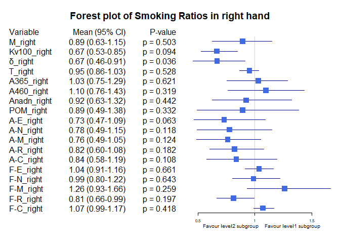<!-- -->


Bảng Smoking ratio, level1 = "Cigarettes, pipe tobacco...", level2 = "Do not smoke"

|            |Variable    |Subgroup | Level1_Mean| Level2_Mean|     Ratio|  CI_Lower|  CI_Upper|   P_Value|
|:-----------|:-----------|:--------|-----------:|-----------:|---------:|---------:|---------:|---------:|
|M_right     |M_right     |Smoking  |  20.3277857|  22.7710625| 0.8927026| 0.6330407| 1.1503978| 0.5025081|
|Kv100_right |Kv100_right |Smoking  |  14.4022857|  21.6461641| 0.6653505| 0.5271784| 0.8292426| 0.0943044|
|δ_right     |δ_right     |Smoking  |   2.6850714|   4.0207995| 0.6677954| 0.4681846| 0.9013789| 0.0360505|
|T_right     |T_right     |Smoking  |  30.0641429|  31.5948151| 0.9515531| 0.8645608| 1.0375931| 0.5277192|
|A365_right  |A365_right  |Smoking  |  86.7500000|  84.2309896| 1.0299060| 0.7658072| 1.2814934| 0.6207002|
|A460_right  |A460_right  |Smoking  |  54.1714286|  49.3911458| 1.0967842| 0.7822456| 1.4168373| 0.3191487|
|Anadn_right |Anadn_right |Smoking  |   0.7540714|   0.8185677| 0.9212084| 0.6235302| 1.3236605| 0.4422434|
|POM_right   |POM_right   |Smoking  |   8.7001429|   9.7461641| 0.8926735| 0.5084920| 1.3790006| 0.3320380|
|A-E_right   |A-E_right   |Smoking  |   1.0537857|   1.4441250| 0.7297053| 0.4633249| 1.0687608| 0.0626022|
|A-N_right   |A-N_right   |Smoking  |   1.0987857|   1.4161510| 0.7758958| 0.4743284| 1.1044004| 0.1181510|
|A-M_right   |A-M_right   |Smoking  |   0.8703571|   1.1446484| 0.7603707| 0.4788917| 1.0628640| 0.1244087|
|A-R_right   |A-R_right   |Smoking  |   0.5807143|   0.7076146| 0.8206647| 0.5851707| 1.0646234| 0.1819037|
|A-C_right   |A-C_right   |Smoking  |   0.7765000|   0.9281510| 0.8366095| 0.5694448| 1.1712323| 0.1077741|
|F-E_right   |F-E_right   |Smoking  |   0.0152214|   0.0146922| 1.0360219| 0.9113224| 1.1624496| 0.6610133|
|F-N_right   |F-N_right   |Smoking  |   0.0325500|   0.0329661| 0.9873766| 0.7939814| 1.2135520| 0.6430740|
|F-M_right   |F-M_right   |Smoking  |   0.1029071|   0.0818156| 1.2577933| 0.9160383| 1.6573888| 0.2587794|
|F-R_right   |F-R_right   |Smoking  |   0.2666000|   0.3284633| 0.8116585| 0.6700735| 1.0225519| 0.1966093|
|F-C_right   |F-C_right   |Smoking  |   1.2066714|   1.1287432| 1.0690398| 0.9842163| 1.1628719| 0.4183417|

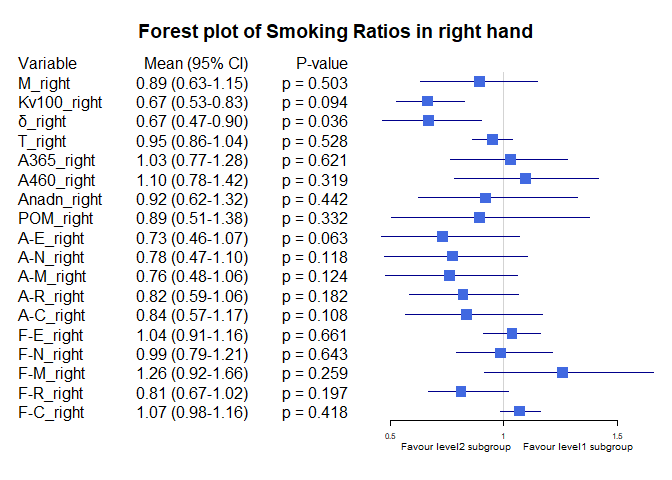<!-- -->

Bảng Hypertension ratio, level1 = "Yes", level2 = "No"

|            |Variable    |Subgroup     | Level1_Mean| Level2_Mean|     Ratio|  CI_Lower|  CI_Upper|   P_Value|
|:-----------|:-----------|:------------|-----------:|-----------:|---------:|---------:|---------:|---------:|
|M_right     |M_right     |Hypertension |  19.8770476|  23.2371754| 0.8553986| 0.6607457| 1.0662269| 0.2745247|
|Kv100_right |Kv100_right |Hypertension |  17.1661667|  21.5174912| 0.7977773| 0.5642673| 1.1009377| 0.0847909|
|δ_right     |δ_right     |Hypertension |   2.6535476|   4.1964503| 0.6323315| 0.4887263| 0.8051216| 0.0020625|
|T_right     |T_right     |Hypertension |  30.1119762|  31.7651696| 0.9479558| 0.8819790| 1.0143705| 0.3795785|
|A365_right  |A365_right  |Hypertension |  89.5690476|  82.8830409| 1.0806680| 0.8756553| 1.3180206| 0.4848350|
|A460_right  |A460_right  |Hypertension |  56.5333333|  47.9339181| 1.1794015| 0.9408530| 1.4333696| 0.1147185|
|Anadn_right |Anadn_right |Hypertension |   0.9819048|   0.7425497| 1.3223421| 0.7741651| 2.1798972| 0.2009246|
|POM_right   |POM_right   |Hypertension |   6.7061667|  10.6092456| 0.6321059| 0.4388415| 0.8531921| 0.0222082|
|A-E_right   |A-E_right   |Hypertension |   0.9735238|   1.5216316| 0.6397894| 0.4649356| 0.8529447| 0.0056803|
|A-N_right   |A-N_right   |Hypertension |   0.9965238|   1.4928012| 0.6675529| 0.4748432| 0.8736920| 0.0102098|
|A-M_right   |A-M_right   |Hypertension |   0.7798810|   1.2116667| 0.6436432| 0.4706321| 0.8286192| 0.0105471|
|A-R_right   |A-R_right   |Hypertension |   0.5892381|   0.7200585| 0.8183198| 0.6543075| 0.9927302| 0.0976492|
|A-C_right   |A-C_right   |Hypertension |   0.7802381|   0.9453977| 0.8253015| 0.6186120| 1.1048154| 0.0138242|
|F-E_right   |F-E_right   |Hypertension |   0.0146095|   0.0148526| 0.9836320| 0.8762203| 1.0894809| 0.8384678|
|F-N_right   |F-N_right   |Hypertension |   0.0330952|   0.0328164| 1.0084977| 0.8402010| 1.2099542| 0.6352583|
|F-M_right   |F-M_right   |Hypertension |   0.0974857|   0.0812228| 1.2002259| 0.9452947| 1.5197147| 0.2907134|
|F-R_right   |F-R_right   |Hypertension |   0.3452214|   0.3070947| 1.1241529| 0.9044353| 1.3786462| 0.2713336|
|F-C_right   |F-C_right   |Hypertension |   1.1668286|   1.1338520| 1.0290836| 0.9414134| 1.1179796| 0.3399347|

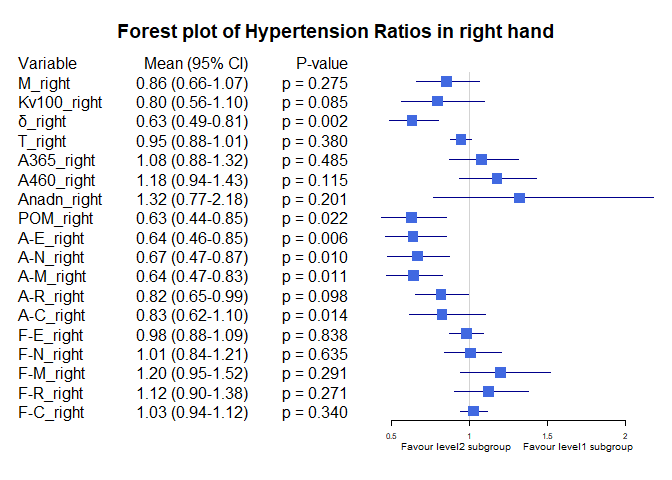<!-- -->

Bảng Obesity ratio, level1 = "Yes", level2 = "No"

|            |Variable    |Subgroup | Level1_Mean| Level2_Mean|     Ratio|  CI_Lower| CI_Upper|   P_Value|
|:-----------|:-----------|:--------|-----------:|-----------:|---------:|---------:|--------:|---------:|
|M_right     |M_right     |Obesity  |  27.7774583|  21.7102476| 1.2794630| 1.1130971| 1.451900| 0.0978850|
|Kv100_right |Kv100_right |Obesity  |  16.6159792|  20.7722667| 0.7999117| 0.5754637| 1.050892| 0.5368324|
|δ_right     |δ_right     |Obesity  |   4.3157708|   3.7199429| 1.1601713| 0.8904123| 1.440118| 0.2733984|
|T_right     |T_right     |Obesity  |  33.3610208|  31.0868286| 1.0731561| 1.0191149| 1.127856| 0.0852356|
|A365_right  |A365_right  |Obesity  |  95.0354167|  83.5000000| 1.1381487| 0.9393440| 1.334426| 0.5259582|
|A460_right  |A460_right  |Obesity  |  48.0041667|  50.5057143| 0.9504700| 0.8063342| 1.107203| 0.6270190|
|Anadn_right |Anadn_right |Obesity  |   0.5900000|   0.8317905| 0.7093132| 0.4729453| 1.065183| 0.1403658|
|POM_right   |POM_right   |Obesity  |  12.0405625|   9.2747429| 1.2982098| 0.9810786| 1.695911| 0.0687756|
|A-E_right   |A-E_right   |Obesity  |   1.6832083|   1.3387333| 1.2573141| 0.9101542| 1.676951| 0.1876260|
|A-N_right   |A-N_right   |Obesity  |   1.7027500|   1.3199238| 1.2900366| 0.8581819| 1.667977| 0.1215550|
|A-M_right   |A-M_right   |Obesity  |   1.1573958|   1.0883333| 1.0634571| 0.7863281| 1.375197| 0.5047251|
|A-R_right   |A-R_right   |Obesity  |   0.7402917|   0.6785000| 1.0910710| 0.8832367| 1.308750| 0.4054541|
|A-C_right   |A-C_right   |Obesity  |   0.9827083|   0.8915857| 1.1022029| 0.8480883| 1.399239| 0.4008592|
|F-E_right   |F-E_right   |Obesity  |   0.0162458|   0.0146205| 1.1111699| 0.9752331| 1.241546| 0.2236085|
|F-N_right   |F-N_right   |Obesity  |   0.0318750|   0.0330076| 0.9656861| 0.7948889| 1.159710| 0.9802403|
|F-M_right   |F-M_right   |Obesity  |   0.0739625|   0.0869314| 0.8508143| 0.6945528| 1.030566| 0.3609602|
|F-R_right   |F-R_right   |Obesity  |   0.3652271|   0.3118890| 1.1710161| 0.9265950| 1.438538| 0.1023965|
|F-C_right   |F-C_right   |Obesity  |   1.1839250|   1.1380224| 1.0403354| 0.9291456| 1.153238| 0.5249842|

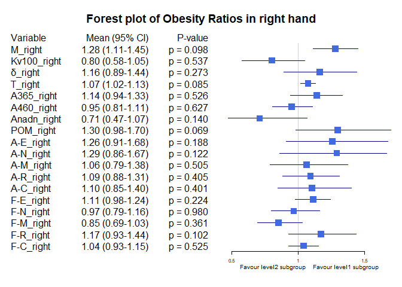<!-- -->

Bảng Race ratio, level1 = "White", level2 = "Asian or Asian British"

|            |Variable    |Subgroup | Level1_Mean| Level2_Mean|     Ratio|  CI_Lower|  CI_Upper|   P_Value|
|:-----------|:-----------|:--------|-----------:|-----------:|---------:|---------:|---------:|---------:|
|M_right     |M_right     |Race     |  26.0505714|  21.0673607| 1.2365370| 1.0590005| 1.4407878| 0.1675457|
|Kv100_right |Kv100_right |Race     |  20.0283571|  20.5668770| 0.9738162| 0.6510302| 1.3651213| 0.7390320|
|δ_right     |δ_right     |Race     |   4.5264524|   3.5580628| 1.2721676| 0.9760034| 1.5985586| 0.0510207|
|T_right     |T_right     |Race     |  32.8705238|  30.8065383| 1.0669983| 1.0191349| 1.1140258| 0.0917793|
|A365_right  |A365_right  |Race     | 104.5976190|  82.8019126| 1.2632271| 1.0974834| 1.4466110| 0.0350312|
|A460_right  |A460_right  |Race     |  49.3476190|  52.2224044| 0.9449511| 0.8008662| 1.1134506| 0.6244249|
|Anadn_right |Anadn_right |Race     |   0.4765476|   0.8431749| 0.5651824| 0.4300007| 0.7264752| 0.0017184|
|POM_right   |POM_right   |Race     |  14.8303810|   8.1369044| 1.8226073| 1.3852166| 2.4530757| 0.0002755|
|A-E_right   |A-E_right   |Race     |   1.5320714|   1.3286557| 1.1530989| 0.8195564| 1.5456936| 0.2766641|
|A-N_right   |A-N_right   |Race     |   1.6708571|   1.2528634| 1.3336308| 1.0226071| 1.7033174| 0.0350494|
|A-M_right   |A-M_right   |Race     |   1.3315476|   1.0159153| 1.3106876| 1.0199297| 1.6110431| 0.0306042|
|A-R_right   |A-R_right   |Race     |   0.7323095|   0.6666393| 1.0985093| 0.9406750| 1.2953562| 0.1513272|
|A-C_right   |A-C_right   |Race     |   1.0307143|   0.8590601| 1.1998163| 0.9534946| 1.5063458| 0.1146684|
|F-E_right   |F-E_right   |Race     |   0.0177952|   0.0142011| 1.2530893| 1.1355999| 1.3685549| 0.0007927|
|F-N_right   |F-N_right   |Race     |   0.0311786|   0.0333284| 0.9354952| 0.7793218| 1.1435127| 0.7280646|
|F-M_right   |F-M_right   |Race     |   0.0823119|   0.0874186| 0.9415836| 0.7378426| 1.2178171| 0.3807683|
|F-R_right   |F-R_right   |Race     |   0.2930881|   0.3183740| 0.9205779| 0.7455344| 1.1397199| 0.4893476|
|F-C_right   |F-C_right   |Race     |   1.1003976|   1.1544656| 0.9531662| 0.8820544| 1.0348816| 0.1338103|

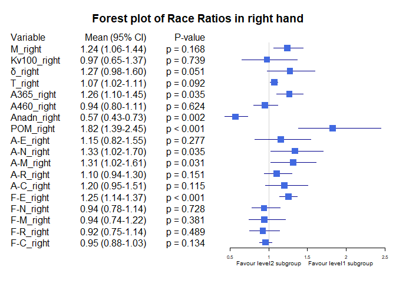<!-- -->


Bảng Race ratio, level1 = "Black, African, Caribbean or Black Bristish", level2 = "Asian or Asian British"

|            |Variable    |Subgroup | Level1_Mean| Level2_Mean|     Ratio|  CI_Lower|  CI_Upper|   P_Value|
|:-----------|:-----------|:--------|-----------:|-----------:|---------:|---------:|---------:|---------:|
|M_right     |M_right     |Race     |  30.7066667|  21.0673607| 1.4575469| 1.0398125| 1.8118995| 0.1122633|
|Kv100_right |Kv100_right |Race     |  17.3366667|  20.5668770| 0.8429411| 0.4993973| 1.3028581| 0.8240537|
|δ_right     |δ_right     |Race     |   4.8366667|   3.5580628| 1.3593539| 1.0081636| 1.7556507| 0.1439869|
|T_right     |T_right     |Race     |  34.5266667|  30.8065383| 1.1207578| 1.0702304| 1.1746719| 0.0654461|
|A365_right  |A365_right  |Race     |  30.0000000|  82.8019126| 0.3623105| 0.0241283| 0.6869291| 0.0332960|
|A460_right  |A460_right  |Race     |  14.3333333|  52.2224044| 0.2744671| 0.1739038| 0.3779040| 0.0083724|
|Anadn_right |Anadn_right |Race     |   1.6133333|   0.8431749| 1.9134030| 0.3031636| 4.2740717| 0.9873261|
|POM_right   |POM_right   |Race     |  13.8600000|   8.1369044| 1.7033505| 0.2436980| 3.3124889| 0.5461902|
|A-E_right   |A-E_right   |Race     |   1.5600000|   1.3286557| 1.1741190| 0.8072810| 1.6021882| 0.3999214|
|A-N_right   |A-N_right   |Race     |   2.0666667|   1.2528634| 1.6495547| 0.9082810| 2.4761892| 0.1234013|
|A-M_right   |A-M_right   |Race     |   1.6100000|   1.0159153| 1.5847778| 0.8995216| 2.4396486| 0.1273121|
|A-R_right   |A-R_right   |Race     |   0.8333333|   0.6666393| 1.2500512| 0.8924533| 1.7054618| 0.2730167|
|A-C_right   |A-C_right   |Race     |   1.1466667|   0.8590601| 1.3347921| 1.1483130| 1.5537356| 0.0833720|
|F-E_right   |F-E_right   |Race     |   0.0126667|   0.0142011| 0.8919501| 0.7089132| 1.1231042| 0.4149887|
|F-N_right   |F-N_right   |Race     |   0.0320000|   0.0333284| 0.9601417| 0.8039575| 1.1209394| 0.8985214|
|F-M_right   |F-M_right   |Race     |   0.0640000|   0.0874186| 0.7321098| 0.6473242| 0.8381080| 0.1060262|
|F-R_right   |F-R_right   |Race     |   0.4100000|   0.3183740| 1.2877934| 0.6582961| 1.8478086| 0.5294299|
|F-C_right   |F-C_right   |Race     |   1.1016667|   1.1544656| 0.9542655| 0.8867432| 1.0332668| 0.3984758|

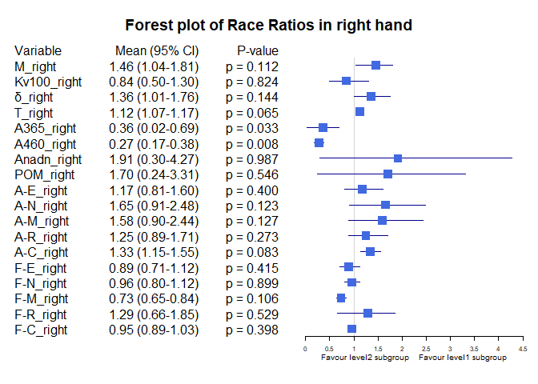<!-- -->

Bảng BMI ratio, level1 = "BMI <25", level2 = "BMI [25-30)"

|            |Variable    |Subgroup  | Level1_Mean| Level2_Mean|     Ratio|  CI_Lower|  CI_Upper|   P_Value|
|:-----------|:-----------|:---------|-----------:|-----------:|---------:|---------:|---------:|---------:|
|M_right     |M_right     |BMI_25_30 |  18.9726899|  26.0700617| 0.7277578| 0.5989778| 0.8723400| 0.0003756|
|Kv100_right |Kv100_right |BMI_25_30 |  24.1438062|  15.4027778| 1.5674969| 1.1583918| 2.1780248| 0.0003068|
|δ_right     |δ_right     |BMI_25_30 |   3.9529690|   3.3488272| 1.1804040| 0.9399889| 1.4828636| 0.4435576|
|T_right     |T_right     |BMI_25_30 |  30.3708450|  32.2270988| 0.9424008| 0.8917507| 0.9990238| 0.0129364|
|A365_right  |A365_right  |BMI_25_30 |  84.5620155|  81.8086420| 1.0336563| 0.8373142| 1.2919252| 0.6465435|
|A460_right  |A460_right  |BMI_25_30 |  51.5286822|  48.8765432| 1.0542620| 0.8863269| 1.2754348| 0.4727354|
|Anadn_right |Anadn_right |BMI_25_30 |   0.8040000|   0.8760494| 0.9177565| 0.5411629| 1.4664683| 0.9374719|
|POM_right   |POM_right   |BMI_25_30 |   7.9989612|  11.3065432| 0.7074630| 0.4976554| 0.9814341| 0.0421134|
|A-E_right   |A-E_right   |BMI_25_30 |   1.4375891|   1.1812963| 1.2169590| 0.9315306| 1.5971150| 0.3559721|
|A-N_right   |A-N_right   |BMI_25_30 |   1.3631318|   1.2511111| 1.0895369| 0.8307066| 1.4284748| 0.7400108|
|A-M_right   |A-M_right   |BMI_25_30 |   1.0817442|   1.0988272| 0.9844534| 0.7539031| 1.2989318| 0.8092936|
|A-R_right   |A-R_right   |BMI_25_30 |   0.6290698|   0.7572222| 0.8307598| 0.6769875| 1.0184325| 0.1253215|
|A-C_right   |A-C_right   |BMI_25_30 |   0.8665736|   0.9314198| 0.9303793| 0.7528677| 1.1733708| 0.5788027|
|F-E_right   |F-E_right   |BMI_25_30 |   0.0143318|   0.0150802| 0.9503679| 0.8401335| 1.0717509| 0.6185658|
|F-N_right   |F-N_right   |BMI_25_30 |   0.0322333|   0.0342407| 0.9413737| 0.8033874| 1.0973146| 0.4605344|
|F-M_right   |F-M_right   |BMI_25_30 |   0.0870628|   0.0867222| 1.0039271| 0.8052931| 1.2331269| 0.9660366|
|F-R_right   |F-R_right   |BMI_25_30 |   0.3031760|   0.3257654| 0.9306573| 0.7575375| 1.1626553| 0.2089794|
|F-C_right   |F-C_right   |BMI_25_30 |   1.1477535|   1.1225247| 1.0224750| 0.9491350| 1.0949998| 0.4386276|

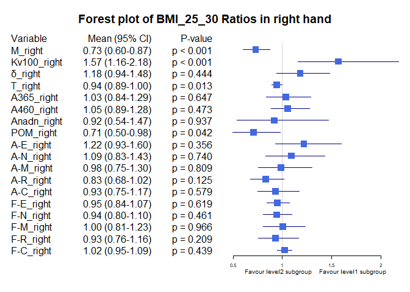<!-- -->

Bảng BMI ratio, level1 = "BMI >=30", level2 = "BMI [25-30)"

|            |Variable    |Subgroup  | Level1_Mean| Level2_Mean|     Ratio|  CI_Lower| CI_Upper|   P_Value|
|:-----------|:-----------|:---------|-----------:|-----------:|---------:|---------:|--------:|---------:|
|M_right     |M_right     |BMI_25_30 |  27.7774583|  26.0700617| 1.0654926| 0.9345747| 1.221186| 0.9539623|
|Kv100_right |Kv100_right |BMI_25_30 |  16.6159792|  15.4027778| 1.0787651| 0.7465606| 1.513136| 0.3428029|
|δ_right     |δ_right     |BMI_25_30 |   4.3157708|   3.3488272| 1.2887410| 0.9839140| 1.652406| 0.1515849|
|T_right     |T_right     |BMI_25_30 |  33.3610208|  32.2270988| 1.0351854| 0.9717231| 1.097025| 0.4281808|
|A365_right  |A365_right  |BMI_25_30 |  95.0354167|  81.8086420| 1.1616794| 0.9513507| 1.450621| 0.3456434|
|A460_right  |A460_right  |BMI_25_30 |  48.0041667|  48.8765432| 0.9821514| 0.8172029| 1.168775| 0.8288699|
|Anadn_right |Anadn_right |BMI_25_30 |   0.5900000|   0.8760494| 0.6734780| 0.3976948| 1.174331| 0.1457467|
|POM_right   |POM_right   |BMI_25_30 |  12.0405625|  11.3065432| 1.0649199| 0.7641118| 1.459472| 0.4281808|
|A-E_right   |A-E_right   |BMI_25_30 |   1.6832083|   1.1812963| 1.4248824| 0.9975363| 2.007725| 0.0955285|
|A-N_right   |A-N_right   |BMI_25_30 |   1.7027500|   1.2511111| 1.3609902| 0.9495552| 1.865748| 0.0737906|
|A-M_right   |A-M_right   |BMI_25_30 |   1.1573958|   1.0988272| 1.0533011| 0.7561563| 1.440742| 0.5760027|
|A-R_right   |A-R_right   |BMI_25_30 |   0.7402917|   0.7572222| 0.9776412| 0.7816412| 1.245891| 0.9217333|
|A-C_right   |A-C_right   |BMI_25_30 |   0.9827083|   0.9314198| 1.0550649| 0.7815818| 1.367875| 0.5168090|
|F-E_right   |F-E_right   |BMI_25_30 |   0.0162458|   0.0150802| 1.0772923| 0.9277307| 1.231817| 0.6355473|
|F-N_right   |F-N_right   |BMI_25_30 |   0.0318750|   0.0342407| 0.9309086| 0.7376106| 1.159869| 0.7679148|
|F-M_right   |F-M_right   |BMI_25_30 |   0.0739625|   0.0867222| 0.8528668| 0.6756409| 1.078796| 0.4385457|
|F-R_right   |F-R_right   |BMI_25_30 |   0.3652271|   0.3257654| 1.1211352| 0.8595894| 1.444079| 0.2521021|
|F-C_right   |F-C_right   |BMI_25_30 |   1.1839250|   1.1225247| 1.0546984| 0.9404906| 1.169420| 0.3445594|

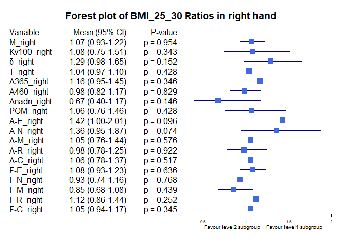<!-- -->

Bảng Age_stage ratio, level1 = "Age <30", level2= "Age [30-40)"


|            |Variable    |Subgroup  | Level1_Mean| Level2_Mean|     Ratio|  CI_Lower|  CI_Upper|   P_Value|
|:-----------|:-----------|:---------|-----------:|-----------:|---------:|---------:|---------:|---------:|
|M_right     |M_right     |Age_stage |  19.1767949|  25.2341313| 0.7599546| 0.6005532| 0.9352022| 0.0424612|
|Kv100_right |Kv100_right |Age_stage |  23.4133974|  18.5121566| 1.2647580| 0.9536875| 1.6430924| 0.0947446|
|δ_right     |δ_right     |Age_stage |   3.5846795|   4.1633687| 0.8610046| 0.6650179| 1.1095178| 0.2585241|
|T_right     |T_right     |Age_stage |  30.5505769|  32.1525707| 0.9501753| 0.8972099| 1.0011836| 0.1110426|
|A365_right  |A365_right  |Age_stage |  80.2179487|  90.2106061| 0.8892297| 0.6859283| 1.0917661| 0.6523736|
|A460_right  |A460_right  |Age_stage |  46.0897436|  52.0919192| 0.8847772| 0.7083804| 1.0750189| 0.3676022|
|Anadn_right |Anadn_right |Age_stage |   0.8906410|   0.6506061| 1.3689406| 0.9204978| 1.9971095| 0.9269890|
|POM_right   |POM_right   |Age_stage |   8.4367308|  11.0968535| 0.7602813| 0.5117916| 1.0804669| 0.0182895|
|A-E_right   |A-E_right   |Age_stage |   1.2639744|   1.5041111| 0.8403464| 0.6322960| 1.1282554| 0.1427090|
|A-N_right   |A-N_right   |Age_stage |   1.2549359|   1.4353131| 0.8743290| 0.6677429| 1.1244892| 0.4010040|
|A-M_right   |A-M_right   |Age_stage |   1.0476923|   1.1360859| 0.9221947| 0.6900420| 1.2053946| 0.5114543|
|A-R_right   |A-R_right   |Age_stage |   0.6694231|   0.6822424| 0.9812100| 0.7773539| 1.2337652| 0.5772608|
|A-C_right   |A-C_right   |Age_stage |   0.8508333|   0.9139394| 0.9309516| 0.7528876| 1.1687483| 0.2335799|
|F-E_right   |F-E_right   |Age_stage |   0.0143013|   0.0148222| 0.9648541| 0.8386147| 1.0898425| 0.5242024|
|F-N_right   |F-N_right   |Age_stage |   0.0371603|   0.0315202| 1.1789346| 1.0060752| 1.3850544| 0.0333897|
|F-M_right   |F-M_right   |Age_stage |   0.0896731|   0.0823798| 1.0885324| 0.8737466| 1.3479856| 0.6055100|
|F-R_right   |F-R_right   |Age_stage |   0.2993397|   0.3301359| 0.9067168| 0.7361688| 1.1400278| 0.3097745|
|F-C_right   |F-C_right   |Age_stage |   1.1121731|   1.1788909| 0.9434063| 0.8597681| 1.0334431| 0.3868365|

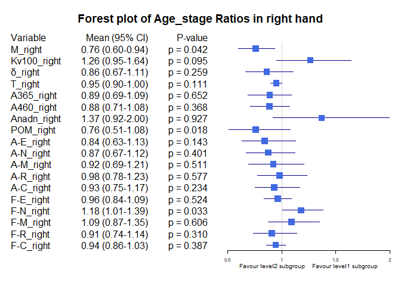<!-- -->

Bảng Age_stage ratio, level1 = "Age <30", level2= "Age [40-50)"


|            |Variable    |Subgroup  | Level1_Mean| Level2_Mean|     Ratio|  CI_Lower| CI_Upper|   P_Value|
|:-----------|:-----------|:---------|-----------:|-----------:|---------:|---------:|--------:|---------:|
|M_right     |M_right     |Age_stage |  19.1767949|  22.9460769| 0.8357331| 0.6131027| 1.159493| 0.2428218|
|Kv100_right |Kv100_right |Age_stage |  23.4133974|  13.9024615| 1.6841188| 1.2263068| 2.435246| 0.0114719|
|δ_right     |δ_right     |Age_stage |   3.5846795|   2.9100769| 1.2318161| 0.8590876| 1.883940| 0.2834385|
|T_right     |T_right     |Age_stage |  30.5505769|  31.4998462| 0.9698643| 0.8882040| 1.070007| 0.2678025|
|A365_right  |A365_right  |Age_stage |  80.2179487|  79.0384615| 1.0149230| 0.7311998| 1.491210| 0.7317482|
|A460_right  |A460_right  |Age_stage |  46.0897436|  54.7230769| 0.8422360| 0.6325457| 1.188254| 0.2969528|
|Anadn_right |Anadn_right |Age_stage |   0.8906410|   1.1620769| 0.7664217| 0.3866638| 1.611303| 0.1108180|
|POM_right   |POM_right   |Age_stage |   8.4367308|   7.4463077| 1.1330086| 0.7029363| 2.002784| 0.7800367|
|A-E_right   |A-E_right   |Age_stage |   1.2639744|   1.2010000| 1.0524349| 0.6823116| 1.738452| 0.6124748|
|A-N_right   |A-N_right   |Age_stage |   1.2549359|   1.3010000| 0.9645933| 0.6364510| 1.634582| 0.7771352|
|A-M_right   |A-M_right   |Age_stage |   1.0476923|   1.0203846| 1.0267622| 0.6843643| 1.741794| 0.6441561|
|A-R_right   |A-R_right   |Age_stage |   0.6694231|   0.6776923| 0.9877980| 0.7118131| 1.412729| 0.8815488|
|A-C_right   |A-C_right   |Age_stage |   0.8508333|   0.8823846| 0.9642432| 0.6768329| 1.505133| 1.0000000|
|F-E_right   |F-E_right   |Age_stage |   0.0143013|   0.0146231| 0.9779940| 0.8360367| 1.164293| 0.7407631|
|F-N_right   |F-N_right   |Age_stage |   0.0371603|   0.0274385| 1.3543127| 1.1485136| 1.596831| 0.0055101|
|F-M_right   |F-M_right   |Age_stage |   0.0896731|   0.0822846| 1.0897915| 0.8108125| 1.438403| 0.8804623|
|F-R_right   |F-R_right   |Age_stage |   0.2993397|   0.2911077| 1.0282784| 0.7845707| 1.383755| 0.9148398|
|F-C_right   |F-C_right   |Age_stage |   1.1121731|   1.1499538| 0.9671458| 0.8652221| 1.079745| 0.8577822|

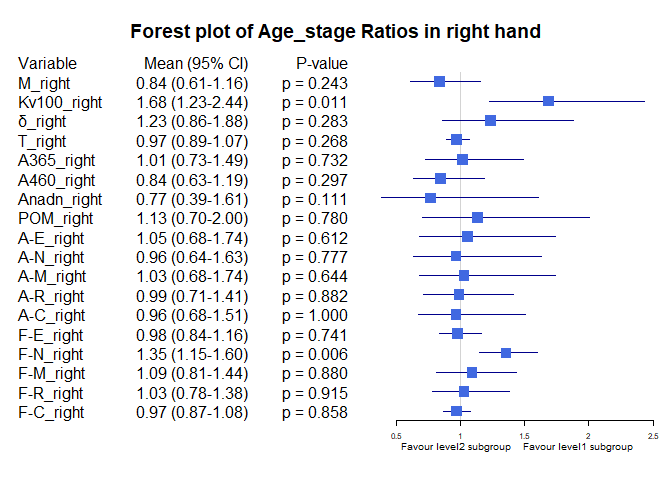<!-- -->

Bảng Age_stage ratio, level1 = "Age <30", level2= "Age >=50"


|            |Variable    |Subgroup  | Level1_Mean| Level2_Mean|     Ratio|  CI_Lower|  CI_Upper|   P_Value|
|:-----------|:-----------|:---------|-----------:|-----------:|---------:|---------:|---------:|---------:|
|M_right     |M_right     |Age_stage |  19.1767949|  18.7191667| 1.0244470| 0.6518081| 1.9384485| 0.8323953|
|Kv100_right |Kv100_right |Age_stage |  23.4133974|  31.1008333| 0.7528222| 0.4969104| 1.2909417| 0.3312874|
|δ_right     |δ_right     |Age_stage |   3.5846795|   4.4163889| 0.8116766| 0.5585588| 1.2914037| 0.3464204|
|T_right     |T_right     |Age_stage |  30.5505769|  29.6863889| 1.0291106| 0.9024044| 1.1961012| 0.6292031|
|A365_right  |A365_right  |Age_stage |  80.2179487|  85.8611111| 0.9342757| 0.7290076| 1.2041182| 0.9614821|
|A460_right  |A460_right  |Age_stage |  46.0897436|  48.4444444| 0.9513938| 0.6686044| 1.4843160| 0.9807355|
|Anadn_right |Anadn_right |Age_stage |   0.8906410|   0.5352778| 1.6638857| 1.0603847| 2.5264297| 0.4834445|
|POM_right   |POM_right   |Age_stage |   8.4367308|  10.5338889| 0.8009132| 0.4045525| 2.0085532| 0.7958821|
|A-E_right   |A-E_right   |Age_stage |   1.2639744|   1.5108333| 0.8366074| 0.5261319| 1.4701725| 0.4116500|
|A-N_right   |A-N_right   |Age_stage |   1.2549359|   1.5183333| 0.8265220| 0.5695872| 1.4088244| 0.5144235|
|A-M_right   |A-M_right   |Age_stage |   1.0476923|   1.2411111| 0.8441567| 0.5893144| 1.2823508| 0.4837655|
|A-R_right   |A-R_right   |Age_stage |   0.6694231|   0.7813889| 0.8567092| 0.6703932| 1.1280633| 0.2179285|
|A-C_right   |A-C_right   |Age_stage |   0.8508333|   1.0866667| 0.7829755| 0.5313393| 1.2762286| 0.3104137|
|F-E_right   |F-E_right   |Age_stage |   0.0143013|   0.0170556| 0.8385117| 0.7291880| 0.9919226| 0.1581949|
|F-N_right   |F-N_right   |Age_stage |   0.0371603|   0.0337500| 1.1010446| 0.8379376| 1.4076657| 0.2764155|
|F-M_right   |F-M_right   |Age_stage |   0.0896731|   0.0928611| 0.9656688| 0.6156601| 1.4456648| 1.0000000|
|F-R_right   |F-R_right   |Age_stage |   0.2993397|   0.3820556| 0.7834979| 0.5903477| 1.0760108| 0.0949007|
|F-C_right   |F-C_right   |Age_stage |   1.1121731|   1.0606111| 1.0486153| 0.9127499| 1.2064636| 0.4973082|

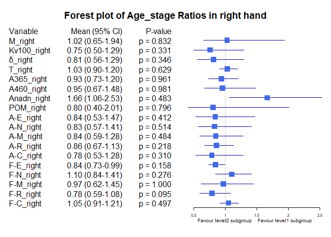<!-- -->

Bảng Age_stage ratio, level1 = "Age [30-40)", level2= "Age >=50"


|            |Variable    |Subgroup  | Level1_Mean| Level2_Mean|     Ratio|  CI_Lower| CI_Upper|   P_Value|
|:-----------|:-----------|:---------|-----------:|-----------:|---------:|---------:|--------:|---------:|
|M_right     |M_right     |Age_stage |  25.2341313|  18.7191667| 1.3480371| 0.8987424| 2.506208| 0.2925591|
|Kv100_right |Kv100_right |Age_stage |  18.5121566|  31.1008333| 0.5952302| 0.3956503| 1.041084| 0.0762056|
|δ_right     |δ_right     |Age_stage |   4.1633687|   4.4163889| 0.9427088| 0.6637360| 1.439614| 0.8347492|
|T_right     |T_right     |Age_stage |  32.1525707|  29.6863889| 1.0830745| 0.9641057| 1.251352| 0.3906906|
|A365_right  |A365_right  |Age_stage |  90.2106061|  85.8611111| 1.0506573| 0.8784497| 1.298747| 0.5723767|
|A460_right  |A460_right  |Age_stage |  52.0919192|  48.4444444| 1.0752919| 0.7668193| 1.650337| 0.6969604|
|Anadn_right |Anadn_right |Age_stage |   0.6506061|   0.5352778| 1.2154550| 0.9262543| 1.686545| 0.4476468|
|POM_right   |POM_right   |Age_stage |  11.0968535|  10.5338889| 1.0534432| 0.5785176| 2.342823| 0.5054479|
|A-E_right   |A-E_right   |Age_stage |   1.5041111|   1.5108333| 0.9955507| 0.6569247| 1.717674| 0.8456713|
|A-N_right   |A-N_right   |Age_stage |   1.4353131|   1.5183333| 0.9453215| 0.6582051| 1.551108| 0.5992079|
|A-M_right   |A-M_right   |Age_stage |   1.1360859|   1.2411111| 0.9153780| 0.6605422| 1.423998| 0.5206822|
|A-R_right   |A-R_right   |Age_stage |   0.6822424|   0.7813889| 0.8731151| 0.7133709| 1.112431| 0.3601599|
|A-C_right   |A-C_right   |Age_stage |   0.9139394|   1.0866667| 0.8410485| 0.5848057| 1.250627| 0.5205978|
|F-E_right   |F-E_right   |Age_stage |   0.0148222|   0.0170556| 0.8690554| 0.7639867| 1.040320| 0.1430748|
|F-N_right   |F-N_right   |Age_stage |   0.0315202|   0.0337500| 0.9339319| 0.7024279| 1.229915| 0.4460994|
|F-M_right   |F-M_right   |Age_stage |   0.0823798|   0.0928611| 0.8871291| 0.5919699| 1.326759| 0.6947331|
|F-R_right   |F-R_right   |Age_stage |   0.3301359|   0.3820556| 0.8641043| 0.6671966| 1.187623| 0.2878142|
|F-C_right   |F-C_right   |Age_stage |   1.1788909|   1.0606111| 1.1115204| 0.9929858| 1.241693| 0.0927925|

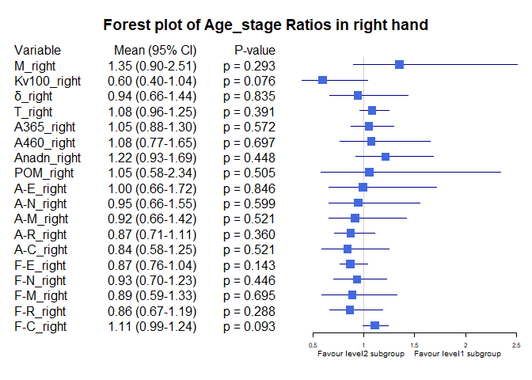<!-- -->

Bảng Age_stage ratio, level1 = "Age [30-40)", level2= "Age [40-50)"


|            |Variable    |Subgroup  | Level1_Mean| Level2_Mean|     Ratio|  CI_Lower| CI_Upper|   P_Value|
|:-----------|:-----------|:---------|-----------:|-----------:|---------:|---------:|--------:|---------:|
|M_right     |M_right     |Age_stage |  25.2341313|  22.9460769| 1.0997144| 0.8773968| 1.481390| 0.9424102|
|Kv100_right |Kv100_right |Age_stage |  18.5121566|  13.9024615| 1.3315740| 0.9686168| 1.910051| 0.1820064|
|δ_right     |δ_right     |Age_stage |   4.1633687|   2.9100769| 1.4306731| 1.0278382| 2.226151| 0.0668671|
|T_right     |T_right     |Age_stage |  32.1525707|  31.4998462| 1.0207215| 0.9451312| 1.118979| 0.6820626|
|A365_right  |A365_right  |Age_stage |  90.2106061|  79.0384615| 1.1413507| 0.8720467| 1.599619| 0.5337565|
|A460_right  |A460_right  |Age_stage |  52.0919192|  54.7230769| 0.9519187| 0.7593099| 1.257999| 0.4419862|
|Anadn_right |Anadn_right |Age_stage |   0.6506061|   1.1620769| 0.5598649| 0.3086056| 1.037522| 0.0852874|
|POM_right   |POM_right   |Age_stage |  11.0968535|   7.4463077| 1.4902491| 1.0597005| 2.314520| 0.0325751|
|A-E_right   |A-E_right   |Age_stage |   1.5041111|   1.2010000| 1.2523823| 0.8678471| 2.097342| 0.2089509|
|A-N_right   |A-N_right   |Age_stage |   1.4353131|   1.3010000| 1.1032384| 0.7307624| 1.836370| 0.5179132|
|A-M_right   |A-M_right   |Age_stage |   1.1360859|   1.0203846| 1.1133898| 0.7531267| 1.764874| 0.4349730|
|A-R_right   |A-R_right   |Age_stage |   0.6822424|   0.6776923| 1.0067141| 0.7541418| 1.495791| 0.9902636|
|A-C_right   |A-C_right   |Age_stage |   0.9139394|   0.8823846| 1.0357608| 0.7315200| 1.586695| 0.4716035|
|F-E_right   |F-E_right   |Age_stage |   0.0148222|   0.0146231| 1.0136186| 0.8832928| 1.157708| 0.7680968|
|F-N_right   |F-N_right   |Age_stage |   0.0315202|   0.0274385| 1.1487598| 0.9587691| 1.360548| 0.3769115|
|F-M_right   |F-M_right   |Age_stage |   0.0823798|   0.0822846| 1.0011567| 0.7766825| 1.272008| 0.7306285|
|F-R_right   |F-R_right   |Age_stage |   0.3301359|   0.2911077| 1.1340678| 0.8813407| 1.486907| 0.4130007|
|F-C_right   |F-C_right   |Age_stage |   1.1788909|   1.1499538| 1.0251637| 0.9384933| 1.124274| 0.3383131|

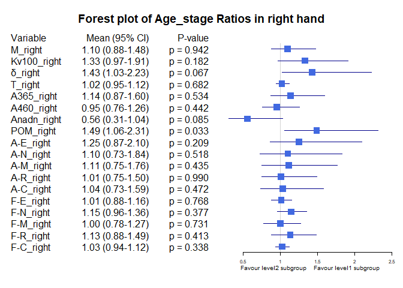<!-- -->

Bảng Age_stage ratio, level1 = "Age [40-50)", level2= "Age >=50"


|            |Variable    |Subgroup  | Level1_Mean| Level2_Mean|     Ratio|  CI_Lower| CI_Upper|   P_Value|
|:-----------|:-----------|:---------|-----------:|-----------:|---------:|---------:|--------:|---------:|
|M_right     |M_right     |Age_stage |  22.9460769|  18.7191667| 1.2258065| 0.7388104| 2.315866| 0.8982751|
|Kv100_right |Kv100_right |Age_stage |  13.9024615|  31.1008333| 0.4470125| 0.2820677| 0.776082| 0.0364883|
|δ_right     |δ_right     |Age_stage |   2.9100769|   4.4163889| 0.6589268| 0.3933223| 1.077599| 0.1791243|
|T_right     |T_right     |Age_stage |  31.4998462|  29.6863889| 1.0610872| 0.9191258| 1.232532| 0.7012384|
|A365_right  |A365_right  |Age_stage |  79.0384615|  85.8611111| 0.9205385| 0.6427921| 1.241252| 0.9650063|
|A460_right  |A460_right  |Age_stage |  54.7230769|  48.4444444| 1.1296048| 0.7375421| 1.824046| 0.4557722|
|Anadn_right |Anadn_right |Age_stage |   1.1620769|   0.5352778| 2.1709792| 1.1101749| 4.204921| 0.0391224|
|POM_right   |POM_right   |Age_stage |   7.4463077|  10.5338889| 0.7068907| 0.3362415| 1.687744| 0.7653693|
|A-E_right   |A-E_right   |Age_stage |   1.2010000|   1.5108333| 0.7949255| 0.4152551| 1.419223| 0.4155241|
|A-N_right   |A-N_right   |Age_stage |   1.3010000|   1.5183333| 0.8568606| 0.4927047| 1.551363| 0.6607237|
|A-M_right   |A-M_right   |Age_stage |   1.0203846|   1.2411111| 0.8221541| 0.4724882| 1.357261| 0.4045229|
|A-R_right   |A-R_right   |Age_stage |   0.6776923|   0.7813889| 0.8672920| 0.5860913| 1.195724| 0.7012384|
|A-C_right   |A-C_right   |Age_stage |   0.8823846|   1.0866667| 0.8120104| 0.4808683| 1.431348| 0.3676102|
|F-E_right   |F-E_right   |Age_stage |   0.0146231|   0.0170556| 0.8573791| 0.7390310| 1.045689| 0.2669821|
|F-N_right   |F-N_right   |Age_stage |   0.0274385|   0.0337500| 0.8129915| 0.5972415| 1.094817| 0.2010800|
|F-M_right   |F-M_right   |Age_stage |   0.0822846|   0.0928611| 0.8861041| 0.5729273| 1.389439| 1.0000000|
|F-R_right   |F-R_right   |Age_stage |   0.2911077|   0.3820556| 0.7619512| 0.5605589| 1.106871| 0.1028555|
|F-C_right   |F-C_right   |Age_stage |   1.1499538|   1.0606111| 1.0842370| 0.9388322| 1.236394| 0.2495928|

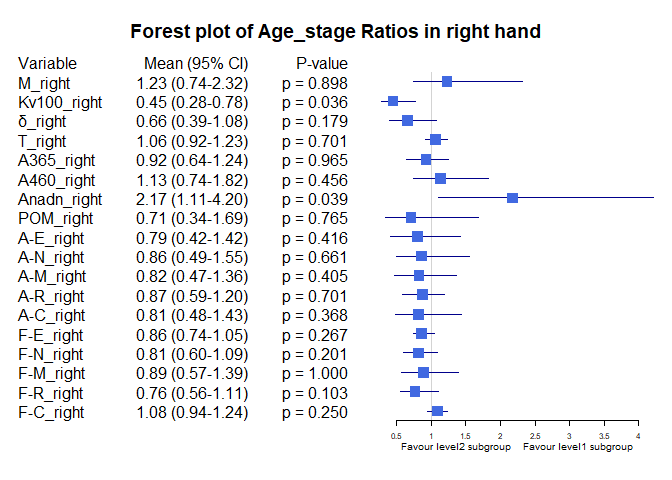<!-- -->
