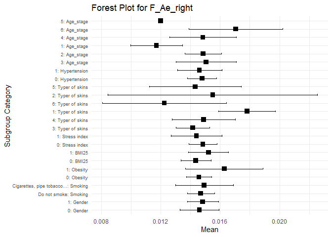
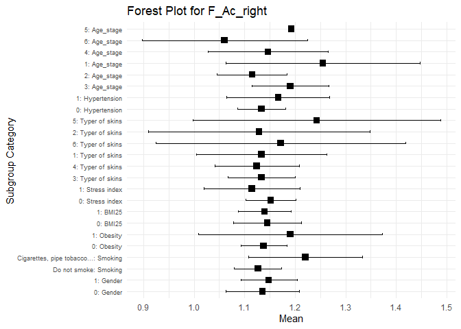

## Load bộ số liệu và các packages


```
## ── Attaching core tidyverse packages ──────────────────────── tidyverse 2.0.0 ──
## ✔ dplyr     1.1.3     ✔ readr     2.1.4
## ✔ forcats   1.0.0     ✔ stringr   1.5.0
## ✔ ggplot2   3.4.3     ✔ tibble    3.2.1
## ✔ lubridate 1.9.2     ✔ tidyr     1.3.0
## ✔ purrr     1.0.2     
## ── Conflicts ────────────────────────────────────────── tidyverse_conflicts() ──
## ✖ dplyr::filter() masks stats::filter()
## ✖ dplyr::lag()    masks stats::lag()
## ℹ Use the conflicted package (<http://conflicted.r-lib.org/>) to force all conflicts to become errors
## 
## Attaching package: 'rstatix'
## 
## 
## The following object is masked from 'package:stats':
## 
##     filter
```

## So sánh khác biệt về trung bình của chỉ số M_right theo các biến

Tạo hàm tính 95%CI


Tạo hàm so sánh trung bình bằng Wilcox.test nếu subgroup có 2 level


Tạo hàm so sánh bắt cặp các trung bình bằng Wilcox.pairwise test nếu group có >2 level


Tạo hàm vẽ Forest plot


Hàm để tạo bảng 


Sub group list = "Gender", "Smoking", "Obesity", "BMI25", "Stress index", "Typer of skins", "Hypertension", "Age_stage"


## Tạo bảng và Forest plot với biến M_right

|Subgroup_Category |Subgroup                    | n_M_right|     Mean|  CI_lower| CI_upper|   P_Value|
|:-----------------|:---------------------------|---------:|--------:|---------:|--------:|---------:|
|Gender            |0                           |        31| 21.24866| 17.918146| 24.57917| 0.4006173|
|Gender            |1                           |        44| 22.86338| 19.911520| 25.81524| 0.4006173|
|Smoking           |Do not smoke                |        62| 22.67448| 20.402104| 24.94686| 0.4796795|
|Smoking           |Cigarettes, pipe tobacco... |        13| 19.91377| 12.918098| 26.90944| 0.4796795|
|Obesity           |0                           |        68| 21.60820| 19.272501| 23.94389| 0.1069954|
|Obesity           |1                           |         7| 27.90567| 24.447443| 31.36389| 0.1069954|
|BMI25             |0                           |        42| 18.83752| 15.821631| 21.85340| 0.0000984|
|BMI25             |1                           |        33| 26.47034| 23.918497| 29.02219| 0.0000984|
|Stress index      |0                           |        57| 20.80047| 18.319373| 23.28157| 0.0124304|
|Stress index      |1                           |        18| 26.61500| 22.410480| 30.81952| 0.0124304|
|Typer of skins    |3                           |        40| 19.38852| 16.283161| 22.49387|        NA|
|Typer of skins    |4                           |        11| 26.75303| 23.147883| 30.35818|        NA|
|Typer of skins    |1                           |        10| 24.73180| 20.822265| 28.64134|        NA|
|Typer of skins    |6                           |         4| 29.91750| 19.431679| 40.40332|        NA|
|Typer of skins    |2                           |         4| 30.01750| 21.210866| 38.82413|        NA|
|Typer of skins    |5                           |         6| 17.96917|  3.734395| 32.20394|        NA|
|Hypertension      |0                           |        54| 23.09776| 20.608567| 25.58695| 0.2597899|
|Hypertension      |1                           |        21| 19.87705| 15.314328| 24.43977| 0.2597899|
|Age_stage         |3                           |        13| 25.71562| 21.911600| 29.51963|        NA|
|Age_stage         |2                           |        36| 22.45056| 19.353712| 25.54740|        NA|
|Age_stage         |1                           |         7| 15.93714|  7.498859| 24.37543|        NA|
|Age_stage         |4                           |        12| 23.05325| 15.937717| 30.16878|        NA|
|Age_stage         |6                           |         6| 18.71917|  5.709795| 31.72854|        NA|
|Age_stage         |5                           |         1| 21.66000|       NaN|      NaN|        NA|
Wilcox pairwise test cho các sub group có >2 level

```
## Group Gender does not have more than 2 unique levels. Skipping.
```

```
## Group Smoking does not have more than 2 unique levels. Skipping.
```

```
## Group Obesity does not have more than 2 unique levels. Skipping.
```

```
## Group BMI25 does not have more than 2 unique levels. Skipping.
```

```
## Group Stress index does not have more than 2 unique levels. Skipping.
```

```
## Group Hypertension does not have more than 2 unique levels. Skipping.
```


|Group          | Group1| Group2|   P_Value|
|:--------------|------:|------:|---------:|
|Typer of skins |      3|      4| 0.0185432|
|Typer of skins |      3|      1| 0.1248611|
|Typer of skins |      3|      6| 0.0556018|
|Typer of skins |      3|      2| 0.0556018|
|Typer of skins |      3|      5| 0.8862672|
|Typer of skins |      4|      1| 0.2816203|
|Typer of skins |      4|      6| 0.5714286|
|Typer of skins |      4|      2| 0.6608059|
|Typer of skins |      4|      5| 0.3501939|
|Typer of skins |      1|      6| 0.2397602|
|Typer of skins |      1|      2| 0.2397602|
|Typer of skins |      1|      5| 0.4278222|
|Typer of skins |      6|      2| 1.0000000|
|Typer of skins |      6|      5| 0.1714286|
|Typer of skins |      2|      5| 0.2571429|
|Age_stage      |      3|      2| 0.3288463|
|Age_stage      |      3|      1| 0.0556760|
|Age_stage      |      3|      4| 1.0000000|
|Age_stage      |      3|      6| 0.3676102|
|Age_stage      |      3|      5| 0.4285714|
|Age_stage      |      2|      1| 0.1044284|
|Age_stage      |      2|      4| 0.4441206|
|Age_stage      |      2|      6| 0.6611131|
|Age_stage      |      2|      5| 0.5945946|
|Age_stage      |      1|      4| 0.1422164|
|Age_stage      |      1|      6| 0.6282051|
|Age_stage      |      1|      5| 0.7500000|
|Age_stage      |      4|      6| 0.9635854|
|Age_stage      |      4|      5| 0.6153846|
|Age_stage      |      6|      5| 0.8571429|
Forest plot 
<!-- -->


Bảng phân tích theo từng characteristic


## Tạo bảng và Forest plot với biến Kv100_right

|Subgroup_Category |Subgroup                    | n_Kv100_right|     Mean|   CI_lower| CI_upper|   P_Value|
|:-----------------|:---------------------------|-------------:|--------:|----------:|--------:|---------:|
|Gender            |0                           |            31| 22.14626| 17.6703903| 26.62214| 0.2961153|
|Gender            |1                           |            44| 19.23460| 15.6510430| 22.81815| 0.2961153|
|Smoking           |Do not smoke                |            62| 21.63233| 18.4188013| 24.84586| 0.1474417|
|Smoking           |Cigarettes, pipe tobacco... |            13| 14.74246| 11.6345296| 17.85039| 0.1474417|
|Obesity           |0                           |            68| 20.83542| 17.8551032| 23.81574| 0.5179169|
|Obesity           |1                           |             7| 16.57826|  9.7953229| 23.36120| 0.5179169|
|BMI25             |0                           |            42| 24.06937| 20.3114643| 27.82728| 0.0005078|
|BMI25             |1                           |            33| 15.81645| 12.1754089| 19.45749| 0.0005078|
|Stress index      |0                           |            57| 20.57171| 17.3439292| 23.79949| 0.9258715|
|Stress index      |1                           |            18| 20.01495| 14.2258773| 25.80403| 0.9258715|
|Typer of skins    |3                           |            40| 19.72226| 15.8623151| 23.58220|        NA|
|Typer of skins    |4                           |            11| 20.48197| 13.5762321| 27.38771|        NA|
|Typer of skins    |1                           |            10| 22.66645| 12.1260173| 33.20688|        NA|
|Typer of skins    |6                           |             4| 15.07250|  0.7122165| 29.43278|        NA|
|Typer of skins    |2                           |             4| 12.98000|  3.2300125| 22.72999|        NA|
|Typer of skins    |5                           |             6| 29.96500| 18.5246333| 41.40537|        NA|
|Hypertension      |0                           |            54| 21.71050| 18.4573558| 24.96364| 0.0860008|
|Hypertension      |1                           |            21| 17.16617| 11.8244801| 22.50785| 0.0860008|
|Age_stage         |3                           |            13| 15.31400| 10.8606768| 19.76732|        NA|
|Age_stage         |2                           |            36| 22.32660| 18.1574832| 26.49571|        NA|
|Age_stage         |1                           |             7| 23.24000| 13.6358020| 32.84420|        NA|
|Age_stage         |4                           |            12| 12.71183|  8.7959514| 16.62772|        NA|
|Age_stage         |6                           |             6| 31.10083| 12.4376158| 49.76405|        NA|
|Age_stage         |5                           |             1| 28.19000|        NaN|      NaN|        NA|
Wilcox pairwise test cho các sub group có >2 level

```
## Group Gender does not have more than 2 unique levels. Skipping.
```

```
## Group Smoking does not have more than 2 unique levels. Skipping.
```

```
## Group Obesity does not have more than 2 unique levels. Skipping.
```

```
## Group BMI25 does not have more than 2 unique levels. Skipping.
```

```
## Group Stress index does not have more than 2 unique levels. Skipping.
```

```
## Group Hypertension does not have more than 2 unique levels. Skipping.
```


|Group          | Group1| Group2|   P_Value|
|:--------------|------:|------:|---------:|
|Typer of skins |      3|      4| 0.6595919|
|Typer of skins |      3|      1| 0.6073440|
|Typer of skins |      3|      6| 0.5947949|
|Typer of skins |      3|      2| 0.3513786|
|Typer of skins |      3|      5| 0.0594960|
|Typer of skins |      4|      1| 0.9725388|
|Typer of skins |      4|      6| 0.4893773|
|Typer of skins |      4|      2| 0.3428571|
|Typer of skins |      4|      5| 0.1489981|
|Typer of skins |      1|      6| 0.4535465|
|Typer of skins |      1|      2| 0.2397602|
|Typer of skins |      1|      5| 0.2634865|
|Typer of skins |      6|      2| 0.6857143|
|Typer of skins |      6|      5| 0.0666667|
|Typer of skins |      2|      5| 0.0380952|
|Age_stage      |      3|      2| 0.0791496|
|Age_stage      |      3|      1| 0.0674923|
|Age_stage      |      3|      4| 0.3760202|
|Age_stage      |      3|      6| 0.0715023|
|Age_stage      |      3|      5| 0.1428571|
|Age_stage      |      2|      1| 0.7353798|
|Age_stage      |      2|      4| 0.0123207|
|Age_stage      |      2|      6| 0.2076703|
|Age_stage      |      2|      5| 0.6486486|
|Age_stage      |      1|      4| 0.0358419|
|Age_stage      |      1|      6| 0.4452214|
|Age_stage      |      1|      5| 1.0000000|
|Age_stage      |      4|      6| 0.0244559|
|Age_stage      |      4|      5| 0.1538462|
|Age_stage      |      6|      5| 1.0000000|
Forest plot 
<!-- -->


## Tạo bảng và Forest plot với biến δ_right

|Subgroup_Category |Subgroup                    | n_δ_right|     Mean|  CI_lower| CI_upper|   P_Value|
|:-----------------|:---------------------------|---------:|--------:|---------:|--------:|---------:|
|Gender            |0                           |        31| 3.759113| 3.0395029| 4.478723| 0.8464324|
|Gender            |1                           |        44| 3.739992| 3.1375649| 4.342420| 0.8464324|
|Smoking           |Do not smoke                |        62| 3.968890| 3.4734691| 4.464310| 0.0484299|
|Smoking           |Cigarettes, pipe tobacco... |        13| 2.693923| 1.6666142| 3.721232| 0.0484299|
|Obesity           |0                           |        68| 3.692735| 3.2073660| 4.178105| 0.2949661|
|Obesity           |1                           |         7| 4.283738| 2.9391669| 5.628309| 0.2949661|
|BMI25             |0                           |        42| 3.887087| 3.1889013| 4.585273| 0.8560102|
|BMI25             |1                           |        33| 3.570742| 3.0219906| 4.119494| 0.8560102|
|Stress index      |0                           |        57| 3.520901| 2.9796547| 4.062146| 0.0365822|
|Stress index      |1                           |        18| 4.466713| 3.7130332| 5.220393| 0.0365822|
|Typer of skins    |3                           |        40| 2.981442| 2.4995401| 3.463343|        NA|
|Typer of skins    |4                           |        11| 4.959242| 3.5355258| 6.382959|        NA|
|Typer of skins    |1                           |        10| 4.728283| 3.4358848| 6.020682|        NA|
|Typer of skins    |6                           |         4| 4.197500| 1.5782940| 6.816706|        NA|
|Typer of skins    |2                           |         4| 3.975000| 0.6377911| 7.312209|        NA|
|Typer of skins    |5                           |         6| 4.551667| 1.3685402| 7.734793|        NA|
|Hypertension      |0                           |        54| 4.173475| 3.6265207| 4.720430| 0.0029424|
|Hypertension      |1                           |        21| 2.653548| 2.0382055| 3.268890| 0.0029424|
|Age_stage         |3                           |        13| 3.574000| 2.5558187| 4.592181|        NA|
|Age_stage         |2                           |        36| 4.107801| 3.4420057| 4.773596|        NA|
|Age_stage         |1                           |         7| 3.202857| 1.2887320| 5.116982|        NA|
|Age_stage         |4                           |        12| 2.643417| 1.5247414| 3.762092|        NA|
|Age_stage         |6                           |         6| 4.416389| 2.0755936| 6.757184|        NA|
|Age_stage         |5                           |         1| 6.110000|       NaN|      NaN|        NA|
Wilcox pairwise test cho các sub group có >2 level

```
## Group Gender does not have more than 2 unique levels. Skipping.
```

```
## Group Smoking does not have more than 2 unique levels. Skipping.
```

```
## Group Obesity does not have more than 2 unique levels. Skipping.
```

```
## Group BMI25 does not have more than 2 unique levels. Skipping.
```

```
## Group Stress index does not have more than 2 unique levels. Skipping.
```

```
## Group Hypertension does not have more than 2 unique levels. Skipping.
```


|Group          | Group1| Group2|   P_Value|
|:--------------|------:|------:|---------:|
|Typer of skins |      3|      4| 0.0053907|
|Typer of skins |      3|      1| 0.0059020|
|Typer of skins |      3|      6| 0.1361549|
|Typer of skins |      3|      2| 0.3582757|
|Typer of skins |      3|      5| 0.2745033|
|Typer of skins |      4|      1| 1.0000000|
|Typer of skins |      4|      6| 0.7531136|
|Typer of skins |      4|      2| 0.4893773|
|Typer of skins |      4|      5| 0.8075307|
|Typer of skins |      1|      6| 0.7332667|
|Typer of skins |      1|      2| 0.6353646|
|Typer of skins |      1|      5| 0.8748751|
|Typer of skins |      6|      2| 1.0000000|
|Typer of skins |      6|      5| 0.9142857|
|Typer of skins |      2|      5| 1.0000000|
|Age_stage      |      3|      2| 0.4345844|
|Age_stage      |      3|      1| 0.5880289|
|Age_stage      |      3|      4| 0.1860700|
|Age_stage      |      3|      6| 0.5788737|
|Age_stage      |      3|      5| 0.2857143|
|Age_stage      |      2|      1| 0.2172951|
|Age_stage      |      2|      4| 0.0311713|
|Age_stage      |      2|      6| 0.7058427|
|Age_stage      |      2|      5| 0.2060360|
|Age_stage      |      1|      4| 0.5539392|
|Age_stage      |      1|      6| 0.2948718|
|Age_stage      |      1|      5| 0.5000000|
|Age_stage      |      4|      6| 0.1024564|
|Age_stage      |      4|      5| 0.1538462|
|Age_stage      |      6|      5| 0.5714286|
Forest plot 
<!-- -->

## Tạo bảng và Forest plot với biến T_right

|Subgroup_Category |Subgroup                    | n_T_right|     Mean| CI_lower| CI_upper|   P_Value|
|:-----------------|:---------------------------|---------:|--------:|--------:|--------:|---------:|
|Gender            |0                           |        31| 31.67831| 30.55601| 32.80060| 0.9485282|
|Gender            |1                           |        44| 30.95224| 29.65568| 32.24880| 0.9485282|
|Smoking           |Do not smoke                |        62| 31.57658| 30.70930| 32.44386| 0.3447796|
|Smoking           |Cigarettes, pipe tobacco... |        13| 29.70600| 26.56882| 32.84318| 0.3447796|
|Obesity           |0                           |        68| 30.98938| 30.05308| 31.92569| 0.0370332|
|Obesity           |1                           |         7| 33.80688| 32.13656| 35.47721| 0.0370332|
|BMI25             |0                           |        42| 30.28253| 29.08138| 31.48369| 0.0029533|
|BMI25             |1                           |        33| 32.48666| 31.27519| 33.69814| 0.0029533|
|Stress index      |0                           |        57| 30.69375| 29.60894| 31.77856| 0.0645423|
|Stress index      |1                           |        18| 33.02125| 32.06923| 33.97327| 0.0645423|
|Typer of skins    |3                           |        40| 30.34933| 29.07439| 31.62426|        NA|
|Typer of skins    |4                           |        11| 33.28576| 32.32459| 34.24692|        NA|
|Typer of skins    |1                           |        10| 32.77298| 31.21049| 34.33548|        NA|
|Typer of skins    |6                           |         4| 34.86250| 33.04324| 36.68176|        NA|
|Typer of skins    |2                           |         4| 32.20750| 24.01163| 40.40337|        NA|
|Typer of skins    |5                           |         6| 27.96667| 23.66553| 32.26780|        NA|
|Hypertension      |0                           |        54| 31.69583| 30.80213| 32.58953| 0.4189196|
|Hypertension      |1                           |        21| 30.11198| 27.91394| 32.31001| 0.4189196|
|Age_stage         |3                           |        13| 32.42108| 30.88051| 33.96165|        NA|
|Age_stage         |2                           |        36| 31.53044| 30.37106| 32.68982|        NA|
|Age_stage         |1                           |         7| 28.53429| 25.06732| 32.00125|        NA|
|Age_stage         |4                           |        12| 31.26067| 28.10936| 34.41198|        NA|
|Age_stage         |6                           |         6| 29.68639| 24.29564| 35.07714|        NA|
|Age_stage         |5                           |         1| 34.37000|      NaN|      NaN|        NA|
Wilcox pairwise test cho các sub group có >2 level

```
## Group Gender does not have more than 2 unique levels. Skipping.
```

```
## Group Smoking does not have more than 2 unique levels. Skipping.
```

```
## Group Obesity does not have more than 2 unique levels. Skipping.
```

```
## Group BMI25 does not have more than 2 unique levels. Skipping.
```

```
## Group Stress index does not have more than 2 unique levels. Skipping.
```

```
## Group Hypertension does not have more than 2 unique levels. Skipping.
```


|Group          | Group1| Group2|   P_Value|
|:--------------|------:|------:|---------:|
|Typer of skins |      3|      4| 0.0414975|
|Typer of skins |      3|      1| 0.0895474|
|Typer of skins |      3|      6| 0.0063499|
|Typer of skins |      3|      2| 0.2556003|
|Typer of skins |      3|      5| 0.1597806|
|Typer of skins |      4|      1| 0.8632668|
|Typer of skins |      4|      6| 0.0776557|
|Typer of skins |      4|      2| 0.7531136|
|Typer of skins |      4|      5| 0.0019392|
|Typer of skins |      1|      6| 0.1058941|
|Typer of skins |      1|      2| 0.8391608|
|Typer of skins |      1|      5| 0.0224775|
|Typer of skins |      6|      2| 0.6857143|
|Typer of skins |      6|      5| 0.0095238|
|Typer of skins |      2|      5| 0.1714286|
|Age_stage      |      3|      2| 0.6145708|
|Age_stage      |      3|      1| 0.0236068|
|Age_stage      |      3|      4| 0.9786974|
|Age_stage      |      3|      6| 0.3676102|
|Age_stage      |      3|      5| 0.7142857|
|Age_stage      |      2|      1| 0.0487462|
|Age_stage      |      2|      4| 0.5644657|
|Age_stage      |      2|      6| 0.4503330|
|Age_stage      |      2|      5| 0.3783784|
|Age_stage      |      1|      4| 0.2614114|
|Age_stage      |      1|      6| 0.8356643|
|Age_stage      |      1|      5| 0.5000000|
|Age_stage      |      4|      6| 0.7502693|
|Age_stage      |      4|      5| 0.9230769|
|Age_stage      |      6|      5| 0.8571429|
Forest plot 
<!-- -->

## Tạo bảng và Forest plot với biến A365_right

|Subgroup_Category |Subgroup                    | n_A365_right|      Mean|   CI_lower|  CI_upper|   P_Value|
|:-----------------|:---------------------------|------------:|---------:|----------:|---------:|---------:|
|Gender            |0                           |           31|  84.00806|  70.460991|  97.55514| 0.9015111|
|Gender            |1                           |           44|  83.52348|  72.886340|  94.16063| 0.9015111|
|Smoking           |Do not smoke                |           62|  83.81909|  75.030220|  92.60795| 0.9163818|
|Smoking           |Cigarettes, pipe tobacco... |           13|  83.26923|  58.294200| 108.24426| 0.9163818|
|Obesity           |0                           |           68|  82.48529|  73.621831|  91.34876| 0.4281217|
|Obesity           |1                           |            7|  95.75476|  76.481498| 115.02803| 0.4281217|
|BMI25             |0                           |           42|  84.09921|  72.172329|  96.02608| 0.7007465|
|BMI25             |1                           |           33|  83.24596|  71.775013|  94.71691| 0.7007465|
|Stress index      |0                           |           57|  84.79591|  75.450514|  94.14130| 0.6022815|
|Stress index      |1                           |           18|  80.32870|  61.713941|  98.94347| 0.6022815|
|Typer of skins    |3                           |           40|  92.39167|  83.164459| 101.61887|        NA|
|Typer of skins    |4                           |           11|  89.13636|  70.510711| 107.76202|        NA|
|Typer of skins    |1                           |           10| 105.61167|  93.237087| 117.98625|        NA|
|Typer of skins    |6                           |            4|  22.75000| -19.796006|  65.29601|        NA|
|Typer of skins    |2                           |            4|  61.50000|  -3.985487| 126.98549|        NA|
|Typer of skins    |5                           |            6|  35.00000|   4.283609|  65.71639|        NA|
|Hypertension      |0                           |           54|  81.45062|  71.695839|  91.20540| 0.3792641|
|Hypertension      |1                           |           21|  89.56905|  73.516903| 105.62119| 0.3792641|
|Age_stage         |3                           |           13|  80.47692|  60.869638| 100.08421|        NA|
|Age_stage         |2                           |           36|  86.38657|  74.075530|  98.69762|        NA|
|Age_stage         |1                           |            7|  82.92857|  42.703603| 123.15354|        NA|
|Age_stage         |4                           |           12|  83.04167|  57.199270| 108.88406|        NA|
|Age_stage         |6                           |            6|  85.86111|  65.753038| 105.96918|        NA|
|Age_stage         |5                           |            1|  31.00000|        NaN|       NaN|        NA|
Wilcox pairwise test cho các sub group có >2 level

```
## Group Gender does not have more than 2 unique levels. Skipping.
```

```
## Group Smoking does not have more than 2 unique levels. Skipping.
```

```
## Group Obesity does not have more than 2 unique levels. Skipping.
```

```
## Group BMI25 does not have more than 2 unique levels. Skipping.
```

```
## Group Stress index does not have more than 2 unique levels. Skipping.
```

```
## Group Hypertension does not have more than 2 unique levels. Skipping.
```


|Group          | Group1| Group2|   P_Value|
|:--------------|------:|------:|---------:|
|Typer of skins |      3|      4| 0.6884722|
|Typer of skins |      3|      1| 0.1630617|
|Typer of skins |      3|      6| 0.0030721|
|Typer of skins |      3|      2| 0.1067244|
|Typer of skins |      3|      5| 0.0017371|
|Typer of skins |      4|      1| 0.1971161|
|Typer of skins |      4|      6| 0.0102564|
|Typer of skins |      4|      2| 0.1912977|
|Typer of skins |      4|      5| 0.0030705|
|Typer of skins |      1|      6| 0.0019980|
|Typer of skins |      1|      2| 0.1418581|
|Typer of skins |      1|      5| 0.0004995|
|Typer of skins |      6|      2| 0.2000000|
|Typer of skins |      6|      5| 0.4761905|
|Typer of skins |      2|      5| 0.4761905|
|Age_stage      |      3|      2| 0.4616514|
|Age_stage      |      3|      1| 0.8772962|
|Age_stage      |      3|      4| 0.6832555|
|Age_stage      |      3|      6| 0.9660917|
|Age_stage      |      3|      5| 0.2857143|
|Age_stage      |      2|      1| 0.9606358|
|Age_stage      |      2|      4| 0.8209721|
|Age_stage      |      2|      6| 0.7192204|
|Age_stage      |      2|      5| 0.1743714|
|Age_stage      |      1|      4| 0.7350929|
|Age_stage      |      1|      6| 0.8356643|
|Age_stage      |      1|      5| 0.7500000|
|Age_stage      |      4|      6| 0.7429311|
|Age_stage      |      4|      5| 0.3489119|
|Age_stage      |      6|      5| 0.2857143|
Forest plot 
<!-- -->

## Tạo bảng và Forest plot với biến A460_right

|Subgroup_Category |Subgroup                    | n_A460_right|     Mean|   CI_lower| CI_upper|   P_Value|
|:-----------------|:---------------------------|------------:|--------:|----------:|--------:|---------:|
|Gender            |0                           |           31| 49.41935| 42.1410761| 56.69763| 0.8675353|
|Gender            |1                           |           44| 50.37348| 43.8870706| 56.85990| 0.8675353|
|Smoking           |Do not smoke                |           62| 49.33925| 44.7553080| 53.92319| 0.4623910|
|Smoking           |Cigarettes, pipe tobacco... |           13| 53.03077| 34.4217304| 71.63981| 0.4623910|
|Obesity           |0                           |           68| 49.96176| 44.7493050| 55.17422| 0.9491658|
|Obesity           |1                           |            7| 50.14762| 43.2830809| 57.01216| 0.9491658|
|BMI25             |0                           |           42| 51.11270| 43.6003928| 58.62500| 0.4810942|
|BMI25             |1                           |           33| 48.53636| 43.1256571| 53.94707| 0.4810942|
|Stress index      |0                           |           57| 50.80292| 45.5308648| 56.07498| 0.7376304|
|Stress index      |1                           |           18| 47.37037| 35.8450519| 58.89569| 0.7376304|
|Typer of skins    |3                           |           40| 58.95583| 53.3578921| 64.55377|        NA|
|Typer of skins    |4                           |           11| 50.66667| 38.7709225| 62.56241|        NA|
|Typer of skins    |1                           |           10| 47.13667| 40.5349731| 53.73836|        NA|
|Typer of skins    |6                           |            4| 11.25000| -0.8944836| 23.39448|        NA|
|Typer of skins    |2                           |            4| 46.00000| 24.7307167| 67.26928|        NA|
|Typer of skins    |5                           |            6| 22.08333|  8.8237787| 35.34289|        NA|
|Hypertension      |0                           |           54| 47.43025| 42.0537935| 52.80670| 0.0996986|
|Hypertension      |1                           |           21| 56.53333| 46.5688520| 66.49781| 0.0996986|
|Age_stage         |3                           |           13| 51.16923| 43.0457133| 59.29275|        NA|
|Age_stage         |2                           |           36| 46.61574| 39.6203561| 53.61113|        NA|
|Age_stage         |1                           |            7| 57.57143| 38.1268747| 77.01598|        NA|
|Age_stage         |4                           |           12| 57.61667| 42.5116758| 72.72166|        NA|
|Age_stage         |6                           |            6| 48.44444| 22.9089759| 73.97991|        NA|
|Age_stage         |5                           |            1| 20.00000|        NaN|      NaN|        NA|
Wilcox pairwise test cho các sub group có >2 level

```
## Group Gender does not have more than 2 unique levels. Skipping.
```

```
## Group Smoking does not have more than 2 unique levels. Skipping.
```

```
## Group Obesity does not have more than 2 unique levels. Skipping.
```

```
## Group BMI25 does not have more than 2 unique levels. Skipping.
```

```
## Group Stress index does not have more than 2 unique levels. Skipping.
```

```
## Group Hypertension does not have more than 2 unique levels. Skipping.
```


|Group          | Group1| Group2|   P_Value|
|:--------------|------:|------:|---------:|
|Typer of skins |      3|      4| 0.1728809|
|Typer of skins |      3|      1| 0.0427798|
|Typer of skins |      3|      6| 0.0011679|
|Typer of skins |      3|      2| 0.1588343|
|Typer of skins |      3|      5| 0.0004256|
|Typer of skins |      4|      1| 0.8602139|
|Typer of skins |      4|      6| 0.0049617|
|Typer of skins |      4|      2| 0.9479053|
|Typer of skins |      4|      5| 0.0056827|
|Typer of skins |      1|      6| 0.0019980|
|Typer of skins |      1|      2| 0.8391608|
|Typer of skins |      1|      5| 0.0017483|
|Typer of skins |      6|      2| 0.0285714|
|Typer of skins |      6|      5| 0.1714286|
|Typer of skins |      2|      5| 0.0190476|
|Age_stage      |      3|      2| 0.4019872|
|Age_stage      |      3|      1| 0.3215481|
|Age_stage      |      3|      4| 0.1417096|
|Age_stage      |      3|      6| 0.7587634|
|Age_stage      |      3|      5| 0.1362097|
|Age_stage      |      2|      1| 0.2234367|
|Age_stage      |      2|      4| 0.1160138|
|Age_stage      |      2|      6| 0.9426837|
|Age_stage      |      2|      5| 0.1743969|
|Age_stage      |      1|      4| 0.9662785|
|Age_stage      |      1|      6| 0.4452214|
|Age_stage      |      1|      5| 0.2500000|
|Age_stage      |      4|      6| 0.3251534|
|Age_stage      |      4|      5| 0.2284617|
|Age_stage      |      6|      5| 0.5714286|
Forest plot 
<!-- -->

## Tạo bảng và Forest plot với biến Anadn_right

|Subgroup_Category |Subgroup                    | n_Anadn_right|      Mean|   CI_lower|  CI_upper|   P_Value|
|:-----------------|:---------------------------|-------------:|---------:|----------:|---------:|---------:|
|Gender            |0                           |            31| 0.9841398|  0.5201697| 1.4481099| 0.6984398|
|Gender            |1                           |            44| 0.7017500|  0.6008722| 0.8026278| 0.6984398|
|Smoking           |Do not smoke                |            62| 0.8281989|  0.5935062| 1.0628917| 0.3591432|
|Smoking           |Cigarettes, pipe tobacco... |            13| 0.7720769|  0.5222217| 1.0219321| 0.3591432|
|Obesity           |0                           |            68| 0.8387549|  0.6231533| 1.0543565| 0.2783877|
|Obesity           |1                           |             7| 0.6214286|  0.2995797| 0.9432775| 0.2783877|
|BMI25             |0                           |            42| 0.8071905|  0.5859515| 1.0284295| 0.7528030|
|BMI25             |1                           |            33| 0.8328283|  0.4699968| 1.1956597| 0.7528030|
|Stress index      |0                           |            57| 0.7966140|  0.5688017| 1.0244263| 0.8816304|
|Stress index      |1                           |            18| 0.8876852|  0.4563599| 1.3190105| 0.8816304|
|Typer of skins    |3                           |            40| 0.8589667|  0.5387906| 1.1791428|        NA|
|Typer of skins    |4                           |            11| 0.6413636|  0.4460327| 0.8366946|        NA|
|Typer of skins    |1                           |            10| 0.4581667|  0.3806902| 0.5356432|        NA|
|Typer of skins    |6                           |             4| 1.6600000| -0.9972950| 4.3172950|        NA|
|Typer of skins    |2                           |             4| 0.9475000|  0.2566605| 1.6383395|        NA|
|Typer of skins    |5                           |             6| 0.8266667|  0.4618060| 1.1915273|        NA|
|Hypertension      |0                           |            54| 0.7549136|  0.5806354| 0.9291918| 0.2402396|
|Hypertension      |1                           |            21| 0.9819048|  0.4079518| 1.5558577| 0.2402396|
|Age_stage         |3                           |            13| 0.7780769|  0.5603195| 0.9958344|        NA|
|Age_stage         |2                           |            36| 0.7186574|  0.5005082| 0.9368066|        NA|
|Age_stage         |1                           |             7| 1.0114286|  0.0703148| 1.9525423|        NA|
|Age_stage         |4                           |            12| 1.2055833|  0.1784954| 2.2326713|        NA|
|Age_stage         |6                           |             6| 0.5352778|  0.3434851| 0.7270705|        NA|
|Age_stage         |5                           |             1| 0.6400000|        NaN|       NaN|        NA|
Wilcox pairwise test cho các sub group có >2 level

```
## Group Gender does not have more than 2 unique levels. Skipping.
```

```
## Group Smoking does not have more than 2 unique levels. Skipping.
```

```
## Group Obesity does not have more than 2 unique levels. Skipping.
```

```
## Group BMI25 does not have more than 2 unique levels. Skipping.
```

```
## Group Stress index does not have more than 2 unique levels. Skipping.
```

```
## Group Hypertension does not have more than 2 unique levels. Skipping.
```


|Group          | Group1| Group2|   P_Value|
|:--------------|------:|------:|---------:|
|Typer of skins |      3|      4| 0.3246317|
|Typer of skins |      3|      1| 0.0081836|
|Typer of skins |      3|      6| 0.5266993|
|Typer of skins |      3|      2| 0.3371101|
|Typer of skins |      3|      5| 0.5246100|
|Typer of skins |      4|      1| 0.0971976|
|Typer of skins |      4|      6| 0.3428571|
|Typer of skins |      4|      2| 0.1377289|
|Typer of skins |      4|      5| 0.1801875|
|Typer of skins |      1|      6| 0.1366985|
|Typer of skins |      1|      2| 0.0131260|
|Typer of skins |      1|      5| 0.0056067|
|Typer of skins |      6|      2| 0.7715034|
|Typer of skins |      6|      5| 0.6095238|
|Typer of skins |      2|      5| 0.6688699|
|Age_stage      |      3|      2| 0.1635813|
|Age_stage      |      3|      1| 1.0000000|
|Age_stage      |      3|      4| 0.6631548|
|Age_stage      |      3|      6| 0.2030709|
|Age_stage      |      3|      5| 1.0000000|
|Age_stage      |      2|      1| 0.1771390|
|Age_stage      |      2|      4| 0.0350457|
|Age_stage      |      2|      6| 0.7326453|
|Age_stage      |      2|      5| 0.6731975|
|Age_stage      |      1|      4| 0.4218309|
|Age_stage      |      1|      6| 0.1309390|
|Age_stage      |      1|      5| 1.0000000|
|Age_stage      |      4|      6| 0.0439362|
|Age_stage      |      4|      5| 0.7889848|
|Age_stage      |      6|      5| 0.4491772|
Forest plot 
<!-- -->

## Tạo bảng và Forest plot với biến POM_right

|Subgroup_Category |Subgroup                    | n_POM_right|      Mean|   CI_lower|  CI_upper|   P_Value|
|:-----------------|:---------------------------|-----------:|---------:|----------:|---------:|---------:|
|Gender            |0                           |          31|  9.333307|  6.5181818| 12.148431| 0.5243332|
|Gender            |1                           |          44|  9.375091|  7.5999330| 11.150249| 0.5243332|
|Smoking           |Do not smoke                |          62|  9.604105|  8.0018694| 11.206340| 0.1954352|
|Smoking           |Cigarettes, pipe tobacco... |          13|  8.183231|  3.3013657| 13.065096| 0.1954352|
|Obesity           |0                           |          68|  9.174147|  7.5183953| 10.829899| 0.1377146|
|Obesity           |1                           |           7| 11.142071|  7.9081111| 14.376032| 0.1377146|
|BMI25             |0                           |          42|  7.952032|  6.0110340|  9.893030| 0.0190622|
|BMI25             |1                           |          33| 11.147005|  8.7570700| 13.536940| 0.0190622|
|Stress index      |0                           |          57|  8.834222|  7.1473276| 10.521117| 0.2079775|
|Stress index      |1                           |          18| 11.015880|  7.3886237| 14.643136| 0.2079775|
|Typer of skins    |3                           |          40|  7.432800|  5.9666659|  8.898934|        NA|
|Typer of skins    |4                           |          11| 12.411970|  7.7448214| 17.079118|        NA|
|Typer of skins    |1                           |          10| 14.578283|  8.6443174| 20.512249|        NA|
|Typer of skins    |6                           |           4| 11.142500| -9.0216749| 31.306675|        NA|
|Typer of skins    |2                           |           4| 10.450000|  1.2285632| 19.671437|        NA|
|Typer of skins    |5                           |           6|  5.973333|  0.8451700| 11.101497|        NA|
|Hypertension      |0                           |          54| 10.389019|  8.4695532| 12.308484| 0.0362175|
|Hypertension      |1                           |          21|  6.706167|  4.6530367|  8.759297| 0.0362175|
|Age_stage         |3                           |          13|  9.041692|  6.5681627| 11.515222|        NA|
|Age_stage         |2                           |          36| 10.516366|  8.0125395| 13.020192|        NA|
|Age_stage         |1                           |           7|  6.528571|  1.8739307| 11.183212|        NA|
|Age_stage         |4                           |          12|  7.198500|  3.9022661| 10.494734|        NA|
|Age_stage         |6                           |           6| 10.533889|  0.0788159| 20.988962|        NA|
|Age_stage         |5                           |           1| 10.420000|        NaN|       NaN|        NA|
Wilcox pairwise test cho các sub group có >2 level

```
## Group Gender does not have more than 2 unique levels. Skipping.
```

```
## Group Smoking does not have more than 2 unique levels. Skipping.
```

```
## Group Obesity does not have more than 2 unique levels. Skipping.
```

```
## Group BMI25 does not have more than 2 unique levels. Skipping.
```

```
## Group Stress index does not have more than 2 unique levels. Skipping.
```

```
## Group Hypertension does not have more than 2 unique levels. Skipping.
```


|Group          | Group1| Group2|   P_Value|
|:--------------|------:|------:|---------:|
|Typer of skins |      3|      4| 0.0308317|
|Typer of skins |      3|      1| 0.0022498|
|Typer of skins |      3|      6| 0.8904244|
|Typer of skins |      3|      2| 0.3307379|
|Typer of skins |      3|      5| 0.4928111|
|Typer of skins |      4|      1| 0.3866794|
|Typer of skins |      4|      6| 0.4893773|
|Typer of skins |      4|      2| 0.8512821|
|Typer of skins |      4|      5| 0.1215255|
|Typer of skins |      1|      6| 0.2397602|
|Typer of skins |      1|      2| 0.6353646|
|Typer of skins |      1|      5| 0.0109890|
|Typer of skins |      6|      2| 0.6857143|
|Typer of skins |      6|      5| 0.6095238|
|Typer of skins |      2|      5| 0.2571429|
|Age_stage      |      3|      2| 0.6954337|
|Age_stage      |      3|      1| 0.3113777|
|Age_stage      |      3|      4| 0.3203219|
|Age_stage      |      3|      6| 0.8982751|
|Age_stage      |      3|      5| 0.8571429|
|Age_stage      |      2|      1| 0.1984224|
|Age_stage      |      2|      4| 0.0983976|
|Age_stage      |      2|      6| 0.7658166|
|Age_stage      |      2|      5| 0.9189189|
|Age_stage      |      1|      4| 0.9671350|
|Age_stage      |      1|      6| 0.6282051|
|Age_stage      |      1|      5| 0.7500000|
|Age_stage      |      4|      6| 0.6819651|
|Age_stage      |      4|      5| 0.6153846|
|Age_stage      |      6|      5| 0.8571429|
Forest plot 
<!-- -->

## Tạo bảng và Forest plot với biến Ae_right

|Subgroup_Category |Subgroup                    | n_Ae_right|      Mean|   CI_lower| CI_upper|   P_Value|
|:-----------------|:---------------------------|----------:|---------:|----------:|--------:|---------:|
|Gender            |0                           |         31| 1.2738172|  1.0220175| 1.525617| 0.5831796|
|Gender            |1                           |         44| 1.4415606|  1.1625006| 1.720621| 0.5831796|
|Smoking           |Do not smoke                |         62| 1.4347419|  1.2267301| 1.642754| 0.0957799|
|Smoking           |Cigarettes, pipe tobacco... |         13| 1.0740769|  0.5639245| 1.584229| 0.0957799|
|Obesity           |0                           |         68| 1.3359020|  1.1334771| 1.538327| 0.1777114|
|Obesity           |1                           |          7| 1.7250952|  1.0649719| 2.385219| 0.1777114|
|BMI25             |0                           |         42| 1.4222937|  1.1344551| 1.710132| 0.8267927|
|BMI25             |1                           |         33| 1.3085051|  1.0604805| 1.556530| 0.8267927|
|Stress index      |0                           |         57| 1.3136316|  1.0835936| 1.543670| 0.1449190|
|Stress index      |1                           |         18| 1.5577778|  1.2172949| 1.898261| 0.1449190|
|Typer of skins    |3                           |         40| 1.1565333|  0.9266590| 1.386408|        NA|
|Typer of skins    |4                           |         11| 1.7024242|  1.1454099| 2.259439|        NA|
|Typer of skins    |1                           |         10| 1.7754000|  1.2061797| 2.344620|        NA|
|Typer of skins    |6                           |          4| 1.3550000|  0.4390210| 2.270979|        NA|
|Typer of skins    |2                           |          4| 1.1825000| -0.0172566| 2.382257|        NA|
|Typer of skins    |5                           |          6| 1.6708333|  0.1800975| 3.161569|        NA|
|Hypertension      |0                           |         54| 1.5272778|  1.2942126| 1.760343| 0.0064121|
|Hypertension      |1                           |         21| 0.9735238|  0.6929820| 1.254066| 0.0064121|
|Age_stage         |3                           |         13| 1.3399231|  0.9785202| 1.701326|        NA|
|Age_stage         |2                           |         36| 1.4844444|  1.1801782| 1.788711|        NA|
|Age_stage         |1                           |          7| 1.0542857|  0.3648391| 1.743732|        NA|
|Age_stage         |4                           |         12| 1.1269167|  0.5710111| 1.682822|        NA|
|Age_stage         |6                           |          6| 1.5108333|  0.5723292| 2.449337|        NA|
|Age_stage         |5                           |          1| 2.0900000|        NaN|      NaN|        NA|
Wilcox pairwise test cho các sub group có >2 level

```
## Group Gender does not have more than 2 unique levels. Skipping.
```

```
## Group Smoking does not have more than 2 unique levels. Skipping.
```

```
## Group Obesity does not have more than 2 unique levels. Skipping.
```

```
## Group BMI25 does not have more than 2 unique levels. Skipping.
```

```
## Group Stress index does not have more than 2 unique levels. Skipping.
```

```
## Group Hypertension does not have more than 2 unique levels. Skipping.
```


|Group          | Group1| Group2|   P_Value|
|:--------------|------:|------:|---------:|
|Typer of skins |      3|      4| 0.0392730|
|Typer of skins |      3|      1| 0.0318255|
|Typer of skins |      3|      6| 0.4378782|
|Typer of skins |      3|      2| 1.0000000|
|Typer of skins |      3|      5| 0.5141377|
|Typer of skins |      4|      1| 0.6047302|
|Typer of skins |      4|      6| 0.5714286|
|Typer of skins |      4|      2| 0.3603361|
|Typer of skins |      4|      5| 0.8075307|
|Typer of skins |      1|      6| 0.3036963|
|Typer of skins |      1|      2| 0.2397602|
|Typer of skins |      1|      5| 0.6353646|
|Typer of skins |      6|      2| 0.8857143|
|Typer of skins |      6|      5| 1.0000000|
|Typer of skins |      2|      5| 0.9142857|
|Age_stage      |      3|      2| 0.9188259|
|Age_stage      |      3|      1| 0.2749226|
|Age_stage      |      3|      4| 0.3012939|
|Age_stage      |      3|      6| 0.7256055|
|Age_stage      |      3|      5| 0.2857143|
|Age_stage      |      2|      1| 0.2362184|
|Age_stage      |      2|      4| 0.1398498|
|Age_stage      |      2|      6| 0.7192204|
|Age_stage      |      2|      5| 0.3735117|
|Age_stage      |      1|      4| 0.9018020|
|Age_stage      |      1|      6| 0.3659674|
|Age_stage      |      1|      5| 0.5000000|
|Age_stage      |      4|      6| 0.3354880|
|Age_stage      |      4|      5| 0.6153846|
|Age_stage      |      6|      5| 0.8571429|
Forest plot 
<!-- -->

## Tạo bảng và Forest plot với biến An_right

|Subgroup_Category |Subgroup                    | n_An_right|      Mean|   CI_lower| CI_upper|   P_Value|
|:-----------------|:---------------------------|----------:|---------:|----------:|--------:|---------:|
|Gender            |0                           |         31| 1.2481183|  1.0020757| 1.494161| 0.5290407|
|Gender            |1                           |         44| 1.4019318|  1.1506090| 1.653255| 0.5290407|
|Smoking           |Do not smoke                |         62| 1.3915108|  1.2033743| 1.579647| 0.1044305|
|Smoking           |Cigarettes, pipe tobacco... |         13| 1.0848462|  0.5666955| 1.602997| 0.1044305|
|Obesity           |0                           |         68| 1.3069804|  1.1204915| 1.493469| 0.1836244|
|Obesity           |1                           |          7| 1.6431429|  1.0086460| 2.277640| 0.1836244|
|BMI25             |0                           |         42| 1.3422540|  1.0854439| 1.599064| 0.8685867|
|BMI25             |1                           |         33| 1.3333939|  1.0868893| 1.579899| 0.8685867|
|Stress index      |0                           |         57| 1.2948830|  1.0892855| 1.500481| 0.2916255|
|Stress index      |1                           |         18| 1.4760185|  1.1093835| 1.842653| 0.2916255|
|Typer of skins    |3                           |         40| 1.0847833|  0.8863074| 1.283259|        NA|
|Typer of skins    |4                           |         11| 1.6439394|  1.0858999| 2.201979|        NA|
|Typer of skins    |1                           |         10| 1.8177000|  1.3632268| 2.272173|        NA|
|Typer of skins    |6                           |          4| 1.7000000| -0.0082752| 3.408275|        NA|
|Typer of skins    |2                           |          4| 1.2650000|  0.1253391| 2.404661|        NA|
|Typer of skins    |5                           |          6| 1.4775000|  0.3084139| 2.646586|        NA|
|Hypertension      |0                           |         54| 1.4712901|  1.2598093| 1.682771| 0.0153035|
|Hypertension      |1                           |         21| 0.9965238|  0.7070724| 1.285975| 0.0153035|
|Age_stage         |3                           |         13| 1.2363077|  0.8933238| 1.579292|        NA|
|Age_stage         |2                           |         36| 1.4171296|  1.1534761| 1.680783|        NA|
|Age_stage         |1                           |          7| 1.0378571|  0.4453910| 1.630323|        NA|
|Age_stage         |4                           |         12| 1.1560833|  0.6094322| 1.702734|        NA|
|Age_stage         |6                           |          6| 1.5183333|  0.6906641| 2.346003|        NA|
|Age_stage         |5                           |          1| 3.0400000|        NaN|      NaN|        NA|
Wilcox pairwise test cho các sub group có >2 level

```
## Group Gender does not have more than 2 unique levels. Skipping.
```

```
## Group Smoking does not have more than 2 unique levels. Skipping.
```

```
## Group Obesity does not have more than 2 unique levels. Skipping.
```

```
## Group BMI25 does not have more than 2 unique levels. Skipping.
```

```
## Group Stress index does not have more than 2 unique levels. Skipping.
```

```
## Group Hypertension does not have more than 2 unique levels. Skipping.
```


|Group          | Group1| Group2|   P_Value|
|:--------------|------:|------:|---------:|
|Typer of skins |      3|      4| 0.0219860|
|Typer of skins |      3|      1| 0.0029629|
|Typer of skins |      3|      6| 0.2129933|
|Typer of skins |      3|      2| 0.8064558|
|Typer of skins |      3|      5| 0.4336632|
|Typer of skins |      4|      1| 0.5115617|
|Typer of skins |      4|      6| 1.0000000|
|Typer of skins |      4|      2| 0.4117216|
|Typer of skins |      4|      5| 0.7325469|
|Typer of skins |      1|      6| 0.8391608|
|Typer of skins |      1|      2| 0.2397602|
|Typer of skins |      1|      5| 0.3676324|
|Typer of skins |      6|      2| 0.6857143|
|Typer of skins |      6|      5| 0.9142857|
|Typer of skins |      2|      5| 0.9142857|
|Age_stage      |      3|      2| 0.5945517|
|Age_stage      |      3|      1| 0.4854231|
|Age_stage      |      3|      4| 0.6832555|
|Age_stage      |      3|      6| 0.2440660|
|Age_stage      |      3|      5| 0.1428571|
|Age_stage      |      2|      1| 0.1936702|
|Age_stage      |      2|      4| 0.2530206|
|Age_stage      |      2|      6| 0.6792700|
|Age_stage      |      2|      5| 0.1464871|
|Age_stage      |      1|      4| 1.0000000|
|Age_stage      |      1|      6| 0.4452214|
|Age_stage      |      1|      5| 0.2500000|
|Age_stage      |      4|      6| 0.4532288|
|Age_stage      |      4|      5| 0.1410316|
|Age_stage      |      6|      5| 0.2857143|
Forest plot 
<!-- -->

## Tạo bảng và Forest plot với biến Am_right

|Subgroup_Category |Subgroup                    | n_Am_right|      Mean|   CI_lower|  CI_upper|   P_Value|
|:-----------------|:---------------------------|----------:|---------:|----------:|---------:|---------:|
|Gender            |0                           |         31| 1.0274462|  0.8013712| 1.2535212| 0.4448863|
|Gender            |1                           |         44| 1.1082197|  0.9214883| 1.2949511| 0.4448863|
|Smoking           |Do not smoke                |         62| 1.1246371|  0.9718295| 1.2774447| 0.0903183|
|Smoking           |Cigarettes, pipe tobacco... |         13| 0.8373077|  0.4566053| 1.2180101| 0.0903183|
|Obesity           |0                           |         68| 1.0744608|  0.9214121| 1.2275095| 0.6293174|
|Obesity           |1                           |          7| 1.0784524|  0.7106217| 1.4462830| 0.6293174|
|BMI25             |0                           |         42| 1.0641667|  0.8643431| 1.2639903| 0.6732895|
|BMI25             |1                           |         33| 1.0884091|  0.8817820| 1.2950362| 0.6732895|
|Stress index      |0                           |         57| 1.0297661|  0.8728533| 1.1866789| 0.3031312|
|Stress index      |1                           |         18| 1.2175463|  0.8835430| 1.5515496| 0.3031312|
|Typer of skins    |3                           |         40| 0.8827500|  0.7100356| 1.0554644|        NA|
|Typer of skins    |4                           |         11| 1.3680303|  0.8848983| 1.8511623|        NA|
|Typer of skins    |1                           |         10| 1.3569167|  1.0510203| 1.6628130|        NA|
|Typer of skins    |6                           |          4| 1.3350000| -0.0687980| 2.7387980|        NA|
|Typer of skins    |2                           |          4| 1.1625000|  0.2426707| 2.0823293|        NA|
|Typer of skins    |5                           |          6| 1.1158333|  0.3478040| 1.8838626|        NA|
|Hypertension      |0                           |         54| 1.1895370|  1.0147376| 1.3643365| 0.0197697|
|Hypertension      |1                           |         21| 0.7798810|  0.5905095| 0.9692524| 0.0197697|
|Age_stage         |3                           |         13| 0.9657692|  0.6998203| 1.2317182|        NA|
|Age_stage         |2                           |         36| 1.1440509|  0.9367291| 1.3513728|        NA|
|Age_stage         |1                           |          7| 0.8800000|  0.2063582| 1.5536418|        NA|
|Age_stage         |4                           |         12| 0.8937500|  0.4939416| 1.2935584|        NA|
|Age_stage         |6                           |          6| 1.2411111|  0.6792881| 1.8029341|        NA|
|Age_stage         |5                           |          1| 2.5400000|        NaN|       NaN|        NA|
Wilcox pairwise test cho các sub group có >2 level

```
## Group Gender does not have more than 2 unique levels. Skipping.
```

```
## Group Smoking does not have more than 2 unique levels. Skipping.
```

```
## Group Obesity does not have more than 2 unique levels. Skipping.
```

```
## Group BMI25 does not have more than 2 unique levels. Skipping.
```

```
## Group Stress index does not have more than 2 unique levels. Skipping.
```

```
## Group Hypertension does not have more than 2 unique levels. Skipping.
```


|Group          | Group1| Group2|   P_Value|
|:--------------|------:|------:|---------:|
|Typer of skins |      3|      4| 0.0255262|
|Typer of skins |      3|      1| 0.0042017|
|Typer of skins |      3|      6| 0.2283135|
|Typer of skins |      3|      2| 0.2528318|
|Typer of skins |      3|      5| 0.3872430|
|Typer of skins |      4|      1| 0.9725388|
|Typer of skins |      4|      6| 0.9494505|
|Typer of skins |      4|      2| 0.7531136|
|Typer of skins |      4|      5| 0.5908209|
|Typer of skins |      1|      6| 0.7332667|
|Typer of skins |      1|      2| 0.3036963|
|Typer of skins |      1|      5| 0.4922577|
|Typer of skins |      6|      2| 0.8857143|
|Typer of skins |      6|      5| 0.7619048|
|Typer of skins |      2|      5| 0.9142857|
|Age_stage      |      3|      2| 0.5186160|
|Age_stage      |      3|      1| 0.2845377|
|Age_stage      |      3|      4| 0.5315525|
|Age_stage      |      3|      6| 0.3228660|
|Age_stage      |      3|      5| 0.1428571|
|Age_stage      |      2|      1| 0.1142621|
|Age_stage      |      2|      4| 0.2112500|
|Age_stage      |      2|      6| 0.6147525|
|Age_stage      |      2|      5| 0.1221912|
|Age_stage      |      1|      4| 1.0000000|
|Age_stage      |      1|      6| 0.1979256|
|Age_stage      |      1|      5| 0.2500000|
|Age_stage      |      4|      6| 0.2414634|
|Age_stage      |      4|      5| 0.1410316|
|Age_stage      |      6|      5| 0.2857143|
Forest plot 
<!-- -->

## Tạo bảng và Forest plot với biến Ar_right

|Subgroup_Category |Subgroup                    | n_Ar_right|      Mean|  CI_lower|  CI_upper|   P_Value|
|:-----------------|:---------------------------|----------:|---------:|---------:|---------:|---------:|
|Gender            |0                           |         31| 0.6700000| 0.5481684| 0.7918316| 0.3746122|
|Gender            |1                           |         44| 0.6885758| 0.6028007| 0.7743508| 0.3746122|
|Smoking           |Do not smoke                |         62| 0.7030215| 0.6280744| 0.7779686| 0.1744580|
|Smoking           |Cigarettes, pipe tobacco... |         13| 0.5753846| 0.3803088| 0.7704605| 0.1744580|
|Obesity           |0                           |         68| 0.6794853| 0.6035227| 0.7554479| 0.6292564|
|Obesity           |1                           |          7| 0.6946190| 0.5541682| 0.8350698| 0.6292564|
|BMI25             |0                           |         42| 0.6288095| 0.5374663| 0.7201528| 0.1012533|
|BMI25             |1                           |         33| 0.7471919| 0.6394074| 0.8549765| 0.1012533|
|Stress index      |0                           |         57| 0.6569708| 0.5724922| 0.7414493| 0.1208796|
|Stress index      |1                           |         18| 0.7566667| 0.6406080| 0.8727253| 0.1208796|
|Typer of skins    |3                           |         40| 0.5547500| 0.4764233| 0.6330767|        NA|
|Typer of skins    |4                           |         11| 0.9190909| 0.7279803| 1.1102015|        NA|
|Typer of skins    |1                           |         10| 0.7297333| 0.6387573| 0.8207094|        NA|
|Typer of skins    |6                           |          4| 0.7625000| 0.3218384| 1.2031616|        NA|
|Typer of skins    |2                           |          4| 0.7125000| 0.2836809| 1.1413191|        NA|
|Typer of skins    |5                           |          6| 0.9283333| 0.3903436| 1.4663231|        NA|
|Hypertension      |0                           |         54| 0.7165432| 0.6323133| 0.8007731| 0.1234873|
|Hypertension      |1                           |         21| 0.5892381| 0.4668300| 0.7116462| 0.1234873|
|Age_stage         |3                           |         13| 0.6456923| 0.5126235| 0.7787611|        NA|
|Age_stage         |2                           |         36| 0.7098611| 0.5991794| 0.8205428|        NA|
|Age_stage         |1                           |          7| 0.5171429| 0.3350700| 0.6992157|        NA|
|Age_stage         |4                           |         12| 0.6375000| 0.4091664| 0.8658336|        NA|
|Age_stage         |6                           |          6| 0.7813889| 0.5655733| 0.9972044|        NA|
|Age_stage         |5                           |          1| 1.1600000|       NaN|       NaN|        NA|
Wilcox pairwise test cho các sub group có >2 level

```
## Group Gender does not have more than 2 unique levels. Skipping.
```

```
## Group Smoking does not have more than 2 unique levels. Skipping.
```

```
## Group Obesity does not have more than 2 unique levels. Skipping.
```

```
## Group BMI25 does not have more than 2 unique levels. Skipping.
```

```
## Group Stress index does not have more than 2 unique levels. Skipping.
```

```
## Group Hypertension does not have more than 2 unique levels. Skipping.
```


|Group          | Group1| Group2|   P_Value|
|:--------------|------:|------:|---------:|
|Typer of skins |      3|      4| 0.0008583|
|Typer of skins |      3|      1| 0.0124496|
|Typer of skins |      3|      6| 0.1711707|
|Typer of skins |      3|      2| 0.3168855|
|Typer of skins |      3|      5| 0.0837442|
|Typer of skins |      4|      1| 0.0977429|
|Typer of skins |      4|      6| 0.3599061|
|Typer of skins |      4|      2| 0.2144535|
|Typer of skins |      4|      5| 0.9598971|
|Typer of skins |      1|      6| 0.8318219|
|Typer of skins |      1|      2| 0.7233819|
|Typer of skins |      1|      5| 0.3561984|
|Typer of skins |      6|      2| 0.7715034|
|Typer of skins |      6|      5| 0.9142857|
|Typer of skins |      2|      5| 0.6688699|
|Age_stage      |      3|      2| 0.7001983|
|Age_stage      |      3|      1| 0.2843564|
|Age_stage      |      3|      4| 1.0000000|
|Age_stage      |      3|      6| 0.2818075|
|Age_stage      |      3|      5| 0.1428571|
|Age_stage      |      2|      1| 0.1386347|
|Age_stage      |      2|      4| 0.5756799|
|Age_stage      |      2|      6| 0.3782452|
|Age_stage      |      2|      5| 0.2415669|
|Age_stage      |      1|      4| 0.4985854|
|Age_stage      |      1|      6| 0.0737482|
|Age_stage      |      1|      5| 0.1877813|
|Age_stage      |      4|      6| 0.4936436|
|Age_stage      |      4|      5| 0.1538462|
|Age_stage      |      6|      5| 0.2857143|
Forest plot 
<!-- -->

## Tạo bảng và Forest plot với biến Ac_right

|Subgroup_Category |Subgroup                    | n_Ac_right|      Mean|  CI_lower|  CI_upper|   P_Value|
|:-----------------|:---------------------------|----------:|---------:|---------:|---------:|---------:|
|Gender            |0                           |         31| 0.8793548| 0.7351763| 1.0235334| 0.7549857|
|Gender            |1                           |         44| 0.9059697| 0.7691576| 1.0427817| 0.7549857|
|Smoking           |Do not smoke                |         62| 0.9203495| 0.8220001| 1.0186988| 0.1287901|
|Smoking           |Cigarettes, pipe tobacco... |         13| 0.7739231| 0.4260776| 1.1217685| 0.1287901|
|Obesity           |0                           |         68| 0.8892794| 0.7844559| 0.9941030| 0.5722738|
|Obesity           |1                           |          7| 0.9502381| 0.6196996| 1.2807766| 0.5722738|
|BMI25             |0                           |         42| 0.8603016| 0.7179524| 1.0026508| 0.3990308|
|BMI25             |1                           |         33| 0.9390909| 0.8034112| 1.0747706| 0.3990308|
|Stress index      |0                           |         57| 0.8660702| 0.7452612| 0.9868791| 0.0963868|
|Stress index      |1                           |         18| 0.9864815| 0.8364173| 1.1365456| 0.0963868|
|Typer of skins    |3                           |         40| 0.7703167| 0.6379909| 0.9026424|        NA|
|Typer of skins    |4                           |         11| 1.1536364| 0.9028432| 1.4044295|        NA|
|Typer of skins    |1                           |         10| 1.1060000| 0.7489265| 1.4630735|        NA|
|Typer of skins    |6                           |          4| 1.0375000| 0.6544204| 1.4205796|        NA|
|Typer of skins    |2                           |          4| 0.8275000| 0.4839100| 1.1710900|        NA|
|Typer of skins    |5                           |          6| 0.8500000| 0.4264126| 1.2735874|        NA|
|Hypertension      |0                           |         54| 0.9395864| 0.8353739| 1.0437989| 0.0182547|
|Hypertension      |1                           |         21| 0.7802381| 0.5471220| 1.0133542| 0.0182547|
|Age_stage         |3                           |         13| 0.8323077| 0.7163865| 0.9482288|        NA|
|Age_stage         |2                           |         36| 0.9475463| 0.8093482| 1.0857444|        NA|
|Age_stage         |1                           |          7| 0.6000000| 0.4339565| 0.7660435|        NA|
|Age_stage         |4                           |         12| 0.8659167| 0.4728688| 1.2589645|        NA|
|Age_stage         |6                           |          6| 1.0866667| 0.4842707| 1.6890626|        NA|
|Age_stage         |5                           |          1| 1.0800000|       NaN|       NaN|        NA|
Wilcox pairwise test cho các sub group có >2 level

```
## Group Gender does not have more than 2 unique levels. Skipping.
```

```
## Group Smoking does not have more than 2 unique levels. Skipping.
```

```
## Group Obesity does not have more than 2 unique levels. Skipping.
```

```
## Group BMI25 does not have more than 2 unique levels. Skipping.
```

```
## Group Stress index does not have more than 2 unique levels. Skipping.
```

```
## Group Hypertension does not have more than 2 unique levels. Skipping.
```


|Group          | Group1| Group2|   P_Value|
|:--------------|------:|------:|---------:|
|Typer of skins |      3|      4| 0.0033681|
|Typer of skins |      3|      1| 0.0403820|
|Typer of skins |      3|      6| 0.0575790|
|Typer of skins |      3|      2| 0.5135252|
|Typer of skins |      3|      5| 0.6245500|
|Typer of skins |      4|      1| 0.5492122|
|Typer of skins |      4|      6| 0.6471162|
|Typer of skins |      4|      2| 0.1696541|
|Typer of skins |      4|      5| 0.1740509|
|Typer of skins |      1|      6| 0.9450549|
|Typer of skins |      1|      2| 0.4535465|
|Typer of skins |      1|      5| 0.2544016|
|Typer of skins |      6|      2| 0.3836303|
|Typer of skins |      6|      5| 0.3314247|
|Typer of skins |      2|      5| 0.7483812|
|Age_stage      |      3|      2| 0.5711818|
|Age_stage      |      3|      1| 0.0323255|
|Age_stage      |      3|      4| 0.5315525|
|Age_stage      |      3|      6| 0.2361962|
|Age_stage      |      3|      5| 0.1715029|
|Age_stage      |      2|      1| 0.0381197|
|Age_stage      |      2|      4| 0.3718168|
|Age_stage      |      2|      6| 0.6661260|
|Age_stage      |      2|      5| 0.6394163|
|Age_stage      |      1|      4| 0.3744378|
|Age_stage      |      1|      6| 0.0512821|
|Age_stage      |      1|      5| 0.2500000|
|Age_stage      |      4|      6| 0.2907778|
|Age_stage      |      4|      5| 0.6153846|
|Age_stage      |      6|      5| 0.8571429|
Forest plot 
<!-- -->

## Tạo bảng và Forest plot với biến F_Ae_right

|Subgroup_Category |Subgroup                    | n_F_Ae_right|      Mean|  CI_lower|  CI_upper|   P_Value|
|:-----------------|:---------------------------|------------:|---------:|---------:|---------:|---------:|
|Gender            |0                           |           31| 0.0146075| 0.0132794| 0.0159357| 0.6888593|
|Gender            |1                           |           44| 0.0148311| 0.0137825| 0.0158796| 0.6888593|
|Smoking           |Do not smoke                |           62| 0.0146984| 0.0137900| 0.0156068| 0.8547887|
|Smoking           |Cigarettes, pipe tobacco... |           13| 0.0149308| 0.0129840| 0.0168776| 0.8547887|
|Obesity           |0                           |           68| 0.0145799| 0.0137231| 0.0154367| 0.2373761|
|Obesity           |1                           |            7| 0.0162810| 0.0136692| 0.0188927| 0.2373761|
|BMI25             |0                           |           42| 0.0143635| 0.0133531| 0.0153739| 0.4176360|
|BMI25             |1                           |           33| 0.0152162| 0.0138701| 0.0165622| 0.4176360|
|Stress index      |0                           |           57| 0.0148433| 0.0139029| 0.0157837| 0.6177072|
|Stress index      |1                           |           18| 0.0144074| 0.0127033| 0.0161115| 0.6177072|
|Typer of skins    |3                           |           40| 0.0141608| 0.0130384| 0.0152833|        NA|
|Typer of skins    |4                           |           11| 0.0148939| 0.0127546| 0.0170332|        NA|
|Typer of skins    |1                           |           10| 0.0178133| 0.0158976| 0.0197291|        NA|
|Typer of skins    |6                           |            4| 0.0122500| 0.0080652| 0.0164348|        NA|
|Typer of skins    |2                           |            4| 0.0155000| 0.0084434| 0.0225566|        NA|
|Typer of skins    |5                           |            6| 0.0143333| 0.0112439| 0.0174228|        NA|
|Hypertension      |0                           |           54| 0.0147889| 0.0138050| 0.0157728| 0.9102279|
|Hypertension      |1                           |           21| 0.0146095| 0.0131121| 0.0161070| 0.9102279|
|Age_stage         |3                           |           13| 0.0150615| 0.0130265| 0.0170966|        NA|
|Age_stage         |2                           |           36| 0.0148657| 0.0136393| 0.0160921|        NA|
|Age_stage         |1                           |            7| 0.0117143| 0.0099665| 0.0134621|        NA|
|Age_stage         |4                           |           12| 0.0148417| 0.0125969| 0.0170865|        NA|
|Age_stage         |6                           |            6| 0.0170556| 0.0139001| 0.0202110|        NA|
|Age_stage         |5                           |            1| 0.0120000|       NaN|       NaN|        NA|
Wilcox pairwise test cho các sub group có >2 level

```
## Group Gender does not have more than 2 unique levels. Skipping.
```

```
## Group Smoking does not have more than 2 unique levels. Skipping.
```

```
## Group Obesity does not have more than 2 unique levels. Skipping.
```

```
## Group BMI25 does not have more than 2 unique levels. Skipping.
```

```
## Group Stress index does not have more than 2 unique levels. Skipping.
```

```
## Group Hypertension does not have more than 2 unique levels. Skipping.
```


|Group          | Group1| Group2|   P_Value|
|:--------------|------:|------:|---------:|
|Typer of skins |      3|      4| 0.3996574|
|Typer of skins |      3|      1| 0.0079016|
|Typer of skins |      3|      6| 0.2921094|
|Typer of skins |      3|      2| 0.5494980|
|Typer of skins |      3|      5| 0.8049418|
|Typer of skins |      4|      1| 0.0600853|
|Typer of skins |      4|      6| 0.1017628|
|Typer of skins |      4|      2| 0.7936422|
|Typer of skins |      4|      5| 0.7621749|
|Typer of skins |      1|      6| 0.0182983|
|Typer of skins |      1|      2| 0.3471492|
|Typer of skins |      1|      5| 0.0432253|
|Typer of skins |      6|      2| 0.3836303|
|Typer of skins |      6|      5| 0.2820039|
|Typer of skins |      2|      5| 0.7619048|
|Age_stage      |      3|      2| 0.9455454|
|Age_stage      |      3|      1| 0.0409658|
|Age_stage      |      3|      4| 1.0000000|
|Age_stage      |      3|      6| 0.2347527|
|Age_stage      |      3|      5| 0.5305916|
|Age_stage      |      2|      1| 0.0298747|
|Age_stage      |      2|      4| 0.8950714|
|Age_stage      |      2|      6| 0.2185444|
|Age_stage      |      2|      5| 0.4224610|
|Age_stage      |      1|      4| 0.0520233|
|Age_stage      |      1|      6| 0.0176204|
|Age_stage      |      1|      5| 1.0000000|
|Age_stage      |      4|      6| 0.3208668|
|Age_stage      |      4|      5| 0.4906292|
|Age_stage      |      6|      5| 0.5714286|
Forest plot 
<!-- -->

## Tạo bảng và Forest plot với biến F_An_right

|Subgroup_Category |Subgroup                    | n_F_An_right|      Mean|  CI_lower|  CI_upper|   P_Value|
|:-----------------|:---------------------------|------------:|---------:|---------:|---------:|---------:|
|Gender            |0                           |           31| 0.0344140| 0.0307170| 0.0381109| 0.1365770|
|Gender            |1                           |           44| 0.0313795| 0.0280826| 0.0346764| 0.1365770|
|Smoking           |Do not smoke                |           62| 0.0330618| 0.0303646| 0.0357591| 0.3653913|
|Smoking           |Cigarettes, pipe tobacco... |           13| 0.0305923| 0.0242431| 0.0369415| 0.3653913|
|Obesity           |0                           |           68| 0.0327725| 0.0301690| 0.0353761| 0.8408011|
|Obesity           |1                           |            7| 0.0312857| 0.0227932| 0.0397783| 0.8408011|
|BMI25             |0                           |           42| 0.0324294| 0.0290607| 0.0357980| 0.7400823|
|BMI25             |1                           |           33| 0.0328939| 0.0291981| 0.0365897| 0.7400823|
|Stress index      |0                           |           57| 0.0320766| 0.0292912| 0.0348621| 0.3805532|
|Stress index      |1                           |           18| 0.0343981| 0.0289689| 0.0398274| 0.3805532|
|Typer of skins    |3                           |           40| 0.0321467| 0.0286298| 0.0356635|        NA|
|Typer of skins    |4                           |           11| 0.0356970| 0.0280876| 0.0433063|        NA|
|Typer of skins    |1                           |           10| 0.0304000| 0.0255900| 0.0352100|        NA|
|Typer of skins    |6                           |            4| 0.0307500| 0.0231326| 0.0383674|        NA|
|Typer of skins    |2                           |            4| 0.0385000| 0.0095211| 0.0674789|        NA|
|Typer of skins    |5                           |            6| 0.0313333| 0.0210796| 0.0415871|        NA|
|Hypertension      |0                           |           54| 0.0324543| 0.0298192| 0.0350895| 0.6962268|
|Hypertension      |1                           |           21| 0.0330952| 0.0272258| 0.0389647| 0.6962268|
|Age_stage         |3                           |           13| 0.0303846| 0.0238120| 0.0369572|        NA|
|Age_stage         |2                           |           36| 0.0336065| 0.0299658| 0.0372471|        NA|
|Age_stage         |1                           |            7| 0.0405000| 0.0313952| 0.0496048|        NA|
|Age_stage         |4                           |           12| 0.0266417| 0.0225781| 0.0307053|        NA|
|Age_stage         |6                           |            6| 0.0337500| 0.0206604| 0.0468396|        NA|
|Age_stage         |5                           |            1| 0.0370000|       NaN|       NaN|        NA|
Wilcox pairwise test cho các sub group có >2 level

```
## Group Gender does not have more than 2 unique levels. Skipping.
```

```
## Group Smoking does not have more than 2 unique levels. Skipping.
```

```
## Group Obesity does not have more than 2 unique levels. Skipping.
```

```
## Group BMI25 does not have more than 2 unique levels. Skipping.
```

```
## Group Stress index does not have more than 2 unique levels. Skipping.
```

```
## Group Hypertension does not have more than 2 unique levels. Skipping.
```


|Group          | Group1| Group2|   P_Value|
|:--------------|------:|------:|---------:|
|Typer of skins |      3|      4| 0.2842174|
|Typer of skins |      3|      1| 0.9514243|
|Typer of skins |      3|      6| 0.9181712|
|Typer of skins |      3|      2| 0.4594594|
|Typer of skins |      3|      5| 1.0000000|
|Typer of skins |      4|      1| 0.3781182|
|Typer of skins |      4|      6| 0.5565072|
|Typer of skins |      4|      2| 0.7934612|
|Typer of skins |      4|      5| 0.4504267|
|Typer of skins |      1|      6| 0.7758539|
|Typer of skins |      1|      2| 0.8312718|
|Typer of skins |      1|      5| 0.9567180|
|Typer of skins |      6|      2| 1.0000000|
|Typer of skins |      6|      5| 1.0000000|
|Typer of skins |      2|      5| 0.6095238|
|Age_stage      |      3|      2| 0.3340986|
|Age_stage      |      3|      1| 0.0516734|
|Age_stage      |      3|      4| 0.4927093|
|Age_stage      |      3|      6| 0.2904585|
|Age_stage      |      3|      5| 0.6178585|
|Age_stage      |      2|      1| 0.1062240|
|Age_stage      |      2|      4| 0.0528814|
|Age_stage      |      2|      6| 0.9569022|
|Age_stage      |      2|      5| 0.6054611|
|Age_stage      |      1|      4| 0.0051679|
|Age_stage      |      1|      6| 0.1150803|
|Age_stage      |      1|      5| 1.0000000|
|Age_stage      |      4|      6| 0.1199401|
|Age_stage      |      4|      5| 0.2258870|
|Age_stage      |      6|      5| 0.4491772|
Forest plot 
<!-- -->

## Tạo bảng và Forest plot với biến F_Am_right

|Subgroup_Category |Subgroup                    | n_F_Am_right|      Mean|   CI_lower|  CI_upper|   P_Value|
|:-----------------|:---------------------------|------------:|---------:|----------:|---------:|---------:|
|Gender            |0                           |           31| 0.0841452|  0.0716867| 0.0966036| 0.8452175|
|Gender            |1                           |           44| 0.0879409|  0.0754352| 0.1004466| 0.8452175|
|Smoking           |Do not smoke                |           62| 0.0822774|  0.0740625| 0.0904923| 0.2092199|
|Smoking           |Cigarettes, pipe tobacco... |           13| 0.1059000|  0.0719856| 0.1398144| 0.2092199|
|Obesity           |0                           |           68| 0.0874588|  0.0779159| 0.0970017| 0.6136357|
|Obesity           |1                           |            7| 0.0758143|  0.0564762| 0.0951524| 0.6136357|
|BMI25             |0                           |           42| 0.0873738|  0.0748923| 0.0998553| 0.8887614|
|BMI25             |1                           |           33| 0.0850970|  0.0722887| 0.0979052| 0.8887614|
|Stress index      |0                           |           57| 0.0867292|  0.0762248| 0.0972336| 0.7688536|
|Stress index      |1                           |           18| 0.0852407|  0.0682584| 0.1022230| 0.7688536|
|Typer of skins    |3                           |           40| 0.0869800|  0.0750065| 0.0989535|        NA|
|Typer of skins    |4                           |           11| 0.0802576|  0.0637040| 0.0968112|        NA|
|Typer of skins    |1                           |           10| 0.0830367|  0.0533517| 0.1127216|        NA|
|Typer of skins    |6                           |            4| 0.0970000| -0.0082375| 0.2022375|        NA|
|Typer of skins    |2                           |            4| 0.0780000|  0.0270312| 0.1289688|        NA|
|Typer of skins    |5                           |            6| 0.0975833|  0.0437304| 0.1514363|        NA|
|Hypertension      |0                           |           54| 0.0820500|  0.0734914| 0.0906086| 0.3413031|
|Hypertension      |1                           |           21| 0.0974857|  0.0742950| 0.1206764| 0.3413031|
|Age_stage         |3                           |           13| 0.0857462|  0.0613356| 0.1101567|        NA|
|Age_stage         |2                           |           36| 0.0879676|  0.0744777| 0.1014575|        NA|
|Age_stage         |1                           |            7| 0.0813571|  0.0623196| 0.1003947|        NA|
|Age_stage         |4                           |           12| 0.0840583|  0.0606291| 0.1074876|        NA|
|Age_stage         |6                           |            6| 0.0928611|  0.0379787| 0.1477435|        NA|
|Age_stage         |5                           |            1| 0.0610000|        NaN|       NaN|        NA|
Wilcox pairwise test cho các sub group có >2 level

```
## Group Gender does not have more than 2 unique levels. Skipping.
```

```
## Group Smoking does not have more than 2 unique levels. Skipping.
```

```
## Group Obesity does not have more than 2 unique levels. Skipping.
```

```
## Group BMI25 does not have more than 2 unique levels. Skipping.
```

```
## Group Stress index does not have more than 2 unique levels. Skipping.
```

```
## Group Hypertension does not have more than 2 unique levels. Skipping.
```


|Group          | Group1| Group2|   P_Value|
|:--------------|------:|------:|---------:|
|Typer of skins |      3|      4| 0.6122393|
|Typer of skins |      3|      1| 0.4347550|
|Typer of skins |      3|      6| 0.4837757|
|Typer of skins |      3|      2| 0.3031705|
|Typer of skins |      3|      5| 0.7552560|
|Typer of skins |      4|      1| 0.7767078|
|Typer of skins |      4|      6| 0.7918108|
|Typer of skins |      4|      2| 0.4670924|
|Typer of skins |      4|      5| 0.8401117|
|Typer of skins |      1|      6| 0.8860343|
|Typer of skins |      1|      2| 0.5180082|
|Typer of skins |      1|      5| 0.5487374|
|Typer of skins |      6|      2| 0.8777823|
|Typer of skins |      6|      5| 0.6650055|
|Typer of skins |      2|      5| 0.4499999|
|Age_stage      |      3|      2| 0.8549333|
|Age_stage      |      3|      1| 0.7479448|
|Age_stage      |      3|      4| 0.5642970|
|Age_stage      |      3|      6| 0.8594070|
|Age_stage      |      3|      5| 0.3096289|
|Age_stage      |      2|      1| 0.8944007|
|Age_stage      |      2|      4| 0.7736700|
|Age_stage      |      2|      6| 0.8277649|
|Age_stage      |      2|      5| 0.2012142|
|Age_stage      |      1|      4| 0.9322602|
|Age_stage      |      1|      6| 0.8856201|
|Age_stage      |      1|      5| 0.3710934|
|Age_stage      |      4|      6| 0.8878135|
|Age_stage      |      4|      5| 0.2252400|
|Age_stage      |      6|      5| 0.3129507|
Forest plot 
<!-- -->

## Tạo bảng và Forest plot với biến F_Ar_right

|Subgroup_Category |Subgroup                    | n_F_Ar_right|      Mean|  CI_lower|  CI_upper|   P_Value|
|:-----------------|:---------------------------|------------:|---------:|---------:|---------:|---------:|
|Gender            |0                           |           31| 0.3290511| 0.2758115| 0.3822907| 0.9565113|
|Gender            |1                           |           44| 0.3167152| 0.2761227| 0.3573076| 0.9565113|
|Smoking           |Do not smoke                |           62| 0.3324137| 0.2961701| 0.3686573| 0.2333425|
|Smoking           |Cigarettes, pipe tobacco... |           13| 0.2712615| 0.2111733| 0.3313498| 0.2333425|
|Obesity           |0                           |           68| 0.3150034| 0.2812005| 0.3488064| 0.0353174|
|Obesity           |1                           |            7| 0.3879738| 0.2948430| 0.4811047| 0.0353174|
|BMI25             |0                           |           42| 0.3054897| 0.2626171| 0.3483622| 0.0501913|
|BMI25             |1                           |           33| 0.3425904| 0.2940437| 0.3911371| 0.0501913|
|Stress index      |0                           |           57| 0.3131749| 0.2774903| 0.3488594| 0.5377722|
|Stress index      |1                           |           18| 0.3491713| 0.2757365| 0.4226061| 0.5377722|
|Typer of skins    |3                           |           40| 0.3168558| 0.2723223| 0.3613894|        NA|
|Typer of skins    |4                           |           11| 0.3073939| 0.2122064| 0.4025814|        NA|
|Typer of skins    |1                           |           10| 0.3134483| 0.2304038| 0.3964929|        NA|
|Typer of skins    |6                           |            4| 0.4375000| 0.1789781| 0.6960219|        NA|
|Typer of skins    |2                           |            4| 0.3390000| 0.0610077| 0.6169923|        NA|
|Typer of skins    |5                           |            6| 0.3066667| 0.1641200| 0.4492134|        NA|
|Hypertension      |0                           |           54| 0.3127111| 0.2763902| 0.3490320| 0.3891159|
|Hypertension      |1                           |           21| 0.3452214| 0.2771825| 0.4132604| 0.3891159|
|Age_stage         |3                           |           13| 0.3411462| 0.2671845| 0.4151078|        NA|
|Age_stage         |2                           |           36| 0.3110671| 0.2617607| 0.3603736|        NA|
|Age_stage         |1                           |            7| 0.3465714| 0.1976781| 0.4954648|        NA|
|Age_stage         |4                           |           12| 0.2982000| 0.2149278| 0.3814722|        NA|
|Age_stage         |6                           |            6| 0.3820556| 0.2504373| 0.5136738|        NA|
|Age_stage         |5                           |            1| 0.2060000|       NaN|       NaN|        NA|
Wilcox pairwise test cho các sub group có >2 level

```
## Group Gender does not have more than 2 unique levels. Skipping.
```

```
## Group Smoking does not have more than 2 unique levels. Skipping.
```

```
## Group Obesity does not have more than 2 unique levels. Skipping.
```

```
## Group BMI25 does not have more than 2 unique levels. Skipping.
```

```
## Group Stress index does not have more than 2 unique levels. Skipping.
```

```
## Group Hypertension does not have more than 2 unique levels. Skipping.
```


|Group          | Group1| Group2|   P_Value|
|:--------------|------:|------:|---------:|
|Typer of skins |      3|      4| 0.5445120|
|Typer of skins |      3|      1| 0.9313640|
|Typer of skins |      3|      6| 0.2995550|
|Typer of skins |      3|      2| 0.9006526|
|Typer of skins |      3|      5| 0.8172285|
|Typer of skins |      4|      1| 0.8295528|
|Typer of skins |      4|      6| 0.2870487|
|Typer of skins |      4|      2| 1.0000000|
|Typer of skins |      4|      5| 0.4176457|
|Typer of skins |      1|      6| 0.2526186|
|Typer of skins |      1|      2| 0.9423489|
|Typer of skins |      1|      5| 0.9565579|
|Typer of skins |      6|      2| 0.5516159|
|Typer of skins |      6|      5| 0.5186050|
|Typer of skins |      2|      5| 0.8291180|
|Age_stage      |      3|      2| 0.1850678|
|Age_stage      |      3|      1| 0.8732204|
|Age_stage      |      3|      4| 0.2398598|
|Age_stage      |      3|      6| 0.5097411|
|Age_stage      |      3|      5| 0.2123172|
|Age_stage      |      2|      1| 0.4673699|
|Age_stage      |      2|      4| 0.8647467|
|Age_stage      |      2|      6| 0.1334142|
|Age_stage      |      2|      5| 0.2875047|
|Age_stage      |      1|      4| 0.4673999|
|Age_stage      |      1|      6| 0.6669421|
|Age_stage      |      1|      5| 0.3680828|
|Age_stage      |      4|      6| 0.1453309|
|Age_stage      |      4|      5| 0.2783474|
|Age_stage      |      6|      5| 0.2857143|
Forest plot 
<!-- -->

## Tạo bảng và Forest plot với biến F_Ac_right

|Subgroup_Category |Subgroup                    | n_F_Ac_right|     Mean|  CI_lower| CI_upper|   P_Value|
|:-----------------|:---------------------------|------------:|--------:|---------:|--------:|---------:|
|Gender            |0                           |           31| 1.135505| 1.0633014| 1.207709| 0.7544507|
|Gender            |1                           |           44| 1.148052| 1.0924587| 1.203646| 0.7544507|
|Smoking           |Do not smoke                |           62| 1.126638| 1.0796351| 1.173641| 0.2676827|
|Smoking           |Cigarettes, pipe tobacco... |           13| 1.220262| 1.1073123| 1.333211| 0.2676827|
|Obesity           |0                           |           68| 1.137935| 1.0925605| 1.183309| 0.4596487|
|Obesity           |1                           |            7| 1.190771| 1.0093105| 1.372232| 0.4596487|
|BMI25             |0                           |           42| 1.145271| 1.0782118| 1.212331| 0.7685786|
|BMI25             |1                           |           33| 1.139805| 1.0872164| 1.192394| 0.7685786|
|Stress index      |0                           |           57| 1.151833| 1.1021548| 1.201511| 0.5630896|
|Stress index      |1                           |           18| 1.114472| 1.0194281| 1.209516| 0.5630896|
|Typer of skins    |3                           |           40| 1.133847| 1.0674469| 1.200248|        NA|
|Typer of skins    |4                           |           11| 1.124227| 1.0407410| 1.207714|        NA|
|Typer of skins    |1                           |           10| 1.133507| 1.0045380| 1.262475|        NA|
|Typer of skins    |6                           |            4| 1.171500| 0.9243306| 1.418669|        NA|
|Typer of skins    |2                           |            4| 1.129000| 0.9098383| 1.348162|        NA|
|Typer of skins    |5                           |            6| 1.242917| 0.9974191| 1.488414|        NA|
|Hypertension      |0                           |           54| 1.133547| 1.0863346| 1.180761| 0.3500637|
|Hypertension      |1                           |           21| 1.166829| 1.0650144| 1.268643| 0.3500637|
|Age_stage         |3                           |           13| 1.190531| 1.1145505| 1.266511|        NA|
|Age_stage         |2                           |           36| 1.115000| 1.0458040| 1.184196|        NA|
|Age_stage         |1                           |            7| 1.255000| 1.0633610| 1.446639|        NA|
|Age_stage         |4                           |           12| 1.146367| 1.0279713| 1.264762|        NA|
|Age_stage         |6                           |            6| 1.060611| 0.8972144| 1.224008|        NA|
|Age_stage         |5                           |            1| 1.193000|       NaN|      NaN|        NA|
Wilcox pairwise test cho các sub group có >2 level

```
## Group Gender does not have more than 2 unique levels. Skipping.
```

```
## Group Smoking does not have more than 2 unique levels. Skipping.
```

```
## Group Obesity does not have more than 2 unique levels. Skipping.
```

```
## Group BMI25 does not have more than 2 unique levels. Skipping.
```

```
## Group Stress index does not have more than 2 unique levels. Skipping.
```

```
## Group Hypertension does not have more than 2 unique levels. Skipping.
```


|Group          | Group1| Group2|   P_Value|
|:--------------|------:|------:|---------:|
|Typer of skins |      3|      4| 0.6540654|
|Typer of skins |      3|      1| 0.7519194|
|Typer of skins |      3|      6| 0.9021486|
|Typer of skins |      3|      2| 0.7897738|
|Typer of skins |      3|      5| 0.1850433|
|Typer of skins |      4|      1| 0.9718766|
|Typer of skins |      4|      6| 0.6939982|
|Typer of skins |      4|      2| 1.0000000|
|Typer of skins |      4|      5| 0.1745801|
|Typer of skins |      1|      6| 0.6696601|
|Typer of skins |      1|      2| 0.7768193|
|Typer of skins |      1|      5| 0.3551334|
|Typer of skins |      6|      2| 1.0000000|
|Typer of skins |      6|      5| 0.5211659|
|Typer of skins |      2|      5| 0.3523810|
|Age_stage      |      3|      2| 0.3173940|
|Age_stage      |      3|      1| 0.4503712|
|Age_stage      |      3|      4| 0.3085433|
|Age_stage      |      3|      6| 0.0786199|
|Age_stage      |      3|      5| 1.0000000|
|Age_stage      |      2|      1| 0.1169572|
|Age_stage      |      2|      4| 0.9524239|
|Age_stage      |      2|      6| 0.4276686|
|Age_stage      |      2|      5| 0.8509133|
|Age_stage      |      1|      4| 0.2691513|
|Age_stage      |      1|      6| 0.0976071|
|Age_stage      |      1|      5| 1.0000000|
|Age_stage      |      4|      6| 0.2998834|
|Age_stage      |      4|      5| 0.6796200|
|Age_stage      |      6|      5| 0.5714286|
Forest plot 
<!-- -->


