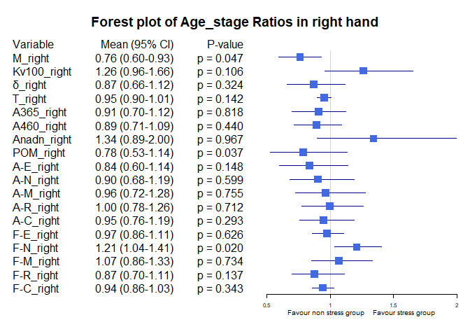

## Load bộ số liệu và các packages


```
## ── Attaching core tidyverse packages ──────────────────────── tidyverse 2.0.0 ──
## ✔ dplyr     1.1.3     ✔ readr     2.1.4
## ✔ forcats   1.0.0     ✔ stringr   1.5.0
## ✔ ggplot2   3.4.3     ✔ tibble    3.2.1
## ✔ lubridate 1.9.2     ✔ tidyr     1.3.0
## ✔ purrr     1.0.2     
## ── Conflicts ────────────────────────────────────────── tidyverse_conflicts() ──
## ✖ dplyr::filter() masks stats::filter()
## ✖ dplyr::lag()    masks stats::lag()
## ℹ Use the conflicted package (<http://conflicted.r-lib.org/>) to force all conflicts to become errors
## 
## Attaching package: 'rstatix'
## 
## 
## The following object is masked from 'package:stats':
## 
##     filter
## 
## 
## Loading required package: grid
## 
## Loading required package: checkmate
## 
## Loading required package: abind
```

## So sánh khác biệt về ratio của chỉ số Stress vs non stress theo các biến


Hàm để tạo bảng tổng hợp kết quả và p-value


Hàm sắp xếp các cột theo thứ tự


Hàm vẽ Forest plot


Bảng Stress index Ratio, level1 = "Yes", level2 = "No"

|            |Variable    |Subgroup     | Level1_Mean| Level2_Mean|     Ratio|  CI_Lower| CI_Upper|   P_Value|
|:-----------|:-----------|:------------|-----------:|-----------:|---------:|---------:|--------:|---------:|
|M_right     |M_right     |Stress index |  26.6150000|  20.8004737| 1.2795382| 1.0520922| 1.524981| 0.0124304|
|Kv100_right |Kv100_right |Stress index |  20.0149537|  20.5717076| 0.9729359| 0.6996103| 1.276161| 0.9258715|
|δ_right     |δ_right     |Stress index |   4.4667130|   3.5209006| 1.2686280| 1.0164778| 1.546612| 0.0365822|
|T_right     |T_right     |Stress index |  33.0212500|  30.6937485| 1.0758298| 1.0294515| 1.123978| 0.0645423|
|A365_right  |A365_right  |Stress index |  80.3287037|  84.7959064| 0.9473182| 0.7306616| 1.168785| 0.6022815|
|A460_right  |A460_right  |Stress index |  47.3703704|  50.8029240| 0.9324339| 0.7034033| 1.165496| 0.7376304|
|Anadn_right |Anadn_right |Stress index |   0.8876852|   0.7966140| 1.1143228| 0.6768575| 1.847355| 0.8816304|
|POM_right   |POM_right   |Stress index |  11.0158796|   8.8342222| 1.2469552| 0.8269187| 1.756948| 0.2079775|
|A-E_right   |A-E_right   |Stress index |   1.5577778|   1.3136316| 1.1858559| 0.8984505| 1.511861| 0.1449190|
|A-N_right   |A-N_right   |Stress index |   1.4760185|   1.2948830| 1.1398856| 0.8638775| 1.502180| 0.2916255|
|A-M_right   |A-M_right   |Stress index |   1.2175463|   1.0297661| 1.1823523| 0.8676557| 1.580976| 0.3031312|
|A-R_right   |A-R_right   |Stress index |   0.7566667|   0.6569708| 1.1517509| 0.9598246| 1.388256| 0.1208796|
|A-C_right   |A-C_right   |Stress index |   0.9864815|   0.8660702| 1.1390318| 0.9560478| 1.382744| 0.0963868|
|F-E_right   |F-E_right   |Stress index |   0.0144074|   0.0148433| 0.9706354| 0.8500165| 1.093391| 0.6177072|
|F-N_right   |F-N_right   |Stress index |   0.0343981|   0.0320766| 1.0723749| 0.9017986| 1.270551| 0.3805532|
|F-M_right   |F-M_right   |Stress index |   0.0852407|   0.0867292| 0.9828374| 0.7943090| 1.220397| 0.7688536|
|F-R_right   |F-R_right   |Stress index |   0.3491713|   0.3131749| 1.1149404| 0.8890461| 1.341004| 0.5377722|
|F-C_right   |F-C_right   |Stress index |   1.1144722|   1.1518327| 0.9675643| 0.8841262| 1.049521| 0.5630896|

Forest plot cho Stress index ratio
<!-- -->
Bảng Gender Ratio, level1 = "male", level2 = "female"

|            |Variable    |Subgroup | Level1_Mean| Level2_Mean|     Ratio|  CI_Lower| CI_Upper|   P_Value|
|:-----------|:-----------|:--------|-----------:|-----------:|---------:|---------:|--------:|---------:|
|M_right     |M_right     |Gender   |  22.8633788|  21.2486559| 1.0759918| 0.8973971| 1.309421| 0.4006173|
|Kv100_right |Kv100_right |Gender   |  19.2345985|  22.1462634| 0.8685257| 0.6738445| 1.167024| 0.2961153|
|δ_right     |δ_right     |Gender   |   3.7399924|   3.7591129| 0.9949136| 0.7848635| 1.277225| 0.8464324|
|T_right     |T_right     |Gender   |  30.9522424|  31.6783065| 0.9770801| 0.9264373| 1.030031| 0.9485282|
|A365_right  |A365_right  |Gender   |  83.5234848|  84.0080645| 0.9942317| 0.8192488| 1.203893| 0.9015111|
|A460_right  |A460_right  |Gender   |  50.3734848|  49.4193548| 1.0193068| 0.8442492| 1.213998| 0.8675353|
|Anadn_right |Anadn_right |Gender   |   0.7017500|   0.9841398| 0.7130593| 0.4733724| 1.158192| 0.6984398|
|POM_right   |POM_right   |Gender   |   9.3750909|   9.3333065| 1.0044769| 0.7401244| 1.412505| 0.5243332|
|A-E_right   |A-E_right   |Gender   |   1.4415606|   1.2738172| 1.1316856| 0.8648556| 1.473281| 0.5831796|
|A-N_right   |A-N_right   |Gender   |   1.4019318|   1.2481183| 1.1232363| 0.8686875| 1.471387| 0.5290407|
|A-M_right   |A-M_right   |Gender   |   1.1082197|   1.0274462| 1.0786158| 0.8159325| 1.396915| 0.4448863|
|A-R_right   |A-R_right   |Gender   |   0.6885758|   0.6700000| 1.0277250| 0.8404420| 1.271097| 0.3746122|
|A-C_right   |A-C_right   |Gender   |   0.9059697|   0.8793548| 1.0302663| 0.8361743| 1.267882| 0.7549857|
|F-E_right   |F-E_right   |Gender   |   0.0148311|   0.0146075| 1.0153026| 0.9076134| 1.129472| 0.6888593|
|F-N_right   |F-N_right   |Gender   |   0.0313795|   0.0344140| 0.9118256| 0.7968821| 1.053152| 0.1365770|
|F-M_right   |F-M_right   |Gender   |   0.0879409|   0.0841452| 1.0451095| 0.8575479| 1.249291| 0.8452175|
|F-R_right   |F-R_right   |Gender   |   0.3167152|   0.3290511| 0.9625106| 0.7932035| 1.182931| 0.9565113|
|F-C_right   |F-C_right   |Gender   |   1.1480523|   1.1355054| 1.0110496| 0.9407062| 1.098351| 0.7544507|

<!-- -->


Bảng Smoking ratio, level1 = "Cigarettes, pipe tobacco...", level2 = "Do not smoke"

|            |Variable    |Subgroup | Level1_Mean| Level2_Mean|     Ratio|  CI_Lower|  CI_Upper|   P_Value|
|:-----------|:-----------|:--------|-----------:|-----------:|---------:|---------:|---------:|---------:|
|M_right     |M_right     |Smoking  |  19.9137692|  22.6744839| 0.8782458| 0.6032870| 1.1521041| 0.4796795|
|Kv100_right |Kv100_right |Smoking  |  14.7424615|  21.6323306| 0.6815013| 0.5339371| 0.8663571| 0.1474417|
|δ_right     |δ_right     |Smoking  |   2.6939231|   3.9688898| 0.6787599| 0.4609309| 0.9501214| 0.0484299|
|T_right     |T_right     |Smoking  |  29.7060000|  31.5765833| 0.9407604| 0.8448919| 1.0317680| 0.3447796|
|A365_right  |A365_right  |Smoking  |  83.2692308|  83.8190860| 0.9934400| 0.7015903| 1.2757859| 0.9163818|
|A460_right  |A460_right  |Smoking  |  53.0307692|  49.3392473| 1.0748192| 0.7511043| 1.4074526| 0.4623910|
|Anadn_right |Anadn_right |Smoking  |   0.7720769|   0.8281989| 0.9322361| 0.6334068| 1.3683837| 0.3591432|
|POM_right   |POM_right   |Smoking  |   8.1832308|   9.6041048| 0.8520555| 0.4433065| 1.3538725| 0.1954352|
|A-E_right   |A-E_right   |Smoking  |   1.0740769|   1.4347419| 0.7486203| 0.4575358| 1.0893524| 0.0957799|
|A-N_right   |A-N_right   |Smoking  |   1.0848462|   1.3915108| 0.7796175| 0.4708054| 1.1376242| 0.1044305|
|A-M_right   |A-M_right   |Smoking  |   0.8373077|   1.1246371| 0.7445137| 0.4571320| 1.0937271| 0.0903183|
|A-R_right   |A-R_right   |Smoking  |   0.5753846|   0.7030215| 0.8184453| 0.5832434| 1.1011268| 0.1744580|
|A-C_right   |A-C_right   |Smoking  |   0.7739231|   0.9203495| 0.8409013| 0.5412574| 1.2347655| 0.1287901|
|F-E_right   |F-E_right   |Smoking  |   0.0149308|   0.0146984| 1.0158100| 0.8798892| 1.1449684| 0.8547887|
|F-N_right   |F-N_right   |Smoking  |   0.0305923|   0.0330618| 0.9253060| 0.7562519| 1.1329503| 0.3653913|
|F-M_right   |F-M_right   |Smoking  |   0.1059000|   0.0822774| 1.2871089| 0.9286069| 1.6816158| 0.2092199|
|F-R_right   |F-R_right   |Smoking  |   0.2712615|   0.3324137| 0.8160360| 0.6579697| 1.0150607| 0.2333425|
|F-C_right   |F-C_right   |Smoking  |   1.2202615|   1.1266382| 1.0830998| 0.9953443| 1.1887652| 0.2676827|

<!-- -->


Bảng Smoking ratio, level1 = "Cigarettes, pipe tobacco...", level2 = "Do not smoke"

|            |Variable    |Subgroup | Level1_Mean| Level2_Mean|     Ratio|  CI_Lower|  CI_Upper|   P_Value|
|:-----------|:-----------|:--------|-----------:|-----------:|---------:|---------:|---------:|---------:|
|M_right     |M_right     |Smoking  |  19.9137692|  22.6744839| 0.8782458| 0.6100179| 1.1521213| 0.4796795|
|Kv100_right |Kv100_right |Smoking  |  14.7424615|  21.6323306| 0.6815013| 0.5370132| 0.8518493| 0.1474417|
|δ_right     |δ_right     |Smoking  |   2.6939231|   3.9688898| 0.6787599| 0.4626052| 0.9183535| 0.0484299|
|T_right     |T_right     |Smoking  |  29.7060000|  31.5765833| 0.9407604| 0.8472999| 1.0309438| 0.3447796|
|A365_right  |A365_right  |Smoking  |  83.2692308|  83.8190860| 0.9934400| 0.7209159| 1.2650304| 0.9163818|
|A460_right  |A460_right  |Smoking  |  53.0307692|  49.3392473| 1.0748192| 0.7466011| 1.4157059| 0.4623910|
|Anadn_right |Anadn_right |Smoking  |   0.7720769|   0.8281989| 0.9322361| 0.6192203| 1.3681254| 0.3591432|
|POM_right   |POM_right   |Smoking  |   8.1832308|   9.6041048| 0.8520555| 0.4592942| 1.3960250| 0.1954352|
|A-E_right   |A-E_right   |Smoking  |   1.0740769|   1.4347419| 0.7486203| 0.4854284| 1.1232629| 0.0957799|
|A-N_right   |A-N_right   |Smoking  |   1.0848462|   1.3915108| 0.7796175| 0.4650643| 1.1595997| 0.1044305|
|A-M_right   |A-M_right   |Smoking  |   0.8373077|   1.1246371| 0.7445137| 0.4700365| 1.0698517| 0.0903183|
|A-R_right   |A-R_right   |Smoking  |   0.5753846|   0.7030215| 0.8184453| 0.5837077| 1.0781860| 0.1744580|
|A-C_right   |A-C_right   |Smoking  |   0.7739231|   0.9203495| 0.8409013| 0.5441556| 1.1883129| 0.1287901|
|F-E_right   |F-E_right   |Smoking  |   0.0149308|   0.0146984| 1.0158100| 0.8891284| 1.1429132| 0.8547887|
|F-N_right   |F-N_right   |Smoking  |   0.0305923|   0.0330618| 0.9253060| 0.7707584| 1.1254634| 0.3653913|
|F-M_right   |F-M_right   |Smoking  |   0.1059000|   0.0822774| 1.2871089| 0.9307325| 1.7146823| 0.2092199|
|F-R_right   |F-R_right   |Smoking  |   0.2712615|   0.3324137| 0.8160360| 0.6609047| 1.0246141| 0.2333425|
|F-C_right   |F-C_right   |Smoking  |   1.2202615|   1.1266382| 1.0830998| 0.9851828| 1.1894765| 0.2676827|

<!-- -->

Bảng Hypertension ratio, level1 = "Yes", level2 = "No"

|            |Variable    |Subgroup     | Level1_Mean| Level2_Mean|     Ratio|  CI_Lower|  CI_Upper|   P_Value|
|:-----------|:-----------|:------------|-----------:|-----------:|---------:|---------:|---------:|---------:|
|M_right     |M_right     |Hypertension |  19.8770476|  23.0977593| 0.8605617| 0.6721204| 1.0675963| 0.2597899|
|Kv100_right |Kv100_right |Hypertension |  17.1661667|  21.7105000| 0.7906850| 0.5675502| 1.0799548| 0.0860008|
|δ_right     |δ_right     |Hypertension |   2.6535476|   4.1734753| 0.6358125| 0.4862138| 0.8073669| 0.0029424|
|T_right     |T_right     |Hypertension |  30.1119762|  31.6958272| 0.9500297| 0.8771768| 1.0173411| 0.4189196|
|A365_right  |A365_right  |Hypertension |  89.5690476|  81.4506173| 1.0996730| 0.8691070| 1.3257919| 0.3792641|
|A460_right  |A460_right  |Hypertension |  56.5333333|  47.4302469| 1.1919258| 0.9664942| 1.4450036| 0.0996986|
|Anadn_right |Anadn_right |Hypertension |   0.9819048|   0.7549136| 1.3006850| 0.7773801| 2.3179160| 0.2402396|
|POM_right   |POM_right   |Hypertension |   6.7061667|  10.3890185| 0.6455053| 0.4486818| 0.8779055| 0.0362175|
|A-E_right   |A-E_right   |Hypertension |   0.9735238|   1.5272778| 0.6374242| 0.4682166| 0.8520190| 0.0064121|
|A-N_right   |A-N_right   |Hypertension |   0.9965238|   1.4712901| 0.6773129| 0.4970376| 0.8789516| 0.0153035|
|A-M_right   |A-M_right   |Hypertension |   0.7798810|   1.1895370| 0.6556172| 0.4856974| 0.8430883| 0.0197697|
|A-R_right   |A-R_right   |Hypertension |   0.5892381|   0.7165432| 0.8223344| 0.6381401| 1.0103080| 0.1234873|
|A-C_right   |A-C_right   |Hypertension |   0.7802381|   0.9395864| 0.8304059| 0.6139603| 1.0811768| 0.0182547|
|F-E_right   |F-E_right   |Hypertension |   0.0146095|   0.0147889| 0.9878716| 0.8900876| 1.1031257| 0.9102279|
|F-N_right   |F-N_right   |Hypertension |   0.0330952|   0.0324543| 1.0197483| 0.8452570| 1.2246387| 0.6962268|
|F-M_right   |F-M_right   |Hypertension |   0.0974857|   0.0820500| 1.1881257| 0.9361243| 1.4619303| 0.3413031|
|F-R_right   |F-R_right   |Hypertension |   0.3452214|   0.3127111| 1.1039628| 0.8859201| 1.3521271| 0.3891159|
|F-C_right   |F-C_right   |Hypertension |   1.1668286|   1.1335475| 1.0293601| 0.9352895| 1.1241954| 0.3500637|

<!-- -->

Bảng Obesity ratio, level1 = "Yes", level2 = "No"

|            |Variable    |Subgroup | Level1_Mean| Level2_Mean|     Ratio|  CI_Lower| CI_Upper|   P_Value|
|:-----------|:-----------|:--------|-----------:|-----------:|---------:|---------:|--------:|---------:|
|M_right     |M_right     |Obesity  |  27.9056667|  21.6081961| 1.2914390| 1.1329990| 1.482039| 0.1069954|
|Kv100_right |Kv100_right |Obesity  |  16.5782619|  20.8354216| 0.7956768| 0.5393319| 1.079476| 0.5179169|
|δ_right     |δ_right     |Obesity  |   4.2837381|   3.6927353| 1.1600447| 0.8623852| 1.469099| 0.2949661|
|T_right     |T_right     |Obesity  |  33.8068810|  30.9893824| 1.0909182| 1.0399604| 1.145587| 0.0370332|
|A365_right  |A365_right  |Obesity  |  95.7547619|  82.4852941| 1.1608707| 0.9386689| 1.387745| 0.4281217|
|A460_right  |A460_right  |Obesity  |  50.1476190|  49.9617647| 1.0037199| 0.8723093| 1.148848| 0.9491658|
|Anadn_right |Anadn_right |Obesity  |   0.6214286|   0.8387549| 0.7408941| 0.4682597| 1.133613| 0.2783877|
|POM_right   |POM_right   |Obesity  |  11.1420714|   9.1741471| 1.2145076| 0.8637166| 1.546658| 0.1377146|
|A-E_right   |A-E_right   |Obesity  |   1.7250952|   1.3359020| 1.2913337| 0.8841996| 1.755595| 0.1777114|
|A-N_right   |A-N_right   |Obesity  |   1.6431429|   1.3069804| 1.2572054| 0.8658118| 1.667485| 0.1836244|
|A-M_right   |A-M_right   |Obesity  |   1.0784524|   1.0744608| 1.0037150| 0.7289809| 1.315654| 0.6293174|
|A-R_right   |A-R_right   |Obesity  |   0.6946190|   0.6794853| 1.0222724| 0.8496369| 1.227118| 0.6292564|
|A-C_right   |A-C_right   |Obesity  |   0.9502381|   0.8892794| 1.0685484| 0.8179936| 1.417904| 0.5722738|
|F-E_right   |F-E_right   |Obesity  |   0.0162810|   0.0145799| 1.1166709| 0.9743798| 1.271431| 0.2373761|
|F-N_right   |F-N_right   |Obesity  |   0.0312857|   0.0327725| 0.9546317| 0.7677323| 1.186937| 0.8408011|
|F-M_right   |F-M_right   |Obesity  |   0.0758143|   0.0874588| 0.8668569| 0.6999937| 1.086204| 0.6136357|
|F-R_right   |F-R_right   |Obesity  |   0.3879738|   0.3150034| 1.2316495| 1.0122070| 1.495269| 0.0353174|
|F-C_right   |F-C_right   |Obesity  |   1.1907714|   1.1379348| 1.0464320| 0.9090966| 1.165513| 0.4596487|

<!-- -->

Bảng Race ratio, level1 = "White", level2 = "Asian or Asian British"

|            |Variable    |Subgroup | Level1_Mean| Level2_Mean|     Ratio|  CI_Lower|  CI_Upper|   P_Value|
|:-----------|:-----------|:--------|-----------:|-----------:|---------:|---------:|---------:|---------:|
|M_right     |M_right     |Race     |  26.1334545|  21.0673607| 1.2404712| 1.0134114| 1.4798308| 0.1543522|
|Kv100_right |Kv100_right |Race     |  20.5697273|  20.5668770| 1.0001386| 0.6216682| 1.4940410| 0.7661713|
|δ_right     |δ_right     |Race     |   4.5036667|   3.5580628| 1.2657637| 0.9169344| 1.6580363| 0.0909342|
|T_right     |T_right     |Race     |  32.8315758|  30.8065383| 1.0657340| 1.0142873| 1.1218225| 0.1391084|
|A365_right  |A365_right  |Race     | 103.4878788|  82.8019126| 1.2498247| 1.0706847| 1.4566773| 0.0782028|
|A460_right  |A460_right  |Race     |  47.2606061|  52.2224044| 0.9049872| 0.7585473| 1.0651027| 0.4477086|
|Anadn_right |Anadn_right |Race     |   0.4646970|   0.8431749| 0.5511276| 0.4122801| 0.7158898| 0.0026480|
|POM_right   |POM_right   |Race     |  14.9004848|   8.1369044| 1.8312228| 1.3439879| 2.5422219| 0.0014081|
|A-E_right   |A-E_right   |Race     |   1.5626364|   1.3286557| 1.1761033| 0.8130194| 1.5964331| 0.2907102|
|A-N_right   |A-N_right   |Race     |   1.6138182|   1.2528634| 1.2881039| 0.9542027| 1.6763311| 0.1086059|
|A-M_right   |A-M_right   |Race     |   1.2556061|   1.0159153| 1.2359358| 0.9335665| 1.5562399| 0.1156763|
|A-R_right   |A-R_right   |Race     |   0.7183939|   0.6666393| 1.0776351| 0.9203064| 1.2620452| 0.2310413|
|A-C_right   |A-C_right   |Race     |   1.0254545|   0.8590601| 1.1936936| 0.9097561| 1.5704206| 0.2132940|
|F-E_right   |F-E_right   |Race     |   0.0182848|   0.0142011| 1.2875663| 1.1578035| 1.4120959| 0.0008005|
|F-N_right   |F-N_right   |Race     |   0.0289545|   0.0333284| 0.8687645| 0.7404707| 1.0229006| 0.4279559|
|F-M_right   |F-M_right   |Race     |   0.0866697|   0.0874186| 0.9914334| 0.7545053| 1.3243927| 0.6308165|
|F-R_right   |F-R_right   |Race     |   0.3168394|   0.3183740| 0.9951797| 0.7981024| 1.2233841| 0.8119590|
|F-C_right   |F-C_right   |Race     |   1.0897788|   1.1544656| 0.9439682| 0.8624277| 1.0440294| 0.1341012|

<!-- -->


Bảng Race ratio, level1 = "Black, African, Caribbean or Black Bristish", level2 = "Asian or Asian British"

|            |Variable    |Subgroup | Level1_Mean| Level2_Mean|     Ratio|  CI_Lower|  CI_Upper|   P_Value|
|:-----------|:-----------|:--------|-----------:|-----------:|---------:|---------:|---------:|---------:|
|M_right     |M_right     |Race     |  30.7066667|  21.0673607| 1.4575469| 1.0467745| 1.8194229| 0.1122633|
|Kv100_right |Kv100_right |Race     |  17.3366667|  20.5668770| 0.8429411| 0.4809092| 1.3393461| 0.8240537|
|δ_right     |δ_right     |Race     |   4.8366667|   3.5580628| 1.3593539| 1.0047347| 1.7410357| 0.1439869|
|T_right     |T_right     |Race     |  34.5266667|  30.8065383| 1.1207578| 1.0713523| 1.1736325| 0.0654461|
|A365_right  |A365_right  |Race     |  30.0000000|  82.8019126| 0.3623105| 0.0248457| 0.6703471| 0.0332960|
|A460_right  |A460_right  |Race     |  14.3333333|  52.2224044| 0.2744671| 0.1772498| 0.3782975| 0.0083724|
|Anadn_right |Anadn_right |Race     |   1.6133333|   0.8431749| 1.9134030| 0.3302826| 4.2255923| 0.9873261|
|POM_right   |POM_right   |Race     |  13.8600000|   8.1369044| 1.7033505| 0.2410090| 3.3315192| 0.5461902|
|A-E_right   |A-E_right   |Race     |   1.5600000|   1.3286557| 1.1741190| 0.8307201| 1.6109266| 0.3999214|
|A-N_right   |A-N_right   |Race     |   2.0666667|   1.2528634| 1.6495547| 0.8913799| 2.4839408| 0.1234013|
|A-M_right   |A-M_right   |Race     |   1.6100000|   1.0159153| 1.5847778| 0.9037463| 2.4322142| 0.1273121|
|A-R_right   |A-R_right   |Race     |   0.8333333|   0.6666393| 1.2500512| 0.8971448| 1.7021058| 0.2730167|
|A-C_right   |A-C_right   |Race     |   1.1466667|   0.8590601| 1.3347921| 1.1444776| 1.5432730| 0.0833720|
|F-E_right   |F-E_right   |Race     |   0.0126667|   0.0142011| 0.8919501| 0.7084820| 1.1185200| 0.4149887|
|F-N_right   |F-N_right   |Race     |   0.0320000|   0.0333284| 0.9601417| 0.8068691| 1.1144834| 0.8985214|
|F-M_right   |F-M_right   |Race     |   0.0640000|   0.0874186| 0.7321098| 0.6475863| 0.8388188| 0.1060262|
|F-R_right   |F-R_right   |Race     |   0.4100000|   0.3183740| 1.2877934| 0.6666494| 1.8299478| 0.5294299|
|F-C_right   |F-C_right   |Race     |   1.1016667|   1.1544656| 0.9542655| 0.8770140| 1.0350788| 0.3984758|

<!-- -->

Bảng BMI ratio, level1 = "BMI <25", level2 = "BMI [25-30)"

|            |Variable    |Subgroup  | Level1_Mean| Level2_Mean|     Ratio|  CI_Lower|  CI_Upper|   P_Value|
|:-----------|:-----------|:---------|-----------:|-----------:|---------:|---------:|---------:|---------:|
|M_right     |M_right     |BMI_25_30 |  18.8375159|  26.0839103| 0.7221891| 0.5872403| 0.8693166| 0.0004537|
|Kv100_right |Kv100_right |BMI_25_30 |  24.0693730|  15.6113462| 1.5417872| 1.1508796| 2.0872508| 0.0006167|
|δ_right     |δ_right     |BMI_25_30 |   3.8870873|   3.3787821| 1.1504404| 0.9003982| 1.4534404| 0.5615457|
|T_right     |T_right     |BMI_25_30 |  30.2825317|  32.1312179| 0.9424645| 0.8911403| 0.9990299| 0.0151260|
|A365_right  |A365_right  |BMI_25_30 |  84.0992063|  79.8782051| 1.0528430| 0.8559081| 1.3154163| 0.4994945|
|A460_right  |A460_right  |BMI_25_30 |  51.1126984|  48.1025641| 1.0625774| 0.8646047| 1.2836012| 0.4796697|
|Anadn_right |Anadn_right |BMI_25_30 |   0.8071905|   0.8897436| 0.9072170| 0.5120875| 1.5350591| 0.9697910|
|POM_right   |POM_right   |BMI_25_30 |   7.9520317|  11.1483333| 0.7132933| 0.5187606| 0.9779828| 0.0571527|
|A-E_right   |A-E_right   |BMI_25_30 |   1.4222937|   1.1963462| 1.1888646| 0.8725794| 1.6094284| 0.4565003|
|A-N_right   |A-N_right   |BMI_25_30 |   1.3422540|   1.2500000| 1.0738032| 0.8242562| 1.4383840| 0.7715921|
|A-M_right   |A-M_right   |BMI_25_30 |   1.0641667|   1.0910897| 0.9753246| 0.7477575| 1.3016990| 0.7861136|
|A-R_right   |A-R_right   |BMI_25_30 |   0.6288095|   0.7613462| 0.8259180| 0.6694209| 1.0234929| 0.1250688|
|A-C_right   |A-C_right   |BMI_25_30 |   0.8603016|   0.9360897| 0.9190375| 0.7447608| 1.1626555| 0.4835716|
|F-E_right   |F-E_right   |BMI_25_30 |   0.0143635|   0.0149295| 0.9620888| 0.8589760| 1.0888176| 0.7603795|
|F-N_right   |F-N_right   |BMI_25_30 |   0.0324294|   0.0333269| 0.9730681| 0.8228944| 1.1393034| 0.6578369|
|F-M_right   |F-M_right   |BMI_25_30 |   0.0873738|   0.0875962| 0.9974617| 0.8042017| 1.2397151| 0.9644584|
|F-R_right   |F-R_right   |BMI_25_30 |   0.3054897|   0.3303718| 0.9246845| 0.7501796| 1.1488560| 0.1836560|
|F-C_right   |F-C_right   |BMI_25_30 |   1.1452714|   1.1260833| 1.0170397| 0.9417707| 1.0893987| 0.5604585|

<!-- -->

Bảng BMI ratio, level1 = "BMI >=30", level2 = "BMI [25-30)"

|            |Variable    |Subgroup  | Level1_Mean| Level2_Mean|     Ratio|  CI_Lower| CI_Upper|   P_Value|
|:-----------|:-----------|:---------|-----------:|-----------:|---------:|---------:|--------:|---------:|
|M_right     |M_right     |BMI_25_30 |  27.9056667|  26.0839103| 1.0698422| 0.9288056| 1.245467| 0.8464371|
|Kv100_right |Kv100_right |BMI_25_30 |  16.5782619|  15.6113462| 1.0619367| 0.6857803| 1.603066| 0.4495188|
|δ_right     |δ_right     |BMI_25_30 |   4.2837381|   3.3787821| 1.2678350| 0.9212020| 1.685212| 0.2094233|
|T_right     |T_right     |BMI_25_30 |  33.8068810|  32.1312179| 1.0521506| 0.9958539| 1.113402| 0.2147228|
|A365_right  |A365_right  |BMI_25_30 |  95.7547619|  79.8782051| 1.1987596| 0.9398536| 1.503023| 0.2521084|
|A460_right  |A460_right  |BMI_25_30 |  50.1476190|  48.1025641| 1.0425145| 0.8950196| 1.229767| 0.8085450|
|Anadn_right |Anadn_right |BMI_25_30 |   0.6214286|   0.8897436| 0.6984356| 0.3921170| 1.234581| 0.2518704|
|POM_right   |POM_right   |BMI_25_30 |  11.1420714|  11.1483333| 0.9994383| 0.7078514| 1.352949| 0.5603355|
|A-E_right   |A-E_right   |BMI_25_30 |   1.7250952|   1.1963462| 1.4419700| 0.9662997| 2.057927| 0.1196845|
|A-N_right   |A-N_right   |BMI_25_30 |   1.6431429|   1.2500000| 1.3145143| 0.8661384| 1.817629| 0.1400177|
|A-M_right   |A-M_right   |BMI_25_30 |   1.0784524|   1.0910897| 0.9884177| 0.6940596| 1.348573| 0.7143005|
|A-R_right   |A-R_right   |BMI_25_30 |   0.6946190|   0.7613462| 0.9123564| 0.7358141| 1.134896| 0.8428508|
|A-C_right   |A-C_right   |BMI_25_30 |   0.9502381|   0.9360897| 1.0151143| 0.7591429| 1.371095| 0.7411499|
|F-E_right   |F-E_right   |BMI_25_30 |   0.0162810|   0.0149295| 1.0905232| 0.9289165| 1.266388| 0.5646466|
|F-N_right   |F-N_right   |BMI_25_30 |   0.0312857|   0.0333269| 0.9387520| 0.7431795| 1.187689| 0.7574739|
|F-M_right   |F-M_right   |BMI_25_30 |   0.0758143|   0.0875962| 0.8654979| 0.6709129| 1.114196| 0.6567835|
|F-R_right   |F-R_right   |BMI_25_30 |   0.3879738|   0.3303718| 1.1743551| 0.9172456| 1.493646| 0.1065058|
|F-C_right   |F-C_right   |BMI_25_30 |   1.1907714|   1.1260833| 1.0574452| 0.9347474| 1.188536| 0.3313442|

<!-- -->

Bảng Age_stage ratio, level1 = "Age <30", level2= "Age [30-40)"


|            |Variable    |Subgroup  | Level1_Mean| Level2_Mean|     Ratio|  CI_Lower|  CI_Upper|   P_Value|
|:-----------|:-----------|:---------|-----------:|-----------:|---------:|---------:|---------:|---------:|
|M_right     |M_right     |Age_stage |  19.1767949|  25.1828778| 0.7615013| 0.5954919| 0.9284725| 0.0471639|
|Kv100_right |Kv100_right |Age_stage |  23.4133974|  18.5590389| 1.2615630| 0.9590258| 1.6560902| 0.1059833|
|δ_right     |δ_right     |Age_stage |   3.5846795|   4.1187056| 0.8703413| 0.6582994| 1.1162316| 0.3242252|
|T_right     |T_right     |Age_stage |  30.5505769|  32.0664944| 0.9527258| 0.8970604| 1.0066953| 0.1423890|
|A365_right  |A365_right  |Age_stage |  80.2179487|  88.3650000| 0.9078023| 0.6961894| 1.1241183| 0.8180587|
|A460_right  |A460_right  |Age_stage |  46.0897436|  51.6011111| 0.8931929| 0.7143378| 1.0875961| 0.4399218|
|Anadn_right |Anadn_right |Age_stage |   0.8906410|   0.6636667| 1.3420005| 0.8945844| 1.9951527| 0.9672279|
|POM_right   |POM_right   |Age_stage |   8.4367308|  10.7492056| 0.7848702| 0.5272991| 1.1371936| 0.0369747|
|A-E_right   |A-E_right   |Age_stage |   1.2639744|   1.5125222| 0.8356732| 0.5996076| 1.1395647| 0.1482239|
|A-N_right   |A-N_right   |Age_stage |   1.2549359|   1.3908444| 0.9022834| 0.6798270| 1.1889492| 0.5990254|
|A-M_right   |A-M_right   |Age_stage |   1.0476923|   1.0886944| 0.9623383| 0.7228149| 1.2760827| 0.7549002|
|A-R_right   |A-R_right   |Age_stage |   0.6694231|   0.6721333| 0.9959677| 0.7754660| 1.2602541| 0.7115788|
|A-C_right   |A-C_right   |Age_stage |   0.8508333|   0.9003333| 0.9450204| 0.7610433| 1.1897650| 0.2929065|
|F-E_right   |F-E_right   |Age_stage |   0.0143013|   0.0147044| 0.9725823| 0.8608896| 1.1088395| 0.6259169|
|F-N_right   |F-N_right   |Age_stage |   0.0371603|   0.0307389| 1.2089004| 1.0375146| 1.4065480| 0.0202081|
|F-M_right   |F-M_right   |Age_stage |   0.0896731|   0.0839844| 1.0677344| 0.8550541| 1.3326478| 0.7339582|
|F-R_right   |F-R_right   |Age_stage |   0.2993397|   0.3425494| 0.8738585| 0.6970253| 1.1141749| 0.1365375|
|F-C_right   |F-C_right   |Age_stage |   1.1121731|   1.1828467| 0.9402513| 0.8568789| 1.0281727| 0.3434453|

<!-- -->

Bảng Age_stage ratio, level1 = "Age <30", level2= "Age [40-50)"


|            |Variable    |Subgroup  | Level1_Mean| Level2_Mean|     Ratio|  CI_Lower| CI_Upper|   P_Value|
|:-----------|:-----------|:---------|-----------:|-----------:|---------:|---------:|--------:|---------:|
|M_right     |M_right     |Age_stage |  19.1767949|  22.9460769| 0.8357331| 0.6147226| 1.205393| 0.2428218|
|Kv100_right |Kv100_right |Age_stage |  23.4133974|  13.9024615| 1.6841188| 1.2399653| 2.350868| 0.0114719|
|δ_right     |δ_right     |Age_stage |   3.5846795|   2.9100769| 1.2318161| 0.8463595| 1.944724| 0.2834385|
|T_right     |T_right     |Age_stage |  30.5505769|  31.4998462| 0.9698643| 0.8919245| 1.077294| 0.2678025|
|A365_right  |A365_right  |Age_stage |  80.2179487|  79.0384615| 1.0149230| 0.7248475| 1.490481| 0.7317482|
|A460_right  |A460_right  |Age_stage |  46.0897436|  54.7230769| 0.8422360| 0.6291193| 1.176283| 0.2969528|
|Anadn_right |Anadn_right |Age_stage |   0.8906410|   1.1620769| 0.7664217| 0.3681286| 1.607992| 0.1108180|
|POM_right   |POM_right   |Age_stage |   8.4367308|   7.4463077| 1.1330086| 0.6927124| 1.894214| 0.7800367|
|A-E_right   |A-E_right   |Age_stage |   1.2639744|   1.2010000| 1.0524349| 0.6804216| 1.696495| 0.6124748|
|A-N_right   |A-N_right   |Age_stage |   1.2549359|   1.3010000| 0.9645933| 0.6450435| 1.626202| 0.7771352|
|A-M_right   |A-M_right   |Age_stage |   1.0476923|   1.0203846| 1.0267622| 0.6879526| 1.710442| 0.6441561|
|A-R_right   |A-R_right   |Age_stage |   0.6694231|   0.6776923| 0.9877980| 0.7060619| 1.437978| 0.8815488|
|A-C_right   |A-C_right   |Age_stage |   0.8508333|   0.8823846| 0.9642432| 0.6600238| 1.534716| 1.0000000|
|F-E_right   |F-E_right   |Age_stage |   0.0143013|   0.0146231| 0.9779940| 0.8367962| 1.153158| 0.7407631|
|F-N_right   |F-N_right   |Age_stage |   0.0371603|   0.0274385| 1.3543127| 1.1419179| 1.593509| 0.0055101|
|F-M_right   |F-M_right   |Age_stage |   0.0896731|   0.0822846| 1.0897915| 0.8171026| 1.421576| 0.8804623|
|F-R_right   |F-R_right   |Age_stage |   0.2993397|   0.2911077| 1.0282784| 0.7866755| 1.373089| 0.9148398|
|F-C_right   |F-C_right   |Age_stage |   1.1121731|   1.1499538| 0.9671458| 0.8601369| 1.080689| 0.8577822|

<!-- -->

Bảng Age_stage ratio, level1 = "Age <30", level2= "Age >=50"


|            |Variable    |Subgroup  | Level1_Mean| Level2_Mean|     Ratio|  CI_Lower| CI_Upper|   P_Value|
|:-----------|:-----------|:---------|-----------:|-----------:|---------:|---------:|--------:|---------:|
|M_right     |M_right     |Age_stage |  19.1767949|  18.7191667| 1.0244470| 0.6406862| 1.998826| 0.8323953|
|Kv100_right |Kv100_right |Age_stage |  23.4133974|  31.1008333| 0.7528222| 0.5035111| 1.364393| 0.3312874|
|δ_right     |δ_right     |Age_stage |   3.5846795|   4.4163889| 0.8116766| 0.5519612| 1.368115| 0.3464204|
|T_right     |T_right     |Age_stage |  30.5505769|  29.6863889| 1.0291106| 0.9029171| 1.184259| 0.6292031|
|A365_right  |A365_right  |Age_stage |  80.2179487|  85.8611111| 0.9342757| 0.6911474| 1.213611| 0.9614821|
|A460_right  |A460_right  |Age_stage |  46.0897436|  48.4444444| 0.9513938| 0.6437240| 1.511940| 0.9807355|
|Anadn_right |Anadn_right |Age_stage |   0.8906410|   0.5352778| 1.6638857| 1.0529945| 2.671831| 0.4834445|
|POM_right   |POM_right   |Age_stage |   8.4367308|  10.5338889| 0.8009132| 0.4143015| 1.988424| 0.7958821|
|A-E_right   |A-E_right   |Age_stage |   1.2639744|   1.5108333| 0.8366074| 0.5301176| 1.524850| 0.4116500|
|A-N_right   |A-N_right   |Age_stage |   1.2549359|   1.5183333| 0.8265220| 0.5585374| 1.356202| 0.5144235|
|A-M_right   |A-M_right   |Age_stage |   1.0476923|   1.2411111| 0.8441567| 0.6039840| 1.311464| 0.4837655|
|A-R_right   |A-R_right   |Age_stage |   0.6694231|   0.7813889| 0.8567092| 0.6668928| 1.125636| 0.2179285|
|A-C_right   |A-C_right   |Age_stage |   0.8508333|   1.0866667| 0.7829755| 0.5021518| 1.209633| 0.3104137|
|F-E_right   |F-E_right   |Age_stage |   0.0143013|   0.0170556| 0.8385117| 0.7186638| 1.004850| 0.1581949|
|F-N_right   |F-N_right   |Age_stage |   0.0371603|   0.0337500| 1.1010446| 0.8237643| 1.461098| 0.2764155|
|F-M_right   |F-M_right   |Age_stage |   0.0896731|   0.0928611| 0.9656688| 0.6475517| 1.480285| 1.0000000|
|F-R_right   |F-R_right   |Age_stage |   0.2993397|   0.3820556| 0.7834979| 0.5891013| 1.061166| 0.0949007|
|F-C_right   |F-C_right   |Age_stage |   1.1121731|   1.0606111| 1.0486153| 0.9277673| 1.198416| 0.4973082|

<!-- -->

Bảng Age_stage ratio, level1 = "Age [30-40)", level2= "Age >=50"


|            |Variable    |Subgroup  | Level1_Mean| Level2_Mean|     Ratio|  CI_Lower| CI_Upper|   P_Value|
|:-----------|:-----------|:---------|-----------:|-----------:|---------:|---------:|--------:|---------:|
|M_right     |M_right     |Age_stage |  25.1828778|  18.7191667| 1.3452991| 0.8846970| 2.471357| 0.3068264|
|Kv100_right |Kv100_right |Age_stage |  18.5590389|  31.1008333| 0.5967377| 0.3981042| 1.072827| 0.0778923|
|δ_right     |δ_right     |Age_stage |   4.1187056|   4.4163889| 0.9325958| 0.6506286| 1.479862| 0.8200619|
|T_right     |T_right     |Age_stage |  32.0664944|  29.6863889| 1.0801750| 0.9590505| 1.246726| 0.4176041|
|A365_right  |A365_right  |Age_stage |  88.3650000|  85.8611111| 1.0291621| 0.8525691| 1.268052| 0.6866670|
|A460_right  |A460_right  |Age_stage |  51.6011111|  48.4444444| 1.0651606| 0.7769065| 1.677647| 0.7340403|
|Anadn_right |Anadn_right |Age_stage |   0.6636667|   0.5352778| 1.2398547| 0.9475872| 1.687527| 0.3840815|
|POM_right   |POM_right   |Age_stage |  10.7492056|  10.5338889| 1.0204404| 0.5607696| 2.427508| 0.6045327|
|A-E_right   |A-E_right   |Age_stage |   1.5125222|   1.5108333| 1.0011179| 0.6702397| 1.781249| 0.8651577|
|A-N_right   |A-N_right   |Age_stage |   1.3908444|   1.5183333| 0.9160337| 0.6316781| 1.604182| 0.4575245|
|A-M_right   |A-M_right   |Age_stage |   1.0886944|   1.2411111| 0.8771934| 0.6135678| 1.329767| 0.3841733|
|A-R_right   |A-R_right   |Age_stage |   0.6721333|   0.7813889| 0.8601777| 0.6808147| 1.114223| 0.2981686|
|A-C_right   |A-C_right   |Age_stage |   0.9003333|   1.0866667| 0.8285276| 0.5943185| 1.272392| 0.4321405|
|F-E_right   |F-E_right   |Age_stage |   0.0147044|   0.0170556| 0.8621498| 0.7514868| 1.020754| 0.1304696|
|F-N_right   |F-N_right   |Age_stage |   0.0307389|   0.0337500| 0.9107819| 0.6812239| 1.177808| 0.3594228|
|F-M_right   |F-M_right   |Age_stage |   0.0839844|   0.0928611| 0.9044092| 0.5906014| 1.339277| 0.7647571|
|F-R_right   |F-R_right   |Age_stage |   0.3425494|   0.3820556| 0.8965959| 0.6969650| 1.181379| 0.4415227|
|F-C_right   |F-C_right   |Age_stage |   1.1828467|   1.0606111| 1.1152501| 0.9887841| 1.258023| 0.0883704|

<!-- -->

Bảng Age_stage ratio, level1 = "Age [30-40)", level2= "Age [40-50)"


|            |Variable    |Subgroup  | Level1_Mean| Level2_Mean|     Ratio|  CI_Lower| CI_Upper|   P_Value|
|:-----------|:-----------|:---------|-----------:|-----------:|---------:|---------:|--------:|---------:|
|M_right     |M_right     |Age_stage |  25.1828778|  22.9460769| 1.0974808| 0.8755265| 1.497364| 1.0000000|
|Kv100_right |Kv100_right |Age_stage |  18.5590389|  13.9024615| 1.3349462| 0.9529168| 1.902529| 0.2024166|
|δ_right     |δ_right     |Age_stage |   4.1187056|   2.9100769| 1.4153253| 0.9713543| 2.226987| 0.0882063|
|T_right     |T_right     |Age_stage |  32.0664944|  31.4998462| 1.0179889| 0.9392447| 1.116080| 0.6289108|
|A365_right  |A365_right  |Age_stage |  88.3650000|  79.0384615| 1.1180000| 0.8724287| 1.578543| 0.6720993|
|A460_right  |A460_right  |Age_stage |  51.6011111|  54.7230769| 0.9429497| 0.7528894| 1.244479| 0.3683792|
|Anadn_right |Anadn_right |Age_stage |   0.6636667|   1.1620769| 0.5711039| 0.3062740| 1.054704| 0.1248584|
|POM_right   |POM_right   |Age_stage |  10.7492056|   7.4463077| 1.4435618| 1.0025895| 2.298305| 0.0544468|
|A-E_right   |A-E_right   |Age_stage |   1.5125222|   1.2010000| 1.2593857| 0.8553248| 2.117437| 0.2042906|
|A-N_right   |A-N_right   |Age_stage |   1.3908444|   1.3010000| 1.0690580| 0.7043877| 1.791095| 0.5968292|
|A-M_right   |A-M_right   |Age_stage |   1.0886944|   1.0203846| 1.0669452| 0.7226204| 1.780579| 0.5696308|
|A-R_right   |A-R_right   |Age_stage |   0.6721333|   0.6776923| 0.9917972| 0.7344678| 1.423215| 0.9578000|
|A-C_right   |A-C_right   |Age_stage |   0.9003333|   0.8823846| 1.0203412| 0.7305771| 1.497974| 0.5429053|
|F-E_right   |F-E_right   |Age_stage |   0.0147044|   0.0146231| 1.0055643| 0.8665320| 1.162121| 0.8728857|
|F-N_right   |F-N_right   |Age_stage |   0.0307389|   0.0274385| 1.1202847| 0.9318933| 1.340640| 0.4887332|
|F-M_right   |F-M_right   |Age_stage |   0.0839844|   0.0822846| 1.0206579| 0.7634732| 1.304324| 0.8730113|
|F-R_right   |F-R_right   |Age_stage |   0.3425494|   0.2911077| 1.1767104| 0.9204812| 1.550814| 0.2135983|
|F-C_right   |F-C_right   |Age_stage |   1.1828467|   1.1499538| 1.0286036| 0.9441087| 1.124699| 0.2930937|

<!-- -->

Bảng Age_stage ratio, level1 = "Age [40-50)", level2= "Age >=50"


|            |Variable    |Subgroup  | Level1_Mean| Level2_Mean|     Ratio|  CI_Lower|  CI_Upper|   P_Value|
|:-----------|:-----------|:---------|-----------:|-----------:|---------:|---------:|---------:|---------:|
|M_right     |M_right     |Age_stage |  22.9460769|  18.7191667| 1.2258065| 0.7486838| 2.4186278| 0.8982751|
|Kv100_right |Kv100_right |Age_stage |  13.9024615|  31.1008333| 0.4470125| 0.2820286| 0.7958902| 0.0364883|
|δ_right     |δ_right     |Age_stage |   2.9100769|   4.4163889| 0.6589268| 0.3990227| 1.1268990| 0.1791243|
|T_right     |T_right     |Age_stage |  31.4998462|  29.6863889| 1.0610872| 0.9181371| 1.2310712| 0.7012384|
|A365_right  |A365_right  |Age_stage |  79.0384615|  85.8611111| 0.9205385| 0.6315569| 1.2371327| 0.9650063|
|A460_right  |A460_right  |Age_stage |  54.7230769|  48.4444444| 1.1296048| 0.7384098| 1.8517561| 0.4557722|
|Anadn_right |Anadn_right |Age_stage |   1.1620769|   0.5352778| 2.1709792| 1.0928691| 4.3519326| 0.0391224|
|POM_right   |POM_right   |Age_stage |   7.4463077|  10.5338889| 0.7068907| 0.3464130| 1.6211879| 0.7653693|
|A-E_right   |A-E_right   |Age_stage |   1.2010000|   1.5108333| 0.7949255| 0.4551000| 1.5606699| 0.4155241|
|A-N_right   |A-N_right   |Age_stage |   1.3010000|   1.5183333| 0.8568606| 0.4971268| 1.5066864| 0.6607237|
|A-M_right   |A-M_right   |Age_stage |   1.0203846|   1.2411111| 0.8221541| 0.4746393| 1.3510687| 0.4045229|
|A-R_right   |A-R_right   |Age_stage |   0.6776923|   0.7813889| 0.8672920| 0.6114341| 1.2221969| 0.7012384|
|A-C_right   |A-C_right   |Age_stage |   0.8823846|   1.0866667| 0.8120104| 0.4771328| 1.3722822| 0.3676102|
|F-E_right   |F-E_right   |Age_stage |   0.0146231|   0.0170556| 0.8573791| 0.7287384| 1.0227563| 0.2669821|
|F-N_right   |F-N_right   |Age_stage |   0.0274385|   0.0337500| 0.8129915| 0.6105899| 1.0808743| 0.2010800|
|F-M_right   |F-M_right   |Age_stage |   0.0822846|   0.0928611| 0.8861041| 0.5788312| 1.3546795| 1.0000000|
|F-R_right   |F-R_right   |Age_stage |   0.2911077|   0.3820556| 0.7619512| 0.5603518| 1.0758448| 0.1028555|
|F-C_right   |F-C_right   |Age_stage |   1.1499538|   1.0606111| 1.0842370| 0.9422812| 1.2334057| 0.2495928|

<!-- -->
